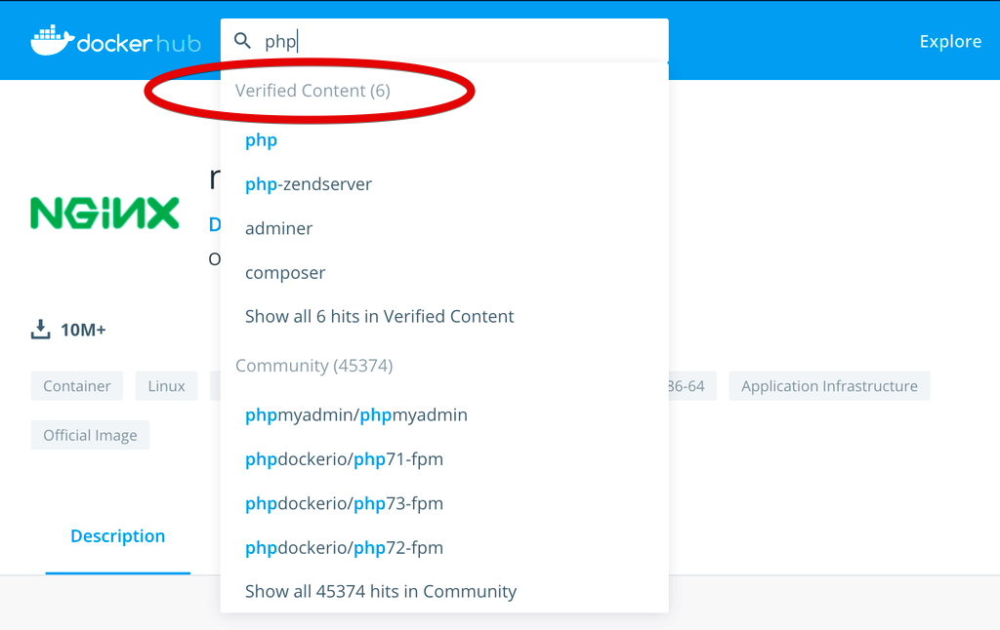

Всем привет! Эта статья продолжает серию переводов замечательных статей об использовании Docker для локальной веб-разработки.

<!-- more -->

## В этой серии

- [Введение: почему это должно вас волновать?](../docker-dlja-lokalnoj-veb-razrabotki-vvedenie/index.md)
- Часть 1: базовый стек LEMP ⬅️ вы здесь
- [Часть 2: посадите свои образы на диету](../docker-dlja-lokalnoj-veb-razrabotki-chast-2/index.md)
- [Часть 3: трёхуровневая архитектура с фреймворками](../docker-dlja-lokalnoj-veb-razrabotki-chast-3/index.md)
- [Часть 4: сглаживание ситуации с помощью Bash](../docker-dlja-lokalnoj-veb-razrabotki-chast-4/index.md)
- [Часть 5: HTTPS для всего](../docker-dlja-lokalnoj-veb-razrabotki-chast-5/index.md)
- [Часть 6: открываем локальный контейнер для доступа в Интернет](../docker-dlja-lokalnoj-veb-razrabotki-chast-6/index.md)
- [Часть 7: использование многоэтапной сборки для внедрения воркера](../docker-dlja-lokalnoj-veb-razrabotki-chast-7/index.md)
- [Часть 8: запланированные задачи](../docker-dlja-lokalnoj-veb-razrabotki-chast-8/index.md)
- [Заключение: куда идти дальше](../docker-dlja-lokalnoj-veb-razrabotki-zaklyuchenie/index.md)

## Первые шаги

Полагаю, вы уже прочитали [введение](../docker-dlja-lokalnoj-veb-razrabotki-vvedenie/index.md) к этой серии статей и теперь готовы к действиям.

Первое, что необходимо сделать, это перейти на сайт Docker, [загрузить и установить Docker Desktop](https://www.docker.com/products/docker-desktop/) для Mac или PC, или [перейти сюда](https://docs.docker.com/get-docker/) для получения инструкций по установке на различные дистрибутивы Linux. Если вы используете Windows, убедитесь, что установили [подсистему Windows для Linux (WSL 2)](https://docs.microsoft.com/en-us/windows/wsl/install) и [настроили Docker Desktop на её использование](https://docs.docker.com/desktop/windows/wsl/).

Второе, что вам понадобится — это терминал.

Как только оба требования будут выполнены, вы можете либо получить конечный результат из [репозитория](https://github.com/osteel/docker-tutorial/tree/part-1) и следовать этому руководству, либо начать с нуля и сравнивать свой код с кодом из репозитория всякий раз, когда застрянете. Последний вариант я рекомендую для начинающих пользователей Docker, поскольку различные концепции с большей вероятностью закрепятся, если вы будете писать код самостоятельно.

Обратите внимание, что эта статья довольно плотная из-за большого количества вводимых понятий. Я не предполагаю никаких предварительных знаний о Docker и стараюсь не оставлять ни одной детали без объяснения. Если вы совсем новичок, убедитесь, что у вас есть немного времени и захватите с собой горячий напиток: мы идем живописным путем.

## Определение необходимых контейнеров

Docker рекомендует запускать только один процесс на контейнер, что примерно означает, что в каждом контейнере должно быть запущена одно приложение. Давайте напомним себе, какие приложения лежат в основе стека LEMP:

- L - Linux
- E - Nginx (engine-x)
- M - MySQL
- P - PHP

Linux — это операционная система, на которой работает Docker, поэтому нам остается настроить Nginx, MySQL и PHP. Для удобства мы также добавим phpMyAdmin. В результате нам понадобятся следующие контейнеры:

- один контейнер для Nginx
- один контейнер для PHP (PHP-FPM)
- один контейнер для MySQL
- один контейнер для phpMyAdmin

Это довольно просто, но как нам перейти к настройке этих контейнеров, и как они будут взаимодействовать друг с другом?

## Docker Compose

Docker Desktop поставляется с инструментом [Docker Compose](https://docs.docker.com/compose/), который позволяет определять и запускать многоконтейнерные приложения Docker (если ваша система работает на Linux, вам придется установить его [отдельно](https://docs.docker.com/compose/install/)).

Docker Compose не является абсолютно необходимым для управления несколькими контейнерами, поскольку это можно сделать с помощью одного только Docker, но на практике это очень неудобно (это похоже на выполнение деления в столбик, когда на столе есть калькулятор: хотя это, конечно, неплохой навык, но это также огромная трата времени).

Контейнеры описываются в конфигурационном файле YAML, а Docker Compose позаботится о сборке образов и запуске контейнеров, а также о некоторых других полезных вещах, таких как автоматическое подключение контейнеров к внутренней сети.

Не волнуйтесь, если вы немного запутались; к концу этой заметки всё станет понятно.

## Nginx

Конфигурационный файл YAML фактически будет нашей отправной точкой: откройте ваш любимый текстовый редактор и добавьте новый файл docker-compose.yml в выбранный вами каталог на вашей локальной машине (вашем компьютере) со следующим содержимым:

```yaml
version: '3.8'

# Services
services:
  # Nginx Service
  nginx:
    image: nginx:1.21
    ports:
      - 80:80
```

Ключ `version` в верхней части файла указывает на версию Docker Compose, которую мы собираемся использовать (3.8 — последняя версия на момент написания статьи).

За ним следует ключ `services`, который представляет собой список компонентов приложения. На данный момент у нас есть только сервис `nginx` с парой ключей: `image` и `ports`. Первый указывает, какой образ использовать для создания контейнера нашего сервиса; в нашем случае это версия 1.21 образа [Nginx](https://hub.docker.com/_/nginx). Откройте ссылку в новой вкладке: она приведет вас на Docker Hub, который является крупнейшим хранилищем образов контейнеров (считайте его аналогом [Packagist](https://packagist.org/) или [PyPI](https://pypi.org/) для Docker).

!!! note "Примечание"

    Почему бы не использовать тег `latest`?

    Вы наверняка заметили, что все образы имеют тег latest, соответствующий самой последней версии образа. Хотя, может быть, и заманчиво использовать его, однако вы не знаете, как будет развиваться образ в будущем — вполне вероятно, что рано или поздно будут внесены разрушающие изменения. Точно так же, как вы делаете заморозку версий для зависимостей приложения (например, через `composer.lock` для PHP или `requirements.txt` в Python), использование определенного тега версии гарантирует, что ваша установка Docker не сломается из-за непредвиденных изменений.

Подобно репозиторию Github, описания образов на Docker Hub обычно хорошо объясняют, как их использовать и какие версии доступны. Здесь мы рассматриваем официальный образ Nginx: Docker ведет [курируемый список «официальных» образов](https://docs.docker.com/docker-hub/official_images/) (иногда поддерживаемых разработчиками upstream, но не всегда), который я всегда использую, когда это возможно. Они легко узнаваемы: на их странице вверху указывается метка _Docker Official Images_, а Docker Hub четко отделяет их от образов сообщества при поиске:



Вернемся к `docker-compose.yml`: в секции `ports` запись `80:80` указывает на то, что мы хотим сопоставить порт 80 нашей локальной машины (используемый HTTP) с портом контейнера. Другими словами, когда мы будем обращаться к порту 80 на нашей локальной машине (т. е. на вашем компьютере), мы будем перенаправлены на порт 80 контейнера Nginx.

Давайте проверим это. Сохраните файл `docker-compose.yml`, откройте терминал и измените текущую директорию на директорию вашего проекта, после чего выполните следующую команду:

```bash
$ docker compose up -d
```

Это может занять некоторое время, так как образ Nginx сначала будет загружен из Docker Hub. Когда всё будет готово, откройте [localhost](http://localhost/) в браузере, где должна появиться страница приветствия Nginx:


Поздравляем! Вы только что создали свой первый контейнер Docker.

Давайте разберем эту команду: выполнив `docker compose up -d`, мы попросили Docker Compose собрать и запустить контейнеры, описанные в `docker-compose.yml`; опция `-d` указывает на то, что мы хотим запустить контейнеры в фоновом режиме и вернуть наш терминал.

Вы можете увидеть, какие контейнеры запущены в данный момент, выполнив следующую команду:

```bash
$ docker compose ps
```

Для остановки контейнеров просто выполните следующую команду:

```bash
$ docker compose stop
```

На данном этапе вам, возможно, интересно, в чем разница между сервисом, образом и контейнером. Сервис — это всего лишь один из компонентов вашего приложения, перечисленных в `docker-compose.yml`. Каждый сервис ссылается на образ, который используется для запуска и остановки контейнеров на основе этого образа.

Чтобы помочь вам понять разницу, думайте об образе как о классе, а о контейнере как об экземпляре этого класса.

Говоря об ООП, как насчет того, чтобы установить PHP?

## PHP

К концу этого раздела мы получим Nginx, обслуживающий простой файл `index.php` через [PHP-FPM](https://php-fpm.org/), который является наиболее широко используемым менеджером процессов для PHP.

!!! note "Примечание"

    Вы не фанат PHP?

    Как уже упоминалось во [введении](../docker-dlja-lokalnoj-veb-razrabotki-vvedenie/index.md), PHP используется на стороне сервера во всей этой серии статей, но замена его на другой язык должна быть достаточно простой.

Замените содержимое `docker-compose.yml` на это:

```yaml
version: '3.8'

# Services
services:
  # Nginx Service
  nginx:
    image: nginx:1.21
    ports:
      - 80:80
    volumes:
      - ./src:/var/www/php
      - ./.docker/nginx/conf.d:/etc/nginx/conf.d
    depends_on:
      - php

  # PHP Service
  php:
    image: php:8.1-fpm
    working_dir: /var/www/php
    volumes:
      - ./src:/var/www/php
```

Здесь происходит несколько вещей: давайте на время забудем о сервисе Nginx и сосредоточимся на новом сервисе PHP. Мы начнем с образа `php:8.1-fpm`, соответствующего тегу `8.1-fpm` [официального образа PHP](https://hub.docker.com/_/php), представляющего версию 8.1 и PHP-FPM. Давайте пока пропустим ключ `working_dir` и посмотрим на `volumes`. Эта секция позволяет нам определить тома (в основном, каталоги или отдельные файлы), которые мы хотим подключить к контейнеру. По сути, это означает, что мы можем сопоставить локальные каталоги и файлы с каталогами и файлами внутри контейнера; в нашем случае мы хотим, чтобы Docker Compose смонтировал папку `src` как папку `/var/www/php` контейнера.

Что находится в папке `src/`? Пока ничего, но именно туда мы поместим код нашего приложения. Как только он будет установлен в контейнер, любое изменение, которое мы внесем в наш код, будет сразу же доступно, без необходимости перезапускать контейнер.

Создайте каталог `src` (на том же уровне, что и `docker-compose.yml`) и добавьте в него следующий файл `index.php`:

```html+php
<!DOCTYPE html>
<html>
  <head>
    <meta charset="UTF-8" />
    <title>Hello there</title>
    <style>
      .center {
        display: block;
        margin-left: auto;
        margin-right: auto;
        width: 50%;
      }
    </style>
  </head>
  <body>
    
  </body>
</html>
```

Он содержит лишь немного HTML и CSS, но всё, что нам сейчас нужно, это убедиться, что PHP файлы правильно обслуживаются.

Вернемся к сервису Nginx: мы добавили в него секцию `volumes`, в которой смонтировали каталог с нашим кодом, как и в случае с сервисом PHP (это делается для того, чтобы Nginx получил копию `index.php`, без которой он вернет _404 Not Found_ при попытке доступа к файлу), и на этот раз мы также хотим импортировать конфигурацию сервера Nginx, которая будет указывать на код нашего приложения:

```yaml
- ./.docker/nginx/conf.d:/etc/nginx/conf.d
```

Поскольку Nginx автоматически читает файлы, заканчивающиеся на `.conf`, расположенные в каталоге `/etc/nginx/conf.d`, смонтировав вместо него наш собственный локальный каталог `conf.d`, мы убедимся, что содержащиеся в нем файлы конфигурации будут обработаны Nginx внутри контейнера.

Создайте папку `.docker/nginx/conf.d` и добавьте в нее следующий файл `php.conf`:

```nginx
server {
    listen 80 default_server;
    listen [::]:80 default_server;
    root   /var/www/php;
    index  index.php;

    location ~* \.php$ {
        fastcgi_pass   php:9000;
        include        fastcgi_params;
        fastcgi_param  SCRIPT_FILENAME $document_root$fastcgi_script_name;
        fastcgi_param  SCRIPT_NAME     $fastcgi_script_name;
    }
}
```

!!! note "Примечание"

    Размещение файлов, связанных с Docker, в папке `.docker` является общей практикой.

Это минималистская конфигурация сервера PHP-FPM, позаимствованная с [сайта Linode](https://www.linode.com/docs/web-servers/nginx/serve-php-php-fpm-and-nginx/), в которой нет ничего особенного; просто обратите внимание, что мы указываем корневой каталог `/var/www/php`, в который мы монтируем код нашего приложения в контейнерах Nginx и PHP, и что мы устанавливаем главную страницу как `index.php`.

Следующая строка также интересна:

```nginx
fastcgi_pass php:9000;
```

Она указывает Nginx перенаправлять запросы к файлам PHP на порт 9000 контейнера PHP, который по умолчанию прослушивает PHP-FPM. Внутри Docker Compose автоматически преобразует ключевое слово `php` в частный IP-адрес, который он назначил контейнеру PHP.

Это ещё одна замечательная особенность Docker Compose: при запуске он автоматически создает внутреннюю сеть, в которой каждый контейнер можно обнаружить по имени его сервиса.

!!! note "Примечание"

    Несколько слов о сетях

    Docker Compose по умолчанию устанавливает сеть с драйвером _bridge_, но вы также можете вручную указать нужные сети. Лично я никогда не использовал никакие другие сети, кроме сети по умолчанию, но вы можете прочитать о других вариантах [здесь](https://docs.docker.com/compose/networking/).

Наконец, давайте посмотрим на последний раздел конфигурации сервиса Nginx:

```yaml
depends_on:
  - php
```

Иногда порядок, в котором Docker Compose запускает контейнеры, имеет значение. Поскольку мы хотим, чтобы Nginx перенаправлял PHP-запросы на порт 9000 контейнера PHP, следующая ошибка может возникнуть, если Nginx окажется запущенным раньше PHP:

```
[emerg] 1#1: host not found in upstream "php" in /etc/nginx/conf.d/php.conf:7
nginx_1  | nginx: [emerg] host not found in upstream "php" in /etc/nginx/conf.d/php.conf:7
nginx_1 exited with code 1
```

Это приводит к остановке процесса Nginx, а поскольку контейнер Nginx будет работать только до тех пор, пока работает процесс Nginx, контейнер также останавливается. Секция `depends_on` гарантирует, что контейнер PHP будет запущен раньше контейнера Nginx, что избавляет нас от неловкой ситуации.

Теперь ваша структура каталогов и файлов должна выглядеть примерно так:

```
docker-tutorial/
├── .docker/
│   └── nginx/
│       └── conf.d/
│           └── php.conf
├── src/
│   └── index.php
└── docker-compose.yml
```

Мы готовы к ещё одному тесту. Вернитесь в терминал и снова выполните ту же команду (на этот раз будет загружен образ PHP):

```bash
docker compose up -d
```

Обновите [localhost](http://localhost/): если всё прошло успешно, вас поприветствует небезызвестный многим человек.

Обновите `index.php` (например, измените содержимое тега `<title>`) и перезагрузите страницу: изменения должны появиться немедленно.

Если вы запустите `docker compose ps`, то увидите, что теперь у вас запущены два контейнера: `nginx_1` и `php_1`.

Давайте проверим контейнер PHP:

```bash
$ docker compose exec php bash
```

Выполняя эту команду, мы просим Docker Compose выполнить Bash в контейнере PHP. Вы должны получить новое приглашение, указывающее, что в настоящее время вы находитесь в каталоге `/var/www/php`: именно для этого предназначен ключ `working_directory`, с которым мы столкнулись ранее. Выполните команду `ls` для просмотра содержимого каталога: вы должны увидеть `index.php`, что вполне ожидаемо, поскольку мы смонтировали нашу локальную папку `src` в папку `/var/www/php` контейнера.

Выполните `exit` для выхода из контейнера.

Прежде чем мы перейдем к следующему разделу, позвольте мне показать вам последний трюк. Вернитесь в терминал и выполните следующую команду:

```bash
$ docker compose logs -f
```

Обновите [localhost](http://localhost/) и снова посмотрите на свой терминал, в котором должно появиться несколько новых строк.

Эта команда собирает логи всех контейнеров, что чрезвычайно полезно для отладки: если что-то идёт не так, первым вашим рефлексом всегда будет просмотр логов. Также можно вывести информацию о конкретном контейнере, просто добавив имя сервиса (например, `docker compose logs -f nginx`).

Нажмите `ctrl+c`, чтобы вернуть терминал обратно.

## MySQL

Последним ключевым компонентом нашего стека LEMP является MySQL. Давайте ещё раз обновим `docker-compose.yml`:

```yaml
version: '3.8'

# Services
services:
  # Nginx Service
  nginx:
    image: nginx:1.21
    ports:
      - 80:80
    volumes:
      - ./src:/var/www/php
      - ./.docker/nginx/conf.d:/etc/nginx/conf.d
    depends_on:
      - php

  # PHP Service
  php:
    build: ./.docker/php
    working_dir: /var/www/php
    volumes:
      - ./src:/var/www/php
    depends_on:
      mysql:
        condition: service_healthy

  # MySQL Service
  mysql:
    image: mysql/mysql-server:8.0
    environment:
      MYSQL_ROOT_PASSWORD: root
      MYSQL_ROOT_HOST: '%'
      MYSQL_DATABASE: demo
    volumes:
      - ./.docker/mysql/my.cnf:/etc/mysql/conf.d/my.cnf
      - mysqldata:/var/lib/mysql
    healthcheck:
      test: mysqladmin ping -h 127.0.0.1 -u root --password=$$MYSQL_ROOT_PASSWORD
      interval: 5s
      retries: 10

# Volumes
volumes:
  mysqldata:
```

Конфигурация сервиса Nginx осталась прежней, но для сервиса PHP была немного обновлена. Мы уже знакомы с ключом `depends_on`: на этот раз мы указываем, что новый сервис MySQL должен быть запущен до PHP. Другим отличием является наличие ключа `condition`; но прежде чем я объясню всё это, давайте взглянем на новую секцию `build` сервиса PHP, которая, похоже, заменила секцию `image`. Вместо того чтобы использовать официальный образ PHP как есть, мы говорим Docker Compose использовать _Dockerfile_ из `.docker/php` для сборки нового образа.

Dockerfile — это как рецепт сборки образа: он есть у каждого образа, даже у официального (например, у [Nginx](https://github.com/nginxinc/docker-nginx/blob/5971de30c487356d5d2a2e1a79e02b2612f9a72f/mainline/buster/Dockerfile)).

Создайте папку `.docker/php` и добавьте в нее файл с именем `Dockerfile` со следующим содержимым:

Для чтения из базы данных MySQL PHP необходимо расширение `pdo_mysql`. Хотя оно не входит в официальный образ, [описание Docker Hub](https://hub.docker.com/_/php) содержит некоторые инструкции по простой установке расширений PHP. В верхней части нашего Dockerfile мы указываем, что стартуем с официального образа, и переходим к установке `pdo_mysql` с помощью команды `RUN`. И это всё! В следующий раз, когда мы запустим наши контейнеры, Docker Compose подхватит изменения и соберет новый образ на основе рецепта, который мы ему дали.

С помощью Dockerfile можно сделать гораздо больше, и хотя это очень базовый пример, некоторые более сложные случаи использования будут рассмотрены в последующих статьях.

Пока же давайте обновим `index.php`, чтобы использовать новое расширение:

```html+php
<!DOCTYPE html>
<html>
    <head>
        <meta charset="UTF-8">
        <title>Hello there</title>
        <style>
            body {
                font-family: "Arial", sans-serif;
                font-size: larger;
            }

            .center {
                display: block;
                margin-left: auto;
                margin-right: auto;
                width: 50%;
            }
        </style>
    </head>
    <body>
        
        <?php
        $connection = new PDO('mysql:host=mysql;dbname=demo;charset=utf8', 'root', 'root');
        $query      = $connection->query("SELECT TABLE_NAME FROM information_schema.TABLES WHERE TABLE_SCHEMA = 'demo'");
        $tables     = $query->fetchAll(PDO::FETCH_COLUMN);

        if (empty($tables)) {
            echo '<p class="center">There are no tables in database <code>demo</code>.</p>';
        } else {
            echo '<p class="center">Database <code>demo</code> contains the following tables:</p>';
            echo '<ul class="center">';
            foreach ($tables as $table) {
                echo "<li>{$table}</li>";
            }
            echo '</ul>';
        }
        ?>
    </body>
</html>
```

Основным изменением является добавление нескольких строк PHP-кода для подключения к базе данных, которая ещё не существует.

Теперь давайте подробнее рассмотрим сервис MySQL в `docker-compose.yml`:

```yaml
# MySQL Service
mysql:
  image: mysql/mysql-server:8.0
  environment:
    MYSQL_ROOT_PASSWORD: root
    MYSQL_ROOT_HOST: '%'
    MYSQL_DATABASE: demo
  volumes:
    - ./.docker/mysql/my.cnf:/etc/mysql/conf.d/my.cnf
    - mysqldata:/var/lib/mysql
  healthcheck:
    test: mysqladmin ping -h 127.0.0.1 -u root --password=$$MYSQL_ROOT_PASSWORD
    interval: 5s
    retries: 10
```

Ключ `image` указывает на образ MySQL Server для версии 8.0, а за ним следует секция, с которой мы ещё не сталкивались: `environment`. Она содержит три ключа — `MYSQL_ROOT_PASSWORD`, `MYSQL_ROOT_HOST` и `MYSQL_DATABASE` — которые являются переменными окружения, то есть будут установлены в контейнере при его создании. Они позволяют нам установить пароль root, разрешить подключения с любого IP-адреса и создать базу данных по умолчанию соответственно.

Другими словами, база данных `demo` будет автоматически создана для нас при запуске контейнера.

!!! note "Примечание"

    Почему мы используем образ MySQL Server?

    На момент написания статьи контейнеры, основанные на [официальном образе](https://hub.docker.com/_/mysql) MySQL, не работают на компьютерах Mac с чипами M1. Это связано с тем, что M1 основан на ARM и официальный образ MySQL не совместим с ним, в то время как MySQL Server совместим. Использование последнего для нашей среды на базе Docker обеспечит максимальную совместимость.

    Есть и другие особенности, о которых следует знать при использовании Docker на машинах M1, о некоторых из них вы можете прочитать [здесь](https://gist.github.com/ciaranmcnulty/f82e710668ee285473ea724c83dd51ec).

После ключа окружения идут уже знакомые нам тома. Первый том — это файл конфигурации, который мы будем использовать для установки набора символов по умолчанию как `utf8mb4_unicode_ci`, что является довольно стандартным на сегодняшний день.

Создайте папку `.docker/mysql` и добавьте в нее следующий файл `my.cnf`:

```mysql
[mysqld]
collation-server     = utf8mb4_unicode_ci
character-set-server = utf8mb4
```

!!! note "Примечание"

    Ошибка плагина паролей?

    Некоторые старые версии PHP несовместимы с новым плагином паролей MySQL по умолчанию, представленным в версии 8. Если вам нужна такая версия, возможно, вам также потребуется добавить следующую строку в конфигурационный файл:

    ```
    default-authentication-plugin = mysql_native_password
    ```

    Если контейнеры уже запущены, уничтожьте их, а также тома с помощью `docker compose down -v` и снова запустите `docker compose up -d`.

Второй том выглядит несколько иначе, чем те, что мы видели до сих пор: вместо указания на локальную папку он ссылается на именованный том, определенный в совершенно новой секции `volumes`, которая находится на одном уровне с секцией `services`:

```yaml
# Volumes
volumes:
  mysqldata:
```

Нам нужен такой том, потому что без него каждый раз, когда контейнер сервиса `mysql` уничтожается, база данных уничтожается вместе с ним. Чтобы сделать её постоянной, мы просто говорим контейнеру MySQL использовать том `mysqldata` для локального хранения данных, причем по умолчанию используется драйвер `local` (как и сети, тома поставляются с различными драйверами и опциями, о которых вы можете узнать [здесь](https://docs.docker.com/compose/compose-file/#volumes-for-services-swarms-and-stack-files)). В результате к контейнеру монтируется локальный каталог, с той лишь разницей, что вместо того, чтобы указывать, какой именно, мы позволяем Docker Compose выбрать место.

Последняя секция — новая: `healthcheck`. Она позволяет нам указать, при каком условии контейнер готов, а не просто запущен. В данном случае недостаточно запустить контейнер MySQL — мы также хотим создать базу данных до того, как контейнер PHP попытается получить к ней доступ. Другими словами, без этой проверки состояния PHP-контейнер может попытаться получить доступ к базе данных, хотя она ещё не существует, что приведет к ошибкам соединения.

Вот для чего нужны эти строки в описании сервиса PHP:

```yaml
depends_on:
  mysql:
    condition: service_healthy
```

По умолчанию `depends_on` будет просто ждать запуска ссылаемых контейнеров, если мы не укажем иное. Однако эта проверка работоспособности может не сработать с первой попытки, поэтому мы настроили её на повторение попыток каждые 5 секунд до 10 раз, используя ключи `interval` и `retries` соответственно.

Сама проверка работоспособности использует `mysqladmin`, утилиту администрирования сервера MySQL, для пинга сервера до получения ответа. Для этого используются пользователь `root` и значение переменной окружения `MYSQL_ROOT_PASSWORD` в качестве пароля (в нашем случае это тоже `root`).

Вернитесь в терминал и снова запустите `docker compose up -d`. Как только он закончит загрузку образа MySQL и все контейнеры будут запущены, обновите [localhost](http://localhost/). Вы должны увидеть следующее:


Теперь у нас есть Nginx, обслуживающий файлы PHP, которые могут подключаться к базе данных MySQL, что означает, что наш стек LEMP практически завершен. Следующие шаги направлены на улучшение нашей установки, начиная с изучения того, как мы можем взаимодействовать с базой данных удобным для пользователя способом.

## phpMyAdmin

Когда дело доходит до работы с базой данных MySQL, [phpMyAdmin](https://www.phpmyadmin.net/) остается популярным выбором; удобно, что они предоставляют [образ Docker](https://hub.docker.com/r/phpmyadmin/phpmyadmin), который довольно прост в настройке.

!!! note "Примечание"

    Не используете phpMyAdmin?

    Если вы используете другой инструмент, например [Sequel Ace](https://github.com/Sequel-Ace/Sequel-Ace) или [MySQL Workbench](https://www.mysql.com/products/workbench), вы можете просто обновить конфигурацию MySQL в `docker-compose.yml` и добавить секцию `ports`, сопоставляющую порт 3306 вашей локальной машины с портом контейнера:

    ```yaml
    ports:
      - 3306:3306
    ```

    После этого всё, что вам нужно сделать, это настроить подключение к базе данных в выбранной вами программе, указав `localhost:3306` в качестве хоста и `root`, `root` в качестве логина и пароля для доступа к базе данных MySQL во время работы контейнера.

    Если вы решите сделать всё вышеперечисленное, то можете вообще пропустить этот раздел и перейти к следующему.

Откройте `docker-compose.yml` в последний раз и добавьте следующую конфигурацию сервиса после конфигурации MySQL:

```yaml
# PhpMyAdmin Service
phpmyadmin:
  image: phpmyadmin/phpmyadmin:5
  ports:
    - 8080:80
  environment:
    PMA_HOST: mysql
  depends_on:
    mysql:
      condition: service_healthy
```

Мы начинаем с версии 5 образа и сопоставляем порт 8080 локальной машины с портом 80 контейнера. Мы указываем, что контейнер MySQL должен быть запущен и готов первым с помощью `depends_on`, и задаем хост, к которому должен подключиться phpMyAdmin с помощью переменной окружения `PMA_HOST` (помните, что Docker Compose автоматически разрешит `mysql` в частный IP-адрес, который он назначил контейнеру).

Сохраните изменения и снова запустите `docker compose up -d`. Образ будет загружен, после чего, когда всё будет готово, зайдите на [localhost:8080](http://localhost:8080/).

Введите `root` / `root` в качестве имени пользователя и пароля, создайте пару таблиц в базе данных `demo` и обновите [localhost](http://localhost/), чтобы убедиться, что они правильно указаны.

И всё! Это было легко, правда?

Давайте перейдем к настройке подходящего доменного имени для нашего приложения.

## Доменное имя

Мы уже прошли долгий путь, и всё, что осталось на сегодня, сводится к доработке нашей настройки. Хотя доступ к [localhost](http://localhost/) является функциональным, он не очень удобен для пользователя.

Замените содержимое `.docker/nginx/conf.d/php.conf` на это:

```nginx
server {
    listen      80;
    listen      [::]:80;
    server_name php.test;
    root        /var/www/php;
    index       index.php;

    location ~* \.php$ {
        fastcgi_pass   php:9000;
        include        fastcgi_params;
        fastcgi_param  SCRIPT_FILENAME $document_root$fastcgi_script_name;
        fastcgi_param  SCRIPT_NAME     $fastcgi_script_name;
    }
}
```

По сути, мы удалили `default_server` (поскольку сервер теперь будет идентифицироваться доменным именем) и добавили конфигурацию `server_name`, задав ей значение `php.test`, которое будет адресом нашего приложения.

Есть один дополнительный шаг, который нужно сделать, чтобы всё заработало: поскольку `php.test` не является настоящим доменным именем (оно нигде не зарегистрировано), вам нужно отредактировать файл `hosts` вашей локальной машины, чтобы он его распознавал.

!!! note "Примечание"

    Где найти файл hosts?

    В системах на базе UNIX (в основном, в дистрибутивах Linux и macOS) он находится по адресу `/etc/hosts`. В Windows он должен быть расположен по адресу `C:\Windows\system32\drivers\etc\hosts`. Вам нужно будет отредактировать его от имени администратора ([это руководство](https://www.howtogeek.com/howto/27350/beginner-geek-how-to-edit-your-hosts-file/) должно помочь, если вы не знаете, как это сделать).

Добавьте следующую строку в ваш файл `hosts` и сохраните его:

```
127.0.0.1 php.test
```

Поскольку мы не обновляли ни `docker-compose.yml`, ни какой-либо `Dockerfile`, на этот раз простого `docker compose up -d` будет недостаточно, чтобы Docker Compose принял изменения. Нам нужно явно указать ему перезапустить контейнеры, чтобы процесс Nginx был перезапущен и новая конфигурация была учтена:

```bash
$ docker compose restart
```

Теперь ваше приложение доступно не только по адресу [localhost](http://localhost/), но и как [php.test](http://php.test/).

## Переменные среды

Мы почти закончили, друзья! Последнее, что я хочу показать вам сегодня, это как установить переменные окружения для всего проекта Docker Compose, а не для конкретного сервиса, как мы делали до сих пор (используя секцию `environment` в `docker-compose.yml`).

Прежде чем мы это сделаем, я бы хотел, чтобы вы получили список текущих контейнеров:

```bash
$ docker compose ps
```

Обратите внимание, что каждый контейнер имеет префикс имени каталога вашего проекта (`docker-tutorial`, если вы клонировали [репозиторий](https://github.com/osteel/docker-tutorial/tree/part-1)):

Теперь, прежде чем мы продолжим, давайте уничтожим наши контейнеры и тома, чтобы мы могли начать всё заново:

```bash
$ docker compose down -v
```

Создайте файл `.env` рядом с `docker-compose.yml` со следующим содержанием:

```ini
COMPOSE_PROJECT_NAME=demo
```

Сохраните файл и снова запустите `docker compose up -d`, а затем `docker compose ps`: теперь каждый контейнер имеет префикс `demo_`.

Почему это важно? Присваивая уникальное имя своему проекту, вы гарантируете, что не произойдет столкновения имен с другими проектами. Если в вашей системе есть несколько проектов на базе Docker, имеющих одинаковое имя или имя каталога, и более одного из них используют службу nginx, Docker может пожаловаться, что другой контейнер с именем xxx_nginx уже существует при запуске среды Docker.

Хотя это может показаться несущественным, это простой способ избежать потенциальных проблем в будущем и обеспечить некоторую согласованность в команде. Кстати говоря, если вы уже имели дело с файлами `.env`, то, вероятно, знаете, что они не должны быть версионированы и помещены в репозиторий кода. Если вы используете Git, вам следует добавить `.env` в файл `.gitignore` и создать файл `.env.example`, который будет доступен вашим коллегам.

Вот как должна выглядеть окончательная структура каталогов и файлов:

```
docker-tutorial/
├── .docker/
│   ├── mysql/
│   │   └── my.cnf
│   ├── nginx/
│   │   └── conf.d/
│   │       └── php.conf
│   └── php/
│       └── Dockerfile
├── src/
│   └── index.php
├── .env
├── .env.example
├── .gitignore
└── docker-compose.yml
```

Это то, что касается переменных окружения в этой статье, но вы можете прочитать о них больше [здесь](https://docs.docker.com/compose/environment-variables/).

## Краткое описание команд и очистка окружения

Прежде чем мы закончим, я хотел бы обобщить все команды, которые мы использовали до сих пор, и добавить ещё несколько, чтобы вы могли очистить свое окружение, если захотите. Это можно использовать как справочник, к которому можно легко вернуться в случае необходимости, особенно в начале работы.

Помните, что их нужно запускать из каталога вашего проекта.

_Запуск и работа контейнеров в фоновом режиме_

```bash
$ docker compose up -d
```

Если вы обновите `docker-compose.yml`, образ или `Dockerfile`, повторное выполнение этой команды автоматически подхватит изменения.

_Перезапуск контейнеров_

```bash
$ docker compose restart
```

Применяется, когда некоторые изменения требуют перезапуска процесса, например, перезапуск Nginx для получения изменений конфигурации сервера.

_Вывод списка контейнеров_

```bash
$ docker compose ps
```

_Просмотр логов контейнеров_

```bash
$ docker compose logs [service]
```

Замените [service] на имя сервиса (например, nginx), чтобы отобразить только его логи.

_Остановка контейнеров_

```bash
$ docker compose stop
```

_Остановка и/или уничтожение контейнеров_

```bash
$ docker compose down
```

_Остановка и/или уничтожение контейнеров и их томов (включая именованные тома)_

```bash
$ docker compose down -v
```

_Удаление всего, включая образы и неиспользуемые контейнеры_

```bash
$ docker compose down -v --rmi all --remove-orphans
```

Неиспользуемые контейнеры — это оставленные контейнеры, которые раньше соответствовали сервису Docker Compose, но теперь ни к чему не подключены, что иногда случается во время создания вашей установки Docker.

## Заключение

Вот краткое изложение того, что мы рассмотрели сегодня:

- что такое Docker Compose;
- в чем разница между сервисом, образом и контейнером;
- как искать образы на Docker Hub;
- что означает запуск одного процесса в контейнере;
- как разделить наше приложение на разные контейнеры соответственно;
- как описывать сервисы в файле `docker-compose.yml`;
- что такое `Dockerfile`;
- как объявлять и использовать тома;
- как Docker Compose делает контейнеры доступными для обнаружения во внутренней сети;
- как назначить доменное имя нашему приложению;
- как задавать переменные окружения;
- куча полезных команд.

Это очень много для усвоения. Поздравляю, если вы дошли до этого момента, это, должно быть, было настоящим усилием. Хорошая новость заключается в том, что следующие статьи будут более легкими, а результат этой статьи уже можно использовать как достойную отправную точку для любого веб-проекта.

Не волнуйтесь, если вы чувствуете себя немного растерянным или перегруженным, это совершенно нормально. Docker — это убедительный пример того, что _практика делает совершенным_: только при регулярном использовании его концепции в конце концов становятся понятными.

В [следующей части](../docker-dlja-lokalnoj-veb-razrabotki-chast-2/index.md) этой серии мы рассмотрим, как выбирать и уменьшать размер образов.

---

Оригинальная статья: [Docker for local web development, part 1: a basic LEMP stack](https://tech.osteel.me/posts/docker-for-local-web-development-part-1-a-basic-lemp-stack) (English)
