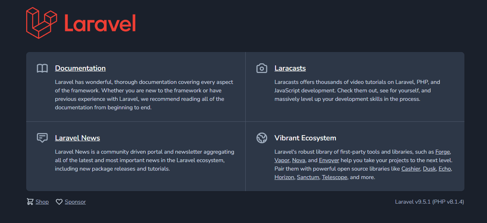
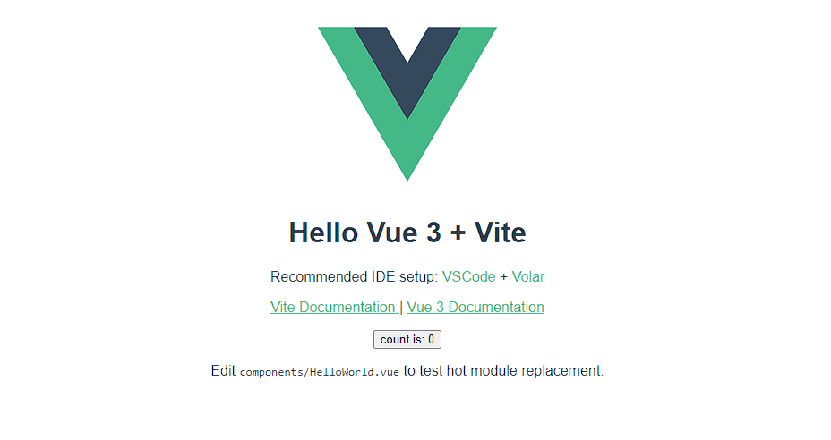

Всем привет! Эта статья продолжает серию переводов замечательных статей об использовании Docker для локальной веб-разработки.

<!-- more -->

## В этой серии

- [Введение: почему это должно вас волновать?](../docker-dlja-lokalnoj-veb-razrabotki-vvedenie/index.md)
- [Часть 1: базовый стек LEMP](../docker-dlja-lokalnoj-veb-razrabotki-chast-1/index.md)
- [Часть 2: посадите свои образы на диету](../docker-dlja-lokalnoj-veb-razrabotki-chast-2/index.md)
- Часть 3: трёхуровневая архитектура с фреймворками ⬅️ вы здесь
- [Часть 4: сглаживание ситуации с помощью Bash](../docker-dlja-lokalnoj-veb-razrabotki-chast-4/index.md)
- [Часть 5: HTTPS для всего](../docker-dlja-lokalnoj-veb-razrabotki-chast-5/index.md)
- [Часть 6: открываем локальный контейнер для доступа в Интернет](../docker-dlja-lokalnoj-veb-razrabotki-chast-6/index.md)
- [Часть 7: использование многоэтапной сборки для внедрения воркера](../docker-dlja-lokalnoj-veb-razrabotki-chast-7/index.md)
- [Часть 8: запланированные задачи](../docker-dlja-lokalnoj-veb-razrabotki-chast-8/index.md)
- [Заключение: куда идти дальше](../docker-dlja-lokalnoj-veb-razrabotki-zaklyuchenie/index.md)

## Предисловие

По правде говоря, то, что мы рассмотрели до сих пор, довольно стандартно. Статей о стеках LEMP на Docker великое множество, и хотя я надеюсь привнести некоторую ценность за счет дружественного к новичкам подхода и определенного уровня детализации, вряд ли было что-то новое (в конце концов, я уже [писал об этом](https://tech.osteel.me/posts/from-vagrant-to-docker-how-to-use-docker-for-local-web-development) в 2015 году).

Я верю, что с сегодняшней статьей ситуация изменится. Существует множество способов управления многоуровневыми проектами с помощью Docker, и хотя подход, который я собираюсь описать, конечно, не единственный, я также считаю, что эта тема вообще не получает широкого освещения.

В этом смысле сегодняшняя статья для некоторых из вас, вероятно, является тем местом, где резина встречается с дорогой. Это не значит, что предыдущие статьи являются незначительными — они представляют собой необходимое введение, способствующее тому, чтобы эта серия была всеобъемлющей, — но именно здесь теория встречается с практической сложностью современных веб-приложений.

Предполагаемая точка отсчета в этом руководстве находится там, где мы остановились в конце [предыдущей части](../docker-dlja-lokalnoj-veb-razrabotki-chast-2/index.md), что соответствует ветке [part-2](https://github.com/osteel/docker-tutorial/tree/part-2) репозитория.

Если вы предпочитаете, вы также можете напрямую обратиться к ветке [part-3](https://github.com/osteel/docker-tutorial/tree/part-3), которая является конечным результатом сегодняшней статьи.

Опять же, это ни в коем случае не единственный подход, просто тот, который был успешным для меня и компаний, для которых я его создавал.

## Трехуровневая архитектура?

После [настройки стека LEMP на Docker](../docker-dlja-lokalnoj-veb-razrabotki-chast-1/index.md) и [уменьшения размера образов](../docker-dlja-lokalnoj-veb-razrabotki-chast-2/index.md) мы собираемся дополнить нашу базу данных MySQL фронтенд-приложением на базе [Vue.js](https://vuejs.org/) и бэкенд-приложением на базе [Laravel](https://laravel.com/), чтобы сформировать то, что мы называем _трехуровневой архитектурой_.

За этим несколько пугающим термином скрывается популярный способ структурирования приложения, заключающийся в разделении презентационного слоя (он же фронтенд), прикладного слоя (он же бэкенд) и персистентного слоя (он же база данных), что обеспечивает независимость каждой части, её развёртываемость, масштабируемость и легкую замену в случае необходимости. Каждый из этих слоев представляет собой один уровень трехуровневой архитектуры. И это всё!

В такой системе обычно бэкенд и фронтенд приложения имеют собственный репозиторий. Однако для простоты мы будем придерживаться одного репозитория в этом учебнике.

## Бэкэнд-приложение

Прежде чем делать что-либо ещё, давайте избавимся от предыдущих контейнеров и томов (не от образов, так как они нам ещё нужны), выполнив следующую команду из корневого каталога проекта:

```bash
$ docker compose down -v
```

Помните, что `down` уничтожает контейнеры, а `-v` удаляет связанные с ними тома.

Давайте также избавимся от предыдущих файлов, связанных с PHP, чтобы освободить место для нового бэкенд-приложения. Удалите папку `.docker/php`, файл `.docker/nginx/conf.d/php.conf` и файл `src/index.php`. Теперь структура файлов и каталогов должна выглядеть следующим образом:

```
docker-tutorial/
├── .docker/
│   ├── mysql/
│   │   └── my.cnf
│   └── nginx/
│       └── conf.d/
│           └── phpmyadmin.conf
├── src/
├── .env
├── .env.example
├── .gitignore
└── docker-compose.yml
```

### Новый сервис backend

Замените содержимое `docker-compose.yml` на это:

```yaml
version: '3.8'

# Services
services:
  # Nginx Service
  nginx:
    image: nginx:1.21-alpine
    ports:
      - 80:80
    volumes:
      - ./src/backend:/var/www/backend
      - ./.docker/nginx/conf.d:/etc/nginx/conf.d
      - phpmyadmindata:/var/www/phpmyadmin
    depends_on:
      - backend
      - phpmyadmin

  # Backend Service
  backend:
    build: ./src/backend
    working_dir: /var/www/backend
    volumes:
      - ./src/backend:/var/www/backend
    depends_on:
      mysql:
        condition: service_healthy

  # MySQL Service
  mysql:
    image: mysql/mysql-server:8.0
    environment:
      MYSQL_ROOT_PASSWORD: root
      MYSQL_ROOT_HOST: '%'
      MYSQL_DATABASE: demo
    volumes:
      - ./.docker/mysql/my.cnf:/etc/mysql/conf.d/my.cnf
      - mysqldata:/var/lib/mysql
    healthcheck:
      test: mysqladmin ping -h 127.0.0.1 -u root --password=$$MYSQL_ROOT_PASSWORD
      interval: 5s
      retries: 10

  # PhpMyAdmin Service
  phpmyadmin:
    image: phpmyadmin/phpmyadmin:5-fpm-alpine
    environment:
      PMA_HOST: mysql
    volumes:
      - phpmyadmindata:/var/www/html
    depends_on:
      mysql:
        condition: service_healthy

# Volumes
volumes:
  mysqldata:

  phpmyadmindata:
```

Основным обновлением является удаление сервиса PHP в пользу сервиса backend, хотя они довольно похожи. Ключ `build` теперь указывает на Dockerfile, расположенный в каталоге backend приложения (`src/backend`), который также смонтирован как том.

Поскольку бэкенд-приложение будет создано с помощью Laravel, давайте создадим конфигурацию сервера Nginx на основе той, что приведена в [официальной документации](https://laravel.com/docs/9.x/deployment#nginx). Создайте новый файл `backend.conf` в `.docker/nginx/conf.d`:

```nginx
server {
    listen      80;
    listen      [::]:80;
    server_name backend.demo.test;
    root        /var/www/backend/public;

    add_header X-Frame-Options "SAMEORIGIN";
    add_header X-Content-Type-Options "nosniff";

    index index.php;

    charset utf-8;

    location / {
        try_files $uri $uri/ /index.php?$query_string;
    }

    location = /favicon.ico { access_log off; log_not_found off; }
    location = /robots.txt  { access_log off; log_not_found off; }

    error_page 404 /index.php;

    location ~ \.php$ {
        fastcgi_pass  backend:9000;
        fastcgi_param SCRIPT_FILENAME $realpath_root$fastcgi_script_name;
        include       fastcgi_params;
    }

    location ~ /\.(?!well-known).* {
        deny all;
    }
}
```

Запомните значения для `server_name` и `fastcgi_pass` (теперь они указывают на порт 9000 контейнера backend).

!!! note "Примечание"

    Почему бы не использовать Laravel Sail?

    Если вы уже являетесь разработчиком Laravel, вы, возможно, сталкивались с [Sail](https://laravel.com/docs/sail), официальной средой разработки Laravel на базе Docker. Хотя их подход во многом похож на подход этой серии, главное отличие в том, что Sail предназначена для приложений, полностью состоящих из Laravel, в отличие от приложений, где часть Laravel является лишь одним из компонентов среди других, как в случае с этой серией.

    Если вам интересно узнать о Laravel Sail, я опубликовал [исчерпывающее руководство](https://tech.osteel.me/posts/you-dont-need-laravel-sail), которое научит вас всему, что вам нужно знать.

Вам также необходимо дополнить локальный файл `hosts` новыми доменными именами (если вы забыли, как это сделать, посмотрите [здесь](../docker-dlja-lokalnoj-veb-razrabotki-chast-1/index.md#domennoe-imia)):

```
127.0.0.1 backend.demo.test frontend.demo.test phpmyadmin.demo.test
```

Обратите внимание, что мы также добавили домен frontend'а, чтобы сэкономить время, и что мы изменили phpMyAdmin с `phpmyadmin.test` на `phpmyadmin.demo.test` для согласованности.

Теперь вам следует открыть файл `phpmyadmin.conf` в папке `.docker/nginx/conf.d` и соответствующим образом обновить следующую строку:

```nginx
server_name phpmyadmin.demo.test
```

Теперь создайте каталог `src/backend` и добавьте `Dockerfile` с таким содержанием:

```docker
FROM php:8.1-fpm-alpine
```

Теперь ваша файловая структура должна выглядеть следующим образом:

```
docker-tutorial/
├── .docker/
│   ├── mysql/
│   │   └── my.cnf
│   └── nginx/
│       └── conf.d/
│           └── backend.conf
│           └── phpmyadmin.conf
├── src/
│   └── backend/
│       └── Dockerfile
├── .env
├── .env.example
├── .gitignore
└── docker-compose.yml
```

Для нормальной работы Laravel требуется [несколько расширений PHP](https://laravel.com/docs/installation#server-requirements), поэтому нам необходимо убедиться, что они установлены. Версия образа PHP Alpine поставляется с рядом предустановленных расширений, список которых мы можем получить, выполнив следующую команду (как обычно, из корня проекта):

```bash
$ docker compose run --rm backend php -m
```

Если вы помните, в первой части этой серии мы использовали `exec` для запуска Bash внутри контейнера, тогда как в этот раз мы используем `run` для выполнения нужной нам команды. В чем разница?

`exec` просто позволяет нам выполнить команду на уже запущенном контейнере, в то время как `run` делает это на новом контейнере, который немедленно останавливается после завершения команды. Однако по умолчанию он не удаляет контейнер; чтобы это произошло, нам нужно указать `--rm` после `run`.

Эта команда, по сути, запускает `php -m` на контейнере backend и дает следующий результат:

```bash
[PHP Modules]
Core
ctype
curl
date
dom
fileinfo
filter
ftp
hash
iconv
json
libxml
mbstring
mysqlnd
openssl
pcre
PDO
pdo_sqlite
Phar
posix
readline
Reflection
session
SimpleXML
sodium
SPL
sqlite3
standard
tokenizer
xml
xmlreader
xmlwriter
zlib

[Zend Modules]
```

Это довольно много расширений, что может показаться неожиданным после прочтения [предыдущей части](../docker-dlja-lokalnoj-veb-razrabotki-chast-2/index.md), в которой восхвалялись образы Alpine за то, что в них по умолчанию установлен самый минимум. Причина также была указана в предыдущей статье: поскольку не всегда просто установить что-то на дистрибутив Alpine, создатели образа PHP решили облегчить жизнь своим пользователям, предварительно установив кучу расширений.

Конечный результат — около 80 МБ, что всё равно очень мало.

Теперь, когда мы знаем, каких расширений не хватает, мы можем заполнить Dockerfile для их установки, а также добавить [Composer](https://getcomposer.org/), который необходим для Laravel:

```docker
FROM php:8.1-fpm-alpine

# Install extensions
RUN docker-php-ext-install pdo_mysql bcmath

# Install Composer
COPY --from=composer:latest /usr/bin/composer /usr/local/bin/composer
```

Здесь мы используем [многоступенчатые сборки](https://docs.docker.com/develop/develop-images/multistage-build/#use-multi-stage-builds) (точнее, [использование внешнего образа в качестве этапа](https://docs.docker.com/develop/develop-images/multistage-build/#use-an-external-image-as-a-stage)), чтобы получить последнюю версию Composer непосредственно из [образа Composer Docker](https://hub.docker.com/_/composer) (подробнее о многоступенчатых сборках мы поговорим в части 7).

### Non-root пользователь (Пользователь без прав администратора)

Перед тем как продолжить, нам нужно сделать ещё одну вещь.

Во-первых, измените секцию `build` сервиса backend в `docker-compose.yml`:

```yaml
# Backend Service
backend:
  build:
    context: ./src/backend
    args:
      HOST_UID: $HOST_UID
  working_dir: /var/www/backend
  volumes:
    - ./src/backend:/var/www/backend
  depends_on:
    mysql:
      condition: service_healthy
```

Теперь секция состоит из ключа `context`, указывающего на Dockerfile бэкенда, как и раньше, а также секции `args`, которую мы рассмотрим через минуту.

Обновите `Dockerfile` бэкенда, чтобы он выглядел следующим образом:

```docker
FROM php:8.1-fpm-alpine

# Install extensions
RUN docker-php-ext-install pdo_mysql bcmath

# Install Composer
COPY --from=composer:latest /usr/bin/composer /usr/local/bin/composer

# Create user based on provided user ID
ARG HOST_UID
RUN adduser --disabled-password --gecos "" --uid $HOST_UID demo

# Switch to that user
USER demo
```

Зачем нам это нужно?

Важно понимать, что, если не указано иное, контейнеры по умолчанию используют пользователя `root`.

Хотя для локальной установки это, пожалуй, нормально, иногда это приводит к проблемам с правами, например, при попытке получить доступ или обновить файл на хост-машине, который был создан контейнером (что часто случается, например, с файлом `laravel.log`).

Это происходит потому, что идентификаторы пользователя и группы, используемые контейнером для создания файла, не всегда совпадают с идентификаторами хост-машины, и в этом случае операция не разрешается (я не хочу слишком долго на этом задерживаться, но приглашаю вас прочитать [эту замечательную статью](https://medium.com/@mccode/understanding-how-uid-and-gid-work-in-docker-containers-c37a01d01cf), чтобы лучше понять, что происходит).

Пользователям Docker Desktop для Mac обычно не нужно беспокоиться об этом, потому что он делает некоторую магию под капотом, чтобы полностью избежать этой проблемы (к сожалению, я не смог найти надлежащего описания соответствующего механизма, кроме [этой проблемы GitHub от 2018 года](https://github.com/docker/for-mac/issues/2657#issuecomment-371210749), ссылающейся на раздел документации Docker, который больше не существует).

С другой стороны, обычно страдают пользователи Linux и WSL 2, а поскольку последняя набирает обороты, внезапно появилось гораздо больше людей, сталкивающихся с проблемами разрешения файлов.

Итак, что делают дополнительные инструкции Dockerfile? Первая из них указывает, что во время сборки образа будет доступна переменная _времени сборки_ `HOST_UID` (опять же, я не хочу тратить на это слишком много времени, но [эта замечательная статья](https://vsupalov.com/docker-arg-env-variable-guide) расскажет вам всё, что нужно знать о переменных Dockerfile). Соответствующее значение будет получено из секции `args`, которую мы также добавили в файл `docker-compose.yml` ранее и которая будет содержать ID текущего пользователя хост-машины (подробнее об этом через минуту).

Затем мы создадим пользователя с таким же ID в контейнере, используя команду `adduser` в Alpine (подробности см. в [документации](https://wiki.alpinelinux.org/wiki/Setting_up_a_new_user)). Мы называем этого пользователя `demo`.

Наконец, мы говорим Docker переключиться на этого пользователя с помощью команды `USER`, что означает, что с этого момента `demo` будет пользователем контейнера по умолчанию.

Нам осталось сделать ещё одну вещь — передать идентификатор пользователя с хост-машины в файл `docker-compose.yml`.

Сначала давайте узнаем, что это за значение, выполнив следующую команду в терминале на хост-машине:

```bash
$ id -u
```

На macOS, например, это значение может быть `501`. На WSL2 — `1000`.

Теперь откройте файл `.env` в корне проекта и добавьте в него следующую строку:

```ini
HOST_UID=501
```

Измените значение на полученное с помощью предыдущей команды, если оно отличается. Готово!

Благодаря этой настройке мы получили гарантию того, что файлы, совместно используемые хост-машиной и контейнерами, всегда будут принадлежать одному и тому же идентификатору пользователя, независимо от того, с какой стороны они были созданы. Это решение также имеет огромное преимущество — оно работает в разных операционных системах.

Я знаю, что рассказал обо всем этом довольно быстро, но я не хочу утомлять вас деталями в середине и без того довольно плотного поста. Я советую вам сохранить в закладках несколько URL-адресов, которые я указал в этом разделе, и вернуться к ним после того, как вы закончите этот учебник.

!!! note "Примечание"

    Как насчет идентификатора группы?

    При изучении этого вопроса большинство ресурсов, которые я нашел, также предлагали создать группу с тем же ID, что и группа пользователя на хост-машине. Изначально я собирался сделать то же самое, но это вызывало всевозможные конфликты, и не было простого способа их обойти.

    Учитывая это, кажется, что наличие одинакового ID пользователя с обеих сторон достаточно, чтобы избежать проблем с правами доступа к файлам, что привело меня к выводу, что создание группы с тем же ID также не является необходимым. Если вы считаете, что это ошибка, пожалуйста, сообщите мне в комментариях, почему.

    Кстати, это не означает, что пользователь, созданный в контейнере, не принадлежит ни к какой группе — если таковая не указана, `adduser` по умолчанию создаст группу с тем же ID, что и у пользователя, и назначит его в нее.

Теперь нам нужно перестроить образ, чтобы применить изменения:

```bash
$ docker compose build backend
```

### Создание нового проекта Laravel

Когда новая версия образа будет готова, выполните следующую команду:

```bash
$ docker compose run --rm backend composer create-project --prefer-dist laravel/laravel tmp "9.*"
```

В результате будет использована версия Composer, установленная на контейнере backend (нет необходимости устанавливать Composer локально!), для создания нового проекта Laravel 9 в папке `/var/www/backend/tmp` контейнера.

Согласно `docker-compose.yml`, рабочей директорией контейнера является `/var/www/backend`, в которую была смонтирована локальная папка `src/backend` — если вы сейчас заглянете в эту директорию на вашей локальной машине, вы обнаружите новую папку `tmp`, содержащую файлы свежего приложения Laravel. Но почему мы не создали проект в backend напрямую?

За кулисами `composer create-project` выполняет `git clone`, а это не сработает, если целевой каталог не пуст. В нашем случае директория `backend` уже содержит `Dockerfile`, который необходим для выполнения команды в первую очередь. По сути, мы создали папку `tmp` в качестве временного дома для нашего проекта, и теперь нам нужно переместить файлы в их окончательное местоположение:

```bash
$ docker compose run --rm backend sh -c "mv -n tmp/.* ./ && mv tmp/* ./ && rm -Rf tmp"
```

Это приведет к запуску содержимого между двойными кавычками на контейнере, `sh -c` в основном является трюком, позволяющим нам выполнять более одной команды одновременно (если бы мы запустили `docker compose run --rm backend mv -n tmp/.* ./ && mv tmp/* ./ && rm -Rf tmp` вместо этого, только первая команда `mv` была бы выполнена на контейнере, а остальные — на локальной машине).

!!! note "Примечание"

    Разве Composer не должен находиться в собственном контейнере?

    Распространённый способ работы с менеджерами пакетов — изолировать их в собственных контейнерах. Основная причина заключается в том, что это внешние инструменты, используемые в основном во время разработки, и что они не должны поставляться с самим приложением (что в целом верно).

    Я действительно использовал этот подход некоторое время, но он имеет недостатки, которые часто упускаются из виду: поскольку Composer позволяет разработчикам указывать требования к пакету (необходимые расширения PHP, минимальная версия PHP и т. д.), по умолчанию он будет проверять систему, на которую он устанавливает зависимости приложения, чтобы убедиться, что она соответствует этим критериям. На практике это означает, что конфигурация контейнера, на котором установлен Composer, должна быть максимально приближена к конфигурации приложения, что часто означает удвоение работы для сопровождающего. В результате некоторые предпочитают запускать Composer с флагом `--ignore-platform-reqs`, что гарантирует, что зависимости всегда будут устанавливаться независимо от конфигурации системы.

    Это опасно: хотя в большинстве случаев ошибки, связанные с зависимостями, будут замечены во время разработки, в некоторых случаях проблема может остаться незамеченной, пока кто-то не наткнется на нее в постановке («staging») или даже в продакшене (это особенно актуально, если ваше приложение не имеет полного тестового покрытия). Более того, поэтапные сборки — это эффективный способ отделить менеджер пакетов от приложения в одном Dockerfile, но об этом я расскажу позже в этой серии. Потерпите!

По умолчанию Laravel создал для вас файл `.env`, но давайте заменим его содержимое на этот (вы найдете этот файл в `src/backend`):

```ini
APP_NAME=demo
APP_ENV=local
APP_KEY=base64:BcvoJ6dNU/I32Hg8M8IUc4M5UhGiqPKoZQFR804cEq8=
APP_DEBUG=true
APP_URL=http://backend.demo.test

LOG_CHANNEL=single

DB_CONNECTION=mysql
DB_HOST=mysql
DB_PORT=3306
DB_DATABASE=demo
DB_USERNAME=root
DB_PASSWORD=root

BROADCAST_DRIVER=log
CACHE_DRIVER=file
QUEUE_CONNECTION=sync
SESSION_DRIVER=file
```

Здесь не так много интересного, кроме конфигурации базы данных (обратите внимание на значение `DB_HOST`) и некоторых стандартных настроек приложения.

Давайте опробуем нашу новую установку:

```bash
$ docker compose up -d
```

Когда всё будет готово, посетите [backend.demo.test](http://backend.demo.test/); если всё прошло хорошо, вы должны увидеть домашнюю страницу проекта на Laravel:



!!! note "Примечание"

    Увеличьте объем оперативной памяти!

    Если время отклика бэкенда кажется медленным, быстрый и простой трюк для Docker Desktop — увеличить объем оперативной памяти, которую он может использовать. Откройте настройки и отрегулируйте ползунок _Memory_ в разделе _Resources_. Если у вас Windows, эти настройки регулируются ОС.

    По умолчанию это значение равно 2 ГБ; я увеличил его вдвое, и это заметно улучшило ситуацию (если у вас 8 ГБ или больше, это, скорее всего, никак не повлияет на производительность вашей машины).

    Есть и другие вещи, которые можно сделать для ускорения работы macOS (например, [Mutagen](https://docs.docker.com/docker-for-mac/mutagen/)), но они кажутся немного халтурными, и лично я не являюсь их большим поклонником. Если вы предпочитаете PHP, обязательно ознакомьтесь с разделом [OPcache](#opcache) ниже.

    А если вы являетесь пользователем Windows и ещё не пробовали [WSL 2](https://docs.docker.com/docker-for-windows/wsl/), то вам, вероятно, стоит обратить на него внимание.

Давайте также проверим настройки нашей базы данных, запустив стандартные миграции Laravel:

```bash
$ docker compose exec backend php artisan migrate
```

Вы можете войти в [phpmyadmin.demo.test](http://phpmyadmin.demo.test/) (с учетными данными `root` / `root`), чтобы убедиться в наличии базы данных `demo` и её недавно созданных таблиц (`failed_jobs`, `migrations`, `password_resets` и `users`).

Осталось сделать последнее, прежде чем перейти к фронтенду: поскольку наша цель — взаимодействие с бэкендом, давайте добавим следующую конечную точку в `routes/api.php`:

```php
<?php // ignore this line, it's for syntax highlighting only

Route::get('/hello-there', function () {
    return 'General Kenobi';
});
```

Попробуйте перейти по ссылке [backend.demo.test/api/hello-there](http://backend.demo.test/api/hello-there), вы должны увидеть строчку «General Kenobi».

Наш API готов!

На этом мы закончили, но если вы хотите экспериментировать дальше, пока контейнер бэкенда работает, вы можете запустить команды Artisan и Composer следующим образом:

```bash
$ docker compose exec backend php artisan
$ docker compose exec backend composer
```

А если он не запущен:

```bash
$ docker compose run --rm backend php artisan
$ docker compose run --rm backend composer
```

!!! note "Примечание"

    Используете Xdebug?

    Я сам не использую его, но на данном этапе вы, возможно, захотите добавить Xdebug в свою сборку. Я не буду подробно рассказывать об этом, потому что это слишком специфично для PHP, но [это руководство](https://matthewsetter.com/setup-step-debugging-php-xdebug3-docker/) покажет вам понять, как заставить его работать с Docker и Docker Compose.

### OPcache

Вы можете пропустить этот раздел, если PHP не является языком, который вы собираетесь использовать в бэкенде. Однако если это так, я настоятельно рекомендую вам выполнить эти шаги, потому что OPcache — это изменение в игре, когда речь идет о локальной производительности, особенно на macOS (но это также улучшит вашу работу на других операционных системах).

Я не буду подробно объяснять это здесь и просто процитирую [официальную документацию PHP](https://www.php.net/manual/ru/intro.opcache.php):

> OPcache улучшает производительность PHP путём сохранения скомпилированного байт-кода скриптов в разделяемой памяти, тем самым избавляя PHP от необходимости загружать и анализировать скрипты при каждом запросе.

По умолчанию он не включен, но мы можем легко сделать это, выполнив несколько шагов, заимствованных из [этой статьи](https://laravel-news.com/php-opcache-docker) (которую я приглашаю вас прочитать для получения более подробной информации о различных параметрах).

Во-первых, нам нужно представить пользовательскую конфигурацию для PHP. Создайте новую папку `.docker` в `src/backend` и добавьте в нее файл `php.ini` со следующим содержимым:

```ini
[opcache]
opcache.enable=1
opcache.revalidate_freq=0
opcache.validate_timestamps=1
opcache.max_accelerated_files=10000
opcache.memory_consumption=192
opcache.max_wasted_percentage=10
opcache.interned_strings_buffer=16
opcache.fast_shutdown=1
```

Мы размещаем этот файл здесь, а не в корне проекта, потому что эта конфигурация специфична для бэкенд-приложения, и нам нужно ссылаться на нее из его Dockerfile.

Dockerfile — это действительно то место, откуда мы можем импортировать эту конфигурацию, а также то место, куда мы установим расширение `opcache`. Замените его содержимое на следующее:

```docker
FROM php:8.1-fpm-alpine

# Install extensions
RUN docker-php-ext-install pdo_mysql bcmath opcache

# Install Composer
COPY --from=composer:latest /usr/bin/composer /usr/local/bin/composer

# Configure PHP
COPY .docker/php.ini $PHP_INI_DIR/conf.d/opcache.ini

# Use the default development configuration
RUN mv $PHP_INI_DIR/php.ini-development $PHP_INI_DIR/php.ini

# Create user based on provided user ID
ARG HOST_UID
RUN adduser --disabled-password --gecos "" --uid $HOST_UID demo

# Switch to that user
USER demo
```

Обратите внимание, что мы добавили инструкцию по копированию файла `php.ini` в каталог, в который должны помещаться пользовательские конфигурации в контейнере, местоположение которого задается переменной окружения `$PHP_INI_DIR`. Кроме того, мы также использовали настройки разработки по умолчанию, предоставленные сопровождающими образа, которые, помимо прочего, устанавливают параметры отчетов об ошибках (для этого предназначена следующая инструкция `RUN`).

Вот и всё! Соберите образ снова и перезапустите контейнеры — вы должны заметить некоторое улучшение в отзывчивости бэкенда:

```bash
$ docker compose build backend
$ docker compose up -d
```

## Фронтенд-приложение

Третий уровень нашей архитектуры — это фронтенд-приложение, для которого мы будем использовать всё более популярный Vue.js.

Шаги по его настройке на самом деле очень похожи на шаги по настройке бэкенда; сначала добавим соответствующий сервис в `docker-compose.yml`, сразу после бэкенда:

```yaml
# Frontend Service
frontend:
  build: ./src/frontend
  working_dir: /var/www/frontend
  volumes:
    - ./src/frontend:/var/www/frontend
  depends_on:
    - backend
```

Здесь нет ничего такого, чего бы мы не видели раньше. Нам также нужно указать для сервиса Nginx, что сначала должен быть запущен сервис frontend:

```yaml
# Nginx Service
nginx:
  image: nginx:1.21-alpine
  ports:
    - 80:80
  volumes:
    - ./src/backend:/var/www/backend
    - ./.docker/nginx/conf.d:/etc/nginx/conf.d
    - phpmyadmindata:/var/www/phpmyadmin
  depends_on:
    - backend
    - phpmyadmin
    - frontend
```

Затем создайте новую папку `frontend` в `src` и добавьте в нее следующий Dockerfile:

```docker
FROM node:17-alpine
```

На данный момент мы просто берем Alpine-версию [официального образа Node.js](https://hub.docker.com/_/node), которая поставляется как с [Yarn](https://yarnpkg.com/), так и с [npm](https://www.npmjs.com/) (это менеджеры пакетов, как Composer, но для JavaScript). Я буду использовать Yarn, так как мне сказали, что именно им пользуются крутые ребята в наше время.

Давайте соберем образ:

```bash
$ docker compose build frontend
```

Когда образ будет готов, создайте свежий проект Vue.js с помощью следующей команды:

```bash
$ docker compose run --rm frontend yarn create vite tmp --template vue
```

Мы используем [Vite](https://vitejs.dev/) для [создания нового проекта](https://vitejs.dev/guide/#scaffolding-your-first-vite-project) в каталоге `tmp`. Этот каталог расположен в `/var/www/frontend`, который является рабочим каталогом контейнера согласно `docker-compose.yml`.

!!! note "Примечание"

    Почему именно Vite?

    [Vite](https://vitejs.dev/) — это набор инструментов для фронтенда, на который обратил мое внимание Брайан Парвин в [комментариях](https://tech.osteel.me/posts/docker-for-local-web-development-part-3-a-three-tier-architecture-with-frameworks#comment-5697583530). Он обеспечивает значительный прирост производительности по сравнению с [Vue CLI](https://cli.vuejs.org/) в части компиляции и горячей загрузки.

Как и в бэкенде, давайте переместим файлы из `tmp` обратно в родительский каталог:

```bash
$ docker compose run --rm frontend sh -c "mv -n tmp/.* ./ && mv tmp/* ./ && rm -Rf tmp"
```

Если всё прошло успешно, вы найдете файлы приложения в папке `src/frontend` на вашей локальной машине.

Наконец, давайте установим зависимости проекта:

```bash
$ docker compose run --rm frontend yarn
```

!!! note "Примечание"

    Проблемы с папкой `node_modules`?

    Несколько читателей сообщили о проблемах с симлинками, связанных с папкой `node_modules` в Windows. Честно говоря, я не совсем понимаю, что здесь происходит, но кажется, что создание файла `.dockerignore` в корне проекта, содержащего строку `node_modules`, исправляет ситуацию (возможно, сначала вам придется удалить эту папку). Опять же, не уверен, почему так, но вы можете найти ответы [здесь](https://github.com/docker/compose/issues/5888#issuecomment-660578735).

    Файлы `.dockerignore` очень похожи на файлы `.gitignore` в том, что они позволяют нам указать файлы и папки, которые следует игнорировать при копировании или добавлении содержимого в контейнер. В контексте этой серии они не очень нужны, и я затронул их только в заключении, но вы можете прочитать о них больше [здесь](https://docs.docker.com/engine/reference/builder/#dockerignore-file).

Ранее мы уже добавили `frontend.demo.test` в файл `hosts`, поэтому перейдем к созданию конфигурации сервера Nginx. Добавьте новый файл `frontend.conf` в `.docker/nginx/conf.d`, со следующим содержанием (большая часть блока `location` взята из [этой статьи](https://medium.com/@robertz/nginx-vuejs-and-express-with-docker-4177cb506fbf)):

```nginx
server {
    listen      80;
    listen      [::]:80;
    server_name frontend.demo.test;

    location / {
        proxy_pass         http://frontend:8080;
        proxy_http_version 1.1;
        proxy_set_header   Upgrade $http_upgrade;
        proxy_set_header   Connection 'upgrade';
        proxy_cache_bypass $http_upgrade;
        proxy_set_header   Host $host;
    }
}
```

Эта простая конфигурация перенаправляет трафик с порта 80 доменного имени на порт 8080 контейнера, который будет использоваться сервером разработки.

Давайте также обновим файл `vite.config.js` в `src/frontend`:

```js
import { defineConfig } from 'vite';
import vue from '@vitejs/plugin-vue';

export default defineConfig({
  plugins: [vue()],
  server: {
    host: true,
    hmr: { port: 80 },
    port: 8080,
    watch: {
      usePolling: true,
    },
  },
});
```

Это обеспечит работоспособность функции горячей загрузки. Я не буду подробно описывать каждый вариант, поскольку речь идет не столько о настройке Vite, сколько о том, как создать фронтенд и бэкенд приложения с помощью Docker, независимо от выбранного фреймворка. Однако вы можете ознакомиться с [документацией](https://vitejs.dev/config/)!

Давайте завершим наш `Dockerfile`, добавив команду, которая запустит сервер разработки:

```docker
FROM node:17-alpine

# Start application
CMD ["yarn", "dev"]
```

Пересоберите образ:

```bash
$ docker compose build frontend
```

И запустите проект, чтобы Docker подхватил изменения образа (по какой-то причине команда `restart` этого не сделает):

```bash
$ docker compose up -d
```

Когда все будет готово, зайдите на [frontend.demo.test](http://frontend.demo.test/) и вы увидите приветственную страницу:



Если нет, посмотрите логи контейнера, чтобы понять, что происходит:

```bash
$ docker compose logs -f frontend
```

Откройте `src/frontend/src/components/HelloWorld.vue` и обновите некоторое содержимое (например, тег `<h1>`). Вернитесь в браузер, и вы увидите изменения в реальном времени — это горячая загрузка делает свое волшебство!

Чтобы убедиться, что наша установка завершена, нам осталось сделать запрос к конечной точке API, которую мы определили ранее в бэкенде, с помощью Axios. Давайте установим пакет с помощью следующей команды:

```bash
$ docker compose exec frontend yarn add axios
```

Как только Yarn будет готов, замените содержимое `src/frontend/src/App.vue` на следующее:

```jsx
<template>
  <div id="app">
    <HelloThere :msg="msg" />
  </div>
</template>

<script>
import axios from 'axios';
import HelloThere from './components/HelloThere.vue';

export default {
  name: 'App',
  components: {
    HelloThere,
  },
  data() {
    return {
      msg: null,
    };
  },
  mounted() {
    axios
      .get('http://backend.demo.test/api/hello-there')
      .then((response) => (this.msg = response.data));
  },
};
</script>
```

Всё, что мы здесь делаем, это обращаемся к конечной точке `hello-there`, которую мы создали ранее, и присваиваем её ответ свойству `msg`, которое передается компоненту HelloThere. И снова я не буду слишком задерживаться на этом, поскольку это не учебник по Vue.js — я просто использую его в качестве примера.

Удалите файл `src/frontend/src/components/HelloWorld.vue` и создайте на его месте новый файл `HelloThere.vue`:

```jsx
<template>
    <div>
        
        <p>{{ msg }}</p>
    </div>
</template>

<script>
export default {
    name: 'HelloThere',
    props: {
        msg: String
    }
}
</script>

<style>
p {
    font-family: "Arial", sans-serif;
    font-size: 90px;
    text-align: center;
    font-weight: bold;
}

.center {
    display: block;
    margin-left: auto;
    margin-right: auto;
    width: 50%;
}
</style>
```

Компонент содержит немного кода HTML и CSS и отображает значение `msg` в теге `<p>`.

Сохраните файл и вернитесь в браузер: содержимое ответа нашей конечной точки API теперь должно отображаться в нижней части страницы.


Если вы хотите поэкспериментировать дальше, пока контейнер фронтенда работает, вы можете запускать команды Yarn следующим образом:

```bash
$ docker compose exec frontend yarn
```

А если он не запущен:

```bash
$ docker compose run --rm frontend yarn
```

!!! note "Примечание"

    Использование отдельных репозиториев

    Как я уже упоминал в начале статьи, в реальной ситуации фронтенд и бэкенд приложения, скорее всего, будут находиться в собственных репозиториях, а среда Docker — в третьем. Как сформулировать их три?

    Я делаю это следующим образом: добавляю папку `src` в корневой файл `.gitignore` и проверяю в ней приложения frontend и backend в отдельных каталогах. И это всё! Поскольку `src` является _git-ignored_, вы можете спокойно проверять в ней другие кодовые базы без конфликтов. Теоретически, вы также можете использовать [подмодули Git](https://git-scm.com/book/ru/v2/%D0%98%D0%BD%D1%81%D1%82%D1%80%D1%83%D0%BC%D0%B5%D0%BD%D1%82%D1%8B-Git-%D0%9F%D0%BE%D0%B4%D0%BC%D0%BE%D0%B4%D1%83%D0%BB%D0%B8) для достижения этой цели, но на практике это практически ничего не дает, особенно при применении того, что мы рассмотрим в следующей части.

## Заключение

Это была ещё одна длинная статья, поздравляю, если вы дочитали до этого момента!

Эта статья ещё раз подчеркивает тот факт, что, когда дело доходит до создания такой среды, многое остается на усмотрение сопровождающего. В Docker редко можно найти четкий способ действий, что является одновременно и достоинством, и недостатком — несколько подавляющая гибкость. Эти небольшие отступления делают эти статьи плотными, но я думаю, что для вас важно знать, что вы можете задавать вопросы о том, как всё делается.

На этой же ноте вы можете начать задаваться вопросом о практичности такой среды, с её многочисленными командами и синтаксисом, которые нужно запомнить, чтобы правильно в ней ориентироваться. И вы будете правы. Поэтому [следующая статья](../docker-dlja-lokalnoj-veb-razrabotki-chast-4/index.md) будет посвящена использованию Bash для абстрагирования от части этой сложности, чтобы представить вместо нее более приятный и дружественный интерфейс.

---

Оригинальная статья: [Docker for local web development, part 3: a three-tier architecture with frameworks](https://tech.osteel.me/posts/docker-for-local-web-development-part-3-a-three-tier-architecture-with-frameworks) (English)
