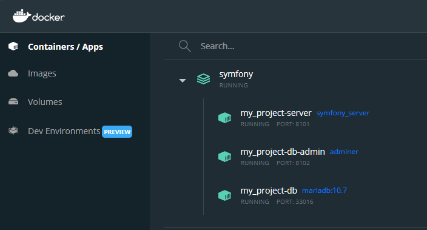
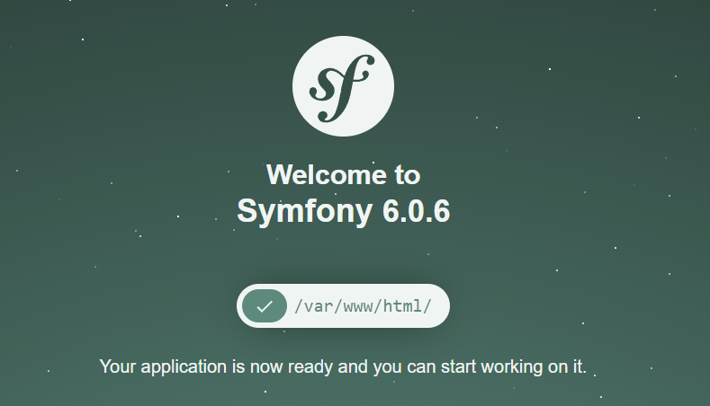

Эта статья — некий симбиоз кусочков, взятых из других решений, а также некоторых знаний и понимания Docker, которые я получил в процессе изучения различных источников.

<!-- more -->

## Требования

- [Docker Engine](https://docs.docker.com/engine/install/)
- [Docker Compose](https://docs.docker.com/compose/install/)

## Введение

Начнем с небольшой аналогии для тех, кто знаком с ООП.

!!! note "Примечание"

    Образы — это классы, то есть шаблоны приложения и его зависимостей, собранных вместе. А контейнеры — объекты этих классов, то есть экземпляры образов. Если продолжить аналогию дальше, то в PHP запись вида `new Classname()` равносильна команде `docker run <image name>`. Есть и другие аналогии. Например, в статье [Как и для чего использовать Docker](https://guides.hexlet.io/ru/docker/) образы рассматриваются как операционные системы, а контейнеры — как запущенные процессы в этих системах.

Что нужно для счастья рядовому пользователю [OSPanel](/../../tags.md#tag:os-panel), который захотел попробовать Docker? Вероятно, веб-сервер типа Apache, PHP 8, MySQL и что-нибудь типа PHPMyAdmin для доступа к базам данных. Этот набор называется _стеком_. Для каждого сервиса в нашем стеке мы создадим отдельный контейнер, с нужной конфигурацией. Контейнеры независимы и могут ничего не знать друг о друге, но при этом отлично работают вместе. Для примера мы создадим проект на основе Apache, PHP 8.3, MariaDB и Adminer (в качестве лёгкой альтернативы PHPMyAdmin).

Вы убедитесь, что не нужно быть системным администратором или DevOps-разработчиком, чтобы иметь базовое понимание, как использовать Docker в своей работе.

!!! note "Примечание"

    Более детально разобраться в Docker вам поможет бесплатный курс [Docker для начинающих + практический опыт](https://rotoro.cloud/ld-courses/docker-%D0%B4%D0%BB%D1%8F-%D0%BD%D0%B0%D1%87%D0%B8%D0%BD%D0%B0%D1%8E%D1%89%D0%B8%D1%85-%D0%BF%D1%80%D0%B0%D0%BA%D1%82%D0%B8%D1%87%D0%B5%D1%81%D0%BA%D0%B8%D0%B9-%D0%BE%D0%BF%D1%8B%D1%82/).

## Структура каталогов

Создайте следующую структуру в корневом каталоге вашего проекта:

```
.
├── src/
├── docker/
│   ├── db/
│   │   └── mariadb/
│   │       └── my.cnf
│   └── server/
│       ├── apache/
│       │   └── sites-enabled/
│       │       └── site.conf
│       ├── php/
│       │   └── php.ini
│       └── Dockerfile
├── .env
└── compose.yaml
```

Папка `src` будет содержать исходный код нашего проекта. В папке `docker` спрячем конфигурационные файлы наших сервисов. В файле `.env` будут указаны используемые переменные окружения. О файле `compose.yaml` читайте ниже.

## compose.yaml

Любое многоконтейнерное приложение Docker состоит из нескольких строчек кода в файле `compose.yaml`:

```yaml
# Используемая версия спецификации
version: '3.9' # необязательно начиная с Docker Compose v1.27.0

services:
# Далее перечисляем используемые сервисы
```

Наверняка некоторые из читателей, кто пользовался OSPanel, помнят проблему, возникшую (и до сих пор возникающую у некоторых пользователей) при обновлении PHPMyAdmin, когда PHPMyAdmin отказывался работать с несовместимыми версиями PHP. В Docker любой такой сервис запускается в отдельном контейнере, именно с той версией компонентов, которые ему нужны для полноценной работы. Поэтому у вас вполне могут быть, скажем, PHP 5.6 для работы приложения (в первом контейнере), и при этом PHPMyAdmin самой свежей версии, работающая на PHP 8.2 (в другом контейнере).

В рамках этого руководства я не буду настраивать файл `hosts` на локальном компьютере, чтобы сделать доступ к сайту более удобным для пользователя, а буду обращаться к нему через `localhost:[PORT]`. Вы можете это сделать сами, добавив в файл `hosts` строчку типа `127.0.0.1 mysite.dev`. Также самостоятельно убедитесь, что указанный вами порт не занят, и сопоставьте доступные порты вашего локального компьютера с портами контейнеров. Другие приложения, которые могут использовать те же порты, на время тестирования лучше отключить.

Начнем с добавления сервиса `server`, который под капотом устанавливает образ с Apache и PHP 8.3 с нужными нам расширениями:

```yaml
version: '3.9'

services:
  server:
    image: php:8.3-apache
```

Однако как же нам добавить конкретные расширения? Поможет `Dockerfile` с набором определённых команд. Потребуется лишь заменить директиву `image` на `build` и указать путь к этому файлу:

```yaml
version: '3.9'

services:
  server:
    build:
      context: .
      dockerfile: ./docker/server/Dockerfile # Указываем путь к файлу Dockerfile
    container_name: '${APP_NAME}-server' # Указываем имя контейнера
    ports:
      - '${APP_PORT}:80' # Порт, по которому сервис будет доступен снаружи:внутри контейнера
    working_dir: /var/www/html # Рабочая директория внутри контейнера
    environment:
      - 'DATABASE_URL=mysql://${MYSQL_USER}:${MYSQL_PASS}@db_server:3306/${MYSQL_DB}?serverVersion=${MYSQL_VER}'
    volumes:
      - ./src:/var/www/html # Сопоставление директории src в корне проекта с рабочей директорией сервера
      - ./docker/server/apache/sites-enabled:/etc/apache2/sites-enabled # Конфигурация сайтов
      - ./docker/server/php/php.ini:/usr/local/etc/php/conf.d/extra-php-config.ini # ini-файл с необходимыми нам настройками PHP
```

!!! note "Примечание"

    Любой вложенный подпункт в `.yml`-файле должен содержать 2 или 4 пробела в качестве отступа — придерживайтесь единого стиля во всём файле.

Обратите внимание на секцию `volumes`. Это так называемые тома, обозначаемые с помощью записи вида `<путь в папке проекта>:<путь внутри контейнера>`. Такое сопоставление называется _пробросом_. Пробрасывать можно как файлы, так и директории. При запуске контейнера Докер пробросит локальные файлы и директории на место соответствующих файлов и директорий в файловой системе контейнера. Любые изменения, производимые внутри `volumes`, применяются как внутри контейнера, так и снаружи.

Вот содержимое `docker/server/Dockerfile`:

```docker
FROM php:8.3-apache

RUN a2enmod rewrite && \
    curl -sSLf \
        -o /usr/local/bin/install-php-extensions \
        https://github.com/mlocati/docker-php-extension-installer/releases/latest/download/install-php-extensions && \
    chmod +x /usr/local/bin/install-php-extensions && \
    install-php-extensions gd pdo_mysql bcmath zip intl opcache @composer
```

Вот как может выглядеть ваш файл `.env`:

```ini
APP_NAME=my_project
APP_PORT=8101
APP_DB_ADMIN_PORT=8102
DB_PORT=33016

MYSQL_ROOT_PASS=root
MYSQL_USER=user
MYSQL_PASS=pass
MYSQL_DB=test_db # База данных, которая будет создана при первоначальном запуске проекта
MYSQL_VER=10.11 # Версия MariaDB
```

Настроим конфигурацию нашего сайта в `docker/server/apache/sites-enabled/site.conf`:

```apache
<VirtualHost *:80>
  DocumentRoot /var/www/html/public
  <Directory /var/www/html/public>
      AllowOverride None
      Order Allow,Deny
      Allow from All

      <IfModule mod_rewrite.c>
          Options -MultiViews
          RewriteEngine On
          RewriteCond %{REQUEST_FILENAME} !-f
          RewriteRule ^(.*)$ index.php [QSA,L]
      </IfModule>
  </Directory>
</VirtualHost>
```

Теперь добавим оставшиеся сервисы, `db_server` и `db_admin`:

```yaml
  db_server:
    image: mariadb:${MYSQL_VER}
    container_name: '${APP_NAME}-db'
    restart: always
    ports:
      - '${DB_PORT}:3306'
    environment:
      MYSQL_ROOT_PASSWORD: '${MYSQL_ROOT_PASS}'
      MYSQL_USER: '${MYSQL_USER}'
      MYSQL_PASSWORD: '${MYSQL_PASS}'
      MYSQL_DATABASE: '${MYSQL_DB}'
    volumes:
      - db_data:/var/lib/mysql
      - ./docker/db/mariadb/my.cnf:/etc/mysql/conf.d/my.cnf
    healthcheck:
      test: mysqladmin ping -h 127.0.0.1 -u root --password=$$MYSQL_ROOT_PASSWORD
      interval: 5s
      retries: 5

  db_admin:
    image: adminer
    container_name: '${APP_NAME}-db-admin'
    ports:
      - '${APP_DB_ADMIN_PORT}:8080'
    environment:
      - ADMINER_DEFAULT_SERVER=db_server
      - ADMINER_DESIGN=lucas-sandery
    depends_on:
      db_server:
        condition: service_healthy
    volumes:
      - db_admin_data:/var/www/html

volumes:
  db_data:
  db_admin_data:
```

Мы будем использовать именованные тома (_volumes_) для сохранения данных. Нам нужны такие тома, потому что без них каждый раз, когда сервисный контейнер БД уничтожается, база данных уничтожается вместе с ним. Именно для этого предназначен последний раздел в файле `compose.yaml`. На тома ссылаются сервисы `db_server` и `db_admin`.

Также обратите внимание на раздел `healthcheck`:

```yaml
healthcheck:
  test: mysqladmin ping -h 127.0.0.1 -u root --password=$$MYSQL_ROOT_PASSWORD
  interval: 5s
  retries: 5
```

Таким образом проверяется, запущен ли наш сервер MariaDB (5 повторений, с интервалом в 5 секунд). Блок `depends_on` в сервисе `db_admin`, который инициирует эту проверку, продублируем и для сервиса `server`.

Осталось добавить пару файлов конфигурации, `docker/server/php/php.ini` и `docker/db/mariadb/my.cnf`:

```ini
upload_max_filesize = 30M
post_max_size = 80M
short_open_tag = Off
memory_limit =  256M
```

```ini
[mysqld]
collation-server = utf8mb4_unicode_ci
character-set-server = utf8mb4
```

Теперь небольшой лайфхак: переместите всю папку с вашим проектом в `\\wsl.localhost\Ubuntu\home\<имя_пользователя_в_ubuntu>\projects` (создайте эту директорию). Это поможет избежать задержек при выполнении скриптов (когда страница долго не отвечает, а потом отваливается с ошибкой и т. п.).

Запустим наше приложение:

```bash
docker compose up -d
```



Для проверки работоспособности сервера создайте файл `src/public/index.php` со следующим содержимым:

```php
<?php phpinfo();
```

Теперь можно использовать адреса `http://localhost:8101/` и `http://localhost:8102/` для доступа к сайту и к панели управления Adminer, соответственно!

Осталось зайти в контейнер `server`:

```bash
docker compose exec server bash
```

удалить все файлы в директории `var/www/html`:

```bash
ls -A1 | xargs rm -rf
```

и установить приложение Symfony:

```bash
composer create-project symfony/website-skeleton .
```



... или Laravel:

```bash
composer create-project laravel/laravel .
```


... или любое другое на ваш вкус.

Дополнительно можно установить права доступа для файлов и папок, если нужно:

```bash
chown -R www-data:www-data .
find . -type f -exec chmod 644 {} \;
find . -type d -exec chmod 755 {} \;
```

Для создания другого проекта копируем папку с текущим, переименовываем, вносим изменения в `.env`-файл, чтобы порты не пересекались, и запускаем аналогичным образом. То есть в итоге вы можете создавать независимые приложения, с отдельными базами данных (а не как в LAMP/WAMP-проектах, когда все базы данных лежат вместе), версиями PHP и т. д.

## Выводы

Таким образом, `compose.yaml` — некий аналог файлов `composer.json` и `package.json` (в проектах на базе Composer и NPM). Он содержит в себе список сервисов (зависимостей), которые должны быть установлены и затем запущены при запуске приложения.

Конечно, по удобству Docker далеко до Open Server, тем более для тех, кто привык к одному продукту. У каждого из них есть как плюсы, так и минусы. Данная статья не является призывом к действию (типа «удаляем OSPanel»), а лишь предлагает для ознакомления современную альтернативу на основе Docker.

## Проект на GitLab

- [Ссылка](https://gitlab.com/dragomano/docker-example-app)

## Используемый материал

- [LAMP Docker setup with PHP 8 and MariaDB for Symfony projects](https://www.bornfight.com/blog/blog-lamp-docker-setup-with-php-8-and-mariadb-for-symfony-projects/) (English)
