Научимся быстрому созданию интерфейсов для Laravel с помощью компонентов maryUI.

<!-- more -->

## Введение

maryUI — это великолепные UI-компоненты для Livewire, работающие на основе daisyUI и Tailwind CSS.

Мы быстро соберём мощное CRUD-приложение, используя простые и эффективные методы работы с [maryUI](https://mary-ui.com/) и Livewire. Вы поразитесь, как мало кода нужно для впечатляющих результатов.

В процессе вы освоите полезные приёмы для создания стильного интерфейса и чистого кода. А также научитесь запускать проекты без готовых решений — с чистого листа.

## Установка

maryUI можно интегрировать с Jetstream/Breeze в ваших проектах, но для этого интенсива мы начнём с самого нуля, для простоты:

- **Свежий Laravel 12+** (установленный и запущенный)
- **Без стартовых наборов** (чистая установка)
- **База данных SQLite** (для минималистичной настройки)

```bash
laravel new myapp
```

При установке не забудьте выбрать вариант с Volt.

```bash
composer require robsontenorio/mary

php artisan mary:install
```

Запустите локальный сервер:

=== ":simple-npm: npm"
    ```bash
    npm run dev
    ```

=== ":simple-pnpm: pnpm"
    ```bash
    pnpm run dev
    ```

=== ":simple-yarn: Yarn"
    ```bash
    yarn dev
    ```

=== ":simple-bun: Bun"
    ```bash
    bun run dev
    ```

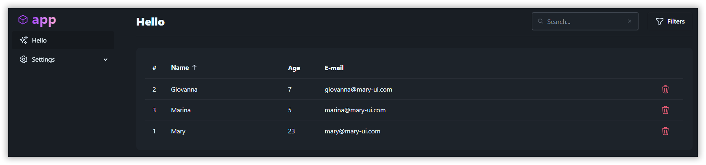

Модернизируем наш пример, заменив хардкод на работу с реальной БД и добавив связи между моделями.

Вместо ручного создания моделей, воспользуйтесь встроенной командой maryUI для автоматизации:

```bash
php artisan mary:bootcamp
```

Будут выполнены следующие действия:

- Создание новой модели `Country`
- Создание новой модели `Language`
- Создание обратной связи «один к одному» между `User` и `Country` (каждый пользователь относится к какой-то стране)
- Создание связи «многие ко многим» между `User` и `Language` (пользователь может знать несколько языков)
- Создание соответствующих миграций, фабрик и сидеров
- Заполнение базы данных тестовыми пользователями, странами, языками и связями между ними

> Если вы обновите страницу в браузере, визуально ничего не изменится — мы займемся компонентом в следующем разделе.

## Отображение пользователей

Как вы можете видеть, в существующем компоненте `users/index.blade.php` уже реализованы сортировка и фильтрация, но данные пока жёстко заданы в коде. Давайте это исправим!

### Компонент таблицы (`x-table`)

Компонент `x-table` позволяет легко отображать данные с пагинацией, настраивать строки через слоты, а также делать таблицу:

- Сортируемой
- Кликабельной
- С возможностью выбора строк
- С раскрывающимися секциями

```php
<x-table :headers="$headers" :rows="$users" />
```

Давайте полностью перепишем метод `users()`, чтобы он использовал Eloquent вместо хардкода:

```php
<?php

use Illuminate\Database\Eloquent\Builder;

public function users(): Collection
{
    return User::query()
        ->with(['country'])
        ->when($this->search, fn(Builder $q) => $q->where('name', 'like', "%$this->search%"))
        ->orderBy(...array_values($this->sortBy))
        ->get();
}
```

После этих изменений вы можете видеть всех пользователей из базы данных.

> Обратите внимание, что столбец `users.age` пустой, так как мы удалили его из миграций. Мы исправим это в следующем разделе.

### Сортировка

Как вы могли заметить в примере исходного кода, у нас есть свойство `$sortBy`, которое управляет:

- столбцом для сортировки
- направлением сортировки (по возрастанию/убыванию)

Эта функциональность работает автоматически при нажатии на заголовки таблицы.

```php
<x-table :headers="$headers" :rows="$users" :sort-by="$sortBy" ... />
```

Давайте обновим свойство `$headers`, заменив столбец `age` на `country.name`:

```diff
- ['key' => 'age', 'label' => 'Age', 'class' => 'w-20'],
+ ['key' => 'country.name', 'label' => 'Country'],
```

При попытке сортировки по столбцу `country.name` возникает ошибка, так как Eloquent не может автоматически сортировать по отношениям. Исправим это:

```php hl_lines="3"
// Это добавит дополнительную колонку `country_name` в коллекции User
User::query()
    ->withAggregate('country', 'name')
    -> ...
```

Обновим свойство `$headers`, чтобы указать правильный столбец для сортировки:

```diff
- ['key' => 'country.name', 'label' => 'Country'],
+ ['key' => 'country_name', 'label' => 'Country'],
```

### Пагинация

Вернёмся к `users/index.blade.php` и используем стандартный трейт `WithPagination` Livewire:

```php hl_lines="1 5"
use Livewire\WithPagination;

new class extends Component
{
    use WithPagination;
}
```

Теперь добавим свойство `with-pagination` для компонента `x-table`:

```php
<x-table ... with-pagination>
```

Наконец, внесем изменения для использования Eloquent-запроса с пагинацией. Обратите внимание, что тип возвращаемого значения изменился:

```php hl_lines="1 3 9"
use Illuminate\Pagination\LengthAwarePaginator;

public function users(): LengthAwarePaginator
{
    return User::query()
        ->withAggregate('country', 'name')
        ->when($this->search, fn(Builder $q) => $q->where('name', 'like', "%$this->search%"))
        ->orderBy(...array_values($this->sortBy))
        ->paginate(5); // вместо `->get()`
}
```

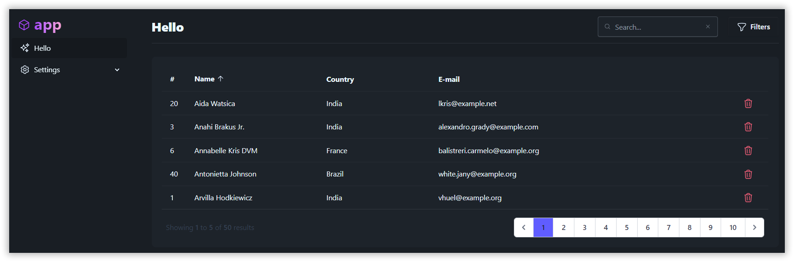

### Сброс фильтров

Есть небольшой «баг» с пагинацией...

1. Перейдите на страницу №9
2. Отфильтруйте по любому имени, которое видите на этой странице
3. Список становится пустым!

На самом деле **это не баг**, а особенность пагинации в Laravel/Livewire (не в maryUI), о которой нужно знать при изменении фильтров.

Исправим это с помощью хуков жизненного цикла Livewire — сбросим пагинацию при изменении свойств компонента. Добавьте следующий метод в компонент:

```php
// Сброс пагинации при изменении любого сввойства компонента
public function updated($property): void
{
    if (! is_array($property) && $property != "") {
        $this->resetPage();
    }
}
```

Подправим метод `clear`:

```php hl_lines="5"
// Сброс фильтров
public function clear(): void
{
    $this->reset();
    $this->resetPage();
    $this->success('Filters cleared.', position: 'toast-bottom');
}
```

!!! tip "Совет"

    Вы можете создать трейт типа `ClearsFilters` с этими методами для переиспользования той же логики в других компонентах.

### CSS таблицы

Вы можете легко применять CSS к заголовкам таблицы и сделать её полностью адаптивной:

```diff
- ['key' => 'country_name', 'label' => 'Country'],
+ ['key' => 'country_name', 'label' => 'Country', 'class' => 'hidden lg:table-cell'],
```

Вы можете даже оформлять строки и ячейки с помощью пользовательского CSS, а также использовать кастомные слоты для переопределения ячеек. С таблицами maryUI можно делать ещё больше — проверьте документацию для дополнительной информации.

### Компонент шапки (`x-header`)

Проверьте исходный код примера, чтобы увидеть, насколько полезен компонент `x-header`. Он включает индикатор прогресса, имеет встроенную вёрстку и адаптируется под разные экраны. Убедитесь в этом на мобильном разрешении.

Давайте изменим заголовок «Hello» на «Users»:

```php
<x-header title="Users" separator progress-indicator ... />
```

### Компонент уведомлений (`x-toast`)

Установщик maryUI уже настроил для вас компонент `x-toast`.

Давайте полностью заменим метод `delete()`:

```php
public function delete(User $user): void
{
    $user->delete();
    $this->warning("$user->name deleted", 'Good bye!', position: 'toast-bottom');
}
```

### Компонент выдвижной панели (`x-drawer`)

Компонент **x-drawer** — отличное решение, когда нужно выполнить второстепенное действие, не прерывая основной процесс работы пользователя.

```php
<x-drawer wire:model="drawer" title="Filters" right separator with-close-button ... />
```

Добавим фильтрацию **по стране**:

```php hl_lines="3 9 16 26"
<?php

use App\Models\Country;

new class extends Component {
    ...

    // Создаем публичное свойство
    public int $country_id = 0;

    // Добавляем условие для фильтрации по стране
    public function users(): LengthAwarePaginator
    {
        ...
        ->when(...)
        ->when($this->country_id, fn(Builder $q) => $q->where('country_id', $this->country_id))
        ...
    }

    // Добавляем новое свойство
    public function with(): array
    {
        return [
            'users' => $this->users(),
            'headers' => $this->headers(),
            'countries' => Country::all(),
        ];
    }
}
```

Теперь разместим компонент `x-select` внутри выдвижной панели, добавив небольшую CSS-сетку для улучшенного отображения:

```php hl_lines="3 5 6"
<x-drawer ...>
    ...
    <div class="grid gap-5">
        <x-input placeholder="Search..." ... />
        <x-select placeholder="Country" wire:model.live="country_id" :options="$countries" icon="o-flag" placeholder-value="0" />
    </div>

</x-drawer>
```

### Задание для самостоятельного выполнения

Если вы используете выдвижную панель (drawer), скорее всего, у вас будет несколько дополнительных фильтров. Чтобы улучшить пользовательский опыт (UX), хорошо бы отображать, сколько фильтров выбрал пользователь.

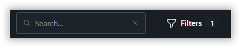

!!! tip "Совет"

    Используйте свойство `badge` у кнопки и дополнительный метод в компоненте для подсчёта заполненных фильтров.

## Обновление пользователей

Давайте построим удобную форму, содержащую компоненты загрузки файлов и обрезки изображений!

### Новые компоненты и маршруты

Создадим несколько новых компонентов Volt, используя синтаксис `class`:

```bash
php artisan make:volt index --class             # Home
php artisan make:volt users/create --class      # Create
php artisan make:volt users/edit --class        # Edit
```

Прежде чем двигаться дальше, приведем названия маршрутов в `web.php` к единому стилю:

```diff
- Volt::route('/', 'users.index');
+ Volt::route('/', 'index');                          // Home
+ Volt::route('/users', 'users.index');               // User (list)
+ Volt::route('/users/create', 'users.create');       // User (create)
+ Volt::route('/users/{user}/edit', 'users.edit');    // User (edit)
```

Как видно, maryUI поставляется с готовым шаблоном приложения. Модифицируйте ссылки в меню для добавления новых маршрутов и протестируйте изменения в браузере:

```diff
// resources/views/components/layouts/app.blade.php

- <x-menu-item title="Hello" icon="o-sparkles" link="/" />
+ <x-menu-item title="Home" icon="o-sparkles" link="/" />
+ <x-menu-item title="Users" icon="o-users" link="/users" />
```

Здесь мы используем компоненты `x-menu` и `x-menu-item`. Они бесшовно работают со стандартной боковой панелью, поставляемой с maryUI. Кроме того, система автоматически сохраняет правильный выбранный пункт меню в зависимости от текущего маршрута пользователя и подмаршрутов при глубокой навигации.

### Компоненты формы

Сначала нам нужно создать ссылку из нашей таблицы на новый компонент редактирования. Это проще простого с компонентом `x-table`. Вернитесь к `users/index.blade.php` и внесите следующее изменение:

```php
<x-table ... link="users/{id}/edit">
```

Можно передавать любой параметр на основе имени столбца модели:

```php
<x-table ... link="users/{id}/edit?name={name}&city={city.name}">
```

После этого изменения вы можете увидеть пустой экран при переходе в компонент `users/edit.blade.php`. Однако это означает, что ссылка работает как ожидалось, что видно по URL в браузере.

Теперь в компоненте `users/edit.blade.php` добавьте `User` в качестве параметра компонента:

```php hl_lines="3 4 7-11"
<?php

use App\Models\User;
use Mary\Traits\Toast;

new class extends Component {
    // Используем это позже
    use Toast;

    // Параметр компонента
    public User $user;
}
```

Давайте добавим `x-header` в секцию blade, чтобы проверить, работает ли параметр `User`. И это сработает благодаря механизму привязки моделей к маршрутам в Laravel:

```diff
<div>
-    //
+    <x-header title="Update {{ $user->name }}" separator />
</div>
```

Теперь добавим свойства компонента, соответствующие свойствам модели `User`, с правилами валидации Livewire. Также включим дополнительное свойство, используя метод Volt `with()`, чтобы получить все доступные страны.

```php hl_lines="3 4 7-11 21-22"
<?php

use Livewire\Attributes\Rule;
use App\Models\Country;

new class extends Component {
    use Toast;

    public User $user;

    // Вместо этого можно использовать «объект form» Livewire
    #[Rule('required')]
    public string $name = '';

    #[Rule('required|email')]
    public string $email = '';

    // Необязательный атрибут
    #[Rule('sometimes')]
    public ?int $country_id = null;

    // Нам также нужно это для заполнения раскрывающегося списка стран в приходящей форме
    public function with(): array
    {
        return [
            'countries' => Country::all()
        ];
    }
}
```

Теперь перейдем в секцию blade и добавим UI-компоненты. В документации вы увидите, что большинство компонентов имеют набор доступных свойств и слотов, что упростит вам работу:

```php hl_lines="4-15"
<div>
    <x-header title="Update {{ $user->name }}" separator />

    <x-form wire:submit="save">
        <x-input label="Name" wire:model="name" />
        <x-input label="Email" wire:model="email" />
        <x-select label="Country" wire:model="country_id" :options="$countries" placeholder="---" />

        <x-slot:actions>
            <x-button label="Cancel" link="/users" />
            <!-- Самая важная вещь здесь — `type="submit"` -->
            <!-- Свойство spinner — это удобно! -->
            <x-button label="Save" icon="o-paper-airplane" spinner="save" type="submit" class="btn-primary" />
        </x-slot:actions>
    </x-form>
</div>
```

Проверив изменения в браузере, мы обнаружим, что форма не заполнена.

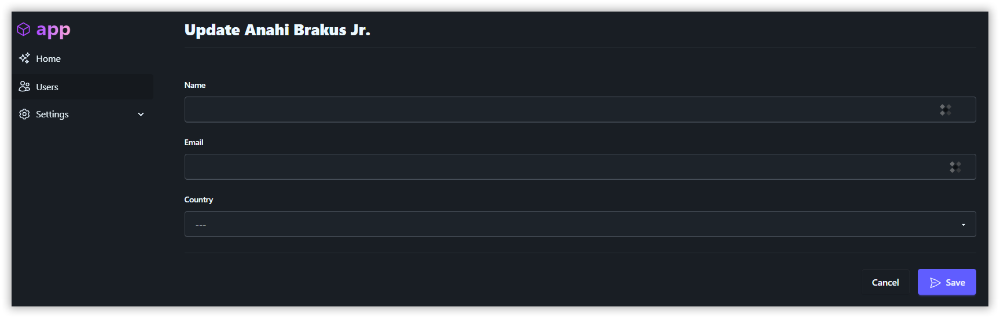

Для исправления воспользуемся методами `mount()` и `fill()` — для автоматического заполнения всех свойств компонента, которые совпадают с полями целевой модели:

```php
public function mount(): void
{
    $this->fill($this->user);
}
```

Конечно, если нажать кнопку «Save», вы получите ошибку, потому что у нас нет метода `save()`. Так что давайте его добавим:

```php
public function save(): void
{
    // Валидируем
    $data = $this->validate();

    // Обновляем
    $this->user->update($data);

    // Делаем уведомление и перенаправляем на нужный маршрут
    $this->success('User updated with success.', redirectTo: '/users');
}
```

### Файловый компонент

Добавим аватар пользователя, красоты ради.

Обратите внимание, мы добавили столбец `users.avatar` в файлы миграций во время первоначальной настройки.

Чтобы загружать файлы в Laravel, не забудьте создать символьную ссылку хранилища (storage link), чтобы сделать локальный диск доступным:

```bash
php artisan storage:link
```

Добавьте новое свойство `$photo` для временного хранения загружаемого файла и используйте трейт `WithFileUploads` Livewire:

```php hl_lines="1 4 8-9"
use Livewire\WithFileUploads;

new class extends Component {
    use Toast, WithFileUploads;

    ...

    #[Rule('nullable|image|max:1024')]
    public $photo;
}
```

Теперь добавим крутой компонент `x-file`. В этом случае мы используем его слот по умолчанию для отображения изображения вместо стандартного поля ввода файла браузера:

```php hl_lines="2-4"
<x-form wire:submit="save">
    <x-file label="Avatar" wire:model="photo" accept="image/png, image/jpeg">
        avatar ?? '/empty-user.jpg' }}" class="h-36 rounded-lg" />
    </x-file>

    <x-input label="Name" ... />
    ...
</x-form>
```

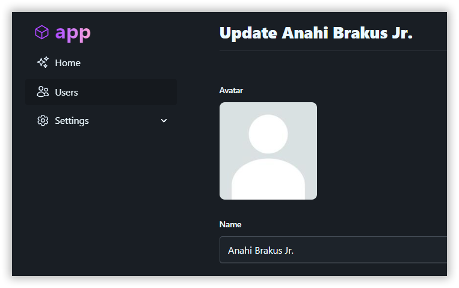

Как видно выше, мы отображаем общее изображение-заглушку, если у пользователя нет аватара. Мы сохранили его для вас под именем `your-app/public/empty-user.jpg` во время первоначальной настройки.

Если вы выберете изображение и нажмете «Save», конечно, изображение не загрузится. Существует множество способов это исправить, но вот один из вариантов для начала:

```php hl_lines="8-11"
public function save()
{
    $data = $this->validate();

    $this->user->update($data);

    // Загружаем файл и сохраняем `url` аватара в модели User
    if ($this->photo) {
        $url = $this->photo->store('users', 'public');
        $this->user->update(['avatar' => "/storage/$url"]);
    }

    $this->success('User updated.', redirectTo: '/users');
}
```

**Работает**!

А что насчёт обрезки изображения аватара?

Во-первых, добавим Cropper.js:

```php
// resources/views/components/layouts/app.blade.php

<head>
    ...
    <!-- Cropper.js -->
    <script src="https://cdnjs.cloudflare.com/ajax/libs/cropperjs/1.6.1/cropper.min.js"></script>
    <link rel="stylesheet" href="https://cdnjs.cloudflare.com/ajax/libs/cropperjs/1.6.1/cropper.min.css" />
</head>
```

Затем вы можете использовать свойство `crop-after-change`, и готово!

```php
<x-file ... crop-after-change>
```

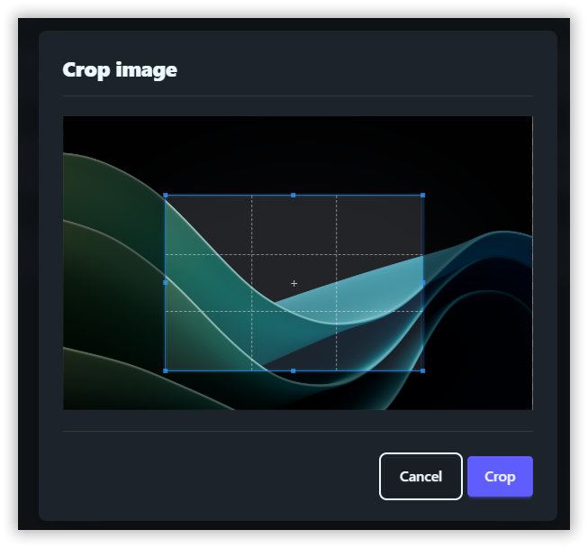

### Улучшаем макет

Та форма, которую мы построили ранее, выглядит не очень красиво, потому что все компоненты по умолчанию используют всю доступную ширину экрана. Вот небольшой лайфхак, который мы используем во всех демонстрациях maryUI: просто разместите приятное изображение с правой стороны.

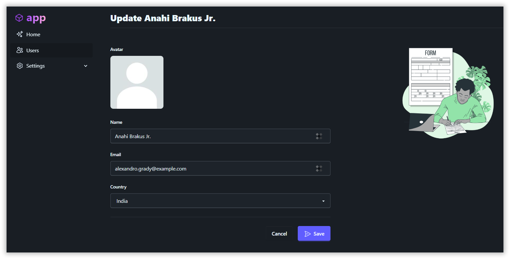

```php hl_lines="2-4 7-12 19"
<div>
    <x-header title="Update {{ $user->name }}" separator />

    <!-- Используем сетку Tailwind -->
    <div class="grid gap-5 lg:grid-cols-2">
        <div>
            <x-form wire:submit="save">
                ...
                <x-slot:actions>
                    ...
                </x-slot:actions>
            </x-form>
        </div>
        <div>
            <!-- Возьмите классное изображение с сайта `StorySet` -->
            
        </div>
    </div>
</div>
```

### Компонент выбора (`x-choices`)

Этот компонент предназначен для создания сложных интерфейсов выбора как одиночных, так и множественных значений. Он также поддерживает поиск значений на стороне фронтенда или сервера.

Помните, что в нашей модели данных существует связь «многие ко многим» между `User` и `Language`?

Внесем изменения в наш компонент:

- Добавим новое свойство `$my_languages` для хранения выбранных языков
- Заполним `$my_languages` языками пользователя с помощью метода `mount()`
- Изменим метод `save()` для сохранения множественного выбора
- Добавим дополнительное свойство `languages` для списка всех доступных языков

```php hl_lines="3 9-11 19-20 28-29 37"
<?php

use App\Models\Language;
...

new class extends Component {
    ...

    // Выбранные языки
    #[Rule('required')]
    public array $my_languages = [];

    ...

    public function mount(): void
    {
        $this->fill($this->user);

        // Заполняем свойство языками пользователя
        $this->my_languages = $this->user->languages->pluck('id')->all();
    }

    public function save()
    {
        ...
        $this->user->update($data);

        // Синхронизируем выбор
        $this->user->languages()->sync($this->my_languages);
        ...
    }

    public function with(): array
    {
        return [
          'countries' => Country::all(),
          'languages' => Language::all(), // Доступные языки
        ];
    }
}
```

В секции blade мы будем использовать вариацию компонента `x-choices-offline` для простой реализации функции множественного выбора:

```php hl_lines="3-8"
<x-select label="Country" ... />

<!-- Множественный выбор-->
<x-choices-offline
    label="My languages"
    wire:model="my_languages"
    :options="$languages"
    searchable />
```

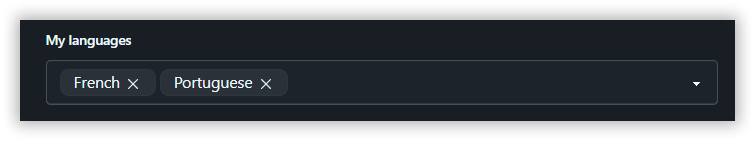

!!! tip "Совет"

    Для больших списков используйте вариацию компонента `x-choices`.

### Компонент с визуальным редактором

Этот компонент является обёрткой вокруг TinyMCE и автоматически загружает изображения и файлы на локальные диски или в облако S3.

Создайте аккаунт на сайте TinyMCE и замените `YOUR-KEY-HERE` на ваш ключ в URL ниже. Также не забудьте добавить ваш локальный адрес в список разрешённых доменов.

```php
// resources/views/components/layouts/app.blade.php

<head>
    ...
    <!-- TinyMCE -->
    <script src="https://cdn.tiny.cloud/1/YOUR-KEY-HERE/tinymce/6/tinymce.min.js" referrerpolicy="origin"></script>
</head>
```

Если вы не хотите зависеть от облачной настройки, просто скачайте TinyMCE SDK и разместите исходный код на собственном сервере:

```php
<script src="/tinymce/tinymce.min.js" referrerpolicy="origin"></script>
```

Добавьте свойство `$bio` в компонент, так как мы добавили столбец `users.bio` во время первоначальной настройки:

```php
new class extends Component {
    ...
    // Необязательный атрибут
    #[Rule('sometimes')]
    public ?string $bio = null;
    ...
}
```

Не забудьте добавить компонент `x-editor` в секцию blade:

```php hl_lines="2"
<x-choices-offline ... />
<x-editor wire:model="bio" label="Biography" hint="The great biography" />
```

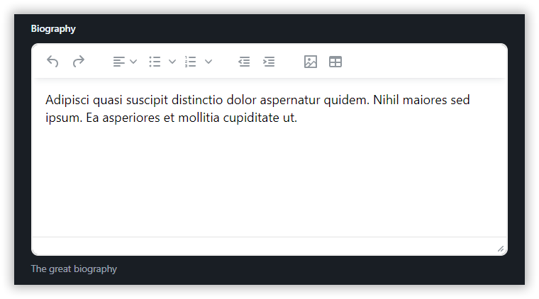

!!! note "Примечание"

    Загрузка изображений работает только для аутентифицированных пользователей вашего приложения. Мы реализуем это в последнем разделе.

### Ещё одно улучшение макета

Если у вас много полей, ещё один способ — создать секции с помощью grid-классов Tailwind, как в примере ниже, чтобы сгруппировать связанную информацию. Это всего лишь одна из альтернатив, используйте то, что подходит именно вам.

```php hl_lines="5-25"
<div>
    <x-header title="Update {{ $user->name }}" separator />

    <x-form wire:submit="save">
        <!--  Основная секция  -->
        <div class="lg:grid grid-cols-5">
            <div class="col-span-2">
                <x-header title="Basic" subtitle="Basic info from user" size="text-lg" />
            </div>
            <div class="col-span-3 grid gap-3">
                ... <!-- некоторые поля здесь -->
            </div>
        </div>

        <!--  Дополнительная секция -->
        <hr class="my-5 border-base-300" />

        <div class="lg:grid grid-cols-5">
            <div class="col-span-2">
                <x-header title="Details" subtitle="More about the user" size="text-lg" />
            </div>
            <div class="col-span-3 grid gap-3">
                ... <!-- другие поля здесь -->
            </div>
        </div>

        <x-slot:actions>
            ... <!-- Действия формы -->
        </x-slot:actions>
    </x-form>
</div>
```

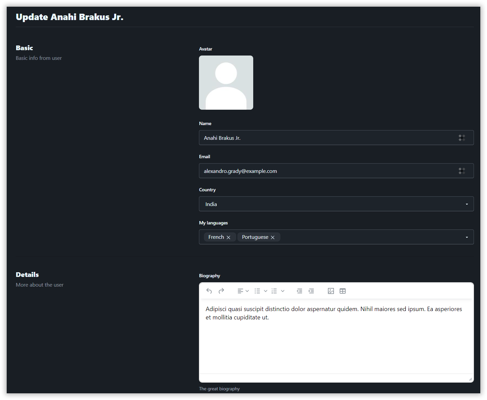

### Отображение аватара в компоненте таблицы

Вернитесь к `users/index.blade.php` и добавьте новый столбец в свойство `$headers`:

```diff
+ ['key' => 'avatar', 'label' => '', 'class' => 'w-1'],
['key' => 'id', 'label' => '#', 'class' => 'w-1'],
```

Теперь давайте настроим строки таблицы с помощью директивы `@scope`:

```php hl_lines="2-4"
<x-table ... >
    @scope('cell_avatar', $user)
        <x-avatar image="{{ $user->avatar ?? '/empty-user.jpg' }}" class="!w-10" />
    @endscope
</x-table>
```

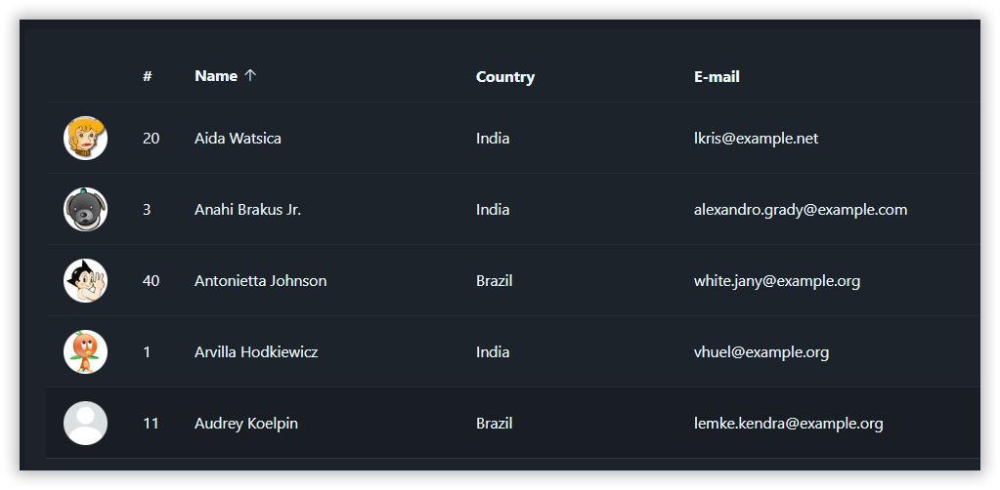

### Задание для самостоятельного выполнения

Мы не будем показывать компонент `users/create.blade.php`, потому что он практически идентичен `users/edit.blade.php`, верно?

Теперь добавьте кнопку «Create» и реализуйте её!

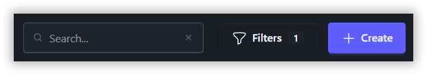

```php hl_lines="3"
<x-slot:actions>
    <x-button label="Filters" ... />
    <x-button label="Create" link="/users/create" responsive icon="o-plus" class="btn-primary" />
</x-slot:actions>
```

## Быстрый поиск

Дайте суперспособности вашим пользователям и позвольте им искать что угодно. В этом примере мы реализуем поиск по именам пользователей, но вы можете комбинировать любые типы контента — другие сущности или даже быстрые действия, например «Создать пользователя». Подробнее см. в [документации](https://mary-ui.com/docs/components/spotlight).

Поместите тег `x-spotlight` в основном макете (`app.blade.php`).

```php hl_lines="4"
<body>
    ...
    <!-- Spotlight -->
    <x-spotlight shortcut="alt.g" />
</body>
```

Создайте класс `App\Support\Spotlight` с методом `search`, который возвращает результат.

```php
<?php

namespace App\Support;

use App\Models\User;
use Illuminate\Http\Request;

class Spotlight
{
    public function search(Request $request)
    {
        // Фильтруем пользователей по имени
        // Преобразовываем результат для соответствия требованиям контракта Spotlight
        return User::query()
            ->where('name', 'like', "%$request->search%")
            ->take(5)
            ->get()
            ->map(function (User $user) {
                return [
                    'avatar' => $user->avatar ?? '/empty-user.jpg',
                    'name' => $user->name,
                    'description' => $user->email,
                    'link' => "/users/{$user->id}/edit"
                ];
            });
    }
}
```

Вот и всё!

Попробуйте нажать ++alt+g++

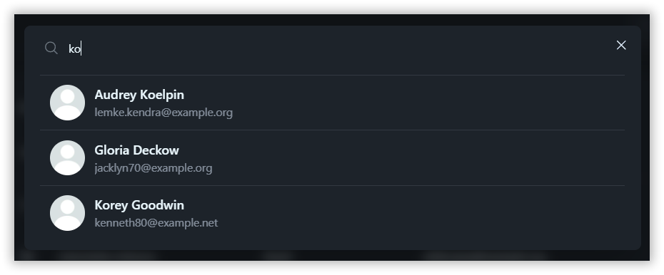

## Аутентификация

Давайте посмотрим, как легко реализовать функции аутентификации и регистрации с нуля за короткое время, без использования стартовых наборов.

* Маршруты
* Шаблон
* Вход
* Регистрация

### Маршруты

Вот как выглядит `routes/web.php` с аутентификацией:

* Маршрут входа.
* Маршрут выхода.
* Защита некоторых маршрутов.

Можете просто скопировать/вставить этот код:

```php
<?php

use Illuminate\Support\Facades\Route;
use Livewire\Volt\Volt;

// Неавторизованные пользователи будут перенаправлены на этот маршрут
Volt::route('/login', 'login')->name('login');

// Маршрут выхода
Route::get('/logout', function () {
    auth()->logout();
    request()->session()->invalidate();
    request()->session()->regenerateToken();

    return redirect('/');
});

// Защищённые маршруты
Route::middleware('auth')->group(function () {
    Volt::route('/', 'index');
    Volt::route('/users', 'users.index');
    Volt::route('/users/create', 'users.create');
    Volt::route('/users/{user}/edit', 'users.edit');
    // ... ещё
});
```

### Шаблон

Создайте новый макет в `resources/views/components/layouts/empty.blade.php`. Мы будем использовать этот макет для страниц входа и регистрации:

```php
<!DOCTYPE html>
<html lang="{{ str_replace('_', '-', app()->getLocale()) }}">
<head>
    <meta charset="utf-8">
    <meta name="viewport" content="width=device-width, initial-scale=1.0, maximum-scale=1.0, viewport-fit=cover">
    <meta name="csrf-token" content="{{ csrf_token() }}">
    @vite(['resources/css/app.css', 'resources/js/app.js'])
</head>
<body class="min-h-screen font-sans antialiased bg-base-200">
    <!-- Здесь можно детализировать макет -->
    <!-- Важно, чтобы он отличался от основного макета приложения -->
    <x-main full-width>
        <x-slot:content>
            {{ $slot }}
        </x-slot:content>
    </x-main>
</body>
</html>
```

### Страница входа

Создадим компонент входа:

```php
php artisan make:volt login --class
```

```php hl_lines="9"
<?php

use Livewire\Attributes\Layout;
use Livewire\Attributes\Rule;
use Livewire\Attributes\Title;
use Livewire\Volt\Component;

new
#[Layout('components.layouts.empty')]       //  <-- Используем шаблон `empty`
#[Title('Login')]
class extends Component {
    #[Rule('required|email')]
    public string $email = '';

    #[Rule('required')]
    public string $password = '';

    public function mount()
    {
        // Аутентификация пройдена
        if (auth()->user()) {
            return redirect('/');
        }
    }

    public function login()
    {
        $credentials = $this->validate();

        if (auth()->attempt($credentials)) {
            request()->session()->regenerate();

            return redirect()->intended('/');
        }

        $this->addError('email', 'The provided credentials do not match our records.');
    }
}; ?>
```

```php
<div class="md:w-96 mx-auto mt-20">
    <div class="mb-10">
        <x-app-brand />
    </div>

    <x-form wire:submit="login">
        <x-input placeholder="E-mail" wire:model="email" icon="o-envelope" />
        <x-input placeholder="Password" wire:model="password" type="password" icon="o-key" />

        <x-slot:actions>
            <x-button label="Create an account" class="btn-ghost" link="/register" />
            <x-button label="Login" type="submit" icon="o-paper-airplane" class="btn-primary" spinner="login" />
        </x-slot:actions>
    </x-form>
</div>
```

Вот и всё!

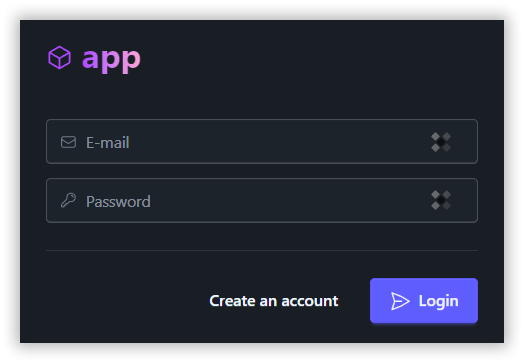

Попробуйте перейти на защищённый маршрут — вас перенаправит на страницу входа. Стандартный макет приложения из maryUI уже отображает аутентифицированного пользователя и кнопку выхода.

### Страница регистрации

Добавьте публичный маршрут в `web.php`:

```php hl_lines="4"
use Livewire\Volt\Volt;

// Публичные маршруты
Volt::route('/register', 'register');

// Защищённые маршруты
Route::middleware('auth')->group(function () {
    // ...
});
```

Создадим форму регистрации:

```php
php artisan make:volt register --class
```

```php hl_lines="11"
<?php

use App\Models\User;
use Livewire\Attributes\Layout;
use Livewire\Attributes\Rule;
use Livewire\Attributes\Title;
use Livewire\Volt\Component;
use Illuminate\Support\Facades\Hash;

new
#[Layout('components.layouts.empty')]       //  <-- Используем шаблон `empty`
#[Title('Registration')]
class extends Component {
    #[Rule('required')]
    public string $name = '';

    #[Rule('required|email|unique:users')]
    public string $email = '';

    #[Rule('required|confirmed')]
    public string $password = '';

    #[Rule('required')]
    public string $password_confirmation = '';

    public function mount()
    {
        // Авторизация пройдена
        if (auth()->user()) {
            return redirect('/');
        }
    }

    public function register()
    {
        $data = $this->validate();

        $data['avatar'] = '/empty-user.jpg';
        $data['password'] = Hash::make($data['password']);

        $user = User::create($data);

        auth()->login($user);

        request()->session()->regenerate();

        return redirect('/');
    }
}; ?>
```

```php
<div class="md:w-96 mx-auto mt-20">
    <div class="mb-10">
        <x-app-brand />
    </div>

    <x-form wire:submit="register">
        <x-input placeholder="Name" wire:model="name" icon="o-user" />
        <x-input placeholder="E-mail" wire:model="email" icon="o-envelope" />
        <x-input placeholder="Password" wire:model="password" type="password" icon="o-key" />
        <x-input placeholder="Confirm Password" wire:model="password_confirmation" type="password" icon="o-key" />

        <x-slot:actions>
            <x-button label="Already registered?" class="btn-ghost" link="/login" />
            <x-button label="Register" type="submit" icon="o-paper-airplane" class="btn-primary" spinner="register" />
        </x-slot:actions>
    </x-form>
</div>
```

Готово!

Перейдите по маршруту `/register` в браузере и создайте аккаунт.

!!! note "Примечание"

    Так как вы авторизованы, загрузка файлов в компоненте HTML Editor теперь будет работать.

## Заключение

Мы могли бы бесконечно расширять этот проект, добавляя всё больше крутых функций, но пока на этом всё.

Ознакомьтесь с документацией и убедитесь, как много можно сделать с минимальным кодом. Каждый компонент тщательно проработан, чтобы обеспечить потрясающие DX/UX/UI.

Как видите, вполне можно создать неплохой интерактивный интерфейс в Laravel без использования фреймворков типа React/Vue.

---

Оригинальный материал: [maryUI - Bootcamp](https://mary-ui.com/bootcamp/01) (English)

Документация: [maryUI - Docs](https://mary-ui.com/docs/installation) (English)

Готовый проект: [Ссылка на репозиторий](https://gitlab.com/dragomano/maryui-example-app)
