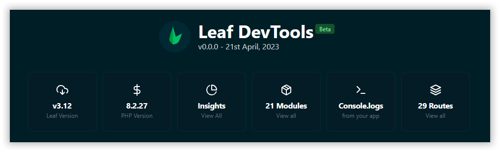
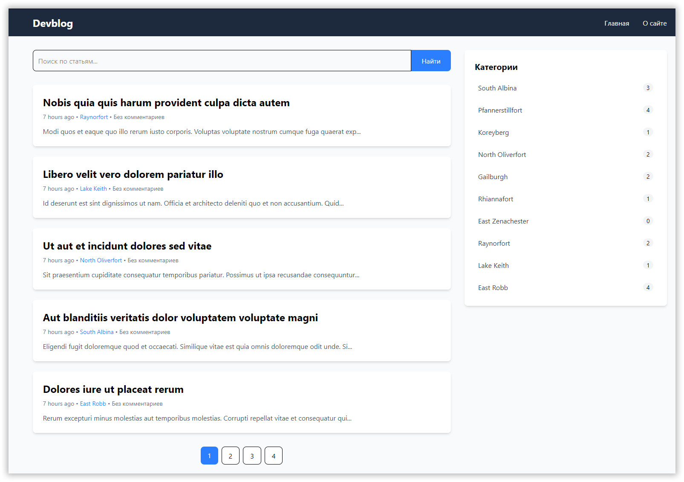
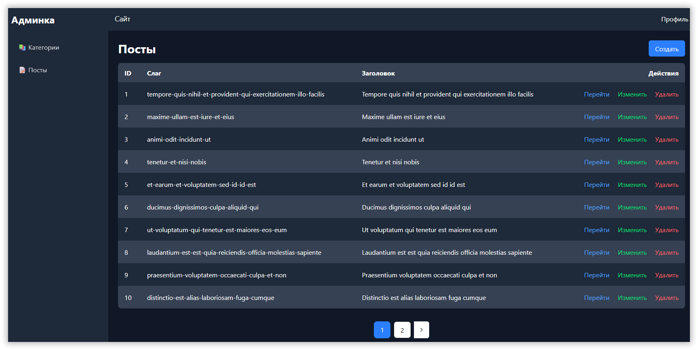
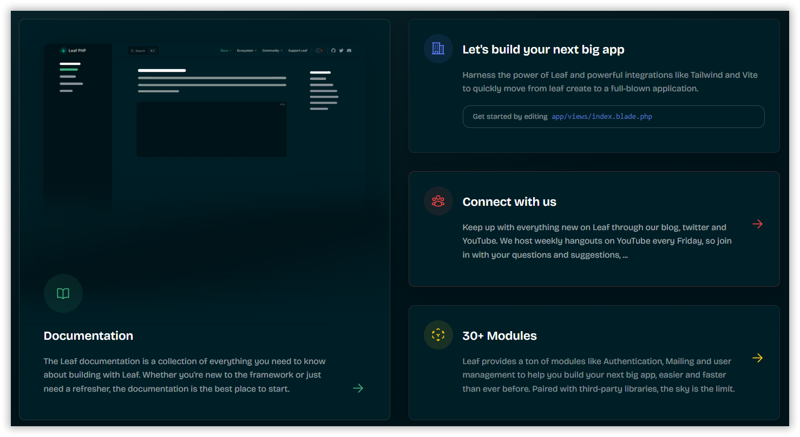

В то время как титаны среди фреймворков с каждым релизом обрастают пачкой новых, но не всем нужных, крутых мега-функций-сервисов, в мире PHP до сих пор можно найти более лёгкие аналоги, с одним из которых мы сегодня познакомимся.

<!-- more -->

## Требования

- PHP 7.4+, с расширениями `json` и `zip`
- Composer

## Введение

Сразу предупрежу — если вы знакомы с Laravel, вы увидите в этих двух фреймворках много общего. Leaf — это легковесный PHP-фреймворк с множеством слабо связанных библиотек, которые можно использовать для создания приложений любого типа. По умолчанию Leaf не навязывает много структуры, но полностью поддерживает шаблон MVC без дополнительной конфигурации.

Laravel (да и многие другие фреймворки) использует некоторые компоненты Symfony. Немудрено, что в итоге появляются фреймворки, использующие компоненты самого Laravel. Зачем изобретать велосипед заново, правда?

Можно собрать свой конструктор Leaf из нужных компонентов, мы же сразу попробуем пакет с MVC. Кое-чего в комплекте нет и нам придётся прикручивать это самостоятельно.

## Установка

Создайте новый каталог, перейдите в него, откройте консоль и выполните следующую команду:

```bash
composer create-project leafs/mvc .
```

Если вы не использовали OS Panel / Laravel Herd, можно запустить просмотр сайта через консоль:

```bash
php leaf serve
```

Это сделает доступным адрес вида `http://localhost:5500/`, для проверки сгенерированного сайта.

## Структура каталогов

Структура каталогов Leaf MVC вдохновлена Ruby on Rails и Laravel. Она заимствует много идей из этих фреймворков, но не является клоном ни одного из них. Она предназначена для того, чтобы стать отправной точкой для создания ваших собственных приложений, и полностью настраивается. Вы в любой момент можете изменить структуру каталогов в соответствии с вашими потребностями, просто не забудьте обновить файл конфигурации путей.

Для нового MVC-приложения структура каталогов выглядит следующим образом:

```
├───app
│   ├── controllers
│   ├── database
│   │   ├── factories
│   │   ├── migrations
│   │   ├── schema
│   │   └── seeds
│   ├── models
│   ├── routes
│   └── views
│       └── errors
├───config
├───public
│   └───assets
│       ├── css
│       └── img
└───vendor
```

## Настройка

Leaf MVC стремится поддерживать чистую и понятную структуру, которая работает «из коробки» для большинства приложений. Это означает, что зачастую вам понадобится изменить лишь несколько деталей в файле `.env`. Поэтому можно полностью удалить каталог `config`, если вы собираетесь использовать только значения конфигурации по умолчанию. Это сделает ваше приложение легче и проще в поддержке.

Однако бывают случаи, когда вам нужно настроить некоторые функции под конкретные задачи, и здесь на помощь приходят файлы конфигурации. Leaf MVC разделяет файлы конфигурации для каждой функции фреймворка, чтобы вы могли легко настроить одну функцию, не затрагивая другие. Чтобы опубликовать все файлы конфигурации, какие есть в комплекте, выполните следующую команду:

```bash
php leaf config:publish
```

Каждый параметр документирован, поэтому вы можете ознакомиться с файлами и изучить доступные вам опции.

??? note "Среда приложения"

    Новая установка Leaf MVC поставляется с файлом `.env.example`, который автоматически дублируется в файл `.env` при установке. Этот файл используется для хранения переменных среды вашего приложения, и вы можете поместить в него конфиденциальную информацию, такую как учётные данные базы данных или почтового сервера. Это позволяет вам иметь разные конфигурации для разных сред, таких как разработка, тестирование и продакшен.

    Любое значение в вашем файле `.env` автоматически загружается в переменные среды вашего приложения, и вы можете получить доступ к этим значениям с помощью вспомогательной функции `_env()`. Эта функция принимает ключ переменной среды, к которой вы хотите получить доступ, и необязательное значение по умолчанию, если переменная среды не установлена.

    Вот пример использования вспомогательной функции `_env()`:

    ```php
    $database = _env('DB_DATABASE');
    $databaseWithDefault = _env('DB_DATABASE', 'leaf');
    ```

??? note "Отладка"

    Вы можете захотеть узнать подробности об установленных модулях фреймворка. Для этого предназначен дополнительный пакет:

    ```bash
    composer require leafs/devtools
    ```

    Обновите `public/index.php`, добавив вызов `DevTools` после подключения `autoload.php`:

    ```php
    require dirname(__DIR__) . '/vendor/autoload.php';

    \Leaf\DevTools::install();
    ```

    Теперь вы можете перейти по адресу `https://<ваш_сайт>/leafDevTools` для просмотра различной информации, например, списка маршрутов:

    

## Постановка задачи

Итак, представим, что нам нужно сделать простой блог, с регистрацией пользователей и созданием постов. Пусть посты имеют категории (1 пост — 1 категория) и теги (1 пост — несколько тегов).

Соответственно, нам понадобится база данных — укажите соответствующие настройки в файле `.env`.

## Контроллеры

Создадим ресурсный контроллер и модель для сущности `Post`:

```bash
php leaf g:controller Post --resource -m
```

Сделаем то же самое для сущности `Category`:

```bash
php leaf g:controller Category --resource -m
```

## Модели

В моделях `Category` и `User` добавьте отношение `hasMany`:

```php
public function posts(): hasMany
{
    return $this->hasMany(Post::class);
}
```

Добавьте используемые отношения в модель `Post`:

```php
public function user(): BelongsTo
{
    return $this->belongsTo(User::class);
}

public function category(): BelongsTo
{
    return $this->belongsTo(Category::class);
}

public function tags(): BelongsToMany
{
    return $this->belongsToMany(Tag::class);
}
```

Модель `Tag` создадим вручную:

```bash
php leaf g:model Tag
```

и добавим отношение `belongsToMany`:

```php
public function posts(): BelongsToMany
{
    return $this->belongsToMany(Post::class);
}
```

!!! note "Примечание"

    Не забудьте добавить `public $timestamps = false;` в моделях `Category` и `Tag`.

Для связи «посты — теги» (_многие ко многим_) нам понадобится промежуточная таблица `post_tag`:

```bash
php leaf g:migration post_tag
```

## Миграции

Вместо того, чтобы возиться с миграциями, в Leaf предусмотрена возможность использования простых JSON-схем.

Например, вот как выглядит соответствующая схема для таблицы `users`:

```json
{
  "id": 1,
  "name": "Mychi Darko",
  "email": "mickdd22@gmail.com",
  "email_verified_at?": "2021-07-23T16:18:35.947712157Z",
  "password": "poekojdenwjwiojweojojweoijoewoj",
  "remember_token?": "deiwoj",
  "timestamps": ""
}
```

То есть такие схемы отвечают не только за структуру таблиц, но и за «посев» данных в них.

Попробуем создать аналогичные схемы для таблиц `posts`, `categories` и `tags`:

```bash
php leaf g:schema posts
php leaf g:schema categories
php leaf g:schema tags
```

```json
{
  "id": 1,
  "user_id:foreignId": 1,
  "category_id:foreignId": 1,
  "slug": "post-title",
  "title": "Post Title",
  "content:text": "Post Content",
  "timestamps": ""
}
```

```json
{
  "id": 1,
  "slug": "category-name",
  "name": "Category Name"
}
```

```json
{
  "id": 1,
  "slug": "tag-name",
  "name": "Tag Name"
}
```

Не забудем и о таблице `post_tag`:

```bash
php leaf g:schema post_tag
```

```json
{
  "id": 1,
  "post_id:foreignId": 1,
  "tag_id:foreignId": 1
}
```

Запустите миграцию:

```bash
php leaf db:migrate
```

Однако мы слишком ленивы, чтобы вручную создавать записи в каждой из таблиц, не так ли? Можно поручить это скучное дело фреймворку. Пример генерации 5 фейковых пользователей есть в файле `app/database/seeds/UsersSeeder.php`. Можете также раскомментировать там создание первого пользователя, под которым будете авторизовываться сами.

Сформируем фабрики и сидеры для наших моделей:

```bash
php leaf g:factory PostFactory
php leaf g:factory TagFactory
php leaf g:factory CategoryFactory
php leaf g:seed Post
php leaf g:seed Tag
php leaf g:seed Category
```

Отредактируйте метод `definition` в фабриках.

`CategoryFactory.php` и `TagFactory.php`:

```php
public function definition(): array
{
    $name = $this->faker->city;

    return [
        'slug' => $this->str::slug($name),
        'name' => $name,
    ];
}
```

`UserFactory.php`:

```php
public function definition(): array
{
    return [
        'name' => $this->faker->name,
        'email' => $this->faker->unique()->safeEmail,
        'email_verified_at' => tick()->now(),
        'password' => '$2y$10$92IXUNpkjO0rOQ5byMi.Ye4oKoEa3Ro9llC/.og/at2.uheWG/igi', // password
        'remember_token' => $this->str::random(10),
    ];
}
```

`PostFactory.php`:

```php
public function definition(): array
{
    $title = rtrim($this->faker->sentence, '.');

    return [
        'user_id' => User::all()->random()->id,
        'category_id' => Category::all()->random()->id,
        'slug' => $this->str::slug($title),
        'title' => $title,
        'content' => $this->faker->paragraphs(rand(1, 6), true),
    ];
}
```

Теперь разберёмся с сидерами.

`CategoriesSeeder.php`:

```php
public function run()
{
    (new CategoryFactory)->create(10)->save();
}
```

`TagsSeeder.php`:

```php
public function run()
{
    (new TagFactory)->create(30)->save();
}
```

`PostsSeeder.php`:

```php
public function run()
{
    (new PostFactory)->create(20)->save();

    $posts = Post::all();
    $tags = Tag::all();

    $posts->each(function ($post) use ($tags) {
        $randomTags = $tags->random(rand(1, 3));
        $post->tags()->attach($randomTags->pluck('id'));
    });
}
```

Теперь обновите метод `run` класса `DatabaseSeeder`:

```php
public function run(): array
{
    return [
        UsersSeeder::class,
        CategoriesSeeder::class,
        TagsSeeder::class,
        PostsSeeder::class,
    ];
}
```

И, наконец, проверьте процесс «посева»:

```bash
php leaf db:seed
```

Либо запустите миграцию вместе с «посевом» данных:

```bash
php leaf db:migrate -s
```

А если вам захочется удалить все таблицы и заново провести миграцию:

```bash
php leaf db:reset --noSeed
```

## Маршруты

Файлы в директории `app/routes`, начинающиеся с подчеркивания `_` , автоматически загружаются Leaf. Это позволяет вам разбивать маршруты на логические части и лучше организовывать код.

Но для простоты мы будем редактировать имеющийся `app/routes/_app.php`. Откройте этот файл и добавьте следующий код:

```php
app()->group('/admin', function () {
    app()->resource('/categories', 'CategoriesController');
    app()->resource('/posts', 'PostsController');
});
```

## Фронтенд

Чтобы вам не пришлось изучать что-то новое, в визуальной части фреймворка по умолчанию используется всё тот же старый добрый Blade — движок разметки, знакомый фанатам Laravel. Откройте `app/views/index.blade.php` и убедитесь сами.

!!! note "Примечание"

    Есть в Leaf и кое-что своё — [движок Bare UI](https://leafphp.dev/docs/frontend/bareui.html), если вы вдруг захотите попробовать что-то ещё, помимо Blade.

Кроме того, Leaf прекрасно работает с Vite, Inertia и Tailwind CSS. С помощью Inertia можно обеспечить взаимодействие с React, Vue и Svelte. Однако в рамках этой учебной статьи мы ограничимся разметкой Blade и Tailwind CSS.

Начнём с установки Tailwind CSS v4:

```bash
npm install tailwindcss @tailwindcss/vite
```

Обновите `vite.config.js`:

```js
import { defineConfig } from 'vite';
import leaf from '@leafphp/vite-plugin';
import tailwindcss from '@tailwindcss/vite';

export default defineConfig({
  plugins: [
    leaf({
      input: ['app/views/css/app.css'],
      refresh: true,
    }),
    tailwindcss(),
  ],
});
```

и `app/views/css/app.css`:

```css
@import 'tailwindcss';
@source "../";

h4 {
  color: blanchedalmond !important;
}
```

Не забудьте раскомментировать блок `{{ vite('css/app.css') }}` в шаблоне `index.blade.php`.

Выполните команду `npm run dev` и проверьте отображение главной страницы сайта в браузере.

Теперь создадим шаблоны нужных нам секций. Разметка будет простенькой, с девизом «лишь бы работало».

### Базовый шаблон

Основной шаблон (или, как их ещё называют, макет), будет таким:

```php
<!DOCTYPE html>
<html lang="ru">

<head>
    <meta charset="UTF-8">
    <meta name="viewport"
          content="width=device-width, initial-scale=1.0">
    <title>{{ _env('APP_NAME', 'My Leaf MVC App') }} - @yield('title')</title>
    <link rel="shortcut icon"
          href="https://leafphp.dev/logo-circle.png"
          type="image/x-icon">
    {{ vite('css/app.css') }}
</head>

<body class="flex flex-col min-h-screen bg-gray-50">
    @include('extra.header')

    @include('extra.breadcrumbs')

    <main class="container mx-auto px-6 py-8 flex-1">
        <div class="grid grid-cols-1 lg:grid-cols-3 gap-8">
            <!-- Основной контент -->
            <div class="lg:col-span-2">
                @yield('content')
            </div>

            @include('extra.sidebar')
        </div>
    </main>

    @include('extra.footer')
</body>

</html>
```

Сохраните его в `app/views/layouts/app.blade.php`, а также создайте пустые заготовки файлов `header.blade.php`, `breadcrumbs.blade.php`, `sidebar.blade.php` и `footer.blade.php` в папке `app/views/extra`.

### Главная страница блога

Теперь файл `app/views/index.blade.php` можно обновить до такого состояния:

```php
@extends('layouts.app')

@section('title', 'Главная')

@section('content')
    @include('extra.search')

    @include('extra.posts')

    @include('extra.pagination')
@endsection
```

Шаблон `search.blade.php`:

```php
<!-- Форма поиска -->
<form class="mb-8">
    <div class="flex">
        <input type="search"
               name="search"
               value="{{ request()->get('search') }}"
               class="flex-1 rounded-l-lg p-3 border focus:outline-none focus:ring-2 focus:ring-blue-500"
               placeholder="Поиск по статьям...">
        <button type="submit"
                class="bg-blue-500 text-white px-6 rounded-r-lg hover:bg-blue-600 hover:cursor-pointer">
            Найти
        </button>
    </div>
</form>
```

Шаблон `posts.blade.php`:

```php
<!-- Список постов -->
@forelse ($posts as $post)
    <article class="bg-white rounded-lg shadow-md mb-6 p-6">
        <h2 class="text-2xl font-bold mb-2">
            <a href="{{ route('post', $post->slug) }}"
               class="hover:text-blue-500">{{ $post->title }}</a>
        </h2>
        <div class="text-sm text-gray-500 mb-3">
            <span>{{ $post->created_at->diffForHumans() }}</span> •
            <a href="{{ route('category', $post->category->slug) }}"
               class="text-blue-500 hover:underline">{{ $post->category->name }}</a> •
            <span>Без комментариев</span>
        </div>
        <p class="text-gray-600">{{ $post->excerpt }}</p>
    </article>
@empty
    <article class="bg-white rounded-lg shadow-md mb-6 p-6">Постов пока нет...</article>
@endforelse
```

Шаблон `pagination.blade.php`: [ссылка](https://gitlab.com/dragomano/leaf-simple-blog/-/blob/main/app/views/extra/pagination.blade.php?ref_type=heads)

Для работы пагинации нам потребуется установить дополнительный пакет, поскольку ничего встроенного я не обнаружил ни в документации, ни в исходном коде:

```bash
composer require illuminate/pagination
```

После этого маршрут главной страницы можно переписать так:

```php
app()->get('/', ['name' => 'home', function () {
    $categories = Category::withCount('posts')->get();
    $posts = Post::paginate(5);

    render('home', compact('categories', 'posts'));
}]);
```

Добавим в модель `Post` метод `getExcerptAttribute` для получения краткого содержания поста:

```php
public function getExcerptAttribute(): string
{
    return Str::limit(strip_tags($this->content));
}
```

Не забудем и о поиске:

```php
app()->get('/', ['name' => 'home', function () {
    $categories = Category::withCount('posts')->get();
    $search = request()->get('search');
    $posts = Post::where('title', 'like', '%' . $search . '%')
        ->orWhere('content', 'like', '%' . $search . '%')
        ->paginate(5);

    if ($search !== null && empty($search)) {
        response()->redirect('/');
    }

    render('home', compact('categories', 'posts'));
}]);
```

Чтобы динамически поддерживать параметр `?page` в адресной строке и определять текущий URL, добавьте этот код в 'public/index.php' (после подключения `autoload.php`):

```php
\Illuminate\Pagination\Paginator::currentPathResolver(function () {
    return strtok($_SERVER['REQUEST_URI'], '?');
});

\Illuminate\Pagination\Paginator::currentPageResolver(function ($pageName = 'page') {
    return isset($_GET[$pageName]) ? (int) $_GET[$pageName] : 1;
});
```

Все шаблоны можно посмотреть в [репозитории](https://gitlab.com/dragomano/leaf-simple-blog/-/tree/main/app/views?ref_type=heads).

Для проверки визуальной части не забывайте о команде `npm run dev` в отдельном окне терминала.

Теперь вернемся к контроллерам и наладим взаимодействие логики с представлением.

В итоге у нас должно получиться что-то вроде такого:

Фронт:



Админка:



## Регистрация и авторизация

Без системы авторизации в вашу админку сможет заходить кто угодно. Поэтому в Leaf предусмотрена соответствующая функциональность из коробки.

!!! note "На заметку"

    Аутентификация — это процесс подтверждения вашей личности, обычно в форме входа в систему, тогда как авторизация — это процесс проверки того, что вы можете делать в приложении. Leaf Auth предоставляет встроенный способ управления тем, что пользователи могут делать в вашем приложении, с использованием ролей и разрешений.

Установите пакет `leafs/auth`:

```bash
composer require leafs/auth
```

Все маршруты, касающиеся авторизации и регистрации, появятся в файле `app/routes/_auth.php`.

Осталось извлечь заготовки шаблонов (а можно не извлекать, если вам они не нужны):

```bash
php leaf scaffold:auth
```

Не забудьте собрать сборку:

```bash
php leaf view:build
```

Теперь нужно установить пакет для работы с базой данных:

```bash
composer require leafs/db
```

Освежите базу данных:

```bash
php leaf db:reset
```

После этого на главной странице сайта в правом верхнем углу можно будет заметить ссылки для авторизации и регистрации. Создайте себе учётку.

### Полномочия и роли

Поскольку мы делаем учебный блог, не нужно забывать, что обычно в блогах право на создание постов есть только у одного человека — администратора (он же — автор блога). Остальные посетители делятся на 2 категории — комментаторов (если они зарегистрированы) и гостей (просто читатели). В Leaf это можно реализовать, создав роли с помощью системы аутентификации. Для этого добавьте следующий код в `public/index.php`:

```php
auth()->createRoles([
  'admin' => ['view posts', 'comment posts', 'edit posts'],
  'user'  => ['view posts', 'comment posts'],
  'guest' => ['view posts']
]);
```

Можно создать учётку админа с помощью сида, на этапе «посева» данных. Нам понадобится дополнительный пакет:

```bash
composer require leafs/password
```

Обновите `UsersSeeder.php`:

```php
<?php
namespace App\Database\Seeds;

use App\Database\Factories\UserFactory;
use App\Models\User;
use Illuminate\Database\Seeder;
use Leaf\Helpers\Password;

class UsersSeeder extends Seeder
{
    public function run(): void
    {
        $user = new User();
        $user->name = 'Admin';
        $user->email = 'admin@mysite.com';
        $user->password = Password::hash('password');
        $user->save();

        (new UserFactory)->create(5)->save();
    }
}
```

Затем чуть измените код авторизации в файле `LoginController.php`:

```php
$success = auth()->login($data);

if (! $success) {
    response()
        ->withFlash('form', request()->body())
        ->withFlash('error', request()->errors())
        ->redirect('/auth/login');
}

if (auth()->id() === 1) {
    auth()->user()->assign('admin');
} else {
    auth()->user()->assign('user');
}

response()->redirect('/admin');
```

В маршрутах мидлвар `auth.required` можно заменить на `is:admin`, чтобы доступ к админке был только у администратора. Либо используйте соответствующие разрешения: `can:edit posts` и т. п.

Далее вы можете оставить всё как есть, либо привести имеющиеся вьюшки к одному стилю оформления — к какому именно, решать вам (светлый `Dashboard` или тёмный `Admin`). В конце концов, у нас обычная обзорная статья, а не курс из 50 уроков.

## Заключение

Мы познакомились с 3-й версией фреймворка, а в это время уже вышла [4-я](https://blog.leafphp.dev/posts/leaf4-is-here.html), с новыми фишечками:



По итогам статьи напрашивается небольшое сравнение Leaf с микрофреймворком [Slim](/slim-4-kratkiy-kurs/):

| Фича                             | Slim | Leaf |
| -------------------------------- | ---- | ---- |
| Роуты и мидлвары                 | +    | +    |
| Заполнение миграций из JSON-схем | -    | +    |
| Фабрики и сидеры из коробки      | -    | +    |
| Поддержка Twig/Blade             | +/-  | -/+  |
| Документация                     | +    | +    |

Если вы не любите изобретать что-то сами, с Leaf вам не по пути. Сравнивать Leaf с Laravel не совсем корректно, поскольку это минималистичный и легковесный фреймворк, созданный для разработчиков, которые хотят быстро создавать небольшие приложения (например, лендинги) или API без лишней сложности. Он фокусируется на простоте и гибкости. Поэтому очевидно, что многих вещей, к которым вы могли привыкнуть в более «прокачанных» фреймворках, в Leaf не обнаружится.

## Готовый проект

[Ссылка на репозиторий](https://gitlab.com/dragomano/leaf-simple-blog)

## Задания для саморазвития

Реализуйте добавление изображений и комментариев в нашем учебном проекте. Добавьте поддержку Markdown в постах. Или попробуйте прикрутить [AdminLTE](https://github.com/ColorlibHQ/AdminLTE) в качестве темы админки.

## Поддержка

Сайт и документация фреймворка Leaf доступны по адресу [https://leafphp.dev](https://leafphp.dev). Также доступен удобный пошаговый [туториал](https://leafphp.dev/tutorial/).
