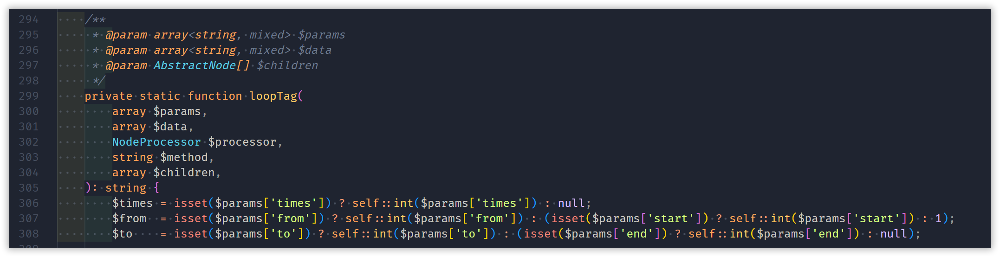
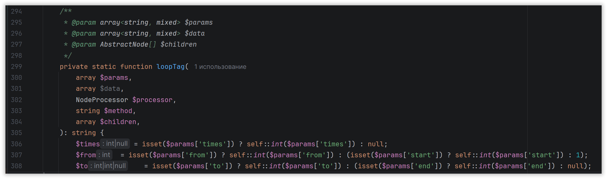

Сводный обзор-сравнение редакторов/IDE для PHP-разработки: VS Code, PhpStorm, OpenIDE и Zed.

<!-- more -->

Выбор инструмента для PHP в 2026 году зависит от приоритетов: глубина понимания кода и фреймворков, скорость работы, стоимость, поддержка нескольких языков и наличие ИИ. Ниже — сравнение четырёх популярных вариантов с акцентом именно на PHP (включая WordPress, Laravel, Symfony, Yii, Bitrix и т. д.).

## Краткий вердикт по профилям

- **Профессиональная ежедневная PHP-разработка (крупные проекты, сложный рефакторинг, Laravel/Symfony)** → **PhpStorm**.
- **Бесплатный, лёгкий, мультиязычный вариант с хорошей настройкой** → **VS Code**.
- **Российская альтернатива на базе IntelliJ Platform (особенно при ограничениях JetBrains или требованиях к отечественному ПО)** → **OpenIDE**.
- **Максимальная скорость редактора + современный ИИ, когда глубина PHP-анализа вторична** → **Zed**.

## 1. PhpStorm (JetBrains)

Специализированная коммерческая IDE, созданная именно под PHP. Работает «из коробки» с минимальной настройкой.

**Сильные стороны для PHP:**

- Лучшее на рынке понимание PHP-кода (AST-уровень, generics, conditional types, array shapes).
- Мощный безопасный рефакторинг (переименование, извлечение методов/классов, перемещение по всему проекту).
- Отличная нативная поддержка Laravel (Eloquent, Blade, routes, facades), Symfony (Twig, Doctrine, DI), Yii, WordPress и др.
- Встроенный Xdebug, профилировщик, мощный Database tool, Git, терминал.
- Статический анализ, инспекции, интеграция с PHPStan/Psalm.
- ИИ (Junie + опциональные AI Pro/Ultimate).

**Слабые стороны:**

- Тяжёлая (больше RAM, дольше стартует и индексирует).
- Платная: ~$109/год для физлиц (первый год, далее дешевле — $87/$65), для организаций выше (~$289/пользователь/год). Есть trial.

**Мой опыт:**

Использовал для своих open-source проектов регулярно, для удобного рефакторинга. Очень понравился Junie. Но после 2022 года они отключили мою бесплатную лицензию. Теперь использую редко и по [программе EAP](https://www.jetbrains.com/ru-ru/phpstorm/nextversion/).

**Кому подходит:**

Профессионалы, фрилансеры и компании, где время = деньги, и PHP — основной язык.

## 2. VS Code (Microsoft)

Лёгкий бесплатный редактор, который превращается в полноценную PHP-среду через расширения.

**Сильные стороны для PHP:**

- Бесплатно (премиум Intelephense — разовая небольшая плата ~$15 за расширенные возможности).
- Очень быстрый старт и низкое потребление ресурсов.
- Отличная экосистема: Intelephense / PHP Tools, PHP Debug (Xdebug), Laravel-расширения, Symfony Language Tools, Composer, Docker и т. д.
- Хорошее автодополнение, навигация, базовый рефакторинг.
- Лучшая поддержка мульти-язычности (JS/TS, Python, Go и др. в одном окне).
- Богатый ИИ-инструментарий (GitHub Copilot, Claude и др.).

**Слабые стороны:**

- Нужно собирать и настраивать стек расширений.
- Рефакторинг и глубокий статический анализ слабее PhpStorm.
- Отладка и работа с БД — через расширения.

**Мой опыт:**

Незаменим для быстрого редактирования, когда нет смысла запускать тяжёлую IDE ради нескольких правок в одном файле.

**Кому подходит:**

Студенты, хобби, небольшие проекты, разработчики, которые часто переключаются между языками, или те, у кого слабый ПК / ограничен бюджет.

## 3. OpenIDE

Российская open-source IDE на базе IntelliJ Platform (совместный проект с участием Haulmont, Axiom JDK и др.). Включена в Реестр отечественного ПО. Есть бесплатная версия и OpenIDE Pro.

**Сильные стороны для PHP (по состоянию на середину 2026):**

- Бета PHP-плагина (доступна бесплатно на момент бета): поддержка PHP 7.0–8.4 + частичный 8.5 (pipe operator `|>`, обновлённый `clone`).
- Автодополнение с автоимпортом, вывод типов (включая generics, conditional types, array shapes), навигация, 50+ инспекций.
- Нативная интеграция внешних анализаторов (PHPStan, Psalm, Mago, PHP_CodeSniffer, PHP-CS-Fixer) с inline-подсветкой и quick-fix.
- Поддержка фреймворков: Laravel (Eloquent, Blade, facades, routes, validation), Symfony (Twig, Doctrine, контейнер), Bitrix, Yii2.
- Xdebug 3 (breakpoints, watches, path mappings для Docker), профилировщик (call tree + flame graph).
- Знакомый интерфейс IntelliJ + маркетплейс плагинов (300+), Docker, DB-клиент, ИИ-агенты.
- Бесплатная базовая версия; часть продвинутых функций может уйти в Pro после выхода из беты.

**Слабые стороны:**

- PHP-поддержка относительно новая (бета), зрелость и стабильность пока ниже PhpStorm.
- Экосистема и сообщество меньше, чем у VS Code / JetBrains.
- Основной фокус исторически на Java/Kotlin/Spring, PHP — развивающееся направление.

**Мой опыт:**

Протестировал, но для постоянного использования мне пока не подходит, поскольку поддержка PHP до сих пор хромает.

Например, я люблю выравнивать код с помощью пробелов, и во всех IDE это выглядит нормально, вот так:

А в OpenIDE почему-то так:

**Кому подходит:**

Российские компании и разработчики, которым нужна лицензионно чистая / санкционно устойчивая альтернатива JetBrains, или те, кто хочет IntelliJ-подобный опыт бесплатно/дешевле.

## 4. Zed

Современный высокопроизводительный редактор, написанный на Rust (от создателей Atom). Бесплатный, с акцентом на скорость и коллаборацию + ИИ.

**Сильные стороны для PHP:**

- Одна из самых быстрых сред (старт за доли секунды даже на больших проектах).
- Поддержка через PHP-расширение: Tree-sitter + LSP (по умолчанию Phpactor, можно Intelephense, PHP Tools / PHPantom).
- Автодополнение, диагностика, базовая навигация и рефакторинг через LSP.
- Отладка через Xdebug (DAP).
- Есть community Laravel-расширение и Symfony Language Tools (частичная поддержка).
- Нативный ИИ (модели локально/в облаке, bring-your-own-key), real-time collaboration.
- Низкое потребление ресурсов.

**Слабые стороны:**

- PHP-экосистема и глубина поддержки фреймворков пока заметно слабее VS Code и особенно PhpStorm (базовый уровень).
- Меньше специализированных инструментов (рефакторинг multi-file, глубокий анализ, Database tool и т. д.).
- Windows-поддержка и некоторые enterprise-сценарии (Dev Containers и т. п.) менее зрелые по сравнению с VS Code.
- Расширений в целом меньше (~800–1000 против огромного маркетплейса VS Code).

**Мой опыт:**

Редактор показался реально быстрым, интерфейс чем-то напоминает Sublime. Но добавление кастомных ИИ-моделей переусложнено, слишком много параметров требуется заполнять.

**Кому подходит:**

Разработчики, для которых скорость редактора и современный UX критичны, а PHP — один из языков (не единственный и не сверхсложный). Хороший «challenger», но пока не замена полноценной PHP-IDE для тяжёлых проектов.

## Сравнительная таблица

| Критерий                | [PhpStorm][phpstorm] | [VS Code][vscode]           | [OpenIDE][openide]        | [Zed][zed]                |
|-------------------------|----------------------|-----------------------------|---------------------------|---------------------------|
| **Цена**                | ~$109/год (инд.)     | Бесплатно (инд. за плагины) | Бесплатно (Pro платный)   | Бесплатно (+ Pro-тарифы)  |
| **Скорость / вес**      | Тяжёлый              | Лёгкий и быстрый            | Средний (IntelliJ-класс)  | Самый быстрый             |
| **Рефакторинг**         | Лучший               | Базовый                     | Хороший                   | Базовый                   |
| **Laravel / Symfony**   | Отличная нативная    | Хорошая (расширения)        | Хорошая (бета)            | Базовая / community       |
| **Отладка (Xdebug)**    | Есть                 | Через расширение            | Есть                      | Через DAP                 |
| **Работа с БД**         | Есть                 | Через расширения            | Есть                      | Нет                       |
| **Поддержка ИИ**        | Junie + плагины      | Copilot и др.               | Есть агенты               | Нативная                  |
| **Локализация**         | Через плагины        | Через расширение            | Встроенная                | [zed-i18n][zed-i18n]      |

## Итоговые рекомендации

- Если PHP — основной язык и вы работаете с крупными кодовыми базами профессионально — **берите PhpStorm**. Лицензия окупается экономией времени.
- Если нужен бесплатный, гибкий и быстрый инструмент — **VS Code** + Intelephense + Laravel/Symfony-расширения остаётся золотым стандартом.
- Если важны российское ПО, open-source IntelliJ-база или ограничения на JetBrains — смотрите **OpenIDE** (особенно следите за развитием PHP-плагина).
- Если хотите попробовать самый перспективный редактор и готовы мириться с менее глубокой PHP-интеграцией — стоит потестировать **Zed**.

Почти все варианты имеют бесплатные trial или полностью бесплатны — лучше всего поставить 2–3 и поработать неделю на реальном проекте. Выбор сильно зависит от конкретного стека (Laravel vs Symfony vs legacy) и железа.

[phpstorm]: https://www.jetbrains.com/ru-ru/phpstorm/
[vscode]: https://code.visualstudio.com
[openide]: https://openide.ru/
[zed]: https://zed.dev
[zed-i18n]: https://github.com/LI-NA/zed-i18n