На практических примерах сравним популярные инструменты для создания админок в Laravel проектах.

<!-- more -->

## Подготовка

Возьмем простой проект, с готовыми моделями, отношениями, фабриками, миграциями и сидерами. Laravel 12 + PHP 8.2. Без админки, без какого-либо UI.

Лично мне интерфейс по сути не нужен, я использую этот проект только для запуска сидеров, чтобы наполнять базу данных фейковыми данными в целях тестирования.

Но там, где одним достаточно консоли, другим хочется всё делать через графический интерфейс.

Поэтому для учебных целей и чисто из интереса мы прикрутим ко всему этому как MoonShine, так и Filament. Комбинировать я не пробовал, разделил на 2 репозитория.

Если кто-то рискнет поставить обе админки одновременно, не забудьте о дополнительных сложностях с отдельными роутами и т. п.

Итак, посмотрим, что у нас есть.

1) Форум с типичной структурой, на примере [SMF](https://simplemachines.org):

* Пользователи
* Категории
* Разделы
* Темы
* Сообщения

Условия:

* В каждой категории может находиться несколько разделов.
* В каждом разделе может находиться несколько тем.
* Разделы могут быть вложенными.
* В каждой теме может находиться несколько сообщений.
* Все сообщения, кроме первого, считаются ответами в теме.
* Первое сообщение темы считается частью самой темы.
* То есть при редактировании темы мы на самом деле должны редактировать `subject` и `body` первого сообщения.

2) Портал с многоязычными сущностями, на примере [Light Portal](https://github.com/dragomano/Light-Portal):

* Страницы
* Комментарии
* Категории
* Теги
* Блоки

Условия:

* Комментарии могут быть вложенными.
* Категории и теги относятся только к страницам.
* Страницы могут не иметь категорий вообще (`category_id` = 0).
* Страницы, категории и теги имеют слаги.

Все сущности портала могут иметь переводы. Все эти переводы хранятся в одной таблице с такой структурой:

```php
<?php

Schema::create('lp_translations', function (Blueprint $table) {
    $table->increments('id');
    $table->unsignedInteger('item_id');
    $table->string('type', 30)->default('block');
    $table->string('lang', 20);
    $table->string('title', 255)->nullable();
    $table->mediumText('content')->nullable();
    $table->string('description', 510)->nullable();
    $table->unique(['item_id', 'type', 'lang']);
    $table->index(['type', 'item_id', 'lang']);
    $table->index([DB::raw('title(100)')], 'title_prefix');
});
```

При этом набор переводимых полей у каждой сущности отличается:

* Страницы имеют `title`, `content`, `description`. Все поля, кроме `description`, обязательны.
* Комментарии имеют только `content`. Поле обязательно.
* Категории имеют `title` и `description`. Обязательно только поле `title`.
* Теги имеют только `title`. Поле обязательно.
* Блоки имеют `title`, `content`, `description`. Все поля опциональны.

Полную структуру проекта можно посмотреть в [репозитории][repo].

## Наполнение

Поскольку у нас есть сидеры и фабрики, мы можем сразу заполнить базу, чтобы были данные для отображения в ресурсах:

```sh
composer install

php artisan migrate:fresh --seed
```

## Установка админки

Процесс установки максимально упрощён:

=== "MoonShine"

    ```sh
    composer require moonshine/moonshine

    php artisan moonshine:install
    ```

=== "Filament"

    ```sh
    composer require filament/filament:"~4.0"

    php artisan filament:install --panels
    ```

## Кейсы

Далее рассмотрим абсолютно реальные задачи, которые мне пришлось решать при настройке каждой из админок.

Если увидите ошибку или знаете более оптимальное решение какой-либо проблемы, оставьте комментарий.

### Кейс 1: Отключение авторизации

Поскольку проект учебный и не предназначен для продакшена, авторизация нам не нужна, админка должна открываться сразу на главной странице сайта, без всяких префиксов:

=== "MoonShine"

    В конфиге `config/moonshine.php` отключаем встроенную авторизацию:

    ```php
    <?php

    'auth' => [
        'enabled' => false,
        // ...
    ],
    ```

    В провайдере подключаем кастомные макет и дашборд:

    ```php
    <?php

    class MoonShineServiceProvider extends ServiceProvider
    {
        public function boot(CoreContract $core, ConfiguratorContract $config): void
        {
            $config->layout(CustomLayout::class);
            $config->changePage(Dashboard::class, CustomDashboard::class);

            $core->autoload(); // автозагрузка ресурсов и страниц
        }
    }
    ```

    Не забудьте также указать пустой `MOONSHINE_ROUTE_PREFIX=` в файле `.env`

    Пример `Customlayout`:

    ```php
    <?php

    class CustomLayout extends AppLayout
    {
        protected ?string $palette = GrayPalette::class; // здесь мы настраиваем цветовую схему

        protected function menu(): array
        {
            return [
                // Здесь будут размещаться пункты меню с созданными ресурсами
            ];
        }
    }
    ```

    Пример `CustomDashboard`:

    ```php
    <?php

    class CustomDashboard extends Page
    {
        public function getBreadcrumbs(): array
        {
            return [
                '#' => $this->getTitle()
            ];
        }

        public function getTitle(): string
        {
            return $this->title ?: __('moonshine::ui.dashboard');
        }

        public function components(): array
        {
            return [
                Grid::make([
                    // Здесь разместим несколько графиков
                ]),
            ];
        }
    }
    ```

=== "Filament"

    Редактируем `app\Providers\Filament\AdminPanelProvider.php`:

    ```php
    <?php

    class AdminPanelProvider extends PanelProvider
    {
        public function panel(Panel $panel): Panel
        {
            return $panel
                ->default()
                ->id('') // здесь мы убираем префикс `admin`
                ->path('') // и здесь тоже убираем
                ->login()
                ->colors([
                    'primary' => Color::Orange, // здесь мы настраиваем цветовую схему
                ])
                ->discoverResources(in: app_path('Filament/Resources'), for: 'App\Filament\Resources') // автозагрузка ресурсов
                ->discoverPages(in: app_path('Filament/Pages'), for: 'App\Filament\Pages') // автозагрузка страниц
                ->pages([
                    Dashboard::class,
                ])
                ->discoverWidgets(in: app_path('Filament/Widgets'), for: 'App\Filament\Widgets')
                ->widgets([
                    //AccountWidget::class, // виджет пользователя не нужен, поскольку авторизации нет
                    FilamentInfoWidget::class,
                ])
                ->middleware([
                    // Список мидлтварей оставляем без изменений
                ])
                ->authMiddleware([
                    //Authenticate::class, // отключаем авторизацию
                ]);
        }
    }
    ```

    Вот только минус — в виджете пользователя в Filament размещается и переключатель светлой/тёмной темы, поэтому после отключения виджета остаемся и без переключателя режимов.

### Кейс 2: Создание ресурсов

Я разместил ресурсы по-своему, но новичкам лучше использовать встроенные консольные команды.

=== "MoonShine"

    Ресурсы, связанные с форумом, у нас будут простыми, с созданием и редактированием в модальных окнах:

    ```sh
    php artisan moonshine:resource ResourceName --model=ModelName
    ```

    Добавляем эти поля в каждый ресурс вручную (наверное, можно было и абстрактный класс замутить?):

    ```php
    protected bool $createInModal = true;

    protected bool $editInModal = true;
    ```

    !!! tip "Совет"

        Чтобы не возиться с созданием полей вручную, можно воспользоваться пакетом [dev-lnk/moonshine-builder](https://github.com/dev-lnk/moonshine-builder)

    Ресурсы, связанные с порталом, будут чуть сложнее:

    ```sh
    php artisan moonshine:resource ResourceName --model=ModelName
    ```

=== "Filament"

    Можно разместить все поля и компоненты в одном файле, использовав атрибут `--simple`:

    ```sh
    php artisan make:filament-resource ResourceName --simple --generate
    ```

    А можно разделить всё по разным страницам, как в MoonShine:

    ```sh
    php artisan make:filament-resource ResourceName --generate
    ```

    !!! tip "Совет"

        Атрибут `--generate` позволит сгенерировать заготовки полей в формах, чтобы меньше возиться вручную

### Кейс 3: Группировка ресурсов в меню

Распределим наши ресурсы по двум группам:

=== "MoonShine"

    Обновляем метод `menu` в классе `CustomLayout`:

    ```php
    <?php

    protected function menu(): array
    {
        return [
            MenuGroup::make(__('base.forum'), [
                MenuItem::make(MemberResource::class, __('base.members')),
                MenuItem::make(MembergroupResource::class, __('base.groups')),
                MenuItem::make(CategoryResource::class, __('base.categories')),
                MenuItem::make(BoardResource::class, __('base.boards')),
                MenuItem::make(TopicResource::class, __('base.topics')),
                MenuItem::make(MessageResource::class, __('base.messages')),
            ])
                ->icon('building-library'),

            MenuGroup::make(__('base.portal'), [
                MenuItem::make(BlockResource::class, __('base.blocks')),
                MenuItem::make(PageResource::class, __('base.pages')),
                MenuItem::make(CommentResource::class, __('base.comments')),
                MenuItem::make(PortalCategoryResource::class, __('base.categories')),
                MenuItem::make(TagResource::class, __('base.tags')),
            ])
                ->icon('building-storefront'),
        ];
    }
    ```

=== "Filament"

    Создаём перечисление (`enum`):

    ```php
    <?php

    namespace App\Enums;

    use Filament\Support\Contracts\HasLabel;

    enum NavigationGroup implements HasLabel
    {
        case Forum;
        case Portal;

        public function getLabel(): string
        {
            return match ($this) {
                self::Forum => __('base.forum'),
                self::Portal => __('base.portal'),
            };
        }
    }
    ```

    Добавляем в классы ресурсов форума:

    ```php
    <?php

    protected static string | UnitEnum | null $navigationGroup = NavigationGroup::Forum;
    ```

    И в классы ресурсов портала:

    ```php
    <?php

    protected static string | UnitEnum | null $navigationGroup = NavigationGroup::Portal;
    ```

### Кейс 4: Отображение количества записей

Многим нужны бейджики со счётчиками ресурсов в таблицах:

=== "MoonShine"

    По идее можно в методе `menu` класса `CustomLayout` просто добавить `->badge()` для каждого пункта. Например:

    ```php
    <?php

    MenuItem::make(MemberResource::class, __('base.members'))
        ->badge(fn() => Member::count()),
    ```

    Либо можно по аналогии с Filament в каждом ресурсе добавить метод `getBadge()`:

    ```php
    <?php

    public function getBadge(): ?string
    {
        return (string) $this->model::count();
    }
    ```

    Но чтобы не превращать меню в сложный список с кучей похожих элементов, чуть-чуть отрефакторим код и реализуем всё в одном месте:

    ```php
    <?php

    protected function menu(): array
    {
        return [
            MenuGroup::make(__('base.forum'),
                $this->menuItems([
                    __('base.members') => MemberResource::class,
                    __('base.groups') => MembergroupResource::class,
                    __('base.categories') => CategoryResource::class,
                    __('base.boards') => BoardResource::class,
                    __('base.topics') => TopicResource::class,
                    __('base.messages') => MessageResource::class,
                ])
            )->icon('building-library'),

            MenuGroup::make(__('base.portal'),
                $this->menuItems([
                    __('base.blocks') => BlockResource::class,
                    __('base.pages') => PageResource::class,
                    __('base.comments') => CommentResource::class,
                    __('base.categories') => PortalCategoryResource::class,
                    __('base.tags') => TagResource::class,
                ])
            )->icon('building-storefront'),
        ];
    }

    protected function menuItems(array $items): array
    {
        return collect($items)->map(function ($config, $label) {
            if (is_array($config)) {
                [$resourceClass, $withBadge] = $config;
            } else {
                $resourceClass = $config;
                $withBadge = true;
            }

            return $this->menuItem($resourceClass, $label, $withBadge);
        })->toArray();
    }

    protected function menuItem(string $resourceClass, string $label, bool $withBadge = true): MenuItem
    {
        $item = MenuItem::make($resourceClass, $label);

        if ($withBadge) {
            $item->badge(fn() => app($resourceClass)->getModel()::count());
        }

        return $item;
    }
    ```

=== "Filament"

    Меню формируется автоматически. Поэтому просто добавляем в класс каждого ресурса:

    ```php
    <?php

    public static function getNavigationBadge(): ?string
    {
        return static::getModel()::count();
    }
    ```

    Как вариант, можно разместить этот метод в трейте и подключать в нужных ресурсах. Либо сделать общий абстрактный класс с данным методом и отнаследовать нужные ресурсы уже от него.

### Кейс 5: Сортировка drag & drop

В некоторых ресурсах у нас будет сортировка перетаскиванием:

=== "MoonShine"

    В документации [есть рецепт](https://getmoonshine.app/ru/docs/4.x/recipes/reorderable-resource), но я его чуть-чуть изменил под себя. Создадим абстрактный класс `ReorderableResource`:

    ```php
    <?php

    abstract class ReorderableResource extends ModelResource
    {
        protected bool $usePagination = false;

        protected SortDirection $sortDirection = SortDirection::ASC;

        public function getReorderableConfig(): array
        {
            return [$this->getModel()->getKeyName(), $this->sortColumn];
        }
    }
    ```

    Отнаследуем от него 3 ресурса (обратите внимание на обязательное наличие поля `$sortColumn`):

    ```php
    <?php

    class BoardResource extends ReorderableResource
    {
        protected string $model = Board::class;

        protected string $sortColumn = 'board_order';
    }
    ```

    ```php
    <?php

    class CategoryResource extends ReorderableResource
    {
        protected string $model = Category::class;

        protected string $sortColumn = 'cat_order';
    }
    ```

    ```php
    <?php

    class BlockResource extends ReorderableResource
    {
        protected string $model = PortalBlock::class;

        protected string $sortColumn = 'priority';
    }
    ```

    Создадим абстрактный класс `ReorderablePage`:

    ```php
    <?php

    abstract class ReorderablePage extends IndexPage
    {
        #[AsyncMethod]
        public function reorder(CrudRequestContract $request): JsonResponse
        {
            $resource = $this->getResource();

            assert($resource instanceof ReorderableResource);

            if ($request->filled('data')) {
                [$primaryKey, $sortColumn] = $resource->getReorderableConfig();

                $ids = explode(',', $request->input('data'));

                foreach ($ids as $position => $id) {
                    $resource
                        ->getModel()
                        ->newQuery()
                        ->where($primaryKey, $id)
                        ->update([$sortColumn => $position + 1]);
                }
            }

            return response()->json(['success' => true]);
        }

        protected function modifyListComponent(ComponentContract $component): ComponentContract
        {
            assert($component instanceof TableBuilder);

            return $component
                ->reorderable(
                    /* @uses reorder */
                    $this->getResource()->getAsyncMethodUrl('reorder')
                )
                ->customAttributes([
                    'data-handle' => '.handle',
                ]);
        }

        protected function buttons(): ListOf
        {
            return parent::buttons()
                ->prepend(
                    ActionButton::make()
                        ->icon('bars-4')
                        ->square()
                        ->secondary()
                        ->customAttributes([
                            'style' => 'cursor: move',
                            'class' => 'handle',
                        ])
                );
        }
    }
    ```

    Отнаследуем от него индексные страницы соответствующих ресурсов:

    ```php
    <?php

    class IndexPage extends ReorderablePage
    {
        protected function fields(): iterable
        {
            return [
              // Поля ресурса
            ];
        }
    }
    ```

    Теперь на этих страницах появится кнопочка для перетаскивания:

    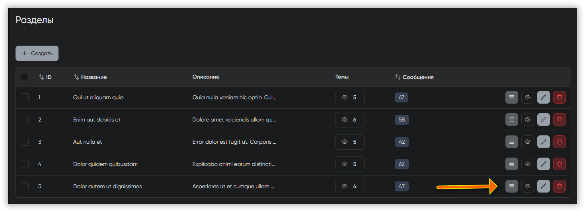

=== "Filament"

    В классах `BoardsTable`, `CategoriesTable` и `BlocksTable` добавьте метод `->reorderable` с указанием соответствующего столбца:

    ```php
    <?php

    class BoardsTable
    {
        public static function configure(Table $table): Table
        {
            return $table
                ->reorderable('board_order') // cat_order для категорий, priority для блоков
                ->columns([
                    // столбцы
                ])
                ->filters([
                    // фильтры
                ])
                ->recordActions([
                    EditAction::make(),
                ])
                ->toolbarActions([
                    BulkActionGroup::make([
                        DeleteBulkAction::make(),
                    ]),
                ]);
        }
    }
    ```

    После этого в левом верхнем углу таблицы соответствующего ресурса появится кнопка для включения режима перетаскивания:

    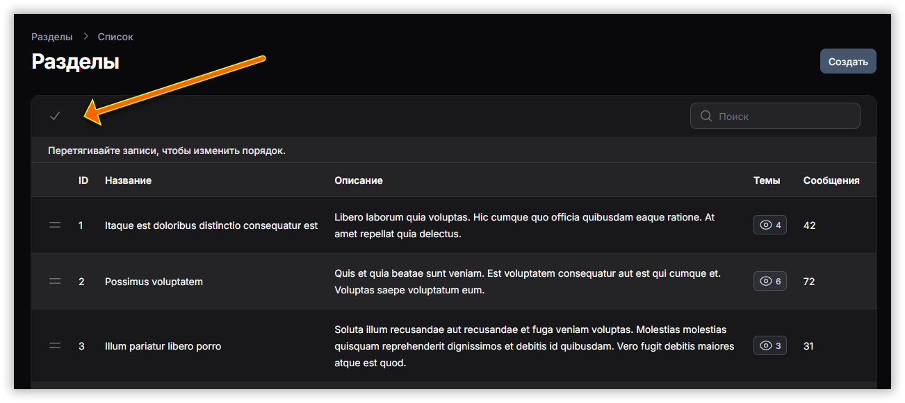

### Кейс 6: Ввод и отображение иконок

Обе админки используют иконки Heroicons. Но в нашем проекте используется Font Awesome. И в некоторых ресурсах должен быть выбор иконок при создании/редактировании:

=== "MoonShine"

    Устанавливаем пакет [bugo/moonshine-fontawesome-field](https://github.com/dragomano/moonshine-fontawesome-field)

    ```sh
    composer require bugo/moonshine-fontawesome-field
    ```

    Добавляем на страницу FormPage ресурсов `PortalBlock`, `PortalCategory`, `PortalTag` следующее поле:

    ```php
    <?php

    IconSelect::make(__('base.icon'), 'icon')
        ->async()
        ->searchable(),
    ```

    Для отображения иконок на индексных страницах поиск нам уже не нужен:

    ```php
    <?php

    IconSelect::make(__('base.icon'), 'icon')
        ->sortable(),
    ```

    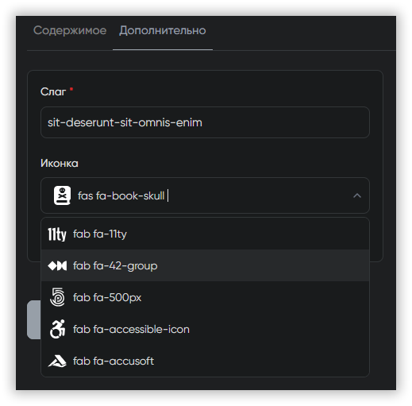

=== "Filament"

    Устанавливаем пакеты [guava/filament-icon-picker](https://github.com/lukas-frey/filament-icon-picker) и [owenvoke/blade-fontawesome](https://github.com/owenvoke/blade-fontawesome)

    ```sh
    composer require guava/filament-icon-picker
    composer require guava/owenvoke/blade-fontawesome

    php artisan filament:assets
    ```

    Для отображения иконок в таблицах придется создать свое поле:

    ```sh
    php artisan make:filament-table-column FontAwesomeColumn
    ```

    ```php
    <?php

    class FontAwesomeColumn extends Column implements HasEmbeddedView
    {
        public function toEmbeddedHtml(): string
        {
            $icon = $this->getState();

            try {
                $result = $icon ? svg(str_replace(' fa', '', $icon), 'h-6 w-6')->toHtml() : '';
            } catch (Exception $e) {
                $result = $e->getMessage();
            }

            ob_start(); ?>

            <div>
                <?= $result ?>
            </div>

            <?php return ob_get_clean();
        }
    }
    ```

    Добавляем новое поле в таблицы соответствующих ресурсов:

    ```php
    FontAwesomeColumn::make('icon'),
    ```

    Для форм создания/редактирования тоже создадим свой кастомный компонент:

    ```sh
    php artisan make:filament-form-field FontAwesomeIconPicker
    ```

    ```php
    <?php

    namespace App\Filament\Forms\Components;

    use Guava\IconPicker\Forms\Components\IconPicker;

    class FontAwesomeIconPicker extends IconPicker
    {
        protected function setUp(): void
        {
            parent::setUp();

            $this
                ->label(__('base.icon'))
                ->sets([
                    'fontawesome-solid',
                    'fontawesome-regular',
                    'fontawesome-brands',
                ])
                ->searchable()
                ->listSearchResults()
                ->formatStateUsing(function ($state) {
                    if (! $state) return null;

                    [$prefix, $iconName] = explode(' fa-', $state, 2);

                    return $prefix . '-' . $iconName;
                })
                ->dehydrateStateUsing(function ($state) {
                    if (! $state) return null;

                    [$prefix, $iconName] = explode('-', $state, 2);

                    return $prefix . ' fa-' . $iconName;
                });
        }
    }
    ```

    И вставляем в соответствующих формах (`PortalTagForm`, `PortalCategoryForm`, `PortalBlockForm`):

    ```php
    FontAwesomeIconPicker::make('icon'),
    ```

    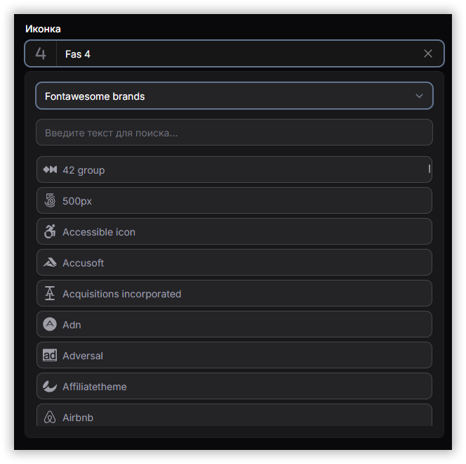

### Кейс 7: Создание слагов из заголовков

Для страниц, категорий и тегов должен генерироваться слаг из заголовка:

=== "MoonShine"

    Сахар с `reactive` и `live` из коробки не работает, поскольку поле `title` находится на странице формы другого ресурса, поэтому придется изобретать.

    В `FormPage` ресурса `Translation`, а также в `TranslationFormPage` ресурсов `Category` и `Tag` добавим кастомные атрибуты для поля `title`:

    ```php
    <?php

    Text::make(__('base.translation_title'), 'title')
        ->customAttributes([
            'x-data' => '',
            'x-on:input.debounce.500ms' => "
                if (\$el.value) {
                    fetch('/admin/pages/generate-slug?title=' + encodeURIComponent(\$el.value))
                        .then(r => r.json())
                        .then(data => \$dispatch('slug-updated', data))
                }
            "
        ])
        ->required(),
    ```

    А в `FormPage` ресурсов `Page`, `Category` и `Tag` добавим кастомные атрибуты уже для поля `slug`:

    ```php
    <?php

    Slug::make(__('base.slug'), 'slug')
        ->required()
        ->customAttributes([
            'x-data' => '',
            'x-on:slug-updated.window' => 'if (!$el.value && $event.detail.slug) $el.value = $event.detail.slug'
        ])
        ->unique(),
    ```

    Ну и про роут не забудем:

    ```php
    <?php

    Route::get('/admin/pages/generate-slug', function () {
        return response()->json([
            'slug' => Str::slug(request('title', ''))
        ]);
    });
    ```

=== "Filament"

    В [документации](https://filamentphp.com/docs/4.x/forms/overview#generating-a-slug-from-a-title) всё доходчиво объяснено, просто добавляем методы `live` и `afterStateUpdated` для поля заголовка:

    ```php
    <?php

    Repeater::make('translations')
        // ...
        ->schema([
            TextInput::make('title')
                ->live(onBlur: true)
                ->afterStateUpdated(
                    fn (Set $set, ?string $state) => $set('../../slug', Str::slug($state))
                )
                ->required()
                ->maxLength(255)
                ->columnSpanFull(),
            // ...
        ]),

    TextInput::make('slug')
        ->label(__('base.slug'))
        ->required()
        ->unique(ignoreRecord: true)
        ->maxLength(255),
    ```

    !!! note "Примечание"

        Если бы поле заголовка находилось не внутри `Repeater`, а на одном уровне с полем слага, тогда [вместо `../../slug` можно было бы использовать просто `slug`](https://filamentphp.com/docs/4.x/forms/repeater#using-get-to-access-parent-field-values).

### Кейс 8: Валидация в формах

Валидация в обеих админках настраивается в форме редактирования. На примере ресурса `CategoryResource`:

=== "MoonShine"

    Поля в методе `fields`, правила валидации — в методе `rules`, всё логично:

    ```php
    <?php

    class FormPage extends BaseFormPage
    {
        protected function fields(): iterable
        {
            return [
                Box::make([
                    ID::make(__('base.id'), 'id_cat'),

                    Text::make(__('base.title'), 'name')
                        ->required(),

                    Textarea::make(__('base.description'), 'description')
                        ->required(),

                    Switcher::make(__('base.collapsible'), 'can_collapse')
                        ->default(true)
                ]),
            ];
        }

        protected function rules(DataWrapperContract $item): array
        {
            return [
                'name' => 'required|string|max:255',
                'description' => 'required|string',
                'can_collapse' => 'integer',
            ];
        }
    }
    ```

=== "Filament"

    Правила валидации устанавливаются вместе с полями через метод `configure`:

    ```php
    <?php

    class CategoryForm
    {
        public static function configure(Schema $schema): Schema
        {
            return $schema
                ->components([
                    TextInput::make('name')
                        ->label(__('base.name'))
                        ->required()
                        ->maxLength(255),

                    Textarea::make('description')
                        ->label(__('base.description'))
                        ->required()
                        ->columnSpanFull(),

                    Toggle::make('can_collapse')
                        ->label(__('base.collapsible'))
                        ->default(true),
                ]);
        }
    }
    ```

### Кейс 9: Редактирование полей отношений в родительском ресурсе

Темы форума не имеют собственных заголовков и содержимого — они используют их из первого сообщения темы, через связь `firstMessage`:

=== "MoonShine"

    `changeFill` и `onApply` творят магию:

    ```php
    <?php

    Text::make(__('base.title'), 'subject')
        ->required()
        ->changeFill(fn(Topic $item) => $item->firstMessage?->subject ?? '')
        ->onApply(fn($item) => $item),

    Textarea::make(__('base.message_body'), 'body')
        ->required()
        ->changeFill(fn(Topic $item) => $item->firstMessage?->body ?? '')
        ->onApply(fn($item) => $item)
        ->setAttribute('rows', '10'),
    ```

    В ресурсе `TopicResource` реализуем кастомную обработку через `afterCreated` и `afterUpdated`:

    ```php
    <?php

    protected function afterCreated(DataWrapperContract $item): DataWrapperContract
    {
        DB::transaction(function () use ($item) {
            $model = $item->getOriginal();
            $data = request()->all();

            $message = Message::create([
                'id_topic' => $model->id_topic,
                'id_board' => $data['id_board'],
                'poster_time' => time(),
                'id_member' => $data['id_member_started'],
                'subject' => $data['subject'],
                'poster_name' => $model->member?->real_name ?? '',
                'poster_email' => $model->member?->email_address ?? '',
                'body' => $data['body'],
                'approved' => $data['approved'],
            ]);

            $model->updateQuietly([
                'id_first_msg' => $message->id_msg,
                'id_last_msg' => $message->id_msg,
                'num_replies' => 0,
                'num_views' => 1,
            ]);
        });

        return $item;
    }

    protected function afterUpdated(DataWrapperContract $item): DataWrapperContract
    {
        $model = $item->getOriginal();
        $data = request()->only(['subject', 'body']);

        if (! empty($data)) {
            Message::where('id_msg', $model->id_first_msg)->update([
                'subject' => $data['subject'],
                'body' => $data['body'],
            ]);
        }

        return $item;
    }
    ```

=== "Filament"

    Объединяем нужные поля в одну секцию:

    ```php
    <?php

    Section::make()
        ->schema([
            TextInput::make('subject')
                ->label(__('base.title'))
                ->required()
                ->maxLength(255)
                ->columnSpanFull(),

            Textarea::make('body')
                ->label(__('base.message_body'))
                ->required()
                ->rows(10)
                ->columnSpanFull(),
        ])
        ->columnSpanFull(),
    ```

    Добавляем этот код в `CreateTopic`:

    ```php
    <?php

    private array $messageData = [];

    protected function mutateFormDataBeforeCreate(array $data): array
    {
        $this->messageData = [
            'subject' => $data['subject'],
            'body' => $data['body'],
        ];

        unset($data['subject'], $data['body']);

        return $data;
    }

    protected function afterCreate(): void
    {
        DB::transaction(function () {
            $topic = $this->record;

            $message = Message::create([
                'id_topic' => $topic->id_topic,
                'id_board' => $topic->id_board,
                'poster_time' => time(),
                'id_member' => $topic->id_member_started,
                'subject' => $this->messageData['subject'],
                'poster_name' => $topic->member?->real_name ?? '',
                'poster_email' => $topic->member?->email_address ?? '',
                'body' => $this->messageData['body'],
                'approved' => $topic->approved ?? 1,
            ]);

            $topic->updateQuietly([
                'id_first_msg' => $message->id_msg,
                'id_last_msg' => $message->id_msg,
                'num_replies' => 0,
                'num_views' => 1,
            ]);
        });
    }
    ```

    А этот — в `EditTopic`:

    ```php
    <?php

    private array $messageData = [];

    protected function mutateFormDataBeforeFill(array $data): array
    {
        if ($this->record->firstMessage) {
            $data['subject'] = $this->record->firstMessage->subject;
            $data['body'] = $this->record->firstMessage->body;
        }

        return $data;
    }

    protected function mutateFormDataBeforeSave(array $data): array
    {
        $this->messageData = [
            'subject' => $data['subject'] ?? null,
            'body' => $data['body'] ?? null,
        ];

        unset($data['subject'], $data['body']);

        return $data;
    }

    protected function afterSave(): void
    {
        if ($this->messageData['subject'] || $this->messageData['body']) {
            Message::where('id_msg', $this->record->id_first_msg)
                ->update(array_filter($this->messageData));
        }
    }
    ```

### Кейс 10: Отображение дочерних ресурсов

При редактировании некоторых ресурсов важно иметь возможность создавать и редактировать дочерние. На примере `TopicResource` и `MessageResource`:

=== "MoonShine"

    На странице формы добавляем поле отношения:

    ```php
    <?php

    HasMany::make(__('base.messages'), 'messages', resource: MessageResource::class)
        ->async()
        ->creatable(),
    ```

    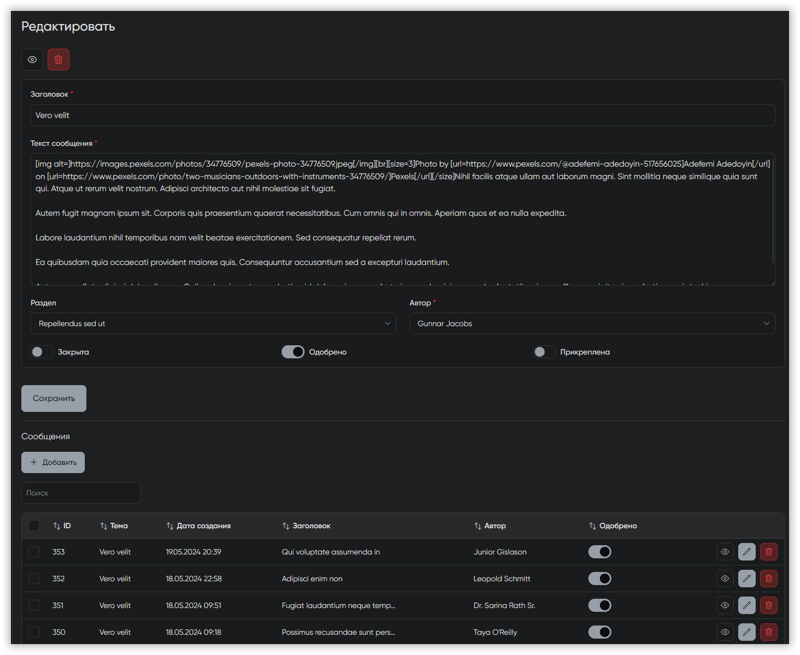

=== "Filament"

    Заполняем метод `getRelations` в `TopicResource`:

    ```php
    <?php

    public static function getRelations(): array
    {
        return [
            MessagesRelationManager::class,
        ];
    }
    ```

    Далее кастомизируем отображаемые поля:

    ```php
    <?php

    class MessagesRelationManager extends RelationManager
    {
        protected static string $relationship = 'messages';

        public function form(Schema $schema): Schema
        {
            return $schema
                ->components([
                    Section::make()
                        ->schema([
                            TextInput::make('subject')
                                ->label(__('base.title'))
                                ->required()
                                ->maxLength(255)
                                ->columnSpanFull(),

                            Textarea::make('body')
                                ->label(__('base.message_body'))
                                ->required()
                                ->rows(10)
                                ->columnSpanFull(),
                        ])
                        ->columnSpanFull(),

                    Select::make('id_member')
                        ->label(__('base.author'))
                        ->relationship('member', 'real_name')
                        ->searchable()
                        ->preload()
                        ->required(),

                    Toggle::make('approved')
                        ->label(__('base.approved'))
                        ->default(true)
                        ->columnSpanFull(),
                ]);
        }

        public function table(Table $table): Table
        {
            return $table
                ->heading(__('base.messages'))
                ->recordTitleAttribute('subject')
                ->columns([
                    TextColumn::make('id_msg')
                        ->label(__('base.id'))
                        ->sortable(),

                    TextColumn::make('subject')
                        ->label(__('base.title'))
                        ->searchable()
                        ->limit(50),

                    TextColumn::make('poster_name')
                        ->label(__('base.author'))
                        ->searchable(),

                    TextColumn::make('poster_time')
                        ->label(__('base.created_at'))
                        ->date('d.m.Y H:i')
                        ->sortable(),

                    IconColumn::make('approved')
                        ->label(__('base.approved'))
                        ->boolean(),
                ])
                ->defaultSort('poster_time', 'desc')
                ->headerActions([
                    CreateAction::make()
                        ->mutateDataUsing(function (array $data): array {
                            /* @var Topic $topic */
                            $topic = $this->getOwnerRecord();

                            $data['id_topic'] = $topic->id_topic;
                            $data['id_board'] = $topic->id_board;

                            $member = Member::find($data['id_member']);
                            $data['poster_name'] = $member?->real_name ?? '';
                            $data['poster_email'] = $member?->email_address ?? '';

                            return $data;
                        }),
                ])
                ->recordActions([
                    EditAction::make(),
                    DeleteAction::make(),
                ])
                ->toolbarActions([
                    BulkActionGroup::make([
                        DeleteBulkAction::make(),
                    ]),
                ]);
        }
    }
    ```

    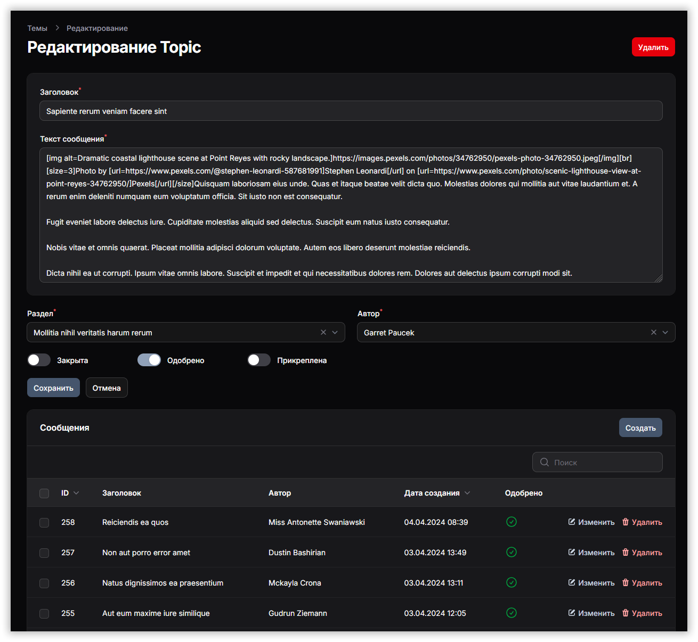

### Кейс 11: Кастомные кнопки

Для страниц и блоков нам нужны кастомные кнопки создания сущностей с разным типом контента:

=== "MoonShine"

    Создаём трейт `HasCustomCreateButtons`:

    ```php
    <?php

    trait HasCustomCreateButtons
    {
        protected function topLeftButtons(): ListOf
        {
            $createUrl = $this->getCreateUrl();

            return new ListOf(
                ActionButtonContract::class,
                $this->getContentTypes()
                    ->map(fn($label, $key) =>
                        ActionButton::make(__('moonshine::ui.create') . ': ' . $label, "$createUrl?type=$key")
                            ->primary()
                            ->icon('plus')
                    )
                    ->values()
                    ->toArray()
            );
        }

        protected function getCreateUrl(): string
        {
            $formPage = $this->getResource()
                ->getPages()
                ->first(fn($page) => $page instanceof FormPage);

            return $this->getResource()
                ->getRouter()
                ->withPage($formPage)
                ->to('resource.page');
        }

        protected function getContentTypes(): Collection
        {
            return collect(ContentType::values());
        }
    }
    ```

    Подключаем этот трейт к соответствующим индексным страницам:

    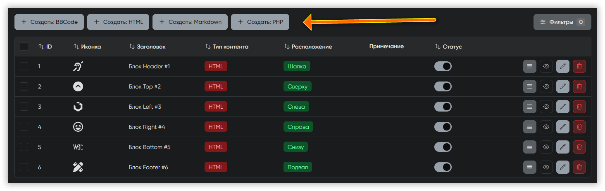

=== "Filament"

    Создаём трейт `HasCustomCreateButtons`:

    ```php
    <?php

    trait HasCustomCreateButtons
    {
        protected function getHeaderActions(): array
        {
            return $this->getContentTypes()
                ->map(fn($label, $key) =>
                    CreateAction::make("create_$key")
                        ->label(__('filament-actions::create.single.modal.heading', ['label' => $label]))
                        ->icon('heroicon-o-plus')
                        ->color('primary')
                        ->url(static::getResource()::getUrl('create', ['type' => $key]))
                )
                ->values()
                ->all();
        }

        protected function getContentTypes(): Collection
        {
            return collect(ContentType::values());
        }
    }
    ```

    Подключаем этот трейт к соответствующим индексным страницам, не забывая убирать из них метод `getHeaderActions`, если он уже там есть:

    ```php
    <?php

    class ListPortalBlocks extends ListRecords
    {
        use HasCustomCreateButtons;

        protected static string $resource = PortalBlockResource::class;
    }
    ```

    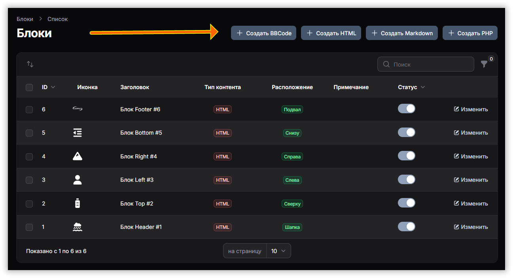

Поскольку при редактировании нам нужно чтобы подключался соответствующий редактор для конкретного типа контента, нужно подправить и кнопки редактирования:

=== "MoonShine"

    Здесь тоже можно было бы сделать трейт, но для наглядности используем отдельные методы.

    Добавляем в `IndexPage` блоков:

    ```php
    <?php

    protected function modifyEditButton(ActionButtonContract $button): ActionButtonContract
    {
        return $button->onBeforeRender(function (ActionButtonContract $action) {
            /* @var PortalBlock $data */
            $data = $action->getData();
            $type = $data->type;
            $action->setUrl($action->getUrl() . '?type=' . $type);
        });
    }
    ```

    Добавляем в `IndexPage` страниц:

    ```php
    <?php

    protected function modifyEditButton(ActionButtonContract $button): ActionButtonContract
    {
        return $button->onBeforeRender(function (ActionButtonContract $action) {
            /* @var PortalPage $data */
            $data = $action->getData();
            $type = $data->type;
            $action->setUrl($action->getUrl() . '?type=' . $type);
        });
    }
    ```

=== "Filament"

    Здесь всё можно сделать через переопределение метода `url` у кнопок редактирования в таблицах:

    ```php
    <?php

    ->recordActions([
        EditAction::make()
            ->url(fn ($record) => PortalBlockResource::getUrl('edit', [
                'record' => $record,
                'type' => $record->type
            ])),
    ])
    ```

### Кейс 12: Разные типы полей в зависимости от типа контента

В моем проекте блоки и страницы могут содержать контент разных типов: BBCode, PHP, HTML, Markdown. Поэтому при редактировании в форме тип поля `content` должен соответственно меняться:

=== "MoonShine"

    Создаём трейт `HasCustomContentField`:

    ```php
    <?php

    trait HasCustomContentField
    {
        protected function getContentField(): Field
        {
            $fieldClass = match (request('type')) {
                'php' => Code::class,
                'html' => TinyMce::class,
                'markdown' => Markdown::class,
                default => Textarea::class,
            };

            $field = $fieldClass::make(__('base.translation_content'), 'content')
                ->setAttribute('rows', '10');

            if ($field instanceof Code) {
                $field->language('php');
            }

            return $field;
        }
    }
    ```

    Подключаем и используем в соответствующих формах. Например, так:

    ```php
    <?php

    class TranslationFormPage extends FormPage
    {
        use HasCustomContentField;

        protected function fields(): iterable
        {
            return [
                Text::make(__('base.translation_title'), 'title'),

                Textarea::make(__('base.translation_description'), 'description')
                    ->setAttribute('rows', '3'),

                $this->getContentField(), // <- а вот и наше поле
            ];
        }
    }
    ```

=== "Filament"

    Создаём трейт `HasCustomContentField`:

    ```php
    <?php

    trait HasCustomContentField
    {
        protected static function getContentField(): Field
        {
            $fieldClass = match (request('type')) {
                'php' => CodeEditor::class,
                'html' => RichEditor::class,
                'markdown' => MarkdownEditor::class,
                default => Textarea::class,
            };

            $field = $fieldClass::make('content')
                ->label(__('base.translation_content'))
                ->columnSpanFull();

            if ($field instanceof Textarea) {
                $field
                    ->rows(10)
                    ->autosize();
            }

            if ($field instanceof CodeEditor) {
                $field->language(Language::Php);
            }

            return $field;
        }
    }
    ```

    Подключаем и используем в соответствующих формах (в методе `configure`). Например:

    ```php
    <?php

    public static function configure(Schema $schema): Schema
    {
        return $schema
            ->components([
                Repeater::make('translations')
                    ->label(__('base.content'))
                    ->relationship('translations')
                    ->schema([
                        TextInput::make('title')
                            ->label(__('base.title'))
                            ->required()
                            ->maxLength(255)
                            ->columnSpanFull(),

                        static::getContentField(), // <- а вот и наше поле
                    ])
                    ->addActionLabel(__('base.add_new'))
                    ->columns()
                    ->columnSpanFull(),
            ]);
    }
    ```

Если знаете, как сделать проще, поделитесь в комментариях.

### Кейс 13: Быстрые фильтры

    Допустим, при просмотре списка категорий нам нужна кнопка для быстрого отображения всех категорий без описаний:

=== "MoonShine"

    Здесь быстрые фильтры также называют тегами. Добавляем этот метод на индексную страницу ресурса:

    ```php
    <?php

    protected function queryTags(): array
    {
        return [
            QueryTag::make(
                __('base.categories_without_description'),
                fn(Builder $query) => $query->whereHas('translation', function (Builder $translationQuery) {
                    $translationQuery
                        ->whereNull('description')
                        ->orWhere('description', '');
                })
            )
        ];
    }
    ```

    

=== "Filament"

    Добавляем этот метод на страницу `ListPortalCategories`:

    ```php
    <?php

    public function getTabs(): array
    {
        return [
            'all' => Tab::make(__('base.all'))
                ->badge(PortalCategory::count()),

            'without_description' => Tab::make(__('base.categories_without_description'))
                ->modifyQueryUsing(fn (Builder $query) =>
                    $query->whereHas('translation', function (Builder $translationQuery) {
                        $translationQuery
                            ->whereNull('description')
                            ->orWhere('description', '');
                    })
                )
                ->badge(PortalCategory::whereHas('translation', function (Builder $q) {
                    $q->whereNull('description')->orWhere('description', '');
                })->count()),
        ];
    }
    ```

    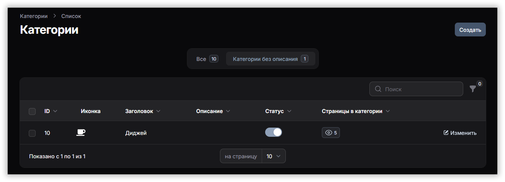

### Кейс 14: Сложные фильтры

На примере фильтров для ресурса `PortalPage` сравним реализацию фильтров в админках:

=== "MoonShine"

    В классе индексной страницы нужно реализовать метод `filters`:

    ```php
    <?php

    protected function filters(): iterable
    {
        return [
            DateRange::make(__('base.created_at'), 'created_at'),

            DateRange::make(__('base.updated_at'), 'updated_at'),

            BelongsTo::make(__('base.category'), 'category', 'title')
                ->nullable()
                ->asyncOnInit(),

            Select::make(__('base.content_type'), 'type')
                ->nullable()
                ->options(ContentType::values()),

            Select::make(__('base.status'), 'status')
                ->nullable()
                ->options(PageStatus::values()),

            BelongsToMany::make(__('base.tags'), 'tags', resource: TagResource::class)
                ->selectMode()
                ->searchable()
                ->selectMaxItems(6)
        ];
    }
    ```

    После этого справа над таблицей с записями появится кнопка «Фильтры»:

    

=== "Filament"

    В `PortalPagesTable`, в методе `configure` заполним секцию `filters`:

    ```php
    <?php

    ->filters([
        Filter::make('created_at')
            ->label(__('base.created_at'))
            ->schema([
                DatePicker::make('created_from')
                    ->label(__('base.created_from')),
                DatePicker::make('created_until')
                    ->label(__('base.created_until')),
            ])
            ->query(function (Builder $query, array $data): Builder {
                return $query
                    ->when(
                        $data['created_from'],
                        fn (Builder $query, $date): Builder => $query->where(
                            'created_at',
                            '>=',
                            Carbon::parse($date)->startOfDay()->timestamp
                        ),
                    )
                    ->when(
                        $data['created_until'],
                        fn (Builder $query, $date): Builder => $query->where(
                            'created_at',
                            '<=',
                            Carbon::parse($date)->endOfDay()->timestamp
                        ),
                    );
            }),

        Filter::make('updated_at')
            ->label(__('base.updated_at'))
            ->schema([
                DatePicker::make('updated_from')
                    ->label(__('base.updated_from')),
                DatePicker::make('updated_until')
                    ->label(__('base.updated_until')),
            ])
            ->query(function (Builder $query, array $data): Builder {
                return $query
                    ->when(
                        $data['updated_from'],
                        fn (Builder $query, $date): Builder => $query->where(
                            'updated_at',
                            '>=',
                            Carbon::parse($date)->startOfDay()->timestamp
                        ),
                    )
                    ->when(
                        $data['updated_until'],
                        fn (Builder $query, $date): Builder => $query->where(
                            'updated_at',
                            '<=',
                            Carbon::parse($date)->endOfDay()->timestamp
                        ),
                    );
            }),

        SelectFilter::make('category')
            ->label(__('base.category'))
            ->searchable()
            ->preload()
            ->options(function () {
                return PortalCategory::query()
                    ->get()
                    ->mapWithKeys(
                        fn(PortalCategory $category) => [
                            $category->category_id => $category->translation?->title ?? $category->category_id,
                        ]
                    )
                    ->toArray();
            })
            ->query(function (Builder $query, array $data): Builder {
                return $query->when(
                    ! empty($data['value']),
                    fn (Builder $query): Builder =>
                        $query->whereHas('category', fn (Builder $q) =>
                            $q->where('lp_categories.category_id', $data['value'])
                        )
                );
            }),

        SelectFilter::make('type')
            ->label(__('base.content_type'))
            ->options(ContentType::values()),

        SelectFilter::make('status')
            ->label(__('base.status'))
            ->options(PageStatus::values())
            ->searchable()
            ->preload(),

        SelectFilter::make('tags')
            ->label(__('base.tags'))
            ->multiple()
            ->searchable()
            ->preload()
            ->options(function () {
                return PortalTag::query()
                    ->get()
                    ->mapWithKeys(fn(PortalTag $tag) => [
                        $tag->tag_id => $tag->translation?->title ?? $tag->tag_id,
                    ])
                    ->toArray();
            })
            ->query(function (Builder $query, array $data): Builder {
                return $query->when(
                    ! empty($data['values']),
                    fn (Builder $query): Builder =>
                        $query->whereHas('tags', fn (Builder $q) =>
                            $q->whereIn('lp_page_tag.tag_id', $data['values'])
                        )
                );
            }),
    ])
    ```

    После этого справа над таблицей с записями появится иконка воронки, для выбора фильтров.

    Встроенных фильтров сортировки по дате здесь нет, поэтому пришлось кастомизировать `Filter`, из-за чего код получился объёмным. Но можно установить дополнительный пакет [malzariey/filament-daterangepicker-filter](https://github.com/malzariey/filament-daterangepicker-filter) и использовать специальные фильтры:

    ```php
    <?php

    DateRangeFilter::make('created_at')
        ->label(__('base.created_at'))
        ->modifyQueryUsing(function (Builder $query, ?Carbon $startDate, ?Carbon $endDate, $dateString) {
            return $query->when(
                ! empty($dateString),
                fn (Builder $query) => $query->whereBetween('created_at', [
                    $startDate->startOfDay()->timestamp,
                    $endDate->endOfDay()->timestamp
                ])
            );
        }),

    DateRangeFilter::make('updated_at')
        ->label(__('base.updated_at'))
        ->modifyQueryUsing(function (Builder $query, ?Carbon $startDate, ?Carbon $endDate, $dateString) {
            return $query->when(
                ! empty($dateString),
                fn (Builder $query) => $query->whereBetween('updated_at', [
                    $startDate->startOfDay()->timestamp,
                    $endDate->endOfDay()->timestamp
                ])
            );
        }),
    ```

    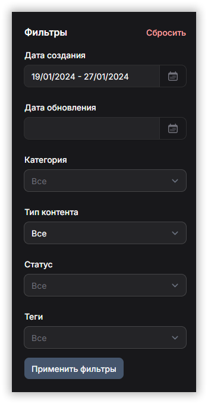

### Кейс 15: Отключение полей по условию

При редактировании комментариев нужно отображать связанную страницу, но не давать её менять, если комментарий уже создан:

=== "MoonShine"

    ```php
    <?php

    BelongsTo::make(__('base.page'), 'page', 'translation.title')
        ->disabled(function () {
            $segments = request()->segments();
            $lastSegment = end($segments);

            return is_numeric($lastSegment);
        })
        ->searchable(),
    ```

=== "Filament"

    ```php
    <?php

    Select::make('page_id')
        ->label(__('base.page'))
        ->getSearchResultsUsing(function (string $search) {
            return PortalPage::query()
                ->whereHas(
                    'translation',
                    fn($q) => $q->where('title', 'LIKE', "%$search%")
                )
                ->limit(50)
                ->get()
                ->mapWithKeys(fn($p) => [$p->page_id => $p->translation->title]);
        })
        ->getOptionLabelUsing(fn($value) => PortalPage::find($value)?->translation->title)
        ->disabled(fn($livewire) => $livewire instanceof EditRecord)
        ->searchable()
        ->required(),
    ```

### Кейс 16: Скрытие/отображение полей по условию

Для страницы портала нужно отображать поле выбора даты, но только при создании записи:

=== "MoonShine"

    ```php
    <?php

    Hidden::make('', 'page_id'),

    Date::make(__('base.created_at'), 'created_at')
        ->withTime()
        ->showWhen('page_id', 0),
    ```

=== "Filament"

    ```php
    <?php

    DateTimePicker::make('created_at')
        ->label(__('base.created_at'))
        ->hidden(fn($livewire) => $livewire instanceof EditRecord),
    ```

### Кейс 17: поле ввода имейла + кнопка копирования

=== "MoonShine"

    ```php
    <?php

    Email::make(__('base.email'), 'email_address')
        ->copy()
        ->required(),
    ```

    И правило в методе `rules`:

    ```php
    <?php

    protected function rules(DataWrapperContract $item): array
    {
        return [
            'email_address' => [
                'sometimes',
                'bail',
                'required',
                'email',
                Rule::unique('members')->ignoreModel($item->getOriginal()),
            ],
        ];
    }
    ```

=== "Filament"

    ```php
    <?php

    TextInput::make('email_address')
        ->label(__('base.email'))
        ->email()
        ->copyable()
        ->required()
        ->unique(ignoreRecord: true)
        ->maxLength(255),
    ```

### Кейс 18: Работа с тегами

Есть различные пакеты для этого, но я реализовал теги для страниц по старинке, через промежуточную таблицу и отношение `BelongsToMany`:

```php
<?php

public function tags(): BelongsToMany
{
    return $this->belongsToMany(PortalTag::class, 'lp_page_tag', 'page_id', 'tag_id');
}
```

=== "MoonShine"

    ```php
    <?php

    BelongsToMany::make(__('base.tags'), 'tags', resource: TagResource::class)
        ->selectMode()
        ->searchable()
        ->selectMaxItems(6),
    ```

=== "Filament"

    ```php
    <?php

    Select::make('tags')
        ->label(__('base.tags'))
        ->relationship('tags', 'title')
        ->multiple()
        ->searchable()
        ->preload()
        ->maxItems(6)
        ->getOptionLabelFromRecordUsing(
            fn(PortalTag $record) => $record->translation?->title
        ),
    ```

### Кейс 19: Связанные записи

На некоторых индексных страницах мне понадобилось отобразить не только количество записей через отношения, но и разместить ссылку для перехода к этим записям:

=== "MoonShine"

    Например, на индексной странице ресурса `BoardResource` мы можем сразу увидеть количество относящихся к ресурсу тем и перейти к этим темам:

    ```php
    <?php

    HasMany::make(__('base.topics'), 'topics')
        ->relatedLink(),
    ```

=== "Filament"

    В Filament из коробки чего-то подобного не нашлось, пришлось изобретать. Добавляем внутри `->columns()` в `BoardsTable`:

    ```php
    <?php

    TextColumn::make('num_topics')
        ->label(__('base.topics'))
        ->sortable()
        ->url(fn (Board $record) => TopicResource::getUrl('index', [
            'filters' => [
                'board' => ['value' => $record->id_board]
            ],
        ]))
        ->icon(Heroicon::OutlinedEye)
        ->size(TextSize::Medium)
        ->badge(),
    ```

    А это — в `TopicsTable`, в фильтры:

    ```php
    <?php

    ->filters([
        SelectFilter::make('board')
            ->label(__('base.board'))
            ->options(Board::pluck('name', 'id_board'))
            ->searchable()
            ->preload()
            ->attribute('id_board'),
    ])
    ```

### Кейс 20: Ссылки в подвале

И, наконец, куда же без ссылок в подвале? Давайте добавим:

=== "MoonShine"

    `CustomLayout.php`:

    ```php
    <?php

    protected function getFooterComponent(): Footer
    {
        return Footer::make()
            ->copyright(sprintf(
                "<strong>%s</strong> &copy; %d, Bugo",
                config('app.name'),
                now()->year
            ))
            ->menu([
                'https://github.com/moonshine-software/moonshine' => 'MoonShine',
                'https://github.com/SimpleMachines/SMF' => 'Simple Machines Forum',
                'https://github.com/dragomano/Light-Portal' => 'Light Portal',
            ]);
    }
    ```

=== "Filament"

    Можно установить плагин [Easy Footer](https://filamentphp.com/plugins/devonab-easy-footer):

    ```php
    <?php

    class AdminPanelProvider extends PanelProvider
    {
        public function panel(Panel $panel): Panel
        {
            return $panel
                // ...
                ->plugins([
                    EasyFooterPlugin::make()
                        ->withLinks([
                            ['title' => 'MoonShine', 'url' => 'https://github.com/moonshine-software/moonshine'],
                            ['title' => 'Simple Machines Forum', 'url' => 'https://github.com/SimpleMachines/SMF'],
                            ['title' => 'Light Portal', 'url' => 'https://github.com/dragomano/Light-Portal']
                        ]),
                ]);
        }
    }
    ```

    Или заморочиться и реализовать через специальный хук:

    ```php
    <?php

    class AdminPanelProvider extends PanelProvider
    {
        public function panel(Panel $panel): Panel
        {
            return $panel
                // ...
                ->renderHook(PanelsRenderHook::FOOTER, fn () => view('filament.custom-footer'));
        }
    }
    ```

    `resources/views/filament/custom-footer.blade.php`:

    ```php
    <!-- HTML-код блока с вашими ссылками -->
    ```

### Кейс 21: Виджеты (статистика)

Зачастую на главной странице дашборда (а иногда и на страницах отдельных ресурсов) размещаются различные графики.

=== "MoonShine"

    Здесь это называется «[метрики](https://getmoonshine.app/ru/docs/4.x/model-resource/metrics)». Из коробки мы уже можем использовать в нашем `CustomDashboard` простые варианты типа таких:

    ```php
    <?php

    protected function components(): iterable
    {
        return [
            Grid::make([
                ValueMetric::make(__('base.users'))
                    ->value(Member::count())
                    ->columnSpan(2),
                ValueMetric::make(__('base.groups'))
                    ->value(Membergroup::count())
                    ->columnSpan(2),
                ValueMetric::make(__('base.categories'))
                    ->value(Category::count())
                    ->columnSpan(2),
                ValueMetric::make(__('base.boards'))
                    ->value(Board::count())
                    ->columnSpan(2),
                ValueMetric::make(__('base.topics'))
                    ->value(Topic::count())
                    ->columnSpan(2),
                ValueMetric::make(__('base.messages'))
                    ->value(Message::count())
                    ->columnSpan(2),
            ])
        ];
    }
    ```

    Если хочется увидеть более красивые графики, устанавливаем дополнительный пакет:

    ```sh
    composer require moonshine/apexcharts
    ```

    И добавляем в тот же `CustomDashboard`:

    ```php
    <?php

    DonutChartMetric::make(__('base.portal'))
        ->values([
            __('base.blocks') => PortalBlock::count(),
            __('base.pages') => PortalPage::count(),
            __('base.categories') => PortalCategory::count(),
            __('base.tags') => PortalTag::count(),
        ])
        ->columnSpan(12),
    ```

    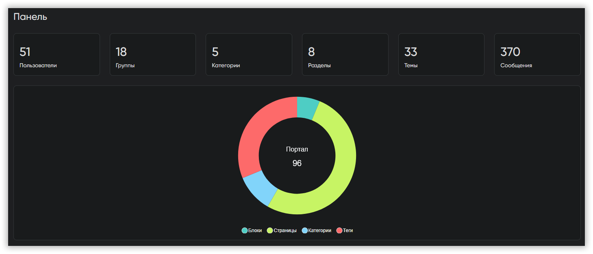

=== "Filament"

    А здесь это называется «[виджеты](https://filamentphp.com/docs/4.x/widgets/overview)». Всё создаётся через консоль:

    ```sh
    php artisan make:filament-widget StatsOverview --stats-overview
    ```

    ```php
    <?php

    class StatsOverview extends StatsOverviewWidget
    {
        protected static ?int $sort = 0;

        protected function getStats(): array
        {
            return [
                Stat::make(__('base.users'), Member::count()),
                Stat::make(__('base.groups'), Membergroup::count()),
                Stat::make(__('base.categories'), Category::count()),
                Stat::make(__('base.boards'), Board::count()),
                Stat::make(__('base.topics'), Topic::count()),
                Stat::make(__('base.messages'), Message::count()),
            ];
        }

        protected function getColumns(): int
        {
            return 6;
        }
    }
    ```

    «Пончики» здесь [доступны из коробки](https://filamentphp.com/docs/4.x/widgets/charts):

    ```sh
    php artisan make:filament-widget PortalChart --chart
    ```

    ```php
    <?php

    class PortalChart extends ChartWidget
    {
        protected static ?int $sort = 1;

        public function getHeading(): ?string
        {
            return __('base.portal');
        }

        protected function getData(): array
        {
            return [
                'datasets' => [
                    [
                        'label' => __('base.portal'),
                        'data' => [
                            PortalBlock::count(),
                            PortalPage::count(),
                            PortalCategory::count(),
                            PortalTag::count(),
                        ],
                        'backgroundColor' => [
                            'rgb(255, 99, 132)',
                            'rgb(54, 162, 235)',
                            'rgb(255, 205, 86)',
                            'rgb(75, 192, 192)',
                        ],
                    ],
                ],
                'labels' => [
                    __('base.blocks'),
                    __('base.pages'),
                    __('base.categories'),
                    __('base.tags'),
                ],
            ];
        }

        protected function getType(): string
        {
            return 'doughnut';
        }

        public function getColumnSpan(): int|string|array
        {
            return 1;
        }
    }
    ```

    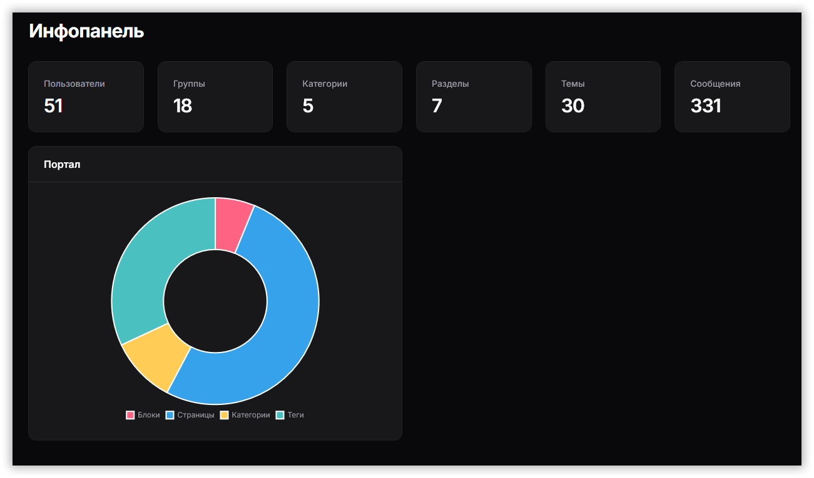

## Заключение

Что мне понравилось в каждой из админок?

**MoonShine**

- Использование одних и тех же полей как в таблицах, так и в формах
- Стильный вид (с каждой версией дизайн всё лучше и лучше)

**Filament**

- Отдельные классы для полей в формах и колонок в таблицах
- Быстрое создание ресурсов при наличии готовых моделей

В обеих админках:

- Удобное разделение на страницы
- Быстрая смена стиля оформления
- Возможность реализации сложных вещей

Что не понравилось?

**MoonShine**

- Не все настройки можно задать через `MoonShineServiceProvider`, приходится использовать и файл `moonshine.php`, либо оба способа вместе.

**Filament**

- Группы в меню не могут иметь иконки одновременно с пунктами

Какие-то вещи удобнее реализованы в одной админке, какие-то — в другой. Что-то меняется с каждым релизом.

С любым из рассмотренных инструментов можно создать крутую админку на любой вкус и цвет. Нужно лишь попробовать.

## Документация

* [MoonShine](https://getmoonshine.app/ru/docs/4.x)
* [Filament](https://filamentphp.com/docs/4.x/)

## Ссылки

* [Версия проекта с MoonShine](https://github.com/dragomano/smf-faker-generator)
* [Версия проекта с Filament](https://gitlab.com/dragomano/smf-faker-generator)

[repo]: https://github.com/dragomano/smf-faker-generator
