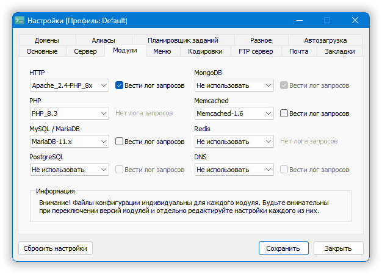
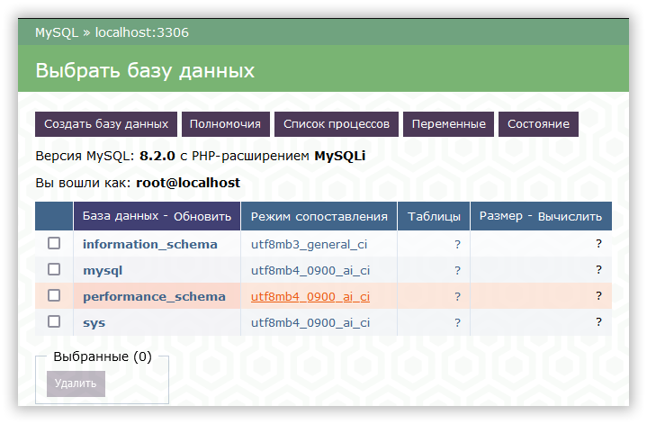
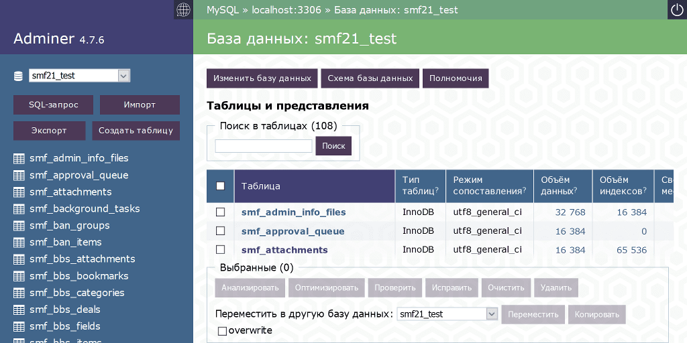
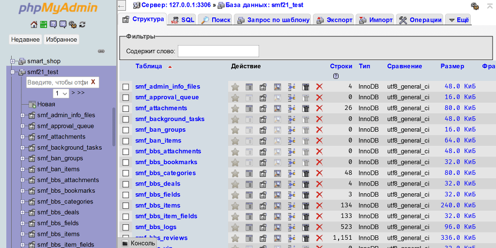
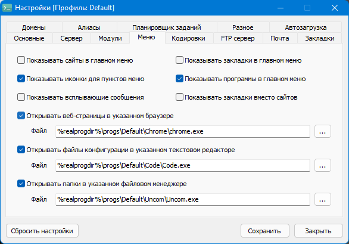

Краткая инструкция по обновлению некоторых компонентов OS Panel (актуальна для версий **5.3.9-5.4.3**).

<!-- more -->

OSP 5 обновляться уже не будет, поэтому читаем эту инструкцию и обновляем всё, что нужно, самостоятельно. Последнюю версию OSP из пятой линейки [можно скачать по ссылке](https://rutracker.org/forum/viewtopic.php?t=6250329).

---

<a href="https://billing.lite-host.in/aff.php?aff=1544" target="_blank"></a>

---

## Обновление PHP (например, с `8.1.x` до `8.1.y`)

!!! note "Вариант для скрупулёзных"

    Поскольку уже есть [новая, шестая версия OSP](../vozmozhnosti-open-server-panel-6/index.md), которая обладает рядом преимуществ, включая свежие версии всех популярных компонентов, оптимальней всего перейти на нее, не забыв перенести свои проекты.

- Останавливаем OS Panel.
- Скачиваем [новую версию][php] (выбираем вариант _Thread Safe_).
- Переходим в директорию `<Путь к OS Panel>\modules\php\PHP_8.1`.
- Распаковываем содержимое архива поверх имеющихся файлов, с заменой (либо предварительно очищаем папку, а затем распаковываем в нее файлы).
- Перезапускаем OS Panel, проверяем работоспособность.

### Установка другой версии (на примере `8.3`)

В случае, если вы хотите не обновить, а установить новую версию в дополнение к имеющимся:

- Скачиваем [новую версию][php] (выбираем вариант _Thread Safe_).
- Создаём директорию `<Путь к OS Panel>\modules\php\PHP_8.3`.
- Распаковываем содержимое архива в созданную директорию.
- Копируем файл `<Путь к OS Panel>\userdata\config\PHP_<старая_версия>_php.ini` и переименовываем в `PHP_8.3_php.ini`.
- Вносим изменения в зависимости от требований конкретной версии (см. для примера файл `php.ini` в архиве).
- При необходимости обновляем версию используемого сервера (Apache/Nginx).
- Перезапускаем OS Panel, выбрав в настройках новую версию.



## Обновление компонента Xdebug

- Скачиваем [новую версию][xdebug] (выбираем вариант с пометкой _TS_).
- Переименовываем в `php_xdebug.dll` и копируем в папку `<Путь к OS Panel>\modules\php\PHP_<Ваша версия PHP>\ext`.
- Корректируем путь в php.ini: `zend_extension = %sprogdir%/modules/php/%phpdriver%/ext/php_xdebug.dll`.

??? note "Варианты настроек Xdebug 3"

    #### Помощь при разработке + улучшенный `var_dump()`

    ```ini
    xdebug.mode = develop
    xdebug.start_with_request = trigger
    xdebug.client_host = localhost
    xdebug.client_port = 9003
    ```

    #### Пошаговая отладка

    ```ini
    xdebug.mode = debug
    xdebug.start_with_request = yes
    xdebug.client_host = localhost
    xdebug.client_port = 9003
    ```

    #### Тестирование с покрытием в PHPStorm

    ```ini
    xdebug.mode = coverage
    xdebug.start_with_request = no
    xdebug.output_dir = "%sprogdir%/userdata/temp/xdebug"
    xdebug.discover_client_host = true
    xdebug.client_host = localhost
    xdebug.client_port = 9003
    ```

    !!! note "Подсказка по работе с Xdebug в VS Code"

        1. Раскомментировать `;zend_extension = xdebug` в `php.ini`.
        2. Применить настройки для [пошаговой отладки](#poshagovaia-otladka).
        3. В корне проекта создать файл `.vscode\launch.json` со следующим содержанием:
        ```json
        {
            "version": "0.2.0",
            "configurations": [
                {
                    "name": "PhpServer",
                    "type": "php",
                    "request": "launch",
                    "port": 9003,
                    "hostname": "site.local", // Домен вашего проекта
                    "pathMappings": { // Путь к главному файлу проекта
                        "D:\\OSPanel\\domains\\site.local\\index.php": "${workspaceFolder}/index.php"
                    }
                }
            ]
        }
        ```
        4. Заменить `site.local` в конфиге на свой домен.
        5. Открыть папку проекта в VS Code.
        6. Всё, можно устанавливать _breakpoints_ (точки останова) и дебажить.

    Подробнее о настройке Xdebug 3 в PHPStorm можно почитать [здесь](https://www.jetbrains.com/help/phpstorm/configuring-xdebug.html#integrationWithProduct) (на английском) или [здесь](https://php.zone/kurs-php-dlya-nachinayushih/otladka-php-koda-s-pomoshchyu-xdebug-v-phpstorm) (на русском).

## Обновление компонента Imagick

- Скачиваем новую версию [здесь][imagick] (см. ссылки с пометкой «DLL», «Thread Save») или [здесь](https://mlocati.github.io/articles/php-windows-imagick.html).
- Файл `php_imagick.dll` из архива распаковываем в `<Путь к OS Panel>\modules\php\PHP_<Ваша версия>\ext`.
- Все остальные \*.dll файлы распаковываем в `<Путь к OS Panel>\modules\php\PHP_<Ваша версия>`.

## Обновление компонента Memcache

- Скачиваем [новую версию][memcache]
- Переименовываем файл в `php_memcache.dll` и сохраняем в `<Путь к OS Panel>\modules\php\PHP_<Ваша версия>\ext`.
- Для использования в `php.ini` находим или добавляем строку `extension = memcache`.
- Для хранения сессий в Memcache добавьте строчки:

```ini
session.save_handler = "memcache"
session.save_path    = "tcp://127.0.0.1:11211"
```

- Включаем _Memcached_ в настройках OS Panel, на вкладке «Модули».

## Обновление компонента Memcached

- Скачиваем [новую версию][memcached]
- Находим в архиве файл с нужной версией, например `3.1.5\basic\php7.4\ts_x64\php_memcached.dll` и сохраняем в `<Путь к OS Panel>\modules\php\PHP_<Ваша версия>\ext`.
- Другой файл, `3.1.5\basic\php7.4\ts_x64\libmemcached.dll`, закидываем в директорию `<Путь к OS Panel>\modules\memcached\Memcached-1.5` (смотря какую версию будете включать в настройках).
- Для использования в `php.ini` находим или добавляем строку `extension = memcached`.
- Для хранения сессий в Memcached добавьте строчки:

```ini
session.save_handler = "memcached"
session.save_path    = "127.0.0.1:11211"
```

- Включаем _Memcached_ в настройках OS Panel, на вкладке «Модули».

## Обновление компонента Redis

- Скачиваем [новую версию][redis] для используемой версии PHP.
- Находим в архиве файл `php_redis.dll` и скидываем в директорию `<Путь к OS Panel>\modules\php\PHP_<Ваша версия>\ext`.
- Для использования в `php.ini` находим или добавляем строку `extension = redis`.
- Для хранения сессий в Redis добавьте строчки:

```ini
session.save_handler = "redis"
session.save_path    = "tcp://127.0.0.1:6379"
```

## Обновление компонента APCu

- Скачиваем свежую версию [здесь][apcu] или [здесь][apcu2].
- Извлекаем из архива файл `php_apcu.dll` и сохраняем в `<Путь к OS Panel>\modules\php\PHP_<Ваша версия>\ext`.
- Для использования в `php.ini` находим или добавляем строку `extension = apcu`.

## Обновление компонента Timezonedb

- Скачиваем [новую версию][timezonedb] (см. ссылки с пометкой «DLL», «Thread Save») для соответствующей версии PHP.
- Распаковываем `php_timezonedb.dll` в директорию `<Путь к OS Panel>\modules\php\PHP_<Ваша версия>\ext`.
- Находим или добавляем в php.ini строчку `extension  = timezonedb`.

## Обновление Apache

- Скачиваем [новую версию][apache].
- Выключаем OS Panel.
- Распаковываем соответствующие директории из загруженного архива в `<Путь к OS Panel>\modules\http\<Выбранная версия>` (где _выбранная версия_, например, `Apache_2.4-PHP_8.0-8.2`), с заменой.
- Перезапускаем OS Panel.
- Если Apache не запускается, установите свежий [Microsoft Visual C++ 2015-2022 Redistributable](https://www.comss.ru/page.php?id=6172)
- Открываем консоль OS Panel и проверяем, обновилась ли версия сервера: `httpd -v`.

<!-- ## Обновление Nginx

- Скачиваем [новую версию][nginx].
- Выключаем OS Panel.
- Делаем резервную копию.
- Копируем директорию `<Путь к OS Panel>\modules\http\Nginx_<старая_версия>`, переименовываем с новым номером версии в названии (например, `Nginx_1.23`).
- Распаковываем в эту директорию соответствующие файлы из скачанного архива (2 папки и файл `nginx.exe`).
- В директории `<Путь к OS Panel>\userdata\config` копируем файлы `Nginx_<старая_версия>_server.conf` и `Nginx_<старая_версия>_vhost.conf` и сохраняем их под новыми именами (с новым номером версии в названии).
- Выбираем новую версию сервера в настройках панели, перезапускаем.
- Открываем консоль OS Panel и проверяем, обновилась ли версия сервера: `nginx -v`.
- Перезапускаем OS Panel.
- Если обновление не заработает, ищите информацию в сети о компиляции Nginx с нужными модулями, либо возьмите [соответствующие файлы](https://drive.proton.me/urls/5PCM6HVJ8R#moGh8kTwLhCz) из последней версии OS Panel.

### Правка конфигов Nginx под различные движки/CMS

- [Посмотреть](https://winnmp.wtriple.com/nginx) -->

<!-- ## Обновление связки Apache + Nginx

- Скачиваем свежие версии [Apache][apache] и [Nginx][nginx].
- Выключаем OS Panel.
- Делаем резервную копию.
- Соответствующие директории из архива с Apache распаковываем в `<Путь к OS Panel>\modules\http\<Выбранная версия>` (где _выбранная версия_, например, `Apache_2.4-PHP_8.0-8.2+Nginx_1.23`), с заменой.
- Соответствующие директории и файл `nginx.exe` из архива с Nginx распаковываем в ту же директорию (см. пункт выше).
- Перезапускаем OS Panel.
- Если обновление не заработает, ищите информацию в сети о компиляции Nginx с нужными модулями, либо возьмите [соответствующие файлы](https://drive.proton.me/urls/4GYJ0BSCRG#MwYOSRsGvNRc) из последней версии OS Panel. -->

## Обновление MySQL (например, с версии `8.0.x` до `8.0.y`)

- Останавливаем OS Panel.
- Скачиваем [нужную версию](https://downloads.mysql.com/archives/community/) MySQL.
- Распаковываем в директорию `<Путь к OS Panel>\modules\database\MySQL-8.0-Win10` папки `bin`, `lib` и `share` из архива, с заменой.
- Перезапускаем OS Panel.
- Проверяем версию и работоспособность сервера баз данных.

!!! note "Импорт больших баз данных"

    `mysql -u root`
    `use ИМЯ_БАЗЫ`
    `source D:\dump.sql`

### Установка другой версии (на примере `8.2`)

В случае, если вы хотите не обновить, а установить новую версию в дополнение к имеющимся:

- Скачиваем [новую версию][mysql] MySQL (ZIP-файл, Windows (x86, 64-bit)).
- Создаём папку `<Путь к OS Panel>\modules\database\MySQL-8.2`.
- Распаковываем в нее папки `bin`, `lib` и `share` из архива.
- Создаём папку `<Путь к OS Panel>\userdata\MySQL-8.2`.
- Копируем конфиг `<Путь к OS Panel>\userdata\config\MySQL-8.0-Win10_my.ini` и сохраняем под именем `MySQL-8.2_my.ini`. После этого открываем новый файл, находим переменную `innodb_log_file_size` и заменяем её на `innodb_redo_log_capacity`. Также закрываем комментарием (`#`) строчку `default_time_zone`, чтобы вы не поседели раньше времени.
- Выбираем новую версию в настройках OS Panel и перезапускаем. После этого ничего не заработает, но не пугайтесь (пока рано).
- Удаляем все файлы из директории `<Путь к OS Panel>\userdata\MySQL-8.2`.
- Заходим в директорию `<Путь к OS Panel>\modules\database\MySQL-8.2-Win10\bin`, открываем командную строку именно в этой директории и выполняем команду `mysqld --initialize --console` для инициализации MySQL сервера. Обратите внимание на логи в консоли. Запишите пароль администратора из строчки `A temporary password is generated for root@localhost: new_pass`, он вам пригодится далее.
- Вновь пробуем запустить OS Panel. На этот раз всё должно пройти нормально.
- С помощью HeidiSQL создаём новый сеанс и пробуем подключиться, указав пользователя `root` и сгенерированный временный пароль. Программа предложит вам сбросить пароль. На этом этапе можно указать `root`, если у вас так было раньше.
- Заходим в phpMyAdmin, проверям версию и работоспособность сервера баз данных.
- Далее загружаем пакет [timezone_2023c_posix_sql.zip](https://dev.mysql.com/downloads/timezones.html) (или с похожим названием, содержащим `posix`), находим в этот архиве файл `timezone_posix.sql` и открываем его.
- Копируем весь код из открытого файла, заходим в базу данных `mysql`, переходим на вкладку SQL и вставляем туда скопированный код. Запускаем (нажимаем «Вперёд»). Готово, таблица часовых поясов заполнена!
- Возвращаем строчку `default_time_zone` в кофниге `<Путь к OS Panel>\userdata\config\MySQL-8.2_my.ini`. Перезапускаем OS Panel.



## Обновление MariaDb (например, с версии `10.x` до `10.y`)

- Останавливаем OS Panel.
- Скачиваем [новую версию][mariadb] MariaDB (ZIP-файл, Windows x86_64).
- Распаковываем в директорию `<Путь к OS Panel>\modules\database\MariaDB-10.x` папки `bin`, `lib` и `share` из архива.
- Перезапускаем OS Panel.
- Проверяем версию и работоспособность сервера баз данных.

### Установка другой версии (на примере `11.x`)

В случае, если вы хотите не обновить, а установить новую версию в дополнение к имеющимся:

- Скачиваем [новую версию][mariadb] MariaDB (ZIP-файл, Windows x86_64).
- Создаём папку `<Путь к OS Panel>\modules\database\MariaDB-11.x`.
- Распаковываем в нее папки `bin`, `lib` и `share` из архива.
- Создаём папку `<Путь к OS Panel>\userdata\MariaDB-11.x`.
- Делаем копию файла `<Путь к OS Panel>\userdata\config\MariaDB-10.x_my.ini` и переименовываем эту копию в `MariaDB-11.x_my.ini`.
- Открываем `MariaDB-11.x_my.ini` и закрываем комментарием (`#`) строчку `default_time_zone`, чтобы вы не поседели раньше времени.
- Заходим в директорию `<Путь к OS Panel>\modules\database\MariaDB-11.x\bin` и выполняем в консоли команду `mysql_install_db --datadir <Путь к OS Panel>\userdata\MariaDB-11.x --password=root`.
- Перезапускаем OS Panel, выбрав в настройках новую версию.
- Заходим в phpMyAdmin, проверям версию и работоспособность сервера баз данных.
- Далее загружаем пакет [zoneinfo.zip](https://mirror.mariadb.org/zoneinfo/zoneinfo.zip), находим в этот архиве файл `zoneinfo.sql` и открываем его.
- Копируем весь код из открытого файла, заходим в базу данных `mysql`, переходим на вкладку SQL и вставляем туда скопированный код. Запускаем (нажимаем «Вперёд»). Готово, таблица часовых поясов заполнена!
- Возвращаем строчку `default_time_zone` в кофниге `<Путь к OS Panel>\userdata\config\MariaDB-11.x_my.ini`. Перезапускаем OS Panel.

## Обновление PostgreSQL (например, с версии `10.x` до `10.y`)

- Останавливаем OS Panel.
- Скачиваем [новую версию][postgresql] PostgreSQL.
- Распаковываем папки `bin`, `lib`, `share` и `StackBuilder` в директорию `<Путь к OS Panel>\modules\database\PostgreSQL-9.6`.
- Перезапускаем OS Panel.
- Проверяем версию и работоспособность сервера баз данных.

!!! note "Экспорт баз данных"

    `pg_dump -h localhost -U postgres -F p -f <Путь к файлу sql> ИМЯ_БАЗЫ`

!!! note "Импорт баз данных"

    `createdb.exe --username=postgres ИМЯ_БАЗЫ`
    `psql --dbname=ИМЯ_БАЗЫ --quiet --file="<Путь к файлу sql>" --username=postgres >nul`

### Установка другой версии (на примере `16.x`)

В случае, если вы хотите не обновить, а установить новую версию в дополнение к имеющимся:

- Скачиваем [новую версию][postgresql].
- Создаём папку `<Путь к OS Panel>\modules\database\PostgreSQL-16.x`.
- Распаковываем в нее папки `bin`, `lib`, `share` и `StackBuilder` из архива.
- Создаём папку `<Путь к OS Panel>\userdata\PostgreSQL-16.x`.
- Делаем копии файлов `<Путь к OS Panel>\userdata\config\PostgreSQL-<старая_версия>_pg_hba.conf` и `<Путь к OS Panel>\userdata\config\PostgreSQL-<старая версия>_postgresql.conf` под новыми названиями: `<Путь к OS Panel>\userdata\config\PostgreSQL-16.x_pg_hba.conf` и `<Путь к OS Panel>\userdata\config\PostgreSQL-16.x_postgresql.conf`.
- Заходим в директорию `<Путь к OS Panel>\modules\database\PostgreSQL-16.x\bin` и выполняем в консоли команду `initdb -D <Путь к OS Panel>\userdata\PostgreSQL-16.x -U postgres`.
- Перезапускаем OS Panel, выбрав в настройках новую версию.
- Проверяем версию и работоспособность сервера баз данных.

!!! info "Если ваш скрипт не видит PostgreSQL"

    В файле конфигурации `php.ini` убираем символ комментария перед строчкой `extension = pgsql`.

## Обновление Adminer

- Скачиваем [новую версию][adminer].
- Переименовываем php файл из архива в `index.php` (в OS Panel 5.3.7-) или в `adminer_core.php` (начиная с OS Panel 5.3.8+).
- Сохраняем по адресу `<Путь к OS Panel>\modules\system\html\openserver\adminer`.

<!-- ### AdminerEvo — наследник _Adminer_

Если вам нравится Adminer и вы регулярно им пользуетесь, то наверняка заметили, что приложение уже давно не обновляется. Однако сообщество своими силами развивает новый проект, основанный на Adminer — [AdminerEvo](https://docs.adminerevo.org). Для обновления достаточно [скачать свежую версию](https://github.com/adminerevo/adminerevo/releases), переименовать и заменить оригинальный файл по адресу `<Путь к OS Panel>\modules\system\html\openserver\adminer`. -->



## Обновление phpMyAdmin

- Скачиваем [новую версию][phpmyadmin].
- Очищаем содержимое папки `<Путь к OS Panel>\modules\system\html\openserver\phpmyadmin` (кроме файлов `db_create.php` и `config.inc.php` — их не трогаем).
- Распаковываем в нее содержимое скачанного архива.



## Обновление HeidiSQL

- Скачиваем [portable-версию][heidisql].
- Распаковываем содержимое архива в `<Путь к OS Panel>\modules\heidisql`, с заменой (настройки хранятся в `portable_settings.txt`).


## Обновление phpPgAdmin

- Скачиваем [свежий релиз][phppgadmin].
- Распаковываем всё содержимое архива (кроме папки `conf`) в `<Путь к OS Panel>\modules\system\html\openserver\phppgadmin`, с заменой.

## Обновление phpRedisAdmin

- Скачиваем [свежий релиз][phpredisadmin].
- Заменяем содержимое `<Путь к OS Panel>\modules\system\html\openserver\phpredisadmin` соответствующими файлами и папками из архива.
- Открываем командную строку внутри директории `<Путь к OS Panel>\modules\system\html\openserver\phpredisadmin`, вводим `composer update`.

## Обновление Git

- Скачиваем [portable-версию][git] (x64).
- Удаляем все содержимое папки `<Путь к OS Panel>\modules\git`, распаковываем туда содержимое архива.
- **Вариант 2**: Обновление через консоль: `git update-git-for-windows`.

## Обновление консоли (ConEmu)

- Запускам консоль, нажимаем на крайнюю правую иконку и выбираем пункт «Настройки...» («Settings...»).
- На вкладке «Основные» включаем автообновление (по желанию).
- Переходим в раздел «Обновление», нажимаем кнопку «Применить & Проверить» и выбираем метод обновления — сразу или после закрытия консоли.

## Обновление Composer

- В _консоли OS Panel_ запускаем команду `composer self-update`.
- P. S. Если запустить установку в командной строке Windows, то обновится Composer в самой системе.
- С помощью команды `composer self-update x.y.z` можно установить конкретную версию Composer.

## Установка и обновление Node.js

- Устанавливаем [Node.js](https://nodejs.org/en/) как обычную программу для Windows (см. версию с пометкой `LTS`).
- [Настраиваем](https://yvoloboy.ru/kak-dobavit-node-js-na-openserver/) OS Panel, чтобы она видела Node.js.
- Обновляем с помощью команды `npm install -g npm` в консоли.

### Установка менеджера зависимостей `pnpm` (опционально)

- Запустите в командной строке `npm install -g pnpm` или в консоли PowerShell: `iwr https://get.pnpm.io/install.ps1 -useb | iex`. После этого во всех командах можно вместо `npm` использовать [pnpm](https://pnpm.io/ru/), он считается более экономным в плане занимаемого пространства.

### Установка менеджера зависимостей `bun` (опционально)

- Запустите в командной строке `npm install -g bun` или в консоли PowerShell: `powershell -c "irm bun.sh/install.ps1 | iex"`. После этого во всех командах можно вместо `npm` использовать [bun](https://bun.sh), он позиционируется как более шустрый по производительности.

## Добавление своих портативных программ вместо стандартных

В [документации](https://ospanel.io/docs/#menju-programm) расписано, что да как. Если вкратце, то приложения необходимо размещать по адресу `<Путь к OS Panel>\progs\<Категория>\<Название приложения>`. Категория по умолчанию, отображаемая в главном меню панели — `Default`. _Название приложения должно совпадать с именем исполняемого файла_. Например, для браузера Chrome путь будет выглядеть так: `<Путь к OS Panel>\progs\Default\Chrome` (при условии, что в этой директории находится файл `chrome.exe`). Если требуется, чтобы в меню приложение называлось как-то по-особому, в его директории размещается файл `osinit.txt` с нужным названием.

Далее на конкретных примерах рассмотрим, как добавлять портативные программы в меню OS Panel:

### VS Code — популярный бесплатный редактор для веб-разработки

- Скачиваем [zip-версию VS Code для Windows](https://code.visualstudio.com/download), распаковываем содержимое архива в директорию `<Путь к OS Panel>\progs\Default\Code`.
- В ту же директорию помещаем файл `osinit.txt` с нужным вам заголовком программы (будет отображаться в меню OS Panel) — например, `VS Code`.
- Подробнее о портативном режиме VS Code читаем [здесь](https://code.visualstudio.com/docs/editor/portable), а о настройке профилей — [здесь](https://code.visualstudio.com/docs/editor/profiles).



### Firefox Developer Edition — идеальный браузер для веб-разработки

- Скачиваем [портативную версию](https://portableapps.com/apps/internet/firefox-developer-portable), запускаем и устанавливаем в директорию `<Путь к OS Panel>\progs\Default\FirefoxPortable` (убедитесь, что название директории совпадает с исполняемым файлом браузера внутри нее).
- В ту же директорию помещаем файл `osinit.txt` с нужным вам заголовком программы (будет отображаться в меню OS Panel) — например, `Firefox Developer` или `Firefox Portable`.

### Slimjet - мощный браузер на движке Chromium со встроенным блокировщиком рекламы

- Скачиваем [портативную версию](https://www.slimjet.com/ru/dlpage.php) с официального сайта, распаковываем в директорию `<Путь к OS Panel>\progs\Default\Slimjet`.

<!-- ### Cent Browser — тюнингованный Chrome-браузер

- Скачиваем [портативную версию](https://www.centbrowser.com/) с официального сайта, распаковываем в директорию `<Путь к OS Panel>\progs\Default\Chrome`.
- В ту же директорию помещаем файл `osinit.txt` с нужным вам заголовком программы (будет отображаться в меню OS Panel) — например, `Cent Browser`. -->

### Midori Browser — объединение движка Firefox с возможностями и интерфейсом в стиле Chrome

- Скачиваем [портативную версию](https://astian.org/midori-browser/download/windows/), распаковываем в директорию `<Путь к OS Panel>\progs\Default\` (в архиве должна находиться папка с именем `midori`).
- В директорию `midori` помещаем файл `osinit.txt` с нужным вам заголовком программы (будет отображаться в меню OS Panel) — например, `Midori Browser`.
- Запускаем браузер, заходим на `about:profiles`, создаём новый профиль в нужной вам директории, перезапускаем.

### Unreal Commander — бесплатный файловый менеджер

- Скачиваем [zip-версию](https://x-diesel.com/?download), распаковываем её содержимое в директорию `Uncom` и переносим в `<Путь к OS Panel>\progs\Default\`.
- В ту же директорию помещаем файл `osinit.txt` с нужным вам заголовком программы (будет отображаться в меню OS Panel) — например, `Unreal Commander`.

### Double Commander — альтернативный файловый менеджер

- Скачиваем [портативную версию](https://sourceforge.net/p/doublecmd/wiki/Download/) (Windows, 64 bit), распаковываем содержимое архива в `<Путь к OS Panel>\progs\Default\`.
- Переходим в директорию `doublecmd` и создаём в ней файл `osinit.txt` с нужным вам заголовком программы — например, `Double Commander`.

### Multi Commander — ещё один файловый менеджер (если предыдущие 2 не понравились)

- Скачиваем [портативную версию](http://multicommander.com/downloads) (Windows, 64 bit), распаковываем содержимое архива в `<Путь к OS Panel>\progs\Default\MultiCommander`.

### DBeaver — менеджер баз данных

- Скачиваем [архив](https://dbeaver.io/files/dbeaver-ce-latest-win32.win32.x86_64.zip) с сайта программы, распаковываем содержимое в `<Путь к OS Panel>\progs\Default\`.
- Переходим в директорию `dbeaver` и создаём в ней файл `osinit.txt` с нужным вам заголовком программы — например, `DBeaver`.

### Everything — поиск файлов и папок по их именам

- Скачиваем [портативную версию](https://www.voidtools.com/ru-ru/), распаковываем содержимое архива в `<Путь к OS Panel>\progs\Default\Everything`.
- В _Сервис —> Настройки -> Индексирование -> Папки_ можно добавить директории ваших проектов (`<Путь к OS Panel>\domains`), для быстрого поиска только в них.

### Crow Translate — удобный портативный переводчик

- Скачиваем `7z`-версию со [страницы релизов](https://github.com/crow-translate/crow-translate/releases) и распаковываем в директорию `<Путь к OS Panel>\progs\Default\Crow`.
- В ту же директорию помещаем файл `osinit.txt` с нужным вам заголовком программы (будет отображаться в меню OS Panel) — например, `Crow Translate`.

### XnViewMP — популярная программа для просмотра изображений

- Скачиваем [zip-версию](https://www.xnview.com/en/xnviewmp/#downloads), распаковываем в директорию `<Путь к OS Panel>\progs\Default`.

### Bruno — легковесная альтернатива Postman/Insomnia

- Скачиваем [портативную версию](https://www.usebruno.com/downloads), распаковываем файлы из папки `win-unpacked` в директорию `<Путь к OS Panel>\progs\Default\Bruno`.

### Antares — простой и современный SQL-клиент для работы с базами данных

- Скачиваем [портативную версию](https://antares-sql.app/downloads), распаковываем файлы в директорию `<Путь к OS Panel>\progs\Default\Antares`.

!!! tip "Подсказка"

    По аналогии с приведёнными примерами вы можете добавлять свои портативные приложения. Попробуйте!

[php]: https://windows.php.net/download
[xdebug]: https://xdebug.org/download
[imagick]: https://phpext.phptools.online/extension/images/imagick-121
[memcache]: https://phpext.phptools.online/extension/caching/memcache-16
[memcached]: https://phpext.phptools.online/extension/caching/memcached-19
[redis]: https://phpext.phptools.online/extension/database/redis-99
[apcu]: https://phpext.phptools.online/extension/caching/APCu-15
[apcu2]: https://github.com/krakjoe/apcu/releases
[timezonedb]: https://phpext.phptools.online/extension/date-and-time/timezonedb-105
[mysql]: https://dev.mysql.com/downloads/mysql/
[mariadb]: https://downloads.mariadb.org/mariadb/+releases/
[postgresql]: https://www.enterprisedb.com/download-postgresql-binaries
[adminer]: https://www.adminer.org/en/
[phpmyadmin]: https://www.phpmyadmin.net/
[heidisql]: https://www.heidisql.com/download.php
[phppgadmin]: https://github.com/ReimuHakurei/phpPgAdmin/releases
[phpredisadmin]: https://github.com/erikdubbelboer/phpRedisAdmin
[apache]: https://www.apachelounge.com/download/
[nginx]: https://nginx.org/ru/download.html
[git]: https://git-scm.com/downloads
