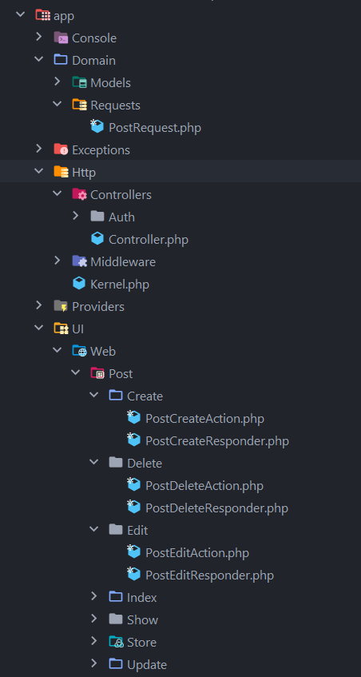

Попробуем на простых примерах научиться переделывать наши приложения из _Model-View-Controller_ в _Action-Domain-Responder_.

<!-- more -->

## Начало работы с MVC

### Структура директорий

Итак, представим, что у нас есть типичный блог на движке Laravel 8, со следующей структурой директорий:


!!! note "Примечание"

    В Laravel используется ActiveRecord для моделей, который классифицируется в первую очередь как паттерн архитектуры источника данных и только во вторую очередь как паттерн логики домена. Это достаточно распространенный паттерн, поэтому мы не будем приводить здесь его код.

!!! note "Примечание"

    О разнице между Active Record и Data Mapper можно почитать [здесь](https://www.culttt.com/2014/07/07/doctrine-2-different-eloquent/) и [здесь](https://www.culttt.com/2014/06/18/whats-difference-active-record-data-mapper/).

### Логика MVC

Вот как выглядят наши маршруты в `web.php`:

```php
<?php

Route::get('/home', [\App\Http\Controllers\PostController::class, 'index'])->name('home');
Route::get('posts/create', [\App\Http\Controllers\PostController::class, 'create']);
Route::post('posts', [\App\Http\Controllers\PostController::class, 'store']);
Route::get('posts/{post}/edit', [\App\Http\Controllers\PostController::class, 'edit']);
Route::get('posts/{post}', [\App\Http\Controllers\PostController::class, 'show']);
Route::put('posts/{post}', [\App\Http\Controllers\PostController::class, 'update']);
Route::delete('posts/{post}', [\App\Http\Controllers\PostController::class, 'destroy']);
```

Вот как выглядит наш `PostController.php`:

```php
<?php

namespace App\Http\Controllers;

use App\Models\Post;
use Illuminate\Http\Request;

class PostController extends Controller
{
    public function index()
    {
        $posts = Post::all();

        return view('posts.index', compact('posts'));
    }

    public function create()
    {
        return view('posts.create');
    }

    public function store(Request $request)
    {
        $request->validate([
            'title' => 'required',
            'body' => 'required',
        ]);

        $post = new Post();
        $post->title = $request->title;
        $post->body = $request->body;
        $post->published_at = $request->published_at;

        $post->save();

        return redirect('/home')->with('success','Post created successfully!');
    }

    public function show(Post $post)
    {
        return view('posts.show', compact('post'));
    }

    public function edit(Post $post)
    {
        return view('posts.edit', compact('post'));
    }

    public function update(Post $post, Request $request)
    {
        $request->validate([
            'title' => 'required',
            'body' => 'required',
        ]);

        $post->title = $request->title;
        $post->body = $request->body;
        $post->published_at = $request->published_at;

        $post->save();

        return redirect('/home')->with('success','Post updated successfully!');
    }

    public function destroy(Post $post)
    {
        $post->delete();

        return redirect('/home')->with('success','Post deleted successfully!');
    }
}
```

Какие проблемы мы здесь видим:

- Контроллер содержит несколько методов действий.
- Контроллер отвечает за действия, бизнес-логику и представления (3 в 1).
- Контроллер выполняет бизнес-логику на модели, а не передает бизнес-логику доменному уровню. Это представляет собой неспособность точно разделить проблемы домена.

## Рефакторинг в ADR

### Логика ADR

Целями рефакторинга являются:

- отделить логику презентации (построения ответа) от всей остальной логики;
- отделить логику домена от всей остальной логики;
- по возможности удалить всю условную логику из действий.

Эти цели дополняют и поддерживают друг друга; они могут быть достигнуты или не достигнуты по отдельности.

Ниже приведен один из возможных порядков рефакторинга. Другой набор изменений или аналогичный набор, но в другом порядке, может достичь тех же целей.

== _Некоторое время спустя_ ==

Вот как теперь выглядят наши маршруты в `web.php`:

```php
<?php

Route::get('/home', \App\UI\Web\Post\Index\PostIndexAction::class)->name('home');
Route::get('posts/create', \App\UI\Web\Post\Create\PostCreateAction::class)->middleware('auth');
Route::post('posts', \App\UI\Web\Post\Store\PostStoreAction::class)->middleware('auth');
Route::get('posts/{post}/edit', \App\UI\Web\Post\Edit\PostEditAction::class)->middleware('auth');
Route::get('posts/{post}', \App\UI\Web\Post\Show\PostShowAction::class);
Route::put('posts/{post}', \App\UI\Web\Post\Update\PostUpdateAction::class)->middleware('auth');
Route::delete('posts/{post}', \App\UI\Web\Post\Delete\PostDeleteAction::class)->middleware('auth');
```

`PostController.php` удалён, а вместо него появилось аж 14 (!) новых классов.

Создание поста:

```php
<?php

namespace App\UI\Web\Post\Create;

use App\Http\Controllers\Controller;
use Illuminate\Contracts\View\View;

final class PostCreateAction extends Controller
{
    protected PostCreateResponder $responder;

    public function __construct(PostCreateResponder $responder)
    {
        $this->responder = $responder;
    }

    public function __invoke(): View
    {
        return $this->responder->respond();
    }
}
```

```php
<?php

namespace App\UI\Web\Post\Create;

use Illuminate\Contracts\View\View;

final class PostCreateResponder
{
    public function respond(): View
    {
        return view('posts.create');
    }
}
```

Удаление поста:

```php
<?php

namespace App\UI\Web\Post\Delete;

use App\Domain\Models\Post;
use App\Http\Controllers\Controller;
use Illuminate\Http\RedirectResponse;

final class PostDeleteAction extends Controller
{
    protected PostDeleteResponder $responder;

    public function __construct(PostDeleteResponder $responder)
    {
        $this->responder = $responder;
    }

    public function __invoke(Post $post): RedirectResponse
    {
        return $this->responder->respond($post);
    }
}
```

```php
<?php

namespace App\UI\Web\Post\Delete;

use App\Domain\Models\Post;
use Illuminate\Http\RedirectResponse;

final class PostDeleteResponder
{
    public function respond(Post $post): RedirectResponse
    {
        if ($post->delete()) {
            return redirect('/home')->with('success', 'Post deleted successfully!');
        }

        return back()->with('error', 'Post not found!');
    }
}
```

Редактирование поста:

```php
<?php

namespace App\UI\Web\Post\Edit;

use App\Domain\Models\Post;
use App\Http\Controllers\Controller;
use Illuminate\Contracts\View\View;

final class PostEditAction extends Controller
{
    protected PostEditResponder $responder;

    public function __construct(PostEditResponder $responder)
    {
        $this->responder = $responder;
    }

    public function __invoke(Post $post): View
    {
        return $this->responder->respond($post);
    }
}
```

```php
<?php

namespace App\UI\Web\Post\Edit;

use App\Domain\Models\Post;
use Illuminate\Contracts\View\View;

final class PostEditResponder
{
    public function respond(Post $post): View
    {
        return view('posts.edit', compact('post'));
    }
}
```

Просмотр всех постов:

```php
<?php

namespace App\UI\Web\Post\Index;

use App\Domain\Models\Post;
use App\Http\Controllers\Controller;
use Illuminate\Contracts\View\View;

final class PostIndexAction extends Controller
{
    protected Post $post;

    protected PostIndexResponder $responder;

    public function __construct(Post $post, PostIndexResponder $responder)
    {
        $this->post = $post;
        $this->responder = $responder;
    }

    public function __invoke(): View
    {
        $posts = $this->post->all();

        return $this->responder->respond($posts);
    }
}
```

```php
<?php

namespace App\UI\Web\Post\Index;

use Illuminate\Contracts\View\View;
use Illuminate\Database\Eloquent\Collection;

final class PostIndexResponder
{
    public function respond(Collection $posts): View
    {
        return view('posts.index', compact('posts'));
    }
}
```

Просмотр отдельного поста:

```php
<?php

namespace App\UI\Web\Post\Show;

use App\Domain\Models\Post;
use App\Http\Controllers\Controller;
use Illuminate\View\View;

final class PostShowAction extends Controller
{
    protected PostShowResponder $responder;

    public function __construct(PostShowResponder $responder)
    {
        $this->responder = $responder;
    }

    public function __invoke(Post $post): View
    {
        return $this->responder->respond($post);
    }
}
```

```php
<?php

namespace App\UI\Web\Post\Show;

use App\Domain\Models\Post;
use Illuminate\View\View;

final class PostShowResponder
{
    public function respond(Post $post): View
    {
        if ($post->id) {
            return view('posts.show', compact('post'));
        }

        return view('errors.404');
    }
}
```

Сохранение нового поста:

```php
<?php

namespace App\UI\Web\Post\Store;

use App\Domain\Models\Post;
use App\Domain\Requests\PostRequest;
use App\Http\Controllers\Controller;
use Illuminate\Http\RedirectResponse;

final class PostStoreAction extends Controller
{
    protected Post $post;

    protected PostStoreResponder $responder;

    public function __construct(Post $post, PostStoreResponder $responder)
    {
        $this->post = $post;
        $this->responder = $responder;
    }

    public function __invoke(PostRequest $request): RedirectResponse
    {
        $post = $this->post->create($request->validated());

        return $this->responder->respond($post);
    }
}
```

```php
<?php

namespace App\UI\Web\Post\Store;

use App\Domain\Models\Post;
use Illuminate\Http\RedirectResponse;

final class PostStoreResponder
{
    public function respond(Post $post): RedirectResponse
    {
        if ($post->id) {
            return redirect('/home')->with('success', 'Post created successfully!');
        }

        return back()->with('error', 'Fill all required fields!');
    }
}
```

Обновление поста:

```php
<?php

namespace App\UI\Web\Post\Update;

use App\Domain\Models\Post;
use App\Domain\Requests\PostRequest;
use App\Http\Controllers\Controller;
use Illuminate\Http\RedirectResponse;

final class PostUpdateAction extends Controller
{
    protected PostUpdateResponder $responder;

    public function __construct(PostUpdateResponder $responder)
    {
        $this->responder = $responder;
    }

    public function __invoke(PostRequest $request, Post $post): RedirectResponse
    {
        $result = $post->update($request->validated());

        return $this->responder->respond($result);
    }
}
```

```php
<?php

namespace App\UI\Web\Post\Update;

use Illuminate\Http\RedirectResponse;

final class PostUpdateResponder
{
    public function respond(bool $result): RedirectResponse
    {
        if ($result) {
            return redirect('/home')->with('success', 'Post updated successfully!');
        }

        return back()->with('error', 'Unable to update this post!');
    }
}
```

!!! note "Примечание"

    Мы используем магический метод PHP `__invoke()` в качестве основного метода для вызова действия; это может быть любое другое имя метода, которое мы хотим стандартизировать.

А вот `PostRequest`, для валидации при создании и обновлении постов:

```php
<?php

namespace App\Domain\Requests;

use Illuminate\Foundation\Http\FormRequest;

final class PostRequest extends FormRequest
{
    /**
     * Determine if the user is authorized to make this request.
     *
     * @return bool
     */
    public function authorize(): bool
    {
        return auth()->check();
    }

    /**
     * Get the validation rules that apply to the request.
     *
     * @return array
     */
    public function rules(): array
    {
        return [
            'title' => 'required|string',
            'body' => 'required|string',
            'published_at' => 'date'
        ];
    }
}
```

### Структура директорий

В сравнении с MVC, структура директорий в ADR будет выглядеть более усложнённой:



Предпринятые нами действия:

- Мы извлекли каждый метод действия из `BlogController` в свой собственный класс _\*Action_ в пространстве имён, предназначенном для пользовательского веб-интерфейса.
- Мы перенесли всю работу по созданию ответа в соответствующий ответчик (_\*Responder_).
- Мы перенесли валидацию в отдельный класс `PostRequest` (логика домена).
- Мы перенесли все модели в папку `Domain` (далее можно сделать репозитории в качестве посредников между действиями и доменами).

### Результат

- каждое **Действие** делает только три вещи: собирает входные данные, вызывает домен, затем вызывает ответчика, передавая ему результат работы домена;
- код **Домена** обрабатывает всю бизнес-логику;
- код **Ответчика** обрабатывает всю логику представления.

На ваше усмотрение:

- Отрефакторить `web.php`
- Создать репозитории для работы с моделями

В таких простых проектах, как рассмотренный выше, переходить с MVC к ADR имеет смысл лишь в учебных целях, либо при разработке с нуля. Но в очень больших проектах, с мега загруженными контроллерами с кучей методов применение ADR будет оправдано как никогда.

## Материал, использованный для статьи

- [Laravel 8 Authentication using Bootstrap 4 instead of Tailwind](https://www.parthpatel.net/laravel-8-bootstrap-auth-scaffolding/) (English)
- [Laravel 8: Basic CRUD Blog Tutorial with Bootstrap](https://www.parthpatel.net/laravel-8-crud-blog-tutorial/) (English)
- [Refactoring From MVC to ADR](https://github.com/pmjones/adr/blob/master/REFACTORING.md) (English)
- [Паттерн Action-Domain-Responder](https://laravel.demiart.ru/pattern-action-domain-responder/)
