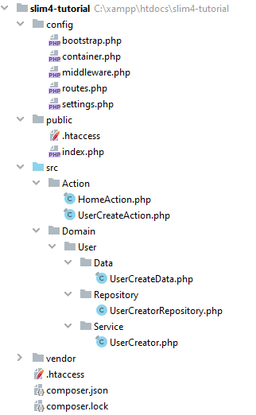
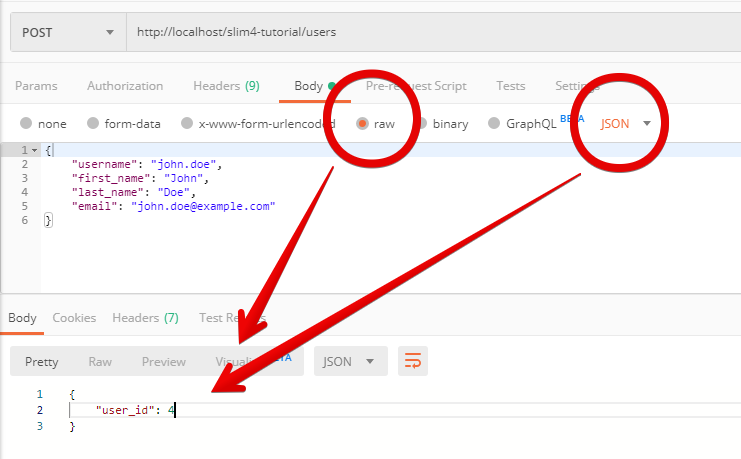

Давайте разберёмся, как работать с мощным и легким фреймворком Slim 4.

<!-- more -->


## Требования

- PHP 7.2+
- MySQL 5.7+ или MariaDB
- Веб-сервер Apache с поддержкой mod_rewrite и .htaccess
- Composer (только для разработки)

## Введение

Slim Framework — это отличный микрофреймворк для веб-приложений, RESTful API и веб-сайтов.

Наша цель — создать RESTful API с маршрутизацией, бизнес-логикой и операциями с базой данных.

Такие стандарты, как [PSR](https://www.php-fig.org/psr/) и лучшие практики очень важны и являются неотъемлемой частью этой статьи.

## Установка

Создайте новый каталог проекта и выполните эту команду для установки основных компонентов Slim 4:

```bash
composer require slim/slim:"4.*"
```

В Slim 4 реализация PSR-7 отделена от ядра App. Это означает, что вы также можете установить другие реализации PSR-7, например, [nyholm/psr7](https://github.com/Nyholm/psr7).

В нашем случае мы устанавливаем реализацию Slim PSR-7 с помощью команды:

```bash
composer require slim/psr7
```

Далее нам понадобится реализация контейнера PSR-11 для внедрения зависимостей и автовнедрения.

Выполните эту команду для установки [PHP-DI](http://php-di.org/):

```bash
composer require php-di/php-di --with-all-dependencies
```

Для тестирования мы устанавливаем [PHPUnit](https://phpunit.de/) как зависимость разработки с опцией `--dev`:

```bash
composer require phpunit/phpunit --dev
```

Отлично, теперь мы установили самые основные зависимости для нашего проекта. Позже мы добавим больше.

!!! note "Примечание"

    Пожалуйста, не фиксируйте `vendor/` в вашем git-репозитории. Чтобы правильно настроить git-репозиторий, создайте файл с именем `.gitignore` в корневой папке проекта и добавьте в этот файл следующие строки:

    ```
    vendor/
    .idea/
    ```

## Структура каталогов

Хорошая структура каталогов помогает упорядочить код, упрощает установку на веб-сервер и повышает безопасность всего приложения.

Создайте следующую структуру каталогов в корневом каталоге вашего проекта:

```
.
├── config/             Файлы конфигурации
├── public/             Файлы веб-сервера (DocumentRoot)
│   └── .htaccess       Правила перенаправления Apache для фронт-контроллера
│   └── index.php       Фронт-контроллер
├── templates/          Шаблоны Twig
├── src/                Наш код (пространство имён App)
├── tmp/                Временные файлы (кэш и логи)
├── vendor/             Директория для зависимостей Composer
├── .htaccess           Внутренний редирект на папку public/
├── .gitignore          Правила игнорирования Git
└── composer.json       Зависимости проекта и автозагрузчик
```

В веб-приложении важно различать публичные и непубличные области.

Каталог `public/` обслуживает ваше приложение и поэтому также будет напрямую доступен всем браузерам, поисковым системам и клиентам API. Все остальные папки не являются общедоступными и не должны быть доступны в Интернете. Это можно сделать, определив папку `public` в Apache как `DocumentRoot` вашего сайта. Но об этом подробнее позже.

## Автозагрузка PSR-4

Одна из самых основных и важных вещей — иметь работающий автозагрузчик PSR-4. Для следующих шагов мы должны определить каталог `src/` как корневой для пространства имен `\App`.

Добавьте эти настройки автозагрузки в `composer.json`:

```json
"autoload": {
    "psr-4": {
        "App\\": "src/"
    }
},
"autoload-dev": {
    "psr-4": {
        "App\\Test\\": "tests/"
    }
}
```

Полный файл `composer.json` должен выглядеть следующим образом:

```json
{
  "require": {
    "slim/slim": "4.*",
    "slim/psr7": "^1.5",
    "php-di/php-di": "^6.3"
  },
  "require-dev": {
    "phpunit/phpunit": "^9.5"
  },
  "autoload": {
    "psr-4": {
      "App\\": "src/"
    }
  },
  "autoload-dev": {
    "psr-4": {
      "App\\Test\\": "tests/"
    }
  },
  "config": {
    "process-timeout": 0,
    "sort-packages": true
  }
}
```

## Перезапись URL-адресов

Чтобы запустить Slim-приложение с помощью Apache, мы должны добавить правила перезаписи адресов для перенаправления веб-трафика на так называемый [фронт-контроллер](<https://ru.wikipedia.org/wiki/%D0%95%D0%B4%D0%B8%D0%BD%D0%B0%D1%8F_%D1%82%D0%BE%D1%87%D0%BA%D0%B0_%D0%B2%D1%85%D0%BE%D0%B4%D0%B0_(%D1%88%D0%B0%D0%B1%D0%BB%D0%BE%D0%BD_%D0%BF%D1%80%D0%BE%D0%B5%D0%BA%D1%82%D0%B8%D1%80%D0%BE%D0%B2%D0%B0%D0%BD%D0%B8%D1%8F)>).

Фронт-контроллер — это просто файл `index.php` и точка входа в приложение.

- Создайте директорию: `public/`
- Создайте файл `.htaccess` в директории `public/` и скопируйте/вставьте это содержимое:

```
## Redirect to front controller
RewriteEngine On
## RewriteBase /
RewriteCond %{REQUEST_FILENAME} !-d
RewriteCond %{REQUEST_FILENAME} !-f
RewriteRule ^ index.php [QSA,L]
```

Пожалуйста, не изменяйте директиву `RewriteRule`. Она должна быть точно такой, как показано выше.

Создайте второй файл `.htaccess` в корневом каталоге вашего проекта и скопируйте/вставьте это содержимое:

```
RewriteEngine on
RewriteRule ^$ public/ [L]
RewriteRule (.*) public/$1 [L]
```

Не пропускайте этот шаг. Этот второй файл `.htaccess` важен для запуска вашего приложения Slim в подкаталоге и в среде разработки.

!!! note "Примечание"

    Для настройки перезаписи адресов на других серверах см. [документацию](https://www.slimframework.com/docs/v4/start/web-servers.html).

Создайте фронт-контроллер `public/index.php` и скопируйте/вставьте это содержимое:

```php
<?php

(require __DIR__ . '/../config/bootstrap.php')->run();
```

Фронт-контроллер является точкой входа в ваше slim-приложение и обрабатывает все запросы, направляя их через один объект-обработчик.

## Конфигурация

Каталог для всех файлов конфигурации: `config/`

Файл `config/settings.php` является основным конфигурационным файлом и объединяет настройки по умолчанию с настройками, специфичными для среды.

- Создайте каталог: `config/`
- Создайте конфигурационный файл `config/settings.php` и скопируйте/вставьте в него это содержимое:

```php
<?php

// Необходимо установить 0 для рабочего режима
error_reporting(E_ALL);

// Необходимо установить '0' для рабочего режима
ini_set('display_errors', '1');

// Часовой пояс
date_default_timezone_set('Europe/Moscow');

// Настройки
$settings = [];

// Настройки пути
$settings['root'] = dirname(__DIR__);

// Настройки посредников для обработки ошибок
$settings['error'] = [

    // Необходимо установить false для рабочего режима
    'display_error_details' => true,

    // Параметр передается в обработчик ошибок по умолчанию
    // Просмотр в сгенерированном выводе, включив настройку "displayErrorDetails".
    // Для консоли и модульных тестов мы также отключаем это
    'log_errors' => true,

    // Отображение подробностей ошибки в журнале ошибок
    'log_error_details' => true,
];

return $settings;
```

### Запуск

Сценарий входа загружает конфигурацию, внедряет зависимости и создает приложение для дальнейшей обработки запроса.

Создайте файл bootstrap `config/bootstrap.php` и скопируйте/вставьте это содержимое:

```php
<?php

use DI\ContainerBuilder;
use Slim\App;

require_once __DIR__ . '/../vendor/autoload.php';

$containerBuilder = new ContainerBuilder();

// Устанавливаем настройки
$containerBuilder->addDefinitions(__DIR__ . '/container.php');

// Создаём экземпляр контейнера PHP-DI
$container = $containerBuilder->build();

// Создаём экземпляр App
$app = $container->get(App::class);

// Регистрируем маршруты
(require __DIR__ . '/routes.php')($app);

// Регистрируем посредники
(require __DIR__ . '/middleware.php')($app);

return $app;
```

### Настройка маршрутизации

Создайте файл для всех маршрутов `config/routes.php` и скопируйте/вставьте это содержимое:

```php
<?php

use Slim\App;

return function (App $app) {
    // пусто
};
```

## Middleware (посредники)

### Что ещё за посредники?

Это классы, которые могут выполняться ДО и ПОСЛЕ вашего Slim-приложения для манипулирования объектами запроса и ответа в соответствии с вашими требованиями.

[Читать далее](https://www.slimframework.com/docs/v4/concepts/middleware.html)

### Посредники для маршрутизации и ошибок

Создайте файл для загрузки глобального обработчика посредников `config/middleware.php` и скопируйте/вставьте это содержимое:

```php
<?php

use Slim\App;
use Slim\Middleware\ErrorMiddleware;

return function (App $app) {
    // Парсим json, данные формы и xml
    $app->addBodyParsingMiddleware();

    // Добавляем встроенных посредников маршрутизации Slim
    $app->addRoutingMiddleware();

    // Отлавливаем исключения и ошибки
    $app->add(ErrorMiddleware::class);
};
```

## Контейнер

### Краткое руководство по контейнеру

[Внедрение зависимостей](https://ru.wikipedia.org/wiki/%D0%92%D0%BD%D0%B5%D0%B4%D1%80%D0%B5%D0%BD%D0%B8%D0%B5_%D0%B7%D0%B0%D0%B2%D0%B8%D1%81%D0%B8%D0%BC%D0%BE%D1%81%D1%82%D0%B8) — это передача зависимостей другим объектам. Внедрение зависимостей облегчает тестирование. Внедрение может быть выполнено через конструктор.

**Контейнер внедрения зависимостей** (он же IoC-контейнер) — это инструмент для внедрения зависимостей.

!!! note "Примечание"

    **Общее правило**: Основное приложение не должно использовать контейнер. Встраивание контейнера в класс — это **антипаттерн**. Вы должны явно объявить все зависимости класса в конструкторе.

Почему внедрение контейнера (в большинстве случаев) является антипаттерном?

В Slim 3 [локатор служб](https://blog.ploeh.dk/2010/02/03/ServiceLocatorisanAnti-Pattern/) (антипаттерн) был «стилем» по умолчанию для внедрения всего контейнера ([Pimple](https://github.com/silexphp/Pimple)) и получения зависимостей из него. Однако есть и следующие недостатки:

- Локатор служб (антипаттерн) скрывает фактические зависимости вашего класса.
- Локатор служб (антипаттерн) также нарушает принцип [инверсии управления](https://ru.wikipedia.org/wiki/%D0%98%D0%BD%D0%B2%D0%B5%D1%80%D1%81%D0%B8%D1%8F_%D1%83%D0%BF%D1%80%D0%B0%D0%B2%D0%BB%D0%B5%D0%BD%D0%B8%D1%8F) (IoC) [SOLID](<https://ru.wikipedia.org/wiki/SOLID_(%D0%BE%D0%B1%D1%8A%D0%B5%D0%BA%D1%82%D0%BD%D0%BE-%D0%BE%D1%80%D0%B8%D0%B5%D0%BD%D1%82%D0%B8%D1%80%D0%BE%D0%B2%D0%B0%D0%BD%D0%BD%D0%BE%D0%B5_%D0%BF%D1%80%D0%BE%D0%B3%D1%80%D0%B0%D0%BC%D0%BC%D0%B8%D1%80%D0%BE%D0%B2%D0%B0%D0%BD%D0%B8%D0%B5)>).

В: Как сделать правильно?

О: Используйте [композицию вместо наследования](https://github.com/intaro/php-course/blob/master/docs/15.-%D0%9E%D0%B1%D1%8A%D0%B5%D0%BA%D1%82%D0%BD%D0%BE-%D0%BE%D1%80%D0%B8%D0%B5%D0%BD%D1%82%D0%B8%D1%80%D0%BE%D0%B2%D0%B0%D0%BD%D0%BD%D0%BE%D0%B5-%D0%BF%D1%80%D0%BE%D0%B3%D1%80%D0%B0%D0%BC%D0%BC%D0%B8%D1%80%D0%BE%D0%B2%D0%B0%D0%BD%D0%B8%D0%B5.md#159-%D0%BD%D0%B0%D1%81%D0%BB%D0%B5%D0%B4%D0%BE%D0%B2%D0%B0%D0%BD%D0%B8%D0%B5-vs-%D0%BA%D0%BE%D0%BC%D0%BF%D0%BE%D0%B7%D0%B8%D1%86%D0%B8%D1%8F-%D0%B8-%D0%B0%D0%B3%D0%B3%D1%80%D0%B5%D0%B3%D0%B0%D1%86%D0%B8%D1%8F) и внедрение зависимостей через конструкторы.

Начиная с Slim 4 вы можете использовать современные инструменты, такие как [PHP-DI][php-di] с потрясающей функцией автовнедрения ([autowire](http://php-di.org/doc/autowiring.html)). Это означает, что можно явно объявить все зависимости в вашем конструкторе и позволить DIC внедрить эти зависимости за вас.

Для большей ясности: композиция не имеет ничего общего с функцией «автовнедрения» DIC. Вы можете использовать композицию с чистыми классами, без контейнера или чего-либо ещё. Функция «автовнедрения» просто использует классы [PHP Reflection](https://www.php.net/manual/ru/book.reflection.php) для автоматического разрешения и внедрения зависимостей.

### Определения контейнеров

Slim 4 использует контейнер внедрения зависимостей для подготовки, управления и внедрения зависимостей приложения.

Вы можете добавить любую контейнерную библиотеку, которая реализует интерфейс [PSR-11](https://www.php-fig.org/psr/psr-11/).

Создайте новый файл для записей контейнера `config/container.php` и скопируйте/вставьте это содержимое:

```php
<?php

use Psr\Container\ContainerInterface;
use Psr\Http\Message\ResponseFactoryInterface;
use Slim\App;
use Slim\Factory\AppFactory;
use Slim\Middleware\ErrorMiddleware;

return [
    'settings' => function () {
        return require __DIR__ . '/settings.php';
    },

    App::class => function (ContainerInterface $container) {
        AppFactory::setContainer($container);

        return AppFactory::create();
    },

    ResponseFactoryInterface::class => function (ContainerInterface $container) {
        return $container->get(App::class)->getResponseFactory();
    },

    ErrorMiddleware::class => function (ContainerInterface $container) {
        $app = $container->get(App::class);
        $settings = $container->get('settings')['error'];

        return new ErrorMiddleware(
            $app->getCallableResolver(),
            $app->getResponseFactory(),
            (bool) $settings['display_error_details'],
            (bool) $settings['log_errors'],
            (bool) $settings['log_error_details']
        );
    },

];
```

## Базовый путь

Большинство людей получат **ошибку 404 (Not Found)**, потому что basePath установлен неправильно.

Если вы запускаете свое приложение Slim из подкаталога, а не непосредственно из корня ([DocumentRoot](https://httpd.apache.org/docs/2.4/en/mod/core.html#documentroot)) вашего веб-сервера, вы должны установить «правильный» базовый путь.

В идеале `DocumentRoot` вашего рабочего сервера указывает непосредственно на каталог `public/`.

Во всех остальных случаях вы должны убедиться, что ваш базовый путь правильный. Например, каталог DocumentRoot — `/var/www/domain.com/htdocs/`, но приложение хранится в каталоге `/var/www/domain.com/htdocs/my-app/`, тогда вам нужно установить `/my-app` в качестве базового пути.

Если быть более точным: в данном контексте «подкаталог» означает подкаталог проекта, а не каталог `public/`. Например, когда вы размещаете свое приложение не в корне сайта.

В целях безопасности вы всегда должны помещать свой фронт-контроллер (index.php) в каталог `public/`. Не помещайте ваш фронт-контроллер в корневой каталог проекта.

Вы можете вручную установить базовый путь в Slim с помощью метода `setBasePath`:

```php
$app->setBasePath('/slim4-tutorial');
```

Но проблема в том, что basePath может быть разным для каждого хоста (dev, testing, staging, prod и т. д.).

[BasePathMiddleware](https://github.com/selective-php/basepath) определяет и устанавливает базовый путь в экземпляре приложения Slim.

Чтобы установить BasePathMiddleware, выполните команду:

```bash
composer require selective/basepath
```

Добавьте следующее определение контейнера в `config/container.php`:

```
use Selective\BasePath\BasePathMiddleware;
// ...

return [
    // ...

    BasePathMiddleware::class => function (ContainerInterface $container) {
        return new BasePathMiddleware($container->get(App::class));
    },
];
```

Затем добавьте `BasePathMiddleware::class` в конвейер посредников в `config/middleware.php`:

```php
<?php

use Selective\BasePath\BasePathMiddleware;
use Slim\App;
use Slim\Middleware\ErrorMiddleware;

return function (App $app) {
    // Парсим json, данные формы и xml
    $app->addBodyParsingMiddleware();

    // Добавляем встроенных посредников маршрутизации Slim
    $app->addRoutingMiddleware();

    $app->add(BasePathMiddleware::class); // <--- сюда

    // Отлавливаем исключения и ошибки
    $app->add(ErrorMiddleware::class);
};
```

Теперь, когда вы установили `BasePathMiddleware`, удалите эту строку (если она существует): `$app->setBasePath('...');`.

## Ваш первый маршрут

Откройте файл `config/routes.php` и вставьте код для первого маршрута:

```php
<?php

use Psr\Http\Message\ResponseInterface;
use Psr\Http\Message\ServerRequestInterface;
use Slim\App;

return function (App $app) {
    $app->get('/', function (ServerRequestInterface $request, ResponseInterface $response) {
        $response->getBody()->write('Привет, мир!');
        return $response;
    });
};
```

Теперь откройте свой веб-сайт, например `http://localhost` и вы должны увидеть сообщение `Привет, мир!`

## Хорошие URL-адреса

!!! note "Примечание"

    Директория `public/` является только `DocumentRoot` вашего веб-сервера, но никогда не является частью базового пути и официального url.

Хорошие URL-адреса:

```
https://www.example.com
https://www.example.com/users
httsp://www.example.com/my-app
https://www.example.com/my-app/users
```

Плохие URL-адреса:

```
https://www.example.com/public
https://www.example.com/public/users
https://www.example.com/my-app/public
https://www.example.com/my-app/public/users
```

## Действия

Slim предоставляет некоторые методы для добавления логики контроллера непосредственно в обратный вызов маршрута. Объект запроса PSR-7 внедряется в маршруты вашего приложения Slim в качестве первого аргумента обратного вызова маршрута следующим образом:

```php
<?php

use Psr\Http\Message\ResponseInterface;
use Psr\Http\Message\ServerRequestInterface;

// ...

$app->get('/hello', function (ServerRequestInterface $request, ResponseInterface $response) {
    $response->getBody()->write('Привет, мир!');
    return $response;
});
```

Хотя такие интерфейсы выглядят интуитивно понятными, они не подходят для сложных сценариев бизнес-логики. Предположим, что существуют десятки или даже сотни обработчиков маршрутов, которые необходимо зарегистрировать. Если только ваша логика не очень проста, я не рекомендую использовать обратные вызовы маршрутов. Не лучше ли реализовать эти обработчики в собственных классах? Да. Именно в этот момент в игру вступает **контроллер одиночного действия**.

Каждый **контроллер одиночного действия** представлен собственным классом.

_Действие_ делает только эти вещи:

- Собирает входные данные из HTTP-запроса (если необходимо)
- Вызывает **Домен** с этими входными данными (если требуется) и сохраняет результат
- Создает HTTP-ответ (обычно с результатами вызова домена).

Вся остальная логика, включая все формы валидации ввода, обработки ошибок и так далее, таким образом, выводится из _Действия_ в **Домен** (для логики домена) или в рендерер ответа (для логики представления).

Ответ может быть преобразован в HTML (например, с помощью Twig) для стандартного веб-запроса; или это может быть что-то вроде JSON для запросов RESTful API.

!!! note "Примечание"

    [Замыкания](https://www.php.net/manual/ru/class.closure.php) как обработчики маршрутизации довольно «дороги», потому что PHP должен создавать все замыкания для каждого запроса. Использование имён классов является более легким, быстрым и лучше масштабируется для больших приложений.

Более подробную информацию о потоке всего, что происходит при прокладке маршрута, и о взаимодействии между различными уровнями можно найти [здесь](https://odan.github.io/slim4-skeleton/action.html).

- Создайте подкаталог: `src/Action`
- Создайте этот класс действия в: `src/Action/HomeAction.php`

```php
<?php

namespace App\Action;

use Psr\Http\Message\ResponseInterface;
use Psr\Http\Message\ServerRequestInterface;

final class HomeAction
{
    public function __invoke(
        ServerRequestInterface $request,
        ResponseInterface $response
    ): ResponseInterface {
        $response->getBody()->write('Привет, мир!');

        return $response;
    }
}
```

Затем откройте `config/routes.php` и замените замыкание маршрута для `/` на эту строку:

```
$app->get('/', \App\Action\HomeAction::class)->setName('home');
```

Теперь полный `config/routes.php` должен выглядеть следующим образом:

```php
<?php

use Slim\App;

return function (App $app) {
    $app->get('/', \App\Action\HomeAction::class)->setName('home');
};
```

Теперь откройте свой веб-сайт, например `http://localhost` и вы должны увидеть сообщение `Привет, мир!`

### Формирование JSON в качестве ответа

Чтобы создать правильный JSON-ответ, вы можете записать строку в формате JSON в тело ответа и установить заголовок `Content-Type` как `application/json`:

```php
<?php

namespace App\Action;

use Psr\Http\Message\ResponseInterface;
use Psr\Http\Message\ServerRequestInterface;

final class HomeAction
{
    public function __invoke(
        ServerRequestInterface $request,
        ResponseInterface $response
    ): ResponseInterface {
        $response->getBody()->write(json_encode(['success' => true]));

        return $response->withHeader('Content-Type', 'application/json');
    }
}
```

Откройте свой веб-сайт, например `http://localhost` и вы должны увидеть ответ JSON `{"success":true}`.

Чтобы изменить код HTTP-статуса, просто используйте метод `$response->withStatus(x)`. Пример:

```php
$result = ['error' => ['message' => 'Validation failed']];

$response->getBody()->write(json_encode($result));

return $response
    ->withHeader('Content-Type', 'application/json')
    ->withStatus(422);
```

## Домен

Забудьте о CRUD! Ваш API должен отражать [сценарии использования](https://blog.cleancoder.com/uncle-bob/2012/08/13/the-clean-architecture.html) в бизнесе, а не технические «операции с базой данных» аля [CRUD](https://ru.wikipedia.org/wiki/CRUD). Не вкладывайте бизнес-логику в действия. Действие вызывает уровень домена, т. е. обслуживание. Если вы хотите повторно использовать ту же логику в другом действии, то просто вызовите нужный вам сервис в своем действии.

### Сервисы

Домен — это место для сложной [бизнес-логики](https://ru.wikipedia.org/wiki/%D0%91%D0%B8%D0%B7%D0%BD%D0%B5%D1%81-%D0%BB%D0%BE%D0%B3%D0%B8%D0%BA%D0%B0).

Вместо того чтобы помещать логику в гигантские (толстые) «Модели», мы помещаем её в меньшие, специализированные классы **Сервисов**.

Сервис предоставляет конкретную функциональность или набор функциональных возможностей, таких как поиск определённой информации или выполнение набора операций, чтобы различные клиенты могли повторно использовать его для различных целей.

Для одного сервиса может быть несколько клиентов, например: действие (запрос), другой сервис, CLI (консоль) и среда юнит-тестирования (phpunit).

!!! note "Примечание"

    Класс сервиса не является классом типа «Менеджер» или «Утилита».

Каждый класс сервиса должен иметь только одну ответственность, например, для перевода денег из пункта А в пункт Б, и не более.

Отделите **данные** от **поведения**, используя сервисы для поведения и [DTO](https://ru.wikipedia.org/wiki/DTO) для данных.

Каталог для всех (доменных) модулей и подмодулей: `src/Domain`

Поместите следующий код в класс сервиса `src/Domain/User/Service/UserCreator.php`:

```php
<?php

namespace App\Domain\User\Service;

use App\Domain\User\Repository\UserCreatorRepository;
use App\Exception\ValidationException;

/**
 * Сервис
 */
final class UserCreator
{
    /**
     * @var UserCreatorRepository
     */
    private $repository;

    /**
     * Конструктор
     *
     * @param UserCreatorRepository $repository The repository
     */
    public function __construct(UserCreatorRepository $repository)
    {
        $this->repository = $repository;
    }

    /**
     * Создаем нового пользователя
     *
     * @param array $data Данные формы
     *
     * @return int ID пользователя
     */
    public function createUser(array $data): int
    {
        // Валидируем ввод
        $this->validateNewUser($data);

        // Добавляем новую запись в таблицу
        $userId = $this->repository->insertUser($data);

        // Лог: Пользователь успешно создан
        //$this->logger->info(sprintf('Пользователь успешно создан: %s', $userId));

        return $userId;
    }

    /**
     * Валидация ввода
     *
     * @param array $data Данные формы
     *
     * @throws ValidationException
     *
     * @return void
     */
    private function validateNewUser(array $data): void
    {
        $errors = [];

        // Здесь вы также можете использовать предпочитаемую библиотеку для валидации

        if (empty($data['username'])) {
            $errors['username'] = 'Поле обязательно';
        }

        if (empty($data['email'])) {
            $errors['email'] = 'Поле обязательно';
        } elseif (filter_var($data['email'], FILTER_VALIDATE_EMAIL) === false) {
            $errors['email'] = 'Неверный имейл';
        }

        if ($errors) {
            throw new ValidationException('Проверьте вводимые данные', $errors);
        }
    }
}
```

Взгляните на **конструктор**! Вы можете видеть, что мы объявили `UserCreatorRepository` как зависимость, потому что служба может взаимодействовать с базой данных только через репозиторий.

### Валидация

Для проверки ввода данных клиентами мы должны проверить данные и собрать все ошибки в коллекцию (массив) ошибок. Этот шаблон называется [шаблоном уведомления](https://martinfowler.com/articles/replaceThrowWithNotification.html).

Создайте файл `src/Exception/ValidationException.php` и скопируйте/вставьте это содержимое:

```php
<?php

namespace App\Exception;

use RuntimeException;
use Throwable;

final class ValidationException extends RuntimeException
{
    private $errors;

    public function __construct(
        string $message,
        array $errors = [],
        int $code = 422,
        Throwable $previous = null
    ){
        parent::__construct($message, $code, $previous);

        $this->errors = $errors;
    }

    public function getErrors(): array
    {
        return $this->errors;
    }
}
```

Если вам нравится этот шаблон для валидации, рекомендую взглянуть на библиотеку [selective/validation](https://github.com/selective-php/validation)

### Репозитории

Репозиторий отвечает за логику доступа к данным, связь с базой данных.

Существует два типа репозиториев: репозитории, ориентированные на коллекцию и репозитории, ориентированные на постоянство. В данном случае мы говорим о **репозиториях, ориентированных на постоянство**, поскольку они лучше подходят для обработки больших объёмов данных.

Репозиторий является источником всех данных, необходимых вашему приложению, и является посредником между службой и базой данных. Репозиторий повышает удобство обслуживания, тестирования и чтения кода, отделяя **бизнес-логику** от **логики доступа к данным**, и обеспечивает централизованное управление и согласованные правила доступа к источнику данных. Каждый метод публичного репозитория представляет собой запрос. Возвращаемые значения представляют собой набор результатов запроса и могут быть примитивами/объектами или их списками (массивами). Транзакции базы данных должны обрабатываться на более высоком уровне (сервис), а не в репозитории.

### Создание репозитория

Для этого руководства нам понадобится тестовая база данных с таблицей `users`. Пожалуйста, выполните этот SQL-запрос в вашей тестовой базе данных:

```sql
CREATE TABLE `users` (
  `id` int(11) NOT NULL AUTO_INCREMENT,
  `username` varchar(255) COLLATE utf8mb4_unicode_ci DEFAULT NULL,
  `email` varchar(255) COLLATE utf8mb4_unicode_ci DEFAULT NULL,
  `first_name` varchar(255) COLLATE utf8mb4_unicode_ci DEFAULT NULL,
  `last_name` varchar(255) COLLATE utf8mb4_unicode_ci DEFAULT NULL,
  PRIMARY KEY (`id`),
  UNIQUE KEY `username` (`username`)
) ENGINE=InnoDB DEFAULT CHARSET=utf8mb4 COLLATE=utf8mb4_unicode_ci;
```

Добавьте настройки базы данных в `config/settings.php`:

```php
// Настройки базы данных
$settings['db'] = [
    'driver' => 'mysql',
    'host' => 'localhost',
    'username' => 'root',
    'database' => 'test',
    'password' => '',
    'charset' => 'utf8mb4',
    'collation' => 'utf8mb4_unicode_ci',
    'flags' => [
        // Отключаем постоянные соединения
        PDO::ATTR_PERSISTENT => false,
        // Включаем исключения
        PDO::ATTR_ERRMODE => PDO::ERRMODE_EXCEPTION,
        // Эмулируем подготовленные выражения
        PDO::ATTR_EMULATE_PREPARES => true,
        // Устанавливаем режим выборки по умолчанию на массив
        PDO::ATTR_DEFAULT_FETCH_MODE => PDO::FETCH_ASSOC,
        // Устанавливаем кодировку символов по умолчанию
        PDO::MYSQL_ATTR_INIT_COMMAND => 'SET NAMES utf8mb4 COLLATE utf8mb4_unicode_ci'
    ],
];
```

!!! note "Примечание"

    Я использую PDO и SQL здесь только в учебных целях. В реальном приложении было бы рекомендовано использование SQL QuickBuilder, с точки зрения удобства обслуживания и безопасности.

Вставьте определение контейнера `PDO::class` в `config/container.php`:

```php
PDO::class => function (ContainerInterface $container) {
    $settings = $container->get('settings')['db'];

    $host = $settings['host'];
    $dbname = $settings['database'];
    $username = $settings['username'];
    $password = $settings['password'];
    $charset = $settings['charset'];
    $flags = $settings['flags'];
    $dsn = "mysql:host=$host;dbname=$dbname;charset=$charset";

    return new PDO($dsn, $username, $password, $flags);
},
```

С этого момента PHP-DI всегда будет внедрять один и тот же экземпляр PDO, как только мы объявим PDO в конструкторе как зависимость.

Следующий класс Repository использует [паттерн Data Mapper](https://designpatternsphp.readthedocs.io/ru/latest/Structural/DataMapper/README.html) («Преобразователь данных»). Преобразователь данных — это уровень доступа к данным, который выполняет двунаправленную передачу данных между постоянным хранилищем данных (часто реляционной базой данных) и представлением данных в памяти (уровень домена). Цель паттерна — сохранить представление в памяти и постоянное хранилище данных независимыми друг от друга и от самого устройства отображения данных.

Общие преобразователи будут работать с множеством различных типов доменных сущностей, а специальные преобразователи — с одним или несколькими.

Ключевым моментом этого паттерна является то, что, в отличие от паттерна Active Record («Активная запись»), модель данных следует принципу единой ответственности.

Создайте новый каталог: `src/Domain/User/Repository`

Создайте файл: `src/Domain/User/Repository/UserCreatorRepository.php` и вставьте это содержимое:

```php
<?php

namespace App\Domain\User\Repository;

use PDO;

/**
 * Репозиторий
 */
final class UserCreatorRepository
{
    /**
     * @var PDO Соединение с базой данных
     */
    private $connection;

    /**
     * Constructor.
     *
     * @param PDO $connection Соединение с базой данных
     */
    public function __construct(PDO $connection)
    {
        $this->connection = $connection;
    }

    /**
     * Вставка новой записи о пользователе
     *
     * @param array $user Пользователь
     *
     * @return int ID пользователя
     */
    public function insertUser(array $user): int
    {
        $row = [
            'username' => $user['username'],
            'first_name' => $user['first_name'],
            'last_name' => $user['last_name'],
            'email' => $user['email'],
        ];

        $sql = "INSERT INTO users SET
                username=:username,
                first_name=:first_name,
                last_name=:last_name,
                email=:email;";

        $this->connection->prepare($sql)->execute($row);

        return (int)$this->connection->lastInsertId();
    }
}
```

Обратите внимание, что мы объявили `PDO` как зависимость, потому что репозиторий требует подключения к базе данных.

Последняя часть заключается в регистрации нового маршрута для `POST /users`.

Создайте новый класс действия в `src/Action/UserCreateAction.php`:

```php
<?php

namespace App\Action;

use App\Domain\User\Service\UserCreator;
use Psr\Http\Message\ResponseInterface;
use Psr\Http\Message\ServerRequestInterface;

final class UserCreateAction
{
    private $userCreator;

    public function __construct(UserCreator $userCreator)
    {
        $this->userCreator = $userCreator;
    }

    public function __invoke(
        ServerRequestInterface $request,
        ResponseInterface $response
    ): ResponseInterface {
        // Собираем входные данные из HTTP-запроса
        $data = (array) $request->getParsedBody();

        // Вызываем домен с помощью входных данных и сохраняем результат
        $userId = $this->userCreator->createUser($data);

        // Преобразовываем результат в представление JSON
        $result = [
            'user_id' => $userId
        ];

        // Создаём HTTP-ответ
        $response->getBody()->write((string) json_encode($result));

        return $response
            ->withHeader('Content-Type', 'application/json')
            ->withStatus(201);
    }
}
```

В этом примере мы создаем «барьер» между исходными и выходными данными, чтобы изменения схемы не влияли на клиентов. Для простоты это делается тем же методом. В действительности, вы должны разделить отображение входных данных и преобразование выходного JSON в отдельные части вашего приложения.

Добавьте новый маршрут в `config/routes.php`:

```php
$app->post('/users', \App\Action\UserCreateAction::class);
```

Полная структура проекта должна выглядеть следующим образом:



Теперь вы можете протестировать работу маршрута `POST /users` с помощью [Postman](https://www.getpostman.com/).

В случае успеха результат должен выглядеть следующим образом:



## Развёртывание

Для развёртывания на рабочем сервере необходимо учесть некоторые важные настройки и моменты, связанные с безопасностью.

Вы можете использовать Composer для создания оптимизированной сборки вашего приложения. Все dev-зависимости следует удалить, а автозагрузчик Composer оптимизировать для повышения производительности.

Выполните эту команду в том же каталоге, что и файл `composer.json` проекта:

```bash
composer install --no-dev --optimize-autoloader
```

Вам не обязательно запускать Composer на своем рабочем сервере. Вместо этого вы должны реализовать [конвейер сборки](https://www.amazon.com/dp/B003YMNVC0), который создает так называемый «артефакт». Артефакт — это ZIP-файл, который можно загрузить и развернуть на рабочем сервере.

Эти инструменты очень полезны для автоматизации процессов сборки программного обеспечения:

- [Apache Ant](https://ant.apache.org/bindownload.cgi) — похож на Make, но реализован на языке Java.
- [Phing](https://www.phing.info/) — инструмент для сборки PHP, вдохновленный Apache Ant.

По соображениям безопасности, вы должны отключить вывод всех подробностей об ошибках:

```php
$settings['error']['display_error_details'] = false;
```

!!! note "Примечание"

    Обязательно установите Apache `DocumentRoot` в каталог `public/`. В противном случае может случиться так, что кто-то другой сможет получить доступ к внутренним файлам из Интернета. [Подробнее](https://www.digitalocean.com/community/tutorials/how-to-move-an-apache-web-root-to-a-new-location-on-ubuntu-16-04)

```ini
/etc/apache2/sites-enabled/000-default.conf
```

```ini
DocumentRoot /var/www/example.com/htdocs/public
```

!!! note "Примечание"

    Никогда не храните секретные пароли в репозитории Git/SVN. Вместо этого вы можете хранить их в файле типа `env.php` и разместить этот файл на один каталог выше каталога вашего приложения.

Пример:

```ini
/var/www/example.com/env.php
```

## Заключение

Итак, делаем выводы:

- Slim — Для обработки маршрутизации и диспетчеризации.
- Контроллеры одиночного действия — обработка запросов и ответов. Вызов домена (сервисный метод).
- Домен - Основной слой вашего приложения.
- Сервисы - Для обработки бизнес-логики.
- Репозитории - Для выполнения запросов к базе данных.

Исходный код с большим количеством примеров (например, чтение пользователя) можно найти здесь: [https://github.com/odan/slim4-tutorial](https://github.com/odan/slim4-tutorial)

Полный каркас для Slim 4 можно найти здесь: [https://github.com/odan/slim4-skeleton](https://github.com/odan/slim4-skeleton)

### Поддержка

Для технических вопросов создайте заявку здесь:

- [https://github.com/odan/slim4-tutorial/issues](https://github.com/odan/slim4-tutorial/issues)

Если у вас есть вопросы по Slim-Framework, посетите сайт:

- [https://discourse.slimframework.com/](https://discourse.slimframework.com/)

[Оригинальная статья](https://odan.github.io/2019/11/05/slim4-tutorial.html) (English)

[php-di]: http://php-di.org/
