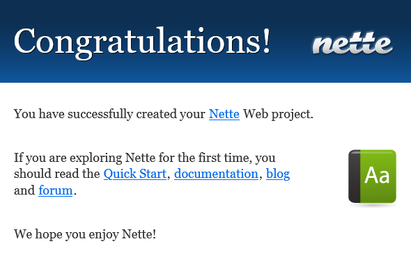

В этом туториале мы научимся создавать блог на малоизвестном у нас фреймворке — [Nette](https://nette.org).

<!-- more -->

## Требования

- PHP 7.4+
- MySQL 5.7+ или MariaDB
- Веб-сервер Apache с поддержкой mod_rewrite и .htaccess
- Composer (только для разработки)

## Установка фреймворка

Выполним в консоли следующую команду:

```bash
composer create-project nette/web-project nette-blog
```

Файлы фреймворка будут загружены в каталог `nette-blog`.

Далее запустите встроенный сервер, с помощью команды `php -S localhost:8000 -t www`.

Теперь можно увидеть приветственную страницу приложения, перейдя в браузере по адресу `http://localhost:8000`.



!!! note "Примечание"

    Если вы разрабатываете на Open Server, укажите в настройках панели на вкладке «Домены» для сайта, с которым вы работаете, папку домена `wwww`. Например, если сайт находится в папке `nette.test`, то имя домена совпадает с названием папки, а папка домена — `\nette.test\wwww`. После этого при посещении сайта будет сразу открываться главная страница, без необходимости добавлять `/wwww/` в адресе.

Как вы уже наверное догадались, папка `www` — публичная папка проекта (как `public` в Laravel). Все остальные директории не должны быть доступны извне.

Сейчас же мы начнём работать с папкой `app`, в которой хранятся файлы презентеров, шаблоны, маршруты (роуты) и ключевой файл — Bootstrap.php, загружающий фреймворк (откройте этот файл и укажите свой часовой пояс в строчке `$configurator->setTimeZone('Europe/Prague')`).

## Главная страница

Для начала заменим содержимое файла `app/Presenters/templates/Homepage/default.latte` текстом `Привет, мир!`

!!! note "Примечание"

    Вы наверное уже успели заметить приятную панель отладки [Tracy](https://tracy.nette.org) в правом нижнем углу страницы. Этот инструмент не раз пригодится вам при разработке на Nette.

Nette следует идеологии **Model-View-Presenter**:

- **Модель** — уровень манипулирования данными. Он полностью отделен от остальной части приложения и общается только с презентерами.
- **Вид** (или _Представление_) — внешний уровень определения. Он отображает запрашиваемые данные пользователю с помощью шаблонов.
- **Презентер** (или _Контроллер_) — уровень соединения. Презентер соединяет модель и вид. Обрабатывает запросы, запрашивает данные у модели и затем передает их текущему представлению.

В случае очень простого приложения, такого как наш блог, слой _Model_ фактически будет состоять только из запросов к самой базе данных — нам не нужен дополнительный PHP-код для этого. Нам нужно создать только слои _Presenter_ и _View_. В Nette у каждого презентера есть свои представления, поэтому мы продолжим работу с ними обоими одновременно.

Создадим базу данных для нашего блога. Можете использовать phpMyAdmin, Adminer или любой другой привычный вам инструмент. Назовите базу `quickstart` и создайте в ней таблицу с именем `posts`:

```sql
CREATE TABLE `posts` (
    `id` int(11) NOT NULL AUTO_INCREMENT PRIMARY KEY,
    `title` varchar(255) NOT NULL,
    `content` text NOT NULL,
    `created_at` timestamp NOT NULL DEFAULT CURRENT_TIMESTAMP
) ENGINE=InnoDB CHARSET=utf8;
```

Добавим несколько записей:

```sql
INSERT INTO `posts` (`id`, `title`, `content`, `created_at`) VALUES
    (1, 'Статья первая', 'Lorem ipusm dolor one', CURRENT_TIMESTAMP),
    (2, 'Статья вторая', 'Lorem ipsum dolor two', CURRENT_TIMESTAMP),
    (3, 'Статья третья', 'Lorem ipsum dolor three', CURRENT_TIMESTAMP);
```

Конфигурация подключения к базе данных хранится в файле `config/local.neon`. Установите соединение DSN и свои учётные данные. Это должно выглядеть следующим образом:

```yaml
database:
	dsn: 'mysql:host=127.0.0.1;dbname=quickstart'
	user: *укажите здесь имя пользователя*
	password: *укажите здесь пароль*
```

!!! note "Примечание"

    Обратите внимание, что в исходных файлах Nette исторически используется табуляция.

Презентер (расположенный в `app/Presenters/HomepagePresenter.php`), который будет перечислять статьи нашего блога, нуждается в подключении к базе данных. Для этого измените конструктор следующим образом:

```php
<?php

namespace App\Presenters;

use Nette\Application\UI\Presenter;
use Nette\Database\Explorer;

final class HomepagePresenter extends Presenter
{
	private Explorer $database;

	public function __construct(Explorer $database)
	{
		$this->database = $database;
	}
}
```

Осталось извлечь посты из базы данных и передать их в шаблон. Для этого предназначен так называемый метод _render_:

```php
<?php

public function renderDefault(): void
{
	$this->template->posts = $this->database
		->table('posts')
		->order('created_at DESC')
		->limit(5);
}
```

Теперь в презентере есть один метод рендеринга `renderDefault()`, который передает данные в представление под названием `default`. Шаблоны презентера можно найти в `app/Presenters/templates/{PresenterName}/{viewName}.latte`, поэтому в данном случае шаблон будет расположен в `app/Presenters/templates/Homepage/default.latte`. В шаблоне теперь доступна переменная `$posts`, которая содержит посты из базы данных.

Отредактируем файл `app/Presenters/templates/Homepage/default.latte` следующим образом:

```html
{block content}
<h1 n:block="title">Мой блог</h1>

<div n:foreach="$posts as $post" class="post">
  <div class="date">{$post->created_at|date:'j.m.Y'}</div>

  <h2>{$post->title}</h2>

  <div>{$post->content}</div>
</div>
{/block}
```

!!! note "Примечание"

    В шаблонах Nette используется шаблонизатор [Latte](https://latte.nette.org).

Добавим немного CSS для красоты. Скопируем этот [style.css](https://github.com/nette/tutorial-quickstart/blob/v3.1/www/css/style.css) в ваш `www/css/style.css`, затем вставим ссылку на него в макет `app/Presenters/templates/@layout.latte`, перед тегом `<title>`:

```html
<link rel="stylesheet" href="{$basePath}/css/style.css" />
```

## Страница отдельной записи

Давайте добавим в наш блог еще одну страницу, на которой будет отображаться содержимое одной конкретной записи блога.

Нам нужно создать новый метод render, который будет получать одну конкретную запись блога и передавать её в шаблон. Иметь это представление в `HomepagePresenter` не очень приятно, потому что речь идёт о записи в блоге, а не о главной странице. Итак, давайте создадим новый класс `PostPresenter` и поместим его в `app/Presenters/PostPresenter.php`. Ему потребуется соединение с базой данных, поэтому снова поместите туда код _внедрения зависимости_ через конструктор:

```php
<?php

namespace App\Presenters;

use Nette;
use Nette\Application\UI\Form;

final class PostPresenter extends \Nette\Application\UI\Presenter
{
	private Nette\Database\Explorer $database;

	public function __construct(Nette\Database\Explorer $database)
	{
		$this->database = $database;
	}

	public function renderShow(int $postId): void
	{
		$this->template->post = $this->database
			->table('posts')
			->get($postId);
	}
}
```

Метод `renderShow` требует один аргумент — ID отображаемого поста. Затем он загружает этот пост из базы данных и передает результат в шаблон.

В шаблоне `app/Presenters/templates/Homepage/default.latte` мы добавляем ссылку на действие `Post:show`:

```html
...
<h2><a n:href="Post:show $post->id">{$post->title}</a></h2>
...
```

Тег `{link}` генерирует адрес URL, который указывает на действие `Post:show`. Этот тег также передает ID поста в качестве аргумента.

Шаблон для действия `Post:show` ещё не существует. Поэтому при попытке перехода по ссылке с названием поста отладчик Tracy покажет ошибку о том, что `app/Presenters/templates/Post/show.latte` не существует.

Осталось создать этот файл:

```html
{block content}

<p><a n:href="Homepage:default">← вернуться к списку постов</a></p>

<div class="date">{$post->created_at|date:'j.m.Y'}</div>

<h1 n:block="title">{$post->title}</h1>

<div class="post">{$post->content}</div>
```

Что произойдет, если кто-то изменит URL и вставит несуществующий `postId`? Мы должны предоставить пользователю красивую страницу ошибки «страница не найдена». Давайте обновим метод `renderShow` в файле `app/Presenters/PostPresenter.php`:

```php
<?php

public function renderShow(int $postId): void
{
	$post = $this->database
		->table('posts')
		->get($postId);

	if (!$post) {
		$this->error('Страница не найдена!');
	}

	$this->template->post = $post;
}
```

Если пост не может быть найден, вызов `$this->error(...)` покажет страницу 404 с красивым и понятным сообщением. Обратите внимание, что в режиме разработки вы не увидите страницу ошибки. Вместо этого Tracy покажет исключение с полной информацией, что довольно удобно для разработки. Вы можете проверить оба режима, просто изменив значение, передаваемое в `setDebugMode` в `Bootstrap.php`.

## Комментарии

Сделаем статьи комментируемыми.

Создайте в базе данных новую таблицу с именем `comments`:

```sql
CREATE TABLE `comments` (
	`id` int NOT NULL AUTO_INCREMENT PRIMARY KEY,
	`post_id` int(11) NOT NULL,
	`name` varchar(250) NOT NULL,
	`email` varchar(250) NOT NULL,
	`content` text NOT NULL,
	`created_at` timestamp NOT NULL DEFAULT CURRENT_TIMESTAMP,
	FOREIGN KEY (`post_id`) REFERENCES `posts` (`id`)
) ENGINE=InnoDB CHARSET=utf8;
```

Что требуется для комментирования? Конечно же, форма. Фреймворк Nette имеет отличную поддержку форм. Они могут быть настроены в презентере и отображены в шаблоне.

В Nette есть понятие _компоненты_. **Компонент** — это многократно используемый класс или фрагмент кода, который может быть присоединен к другому компоненту. Даже презентер является компонентом. Каждый компонент создается с помощью фабрики компонентов. Итак, давайте определим фабрику формы комментариев в `PostPresenter`:

```php
<?php

use Nette\Application\UI\Form;

// ...

protected function createComponentCommentForm(): Form
{
	$form = new Form;

	$form->addText('name', 'Ваше имя:')
		->setRequired();
	$form->addEmail('email', 'Имейл:');
	$form->addTextArea('content', 'Комментарий:')
		->setRequired();

	$form->addSubmit('send', 'Отправить');

	return $form;
}
```

После того как компонент формы определен в презентере, мы можем отобразить его в шаблоне. Для этого поместите тег `{control}` в конец шаблона детализации поста в `app/Presenters/templates/Post/show.latte`. Поскольку имя компонента — `commentForm` (оно происходит от названия метода `createComponentCommentForm`), тег будет выглядеть следующим образом:

```html
...
<h2>Оставить комментарий</h2>

{control commentForm} ...
```

Теперь, если вы перейдете на отдельную страницу какого-то поста, там будет новая форма для размещения комментариев. Однако прежде нам нужно прикрепить к форме метод обратного вызова, который будет сохранять переданные данные.

Поместите следующую строку перед строкой `return` в фабрике компонентов для `commentForm`:

```php
$form->onSuccess[] = [$this, 'commentFormSucceeded'];
```

Это означает «после успешной отправки формы вызвать метод `commentFormSucceeded` текущего презентера». Этот метод ещё не существует, поэтому давайте создадим его:

```php
<?php

public function commentFormSucceeded(\stdClass $data): void
{
	$postId = $this->getParameter('postId');

	$this->database->table('comments')->insert([
		'post_id' => $postId,
		'name' => $data->name,
		'email' => $data->email,
		'content' => $data->content,
	]);

	$this->flashMessage('Спасибо за комментарий!', 'success');
	$this->redirect('this');
}
```

Новый метод имеет один аргумент, которым является экземпляр отправляемой формы, созданный фабрикой компонентов. Мы получаем переданные значения в `$data`. Затем мы вставляем данные в таблицу базы данных `comments`.

Ранее мы передали переменную `$post` шаблону в `PostPresenter::renderShow()` и теперь хотим перебрать все комментарии, у которых столбец `post_id` равен нашему `$post->id`. Вы можете сделать это, вызвав `$post->related('comments')`:

```php
<?php

public function renderShow(int $postId): void
{
	...
	$this->template->post = $post;
	$this->template->comments = $post->related('comments')->order('created_at');
}
```

Осталось отобразить комментарии в шаблоне `app/Presenters/templates/Post/show.latte`:

```html
<h2>Комментарии</h2>

<div class="comments">
  <div n:foreach="$comments as $comment">
    <strong>
      <a href="mailto:{$comment->email}" n:tag-if="$comment->email"> {$comment->name} </a> </strong
    >:

    <p>{$comment->content}</p>
  </div>
</div>
```

## Создание и редактирование постов

Самое время добавить простую форму для добавления новых постов прямо из нашего приложения. Для этого создадим новый класс `app/Presenters/EditPresenter.php`:

```php
<?php

namespace App\Presenters;

use Nette;
use Nette\Application\UI\Form;

final class EditPresenter extends Nette\Application\UI\Presenter
{
	private Nette\Database\Explorer $database;

	public function __construct(Nette\Database\Explorer $database)
	{
		$this->database = $database;
	}
}
```

Добавим метод `createComponentPostForm`:

```php
<?php

use Nette\Application\UI\Form;

// ...

protected function createComponentPostForm(): Form
{
	$form = new Form;

	$form->addText('title', 'Заголовок:')
		->setRequired();
	$form->addTextArea('content', 'Содержание:')
		->setRequired();

	$form->addSubmit('send', 'Сохранить и опубликовать');
	$form->onSuccess[] = [$this, 'postFormSucceeded'];

	return $form;
}
```

Добавим метод обработчика:

```php
<?php

public function postFormSucceeded(array $data): void
{
	$post = $this->database
		->table('posts')
		->insert($data);

	$this->flashMessage('Пост опубликован!', 'success');
	$this->redirect('Post:show', $post->id);
}
```

Осталось создать шаблон `app/Presenters/templates/Edit/create.latte`:

```html
{block content}
<h1>Новый пост</h1>

{control postForm}
```

Последняя строка показывает форму, которую мы собираемся создать.

Мы могли бы также создать соответствующий метод `renderCreate`, но это не обязательно. Нам не нужно получать данные из базы данных и передавать их в шаблон, поэтому этот метод будет пустым. В таких случаях метод может вообще не существовать.

Добавив ссылку на создание поста в файле `app/Presenters/templates/Homepage/default.latte`:

```html
<a n:href="Edit:create">Создать пост</a>
```

Давайте также добавим возможность редактировать существующие посты. Это будет довольно просто — у нас уже есть `postForm`, и мы можем использовать её и для редактирования.

Создадим новую страницу `edit` в `EditPresenter`:

```php
<?php

public function renderEdit(int $postId): void
{
	$post = $this->database
		->table('posts')
		->get($postId);

	if (!$post) {
		$this->error('Пост не найден');
	}

	$this->getComponent('postForm')
		->setDefaults($post->toArray());
}
```

Создадим шаблон `app/Presenters/templates/Edit/edit.latte`:

```html
{block content}
<h1>Редактирование поста</h1>

{control postForm}
```

Обновим метод `postFormSucceeded`, который сможет либо добавлять новый пост (как сейчас), либо редактировать существующие:

```php
<?php

public function postFormSucceeded(array $data): void
{
	$postId = $this->getParameter('postId');

	if ($postId) {
		$post = $this->database
			->table('posts')
			->get($postId);
		$post->update($data);
	} else {
		$post = $this->database
			->table('posts')
			->insert($data);
	}

	$this->flashMessage('Пост опубликован', 'success');
	$this->redirect('Post:show', $post->id);
}
```

Теперь можно добавить ссылку для изменения поста в шаблон `app/Presenters/templates/Post/show.latte`:

```html
<a n:href="Edit:edit $post->id">Изменить пост</a>
```

## Модель

По мере роста нашего приложения мы вскоре обнаруживаем, что нам необходимо выполнять аналогичные операции с базой данных в разных местах и в разных презентерах. Например, получать самые новые опубликованные статьи. Если мы улучшим наше приложение, добавив к статьям флаг, указывающий на состояние готовности, мы также должны пройтись по всем местам в нашем приложении и добавить условие _where_, чтобы убедиться, что выбираются только готовые статьи.

На этом этапе прямой работы с базой данных становится недостаточно, и разумнее будет помочь себе новой функцией, возвращающей опубликованные статьи. И когда позже мы добавим ещё один пункт (например, не отображать статьи с будущей датой), мы будем редактировать наш код только в одном месте.

Мы поместим функцию в класс `PostFacade` и назовем её `getPublicArticles()`.

Создадим наш класс модели `PostFacade` в директории `app/Model/`, чтобы позаботиться о наших статьях. Давайте поместим его в файл `PostFacade.php`.

```php
<?php

namespace App\Model;

use Nette\SmartObject;
use Nette\Database\Explorer;
use Nette\Database\Table\Selection;
use DateTime;

final class PostFacade
{
	use SmartObject;

	private Explorer $database;

	public function __construct(Explorer $database)
	{
		$this->database = $database;
	}

	public function getPublicArticles(): Selection
	{
		return $this->database
			->table('posts')
			->where('created_at < ', new DateTime)
			->order('created_at DESC');
	}
}
```

Добавим строку с полным именем класса в файл `config/services.neon` в секции `services`:

```yaml
services:
	- App\Router\RouterFactory::createRouter
	- App\Model\PostFacade
```

Таким образом, мы сообщаем Nette и её контейнеру DI следующее: «Если кому-то нужен экземпляр этого класса, вы знаете, где его найти. Дайте этому экземпляру всё, что ему нужно, и подготовьте его к использованию в других классах». Класс, зарегистрированный таким образом, называется **сервисом** (или _службой_, кому как нравится).

Теперь отредактируем файл `HomepagePresenter.php`, чтобы избавиться от зависимости от `Nette\Database\Explorer`, заменив её новой зависимостью от нашего созданного класса.

```php
<?php

namespace App\Presenters;

use Nette\Application\UI\Presenter;
use App\Model\PostFacade;

final class HomepagePresenter extends Presenter
{
	private PostFacade $facade;

	public function __construct(PostFacade $facade)
	{
		$this->facade = $facade;
	}

	public function renderDefault(): void
	{
		$this->template->posts = $this->facade
			->getPublicArticles()
			->limit(5);
	}
}
```

Класс `PostFacade` запрашивает `Nette\Database\Explorer` в конструкторе, и поскольку этот класс зарегистрирован в контейнере DI, контейнер создает этот экземпляр и передает его. DI таким образом создает для нас экземпляр PostFacade и передает его в конструкторе классу HomepagePresenter, который его запросил. Своего рода матрешка кода. :) Все компоненты запрашивают только то, что им нужно, и их не волнует, где и как это будет создано. Созданием занимается DI-контейнер.

## Аутентификация

С Nette мы можем использовать любой метод входа в систему, а также комбинировать их. Это зависит от нас.

Для этого простого блога мы воспользуемся встроенным аутентификатором, который осуществляет вход на основе пароля и имени пользователя, хранящихся в конфигурационном файле. Это хорошо подходит для тестирования. Добавим секцию _security_ в конфигурационный файл `config/common.neon`:

```yaml
security:
	users:
		admin: secret  # логин 'admin', пароль 'secret'
```

Теперь у нас есть готовая аутентификация, и нам нужно подготовить пользовательский интерфейс для входа в систему. Поэтому давайте создадим новый презентер под названием _SignPresenter_:

```php
<?php

namespace App\Presenters;

use Nette\Application\UI\Presenter;
use Nette\Application\UI\Form;

final class SignPresenter extends Presenter
{
	protected function createComponentSignInForm(): Form
	{
		$form = new Form;

		$form->addText('username', 'Имя пользователя:')
			->setRequired('Пожалуйста, введите ваше имя.');
		$form->addPassword('password', 'Пароль:')
			->setRequired('Пожалуйста, введите ваш пароль.');
		$form->addSubmit('send', 'Войти');

		$form->onSuccess[] = [$this, 'signInFormSucceeded'];

		return $form;
	}
}
```

Форма будет отображаться в шаблоне `app/Presenters/templates/Sign/in.latte`:

```html
{block content}
<h1 n:block="title">Войти</h1>

{control signInForm}
```

Далее мы добавим _обработчик формы_ для входа пользователя, который будет вызван сразу после успешной отправки формы.

Обработчик просто принимает имя пользователя и пароль, которые пользователь ввел, и передает их аутентификатору. После входа в систему мы перенаправим вас на главную страницу:

```php
<?php

public function signInFormSucceeded(Form $form, \stdClass $data): void
{
	try {
		$this->getUser()->login($data->username, $data->password);
		$this->redirect('Homepage:');
	} catch (Nette\Security\AuthenticationException $e) {
		$form->addError('Неправильные логин или пароль.');
	}
}
```

Обезопасим форму для добавления и редактирования постов. Для этого в файле `app/Presenters/EditPresenter.php` добавим метод `startup`:

```php
<?php

public function startup(): void
{
	parent::startup();

	if (!$this->getUser()->isLoggedIn()) {
		$this->redirect('Sign:in');
	}
}
```

Теперь неавторизованные пользователи будут перенаправляться на форму входа в систему. Осталось спрятать ссылки создания и редактирования постов:

Файл `app/Presenters/templates/Homepage/default.latte`:

```html
<a n:href="Edit:create" n:if="$user->isLoggedIn()">Создать пост</a>
```

Файл `app/Presenters/templates/Post/show.latte`:

```html
<a n:href="Edit:edit $post->id" n:if="$user->isLoggedIn()">Изменить пост</a>
```

А теперь добавим самую главную ссылку — на форму авторизации. Выберите удобное место в файле `app/Presenters/templates/@layout.latte` для этого куска кода:

```html
<ul class="navig">
  <li><a n:href="Homepage:">Главная</a></li>
  {if $user->isLoggedIn()}
  <li><a n:href="Sign:out">Выйти</a></li>
  {else}
  <li><a n:href="Sign:in">Войти</a></li>
  {/if}
</ul>
```

Добавим в `app/Presenters/SignPresenter.php` действие выхода из системы:

```php
<?php

public function actionOut(): void
{
	$this->getUser()->logout();
	$this->flashMessage('Вы вышли.');
	$this->redirect('Homepage:');
}
```

## Материал, использованный для статьи

- [Create Your First Application!](https://doc.nette.org/en/quickstart/getting-started) (English)
