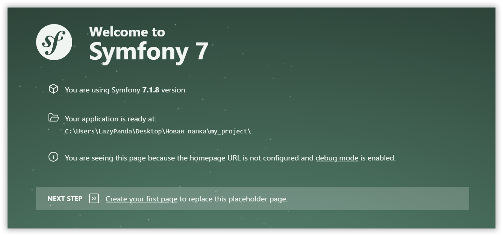
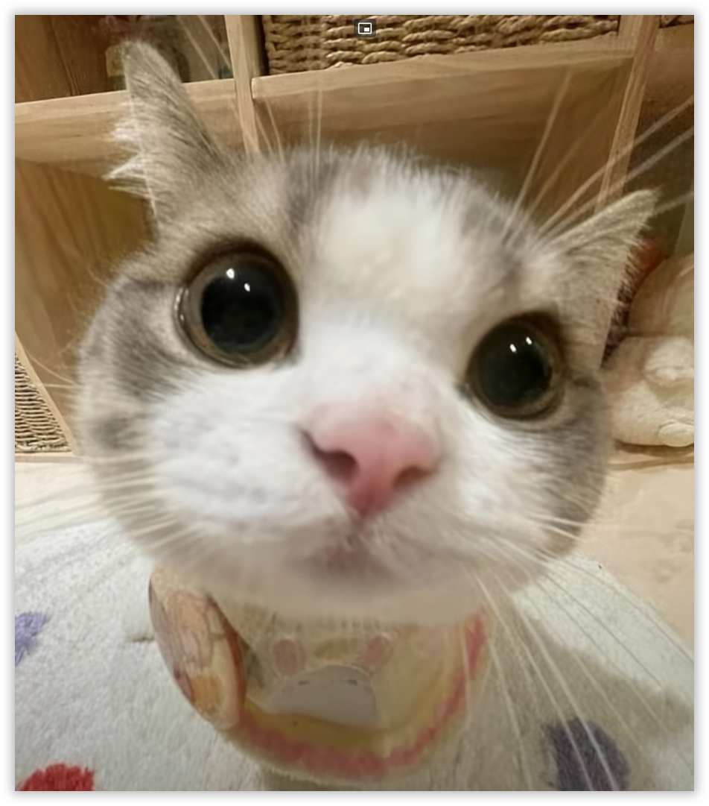

В этой статье мы познакомимся с ласковым и нежным фреймворком, сделанным во Франции.

<!-- more -->

Здравствуйте, юные исследователи и взрослые мечтатели! Сегодня я познакомлю вас с удивительным существом из цифровых джунглей — котом Symfony! Представьте пушистого гения с глазами-дисплеями и хвостом-кабелем. Он не просто мурлычет — он творит волшебство в мире веб-программирования!

Symfony — это супер-помощник для создания сайтов и приложений на языке PHP. Как настоящий кот, он обожает гибкость: может свернуться калачиком для простой задачки или развернуться во весь рост для сложного проекта-небоскрёба!

У нашего кота есть волшебный рюкзачок с инструментами — компонентами. Хотите взять только мячик-маршрутизатор? Пожалуйста! Мечтаете собрать целый конструктор из модулей? Symfony уже мурлычет от нетерпения!

Но помните: даже цифровые коты любят заботу. Если забыть про обновления или настройки, наш друг может запутаться в клубках кода. Но не волнуйтесь — мы всё покажем!

## Обустраиваем кото-домик

Перед знакомством подготовим «угощения»:

- PHP 8.2+ — воздух для нашего кота. Без него ни прыжка!
- Веб-сервер (Apache/Nginx) — уютная лежанка.
- База данных — сундук с игрушками (MySQL, PostgreSQL или SQLite).

Можно использовать готовые «коттеджи»: [OS Panel][ospanel], [XAMPP][xampp], [Docker][docker], [Laravel Herd][herd], или встроенный сервер Symfony — он как картонная коробка, в которой коты обожают сидеть! 📦

Нам потребуется волшебное заклинание. Откройте терминал и наберите:

```bash
composer create-project symfony/skeleton my_project
```

!!! tip "Как открыть терминал в Windows"

    Нажмите ++win+r++ и наберите `cmd`

Здесь `my_project` — имя вашего виртуального дома. Представьте, как Symfony распаковывает свои игрушки: контроллеры, шаблоны, роуты — всё аккуратно расставляется по местам!

### Надеваем поводок

Symfony CLI — как GPS-ошейник для кота. Скачайте [symfony.exe][symfony], положите в папку:

```bash
C:\Users\<Ваше_имя_пользователя>\AppData\Roaming\Composer\vendor\bin
```

Проверьте установку:

```bash
symfony -v
```

Услышали мурлыканье? Значит, всё готово! Заходим в папку проекта:

```bash
cd my_project
```

### Коту нужны витамины!

Установите волшебный набор [`symfony/maker-bundle`][maker] — он как коробка с игрушками-командами (как `php artisan` в Laravel):

```bash
composer require symfony/maker-bundle --dev
```

Запустите сервер — кот запрыгнет на экран!

```bash
symfony server:start
```

И вот, наш котик Symfony готов к игре! Вы можете открыть браузер и перейти по адресу `http://localhost:8000`, чтобы увидеть приветствие.



## Первый фокус: Контроллер

Контроллер — это дирижёр, который говорит Symfony, когда мяукать, а когда показывать трюки. Создадим его:

```bash
php bin/console make:controller HelloController
```

В папке `src/Controller` появится файл-инструкция. Добавим волшебное приветствие:

```php
<?php

public function index(): JsonResponse
{
    return $this->json([
        'message' => 'Мррр-мяу!',
        'path' => 'src/Controller/HelloController.php',
    ]);
}
```

Но JSON — это как кошачья азбука Морзе. Сделаем понятнее:

```php
<?php

#[Route('/hello', name: 'app_hello')]
public function index(): Response
{
    return new Response('Мяу!');
}
```

Теперь по адресу `http://localhost:8000/hello` вас встретит дружелюбное мяуканье!

## Рисуем портрет кота

Twig — это набор красок для украшения нашего кота. Установим пакет `symfony/twig-bundle`:

```bash
composer require symfony/twig-bundle
```

Попробуем вывести фотографию нашего котика:

```php
<?php

#[Route('/photo', name: 'app_photo')]
public function photo(): Response
{
    return $this->render('photo.html.twig');
}
```

Теперь создадим файл `templates/photo.html.twig`:

```twig


Фотография котика


    <h2>А вот и наш котик!</h2>
    

```

Поместите в директорию `public` какое-нибудь изображение с именем `cat.png` и перейдите в браузере на страницу `http://localhost:8000/photo`:


??? note "На заметку"

    Можно ещё отредактировать `templates/base.html.twig`, добавив ссылки для переключения между страницами нашего приложения, воспользовавшись методом `path('имя_маршрута')`.

    Только не забудьте после этого переделать метод `index`, с указанием базового шаблона для отображения приветствия котика. С помощью метода `render` вторым параметром передаются данные в шаблон, поэтому вместо «Мяу!» можно будет отправлять что угодно! Попробуйте реализовать всё это самостоятельно. Вот один из возможных вариантов переделки секции `body` в файле `templates/base.html.twig`:

    ```twig
    <body>
        <a href="{{ path('app_hello') }}">Сказать мяу</a>
        <a href="{{ path('app_photo') }}">Показать фотку</a>
        <p>{{ message ?? '' }}</p>
        
    </body>
    ```

## Сундук с сокровищами: База данных

База данных — это кладовая, где кот хранит свои секреты. Выберите «сундук»: SQLite для мини-проектов, MySQL/PostgreSQL для больших приключений.

Установка ORM — ключа к сокровищам:

```bash
composer require symfony/orm-pack
```

### Настройка подключения

Чтобы наш котик мог зайти в домик базы данных, нам нужно настроить подключение. Для этого отредактируем файл `.env`, который находится в корне проекта. Например, для SQLite можно сделать так:

```ini
DATABASE_URL="sqlite:///%kernel.project_dir%/var/app.db"
```

Просто найдите и раскомментируйте подходящую строчку с настройками.

### Создаём цифровые игрушки (сущности)

Теперь, когда наш котик знает, как попасть в домик, давайте порадуем его какой-нибудь игрушкой:

```bash
php bin/console make:entity
```

Назовите сущность `Ball`, добавьте поля:

- color (цвет мяча)
- description (описание)

Symfony сгенерирует класс-голограмму игрушки в `src/Entity`.

### Миграции — перестановка мебели

После размещения игрушек нужно закрепить текущую обстановку в домике с помощью пары команд:

```bash
php bin/console make:migration
php bin/console doctrine:migrations:migrate
```

Теперь в базе появится таблица для мячиков!

### Играем с данными

Теперь, когда все игрушки собраны, а у нас есть сущности и база данных, мы можем начать работать с данными.

!!! note "На заметку"

    Symfony предоставляет удобный интерфейс для работы с базой данных через `Doctrine` — мощный ORM (Object-Relational Mapping). Вы можете создавать, читать, обновлять и удалять записи в базе данных с помощью простых методов.

Например, чтобы дать котику мячик, вы можете сделать так:

```php
<?php

#[Route('/ball', name: 'create_ball')]
public function createBall(EntityManagerInterface $entityManager): Response
{
    // Создаём новый мячик
    $ball = new Ball();
    $ball->setColor('Красный');
    $ball->setDescription('Простой мячик');

    // Показываем мячик котику, но не отдаём
    $entityManager->persist($ball);

    // Отдаём мячик котику = сохраняем в базе данных
    $entityManager->flush();

    // Отображаем в браузере номер этого мячика
    return $this->render('base.html.twig', [
        'message' => 'Мячик #' . $ball->getId()
    ]);
}
```

Каждый раз при переходе на страницу `/ball` наш котик будет ловить новый мячик!

## Заключение

Symfony — это не просто фреймворк, а верный друг, который:

- 🐾 Играет с вашими идеями
- 🧶 Распутывает сложные задачи
- 📦 Хранит секреты в надёжном месте

Обновления — как новые игрушки: следите за ними, и ваш кот всегда будет в тренде!

Главный секрет: Symfony обожает эксперименты. Не бойтесь пробовать, ошибаться и снова пробовать — ваш цифровой кот всегда поддержит вас мурлыканием кода!

Пусть ваше путешествие в мир веб-разработки будет таким же увлекательным, как игра с весёлым котом!

## Полезняшки

- [Базовый курс для начинающих](https://www.youtube.com/watch?v=jmwo10E1d0o)
- [Курсы на SymfonyCasts](https://symfonycasts.com/tracks/symfony)
- [Шпаргалка по Symfony](https://softdreams.ru/dev/symfony-cheat-sheet/)
- [Symfony & Vite](https://symfony-vite.pentatrion.com)

[maker]: https://symfony.com/bundles/SymfonyMakerBundle/current/index.html
[composer]: https://getcomposer.org/
[ospanel]: ../vozmozhnosti-open-server-panel-6/index.md
[xampp]: https://www.apachefriends.org/download.html
[docker]: ../docker-kak-zamena-open-server/index.md
[herd]: ../laravel-herd/index.md
[symfony]: https://symfony.com/download#step-1-install-symfony-cli
