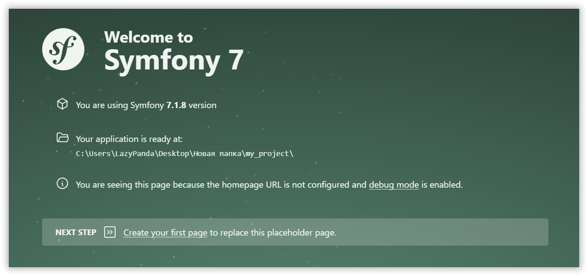

Забудьте о скучных учебниках. Мы познакомимся с фреймворком, который диктует стандарты в мире PHP.

<!-- more -->

Если вы думали, что Symfony — это только для суровых энтерпрайз-архитекторов в розовых очках, то спешу вас расстроить (или обрадовать). Этот фреймворк — как швейцарский нож: острый, надежный и чертовски удобный, когда понимаешь, за какой край браться.

Symfony — это не просто «ещё один инструмент». Это целая экосистема, на которой держатся такие гиганты, как Laravel, Drupal и Magento. Он гибкий: сегодня вы собираете на нем легкий лендинг из пары компонентов, а завтра — сложную систему управления полетами на Марс.

В нем нет магии, только четкая логика и компоненты, которые работают как швейцарские часы. Погнали разбираться, как приручить этого зверя.

## Готовим плацдарм

Для комфортного старта нам понадобится стандартный «джентльменский набор»:

- **PHP 8.2+** — база, без которой двигаться дальше нет смысла.
- **Веб-сервер** (Nginx/Apache/Caddy) или встроенный сервер Symfony.
- **База данных** — на ваш вкус: MySQL, PostgreSQL или старый добрый SQLite для тестов.

Если не хотите возиться с настройкой окружения вручную, используйте проверенные решения: [OS Panel][ospanel], [Docker][docker] или [Laravel Herd][herd].

Первым делом создаем проект. Открываем терминал и запускаем:

```bash
composer create-project symfony/skeleton my_project
```

!!! tip "Совет"
    `skeleton` — это минимальная база. Ничего лишнего, только самое необходимое для взлета.

### Инструменты управления

Чтобы не чувствовать себя сапером в темном лесу, установим Symfony CLI — мощный помощник, который умеет запускать сервер, проверять безопасность и логи.

Скачайте [symfony.exe][symfony], пропишите путь к нему в системных переменных и проверьте:

```bash
symfony -v
```

Если увидели версию — вы в игре. Заходим в папку:

```bash
cd my_project
```

### Прокачиваем проект

В Symfony есть «секретное оружие» — `MakerBundle`. Это генератор кода, который сэкономит вам часы рутинной работы. Установим его:

```bash
composer require symfony/maker-bundle --dev
```

Теперь запускаем локальный сервер:

```bash
symfony server:start
```

Открывайте `http://localhost:8000`. Если видите приветственную страницу — поздравляю, фундамент заложен!



## Контроллеры: Кто здесь главный?

Контроллер — это мозг вашего приложения. Он принимает запрос от пользователя и решает, что с ним делать. Создадим наш первый контроллер одной командой:

```bash
php bin/console make:controller HelloController
```

Загляните в `src/Controller/HelloController.php`. Видите аннотации (или атрибуты) над методом? Это роутинг. Он связывает URL в браузере с конкретным кодом.

Давайте сделаем что-то простое:

```php
<?php

namespace App\Controller;

use Symfony\Bundle\FrameworkBundle\Controller\AbstractController;
use Symfony\Component\HttpFoundation\Response;
use Symfony\Component\Routing\Annotation\Route;

class HelloController extends AbstractController
{
    #[Route('/hello', name: 'app_hello')]
    public function index(): Response
    {
        return new Response('Привет, мир!');
    }
}
```

Теперь по адресу `/hello` вас ждет ваше первое сообщение. Просто, понятно, эффективно.

## Twig: Шаблоны без боли

Выводить текст через `Response` — это как рисовать картину пальцем на песке. Для настоящей верстки нам нужен Twig. Это шаблонизатор, который делает ваш HTML чистым и логичным.

Устанавливаем:

```bash
composer require symfony/twig-bundle
```

Теперь обновим наш метод в контроллере:

```php
<?php

namespace App\Controller;

use Symfony\Bundle\FrameworkBundle\Controller\AbstractController;
use Symfony\Component\HttpFoundation\Response;
use Symfony\Component\Routing\Annotation\Route;

class HelloController extends AbstractController
{
    #[Route('/photo', name: 'app_photo')]
    public function photo(): Response
    {
        return $this->render('photo.html.twig');
    }
}
```

А в файле `templates/photo.html.twig` напишем:

```twig


Галерея


    <h1>Наш проект в деталях</h1>
    

```

Twig позволяет наследоваться от базовых шаблонов (`base.html.twig`), так что вам не придется переписывать «шапку» и «подвал» сайта на каждой странице.

## Работа с данными: Doctrine ORM

База данных в Symfony — это не про написание SQL-запросов вручную. Это про работу с объектами. За это отвечает Doctrine.

Ставим пакет для работы с БД:

```bash
composer require symfony/orm-pack
```

### Настройка связи

Все настройки живут в файле `.env`. Если используете SQLite, просто убедитесь, что строка подключения выглядит так:

```ini
DATABASE_URL="sqlite:///%kernel.project_dir%/var/app.db"
```

### Создаем сущности

Сущность — это обычный PHP-класс, который Doctrine превратит в таблицу в базе данных. Попробуем:

```bash
php bin/console make:entity
```

Назовем сущность `Post` (статья). Добавьте поля `title` (string) и `content` (text). Symfony сам создаст нужные файлы.

### Миграции: Версионность вашей базы

Когда вы изменили код сущности, базу нужно «подтянуть». Для этого используем миграции:

```bash
php bin/console make:migration
php bin/console doctrine:migrations:migrate
```

Готово. Таблица в базе создана без единой строчки SQL.

### Сохраняем данные

Попробуем создать новую запись прямо из контроллера:

```php
<?php

namespace App\Controller;

use App\Entity\Post;
use Doctrine\ORM\EntityManagerInterface;
use Symfony\Bundle\FrameworkBundle\Controller\AbstractController;
use Symfony\Component\HttpFoundation\Response;
use Symfony\Component\Routing\Annotation\Route;

class PostController extends AbstractController
{
    #[Route('/create-post', name: 'app_post_create')]
    public function create(EntityManagerInterface $em): Response
    {
        $post = new Post();
        $post->setTitle('Моя первая статья');
        $post->setContent('Контент статьи в Symfony');

        $em->persist($post);
        $em->flush();

        return new Response('Статья сохранена с ID: ' . $post->getId());
    }
}
```

`persist` говорит Doctrine «запомнить» объект, а `flush` отправляет все изменения в базу одним махом.

## Итог

Symfony — это инструмент для тех, кто ценит порядок, предсказуемость и масштабируемость. Мы только коснулись верхушки айсберга, но этого достаточно, чтобы начать строить свои проекты.

Главное преимущество Symfony — он не ограничивает вас. Вы можете использовать только те части, которые вам нужны, и при этом быть уверенными, что ваш код соответствует лучшим практикам индустрии.

Не бойтесь документации — она у Symfony одна из лучших в мире. Экспериментируйте, ломайте и стройте заново.

## Что изучить дальше?

- [Базовый курс для начинающих](https://www.youtube.com/watch?v=jmwo10E1d0o)
- [Официальная документация Symfony](https://symfony.com/doc/current/index.html)
- [SymfonyCasts — лучшие видеоуроки](https://symfonycasts.com/)
- [Шпаргалка по Symfony](https://softdreams.ru/dev/symfony-cheat-sheet/)
- [Symfony и Vite: Современный фронтенд](https://symfony-vite.pentatrion.com)

[maker]: https://symfony.com/bundles/SymfonyMakerBundle/current/index.html
[composer]: https://getcomposer.org/
[ospanel]: ../vozmozhnosti-open-server-panel-6/index.md
[docker]: ../docker-kak-zamena-open-server/index.md
[herd]: ../laravel-herd/index.md
[symfony]: https://symfony.com/download#step-1-install-symfony-cli
