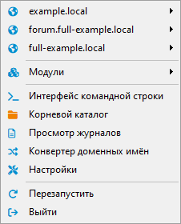
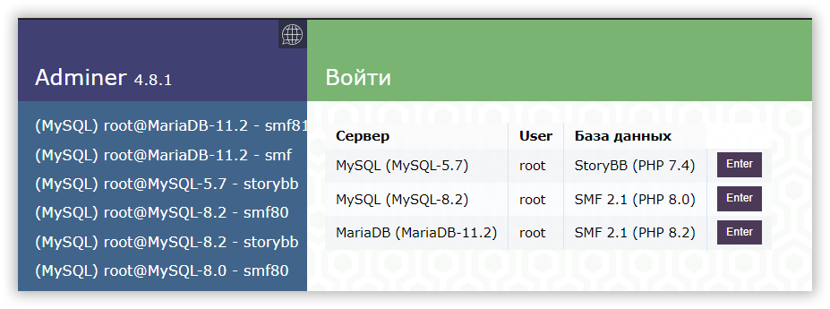
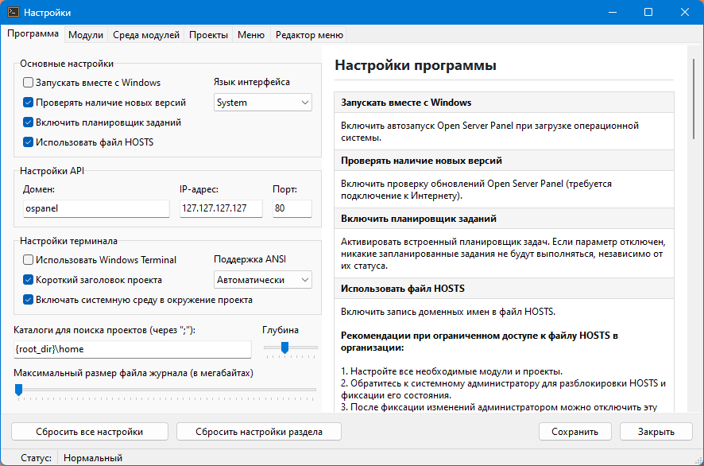
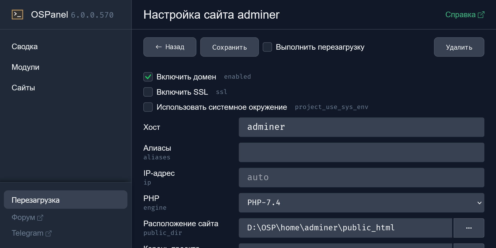

Если кратко: мы получаем меню в трее и инструмент командной строки, а также возможность одновременного использования различных конфигураций модулей для разных проектов.

<!-- more -->

## Основные преимущества

По сравнению с предыдущей, пятой версией, в этой можно обнаружить следующие фичи:

- Конфигурируемость всего и вся (читаем [документацию](https://github.com/OSPanel/OpenServerPanel/wiki/%D0%94%D0%BE%D0%BA%D1%83%D0%BC%D0%B5%D0%BD%D1%82%D0%B0%D1%86%D0%B8%D1%8F))
- Управление через меню в трее + консольный режим + GUI (веб-интерфейс в разработке)
- Модульность (каждый проект может иметь собственные версии PHP, базы данных, NPM, Apache/Nginx на выбор)
- SSL без заморочек (главное — согласиться с добавлением сертификата при установке)
- Множество расширений PHP «из коробки»
- 100% стабильность работы

---

<a href="https://billing.lite-host.in/aff.php?aff=1544" target="_blank"></a>

---

## Установка

- Скачиваем [свежий релиз][ospanel] и устанавливаем нужные модули.
- Осуществляем [первый запуск](https://github.com/OSPanel/OpenServerPanel/wiki/%D0%94%D0%BE%D0%BA%D1%83%D0%BC%D0%B5%D0%BD%D1%82%D0%B0%D1%86%D0%B8%D1%8F#%D0%BF%D0%B5%D1%80%D0%B2%D1%8B%D0%B9-%D0%B7%D0%B0%D0%BF%D1%83%D1%81%D0%BA).
- Проверяем, появилось ли меню в трее.



## Использование

По умолчанию OSP проверяет пользовательские домены в директории `<Путь к OSP>/home`. Чтобы изменить этот путь или добавить дополнительные пути для проверки, отредактируйте значение переменной `projects_search_path` в файле конфигурации `config/program.ini` (если у вас OSP 6.0.0) или в настройках программы (если у вас OSP 6.2+).

??? note "Примеры проектов"

    Изначально в комплекте уже есть 2 демонстрационных примера, например, `<Путь к OS Panel 6>\home\example.local` — вы можете заглянуть в эту директорию, найти там подпапку `.osp` и файл `project.ini` в ней. В нем содержатся все настройки проекта, в том числе указаны модули, которые нужны для работы:

    ```ini
    [example.local]

    php_engine  =
    http_engine =
    ```
    Для работы демонстрационных проектов достаточно выбрать `http_engine` (неважно, Apache или Nginx). Для этого откройте меню OS Panel (возле часиков в трее), найдите пункт «Модули => HTTP» и включите желаемый движок. После этого сайт `example.local` можно будет посмотреть в браузере.

Общий принцип:

- Создаём папку проекта — например, `project.local` — в директории `<Путь к OSP>/home`
- Размещаем файлы проекта в созданной папке
- Создаём в корне проекта папку `.osp`, а в ней файл `project.ini` с конфигурацией проекта (начиная с `6.4.5` файл создавать уже не нужно, программа всё сделает за вас)

!!! note "Примечание"

    Название домена может быть любым — `vasja-pupkin.loc`, `mysite.test` и т. п. Главное — не забудьте указать название своего домена в файле `.osp/project.ini` в квадратных скобочках. Почитайте про [ini-файлы](https://ru.wikipedia.org/wiki/.ini), если интересен их синтаксис.

### Создание проекта

=== "Apache + PHP"

    ```ini
    [project.local]

    php_engine  = PHP-8.4
    http_engine = Apache
    ```

=== "Nginx + PHP"

    ```ini
    [project.local]

    php_engine  = PHP-8.4
    http_engine = Nginx
    ```

=== "Apache (без PHP)"

    ```ini
    [project.local]

    http_engine = Apache
    ```

=== "Nginx (без PHP)"

    ```ini
    [project.local]

    http_engine = Nginx
    ```

!!! tip "Совет"

    Узнать имена имеющихся модулей и проверить их статус можно с помощью команды `osp modules` в консоли OSP.

---

После указания в `project.ini` нужной связки модулей включите их через консоль (`osp on ...`) или через панельку в трее и перезагрузите OSPanel.

??? note "Памятка по работе с консолью"

    Включить конкретные модули:

    ```sh
    osp on MariaDB-11.8 & osp on PHP-8.4
    ```

    Если вам нужно прямо в консоли задать нужную среду окружения (например, чтобы по команде `php -v` отображалась заданная вами версия PHP), используйте команду `osp use`:

    ```sh
    osp use PHP-7.4
    ```

    Чтобы одновременно с указанием используемой версии PHP подключить нужные модули, укажите их через `osp add`:

    ```sh
    osp add Redis-7.0 & osp add MySQL-5.7 & osp use PHP-7.4
    ```
    Для объединения сред нескольких модулей без изоляции от системной переменной `PATH` выполните команду `osp reset` перед запуском других команд.

    Увидеть краткую информацию обо всех имеющихся проектах можно с помощью команды `osp projects`

    Узнать список всех доступных команд: `osp` или `osp help`

## Обновление компонентов

Начиная с версии `6.4.0` проблем с обновлениями компонентов должно стать меньше:

- [Релизы PHP для Windows](https://github.com/OSPanel/php-windows-builder)
- [Релизы Nginx для Windows](https://github.com/OSPanel/nginx)

### Процесс обновления компонентов для версий OS Panel ниже `6.4.0`

Как всегда, есть два варианта — ждать выхода новой версии панели, либо заморочиться и обновить всё, что нужно, самостоятельно. Как — читайте под катом.

??? note "Обновление PHP (например, если у вас `8.4.1`, а хочется `8.4.10`)"

    - Останавливаем OS Panel.
    - Делаем бэкап папки `<Путь к OS Panel>\modules\PHP-8.4`.
    - Скачиваем [новую версию][php] (выбираем вариант _Thread Safe_).
    - Переходим в директорию `<Путь к OS Panel>\modules\PHP-8.4`.
    - В версии `6.0.0` повторяем аналогичные действия для `PHP-8.4-FCGI`. В версиях выше это не требуется.
    - Распаковываем содержимое архива поверх имеющихся файлов, с заменой.
    - Перезапускаем OS Panel, проверяем работоспособность.

??? note "Обновление Apache"

    - Останавливаем OS Panel.
    - Делаем бэкап папки `<Путь к OS Panel>\modules\PHP-{версия}\Apache`.
    - Скачиваем [новую версию][apache] (выбираем Win64)
    - Переходим в директорию `<Путь к OS Panel>\modules\PHP-{версия}\Apache`.
    - Распаковываем содержимое папки Apache24 внутри архива поверх имеющихся файлов, с заменой.
    - Перезапускаем OS Panel, проверяем работоспособность.

??? note "Обновление других модулей"

    - См. статью [Обновление компонентов Open Server](../obnovlenie-komponentov-open-server) — там речь об OSP 5, но в принципе общая стратегия подойдет и для шестой версии, нужно лишь обращать внимание на расположение файлов, модулей и конфигураций.

## Добавление модулей

Сообщество не спит и уже снабжает проект [дополнительными модулями](https://github.com/OSPanel/OpenServerPanel/discussions/57).

В версии `6.2.6` PHP 8.4 уже есть, а процесс добавления модулей чуть упрощается (например, не нужно указывать IP). Однако, если используется устаревшая версия, её всегда [можно обновить](https://drive.proton.me/urls/JGQB8B2V58#F140YSuL4z2l).

Кому не лень, может и сам [создать модуль](https://github.com/OSPanel/OpenServerPanel/wiki/%D0%94%D0%BE%D0%BA%D1%83%D0%BC%D0%B5%D0%BD%D1%82%D0%B0%D1%86%D0%B8%D1%8F#%D1%81%D0%BE%D0%B7%D0%B4%D0%B0%D0%BD%D0%B8%D0%B5-%D0%BC%D0%BE%D0%B4%D1%83%D0%BB%D0%B5%D0%B9) и поделиться с сообществом.

## Работа с NVM

Если Node.js у вас уже установлен глобально, в системе, то ничего делать не нужно. Если же нет, читайте дальше.

Устанавливаем нужную версию Node.js — `osp node install latest`, `osp node install lts` (рекомендуемый вариант), или `osp node install all`.

Затем для работы с нужной версией используйте `osp add Node-x.x.x`, `osp use Node-x.x.x` в консоли. Подробности в [документации](https://github.com/OSPanel/OpenServerPanel/wiki/%D0%94%D0%BE%D0%BA%D1%83%D0%BC%D0%B5%D0%BD%D1%82%D0%B0%D1%86%D0%B8%D1%8F#nvm-node-version-manager).

??? note "Пример подключения JS проекта"

    Допустим, есть [проект на React](../znakomstvo-s-populyarnymi-js-freymvorkami-chast-3/index.md), который вы хотите протестировать. Для этого:

    - Создайте директорию `<Путь к OS Panel 6>\home\react.local`
    - Скопируйте в эту директорию файлы проекта
    - Создайте файл `<Путь к OS Panel 6>\.osp\project.ini`:

    ```ini
    [react.local]

    http_engine = Nginx
    web_root    = {base_dir}\dist
    ```

    - Убедитесь, что модуль `Nginx` запущен (Модули => HTTP)
    - Перейдите в корень проекта, откройте консоль и выполните команды `pnpm i`, `pnpm run build`
    - Перезагрузите OSPanel и протестируйте сайт `https://react.local` в браузере

## Работа с Laravel

При работе с Laravel и подобными фреймворками публичной папкой, как правило, является `public` в корне проекта. Сначала установите фреймворк в пустой папке проекта, а потом создайте `.osp/project.ini`:

```ini
[laravel.local]

php_engine  = PHP-8.2
http_engine = Nginx
web_root    = {base_dir}\public
```

## Конфигурация с PHP

Поместите в корневую директорию проекта (или в `public`, если используете) файл `.user.ini` с нужными настройками. Например:

```ini
error_reporting    = E_ALL & E_NOTICE
max_execution_time = 45
max_file_uploads   = 3
```
В директории `home/full-example.local` можно увидеть и другие примеры настроек с помощью `ini`-файлов:

- переменные окружения (`.osp/env.ini`)
- собственные пункты меню (`.osp/menu.ini`)
- задачи планировщика (`.osp/tasks.ini`)

## Управление базами данных

Для удобного доступа ко всем имеющимся базам данных можно использовать [Adminer][adminer] с закладками, [HeidiSQL][heidisql], [DBeaver][dbeaver] и т. п. В приложениях, при подключении к конкретной базе данных, вместо `localhost` используйте название движка базы данных (`MariaDB-11.8` и т. п.). См. [примеры подключения](https://github.com/OSPanel/OpenServerPanel/wiki/%D0%94%D0%BE%D0%BA%D1%83%D0%BC%D0%B5%D0%BD%D1%82%D0%B0%D1%86%D0%B8%D1%8F#%D0%BF%D1%80%D0%B8%D0%BC%D0%B5%D1%80%D1%8B-%D0%BF%D0%BE%D0%B4%D0%BA%D0%BB%D1%8E%D1%87%D0%B5%D0%BD%D0%B8%D1%8F)

!!! info "Хотите PhpMyAdmin?"

    * [Как установить PhpMyAdmin в Open Server Panel](https://delphinpro.ru/a/6)

    Нытики победили — начиная с OSP `6.4.5`, phpMyAdmin опять входит в комплектацию

??? note "Adminer"

    Например, если вы привыкли использовать Adminer, создайте по аналогии папку для него (в директории `<Путь к OSP>/home`) и добавьте необходимые строчки в `.osp/project.ini`:

    ```ini
    [adminer]

    php_engine = PHP-8.2
    ```

    Используя плагин [OneClick Login](https://github.com/giofreitas/one-click-login), можно сделать удобный интерфейс для выбора нужной базы данных:

    

## Добавление своих пунктов меню

В контекстное меню каждого проекта можно добавить пункты для открытия папки проекта в нужных вам приложениях. Для этого воспользуйтесь графическим интерфейсом, на вкладке «Редактор меню». Пример для VS Code и PHPStorm:

```ini
[22]

caption        = Открыть в VS Code
category       = projects
command        = "%COMSPEC%" /c "code {project_dir}"
hide           = on
icon           = newspaper

[23]

caption        = Открыть в PHPStorm
category       = projects
command        = "%COMSPEC%" /c "osp project {host_decoded} & start "" "phpstorm64" "{project_dir}""
hide           = on
icon           = code
```

!!! note "Примечание"

    Если данные приложения не добавлены в переменные среды (в секцию `PATH`), вместо `code` и `phpstorm64` придётся указывать полный путь к соответствующим exe-файлам.

??? note "Добавление ссылок на портативные программы в меню"

    Общий принцип таков: создаём папку `<Путь к OS Panel 6>\apps\<Папка приложения>` (вместо `apps` можете использовать свое название). Помещаем туда файлы приложения. Затем добавляем секцию приложения в общее меню (через _Настройки - Редактор меню_):

    ```ini
    [Floorp]

    caption = Floorp
    command = "{root_dir}\apps\Floorp\floorp-portable.exe"
    icon    = firefox
    ```
    Ссылки на некоторые портативные программы можно найти в статье [Обновление компонентов Open Server](../obnovlenie-komponentov-open-server/index.md#dobavlenie-svoikh-portativnykh-programm-vmesto-standartnykh)

## Обновление от сборки к сборке

!!! info "Информация"

    Протестировано на версиях OSP 6.0.0-6.4.0

- Экспортируйте нужные вам базы данных, затем закройте OS Panel.
- Переименуйте папку с текущей сборкой, например, в `OSP_old`.
- Установите свежую сборку.
- Скопируйте папку `home` из вашей сборки в свежеустановленную (кроме папок сайтов-примеров, если вы в них ничего не меняли).
- В более ранних сборках (<= `6.0.0.570 beta`) настройки доменов хранились в `config/domains.ini` — не забудьте перенести из него записи в файл `.osp/project.ini` в корне каждого вашего домена, согласно документации (некоторые переменные изменились).
- В версии `6.0.0` настройки меню хранились в файле `config/menu.ini`, а в `6.2.6` переехали в файл `system/menu.dat`. Аналогично, `config/program.ini` => `system/program.dat`. Если вы в этих файлах что-то меняли, не забудьте перенести свои правки, воспользовавшись графическим интерфейсом. Вручную редактировать файлы в директории `system` не рекомендуется.
- Запустите `bin/ospanel.exe` из свежей сборки.
- Запустите нужные вам модули.
- Обновите версии модулей в файлах `.osp/project.ini` ваших проектов, если соответствующие модули обновлены.
- Обновите файл `.osp/project.ini` каждого проекта в соответствии с новым синтаксисом (>= `6.4.0`).
- Импортируйте базы данных, сохранённые ранее.

??? note "Миграция баз данных через консоль"

    На примере переезда с MariaDB 11.7 на 11.8:

    * Скопируйте папку с данными используемого модуля в новое расположение. Например: `data\MariaDB-11.7\default` => `data\MariaDB-11.8\default`
    * Выполните в консоли обновлённого модуля команду `mysql_upgrade`

??? note "Миграция баз данных через Adminer"

    * Нажмите кнопку «Экспорт», выберите нужные базы данных, экпортируйте в SQL-файл (в текущей версии OS Panel)
    * Нажмите кнопку «Импорт», импортируйте SQL-файл (в новой версии OS Panel)

??? note "Миграция с пятой версии"

    Если вы решились перейти с предыдущей версии панели и хотите сохранить свои сайты, нужно лишь запастить «бубном, чаем/кофе, настроением» и следовать простой инструкции:

    * Если ваш проект использует базу данных, экспортируйте её с помощью подручных средств (phpMyAdmin, Adminer, HeidiSQL и т. п.)
    * Скопируйте файлы сайта в новое расположение. Например, из `<Путь к OS Panel 5>\domains\<название сайта>` в `<Путь к OS Panel 6>\home\<название сайта>`
    * Добавьте информацию о вашем сайте (`.osp\project.ini`)
    * Если ваш домен требует более тонкой настройки, воспользуйтесь проектом `<Путь к OS Panel 6>\home\full-example.local` в качестве примера, или почитайте [справку](https://github.com/OSPanel/OpenServerPanel/wiki/%D0%94%D0%BE%D0%BA%D1%83%D0%BC%D0%B5%D0%BD%D1%82%D0%B0%D1%86%D0%B8%D1%8F#%D0%BD%D0%B0%D1%81%D1%82%D1%80%D0%BE%D0%B9%D0%BA%D0%B0-%D0%BF%D1%80%D0%BE%D0%B5%D0%BA%D1%82%D0%BE%D0%B2)
    * Подключите нужные модули в OSP 6: базу данных, PHP и что вам там ещё нужно
    * Импортируйте сохранённую ранее базу данных
    * Остановите и закройте OSP 5, проверьте свой сайт уже в OSP 6, при необходимости поменяйте параметры подключения к базе данных
    * Если вам нужны какие-то портативные программы, которыми вы пользовались в OSP 5, вы можете перенести их в отдельную папку внутри директории `<Путь к OS Panel 6>\apps` (назвать можно как угодно)

## Панель управления

Веб-интерфейс нам пока не завезли, но графический интерфейс в версии 6.2.6 уже появился:



<!-- Также имеется альтернативная [панель управления](https://github.com/delphinpro/oscp/releases).



Разработчики к ней отношения не имеют, все вопросы оставляем на [страничке проекта](https://github.com/delphinpro/oscp). -->

!!! note "Примечание"

    При возникновении каких-либо проблем или вопросов загляните в [документацию](https://github.com/OSPanel/OpenServerPanel/wiki/%D0%94%D0%BE%D0%BA%D1%83%D0%BC%D0%B5%D0%BD%D1%82%D0%B0%D1%86%D0%B8%D1%8F) или в [Telegram](https://t.me/ospanel_chat). Но начать лучше с чтения логов — `osp log general`.

---

<div class="grid cards" markdown>
[Скачать дистрибутив][ospanel]{ .md-button .md-button--primary }

[Скачать с торрента][torrent]{ .md-button }

</div>

[ospanel]: https://ospanel.io/download/
[torrent]: https://rutracker.org/forum/tracker.php?nm=Open%20Server
[adminer]: https://www.adminer.org/en/
[heidisql]: https://www.heidisql.com/download.php
[dbeaver]: https://dbeaver.io/files/dbeaver-ce-latest-win32.win32.x86_64.zip
[php]: https://windows.php.net/download
[apache]: https://www.apachelounge.com/download/
