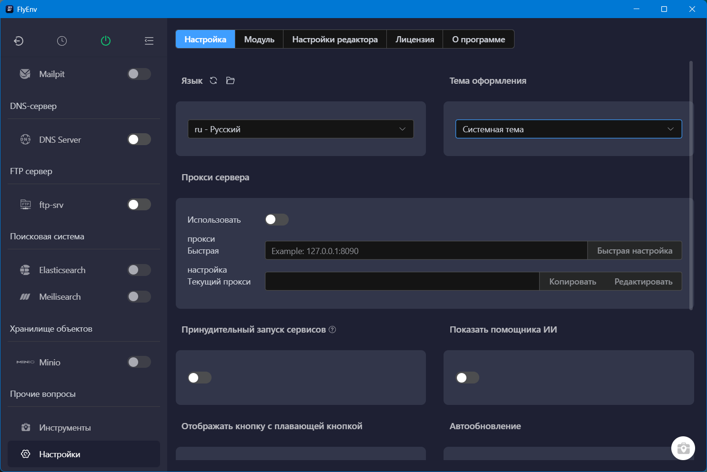
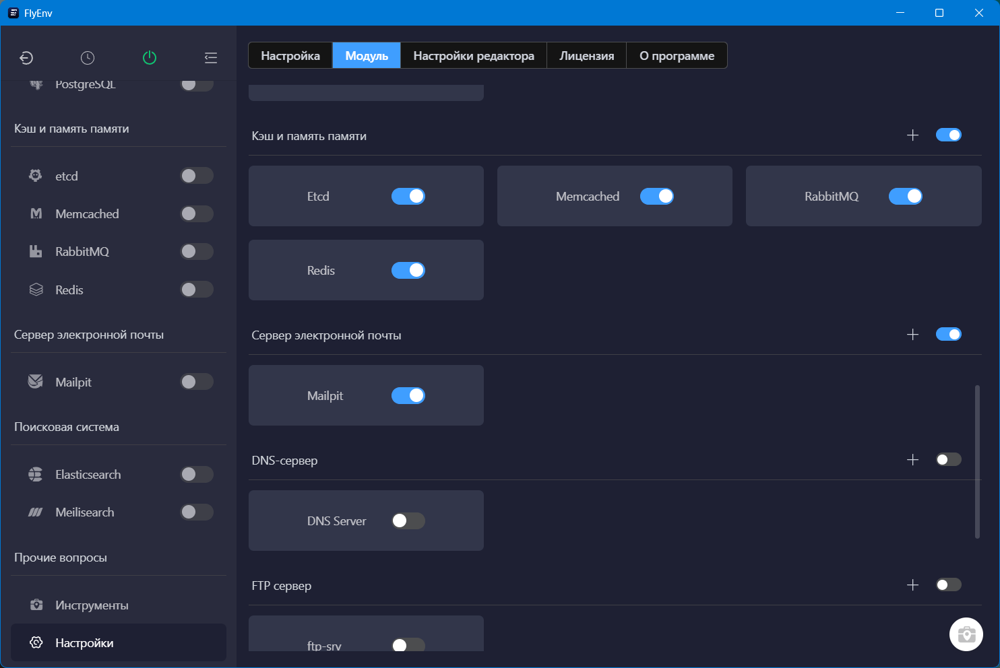
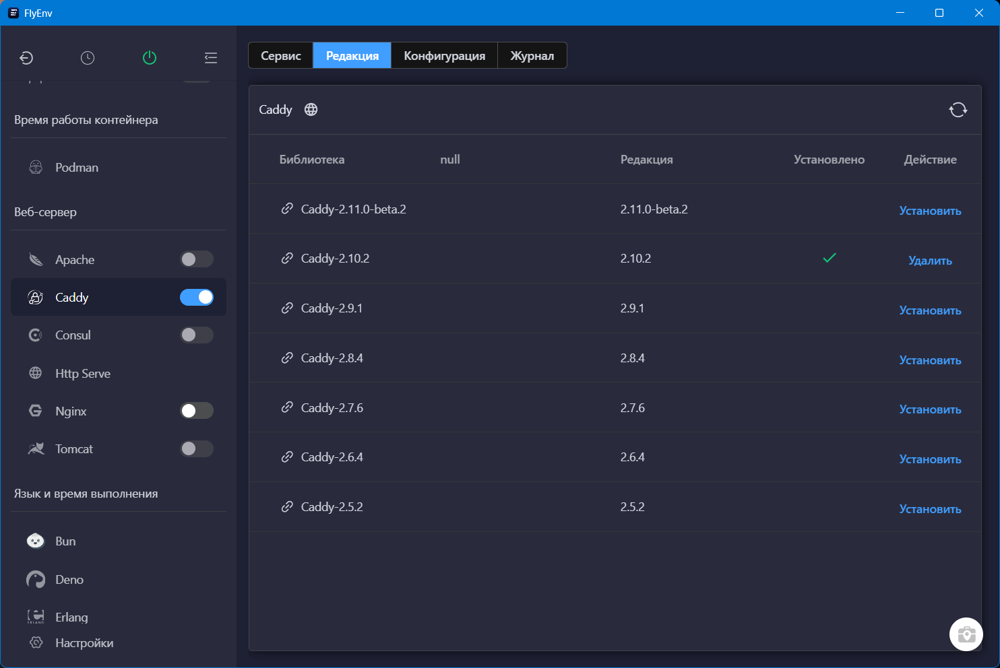
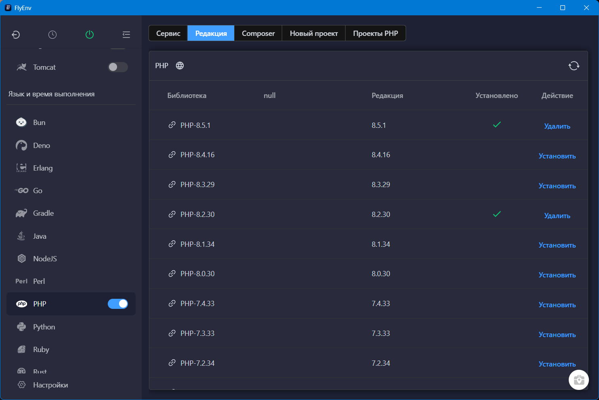
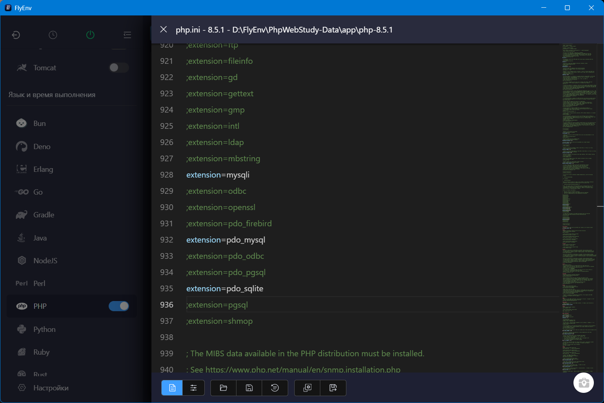
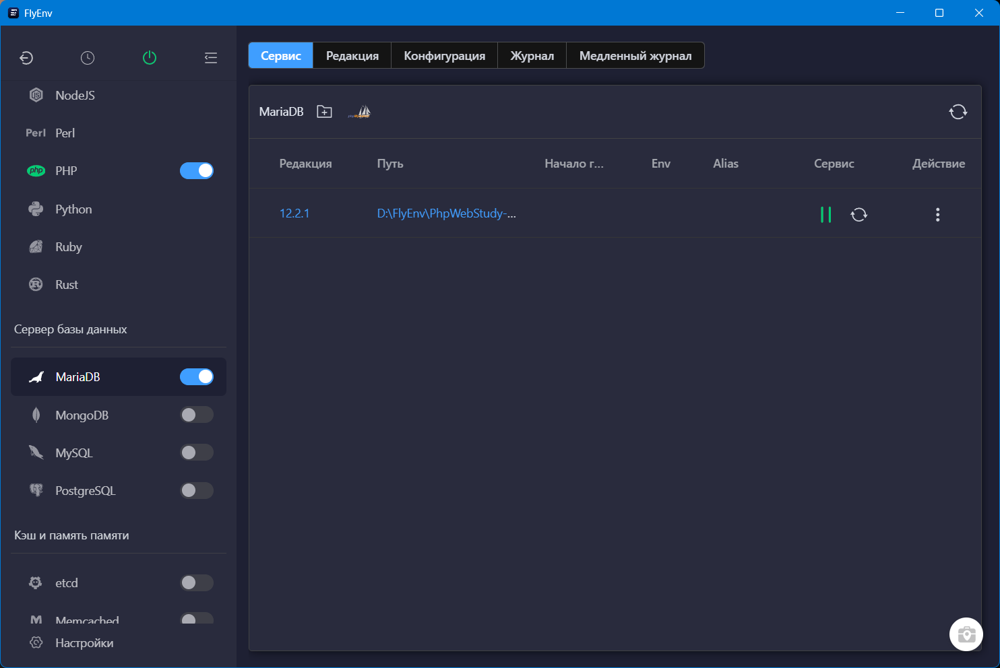
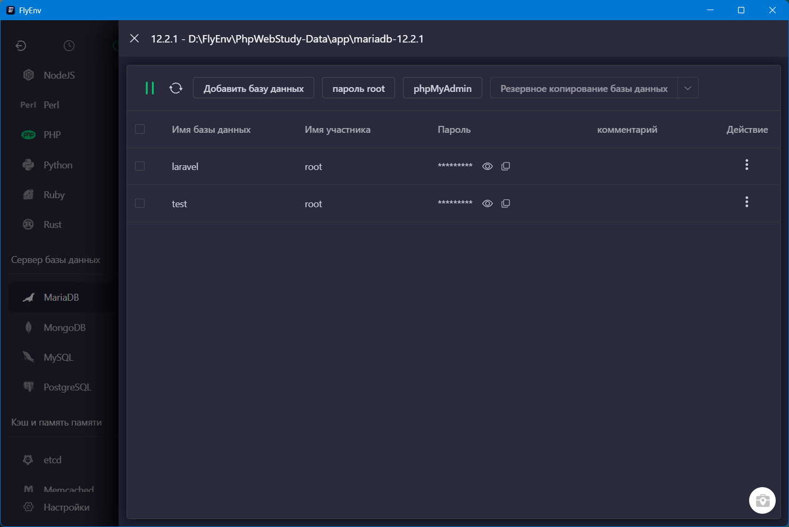
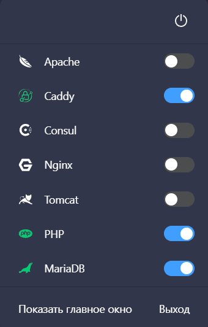
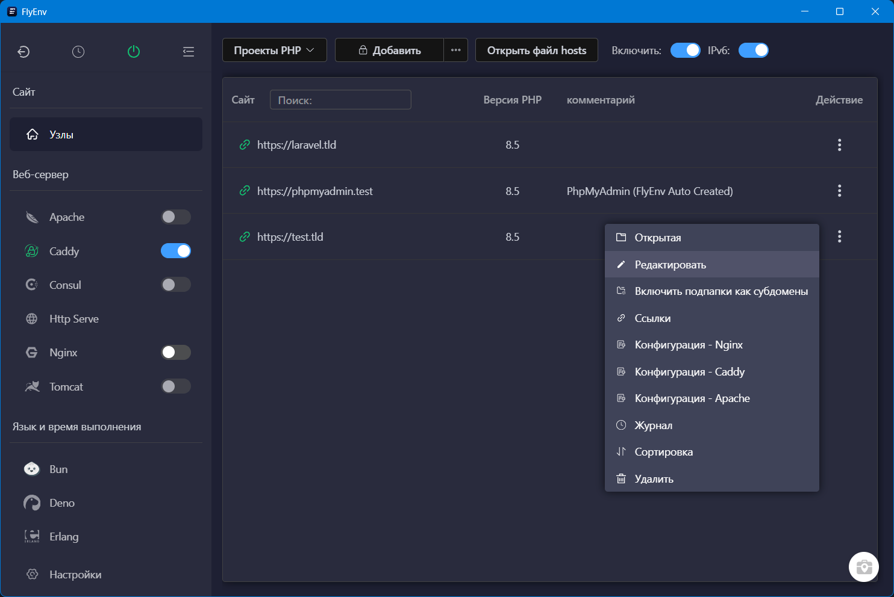

Устали при каждом обновлении скачивать монструозные дистрибутивы Open Server или возиться с настройкой Docker? Попробуйте FlyEnv — продукт, следующий девизу установки только нужных вам модулей в 1 клик.

<!-- more -->

## Установка

[Скачиваем файл приложения](https://www.flyenv.com/download.html) (~143 МБ), запускаем и устанавливаем.

## Настройка

Здесь можно выбрать язык и тему оформления, настроить автозапуск приложения и сервисов, изменить шрифт редактора и прочие мелочи:

При желании можно отключить ненужные вам модули, чтобы не мозолили взгляд:

## Активация модулей

Заходим в соответствующий раздел, выбираем версию, нажимаем «Установить»:

Для PHP можно быстро настроить `php.ini`, а также установить Composer:

С выбором сервера базы данных тоже проблем нет:

Даже PHPMyAdmin можно установить в 1 клик:

И конечно же, у нас есть удобная панелька в трее:

## Создание сайта

Переходим в меню Сайт => Узлы => Добавить, жмакаем на шестерёнку и выбираем нужный фреймворк.

Либо можно создать полностью пустой проект, без фреймворка, указав домен, путь к папке, версию PHP.

## Выбор версии

В стандартной бесплатной версии можно создать 3 сайта, пользоваться ИИ-помощником (Ollama) и наслаждаться большим количеством доступных модулей из коробки.

В платной ко всему этому добавляется синхронизация нескольких устройств, ИИ-помощник DeepSeek, снятие запрета на количество сайтов, встроенный почтовый сервер и некоторые другие плюшки.

Для получения лицензии достаточно внести вклад — материальный (на любую сумму), в развитие продукта (отправляйте PR в GitHub-репозиторий), в продвижение продукта (статьи в блогах, посты в соцсетях и т. п.).

## Сравнительная таблица

Сравним возможности бесплатной версии FlyEnv с другими известными продуктами:

| Фича \ Приложение                   | FlyEnv | Herd            | Docker | Open Server 6  |
|-------------------------------------|--------|-----------------|--------|----------------|
| Графический интерфейс               | +      | +               | +      | +              |
| Веб-сервер                          | Любой  | Nginx           | Любой  | Любой          |
| SSL без заморочек                   | +      | +               | -      | +              |
| Отдельная версия PHP для домена     | +      | +               | +      | +              |
| Установка нескольких версий Node.js | +      | +               | +      | +              |
| Русификация                         | +      | -               | -      | +              |
| Поддержка ОС                        | Все    | MacOS / Windows | Все    | Windows        |

---

[Попробовать](https://www.flyenv.com){ .md-button .md-button--primary }

[Документация](https://www.flyenv.com/guide/what-is-flyenv.html){ .md-button }

