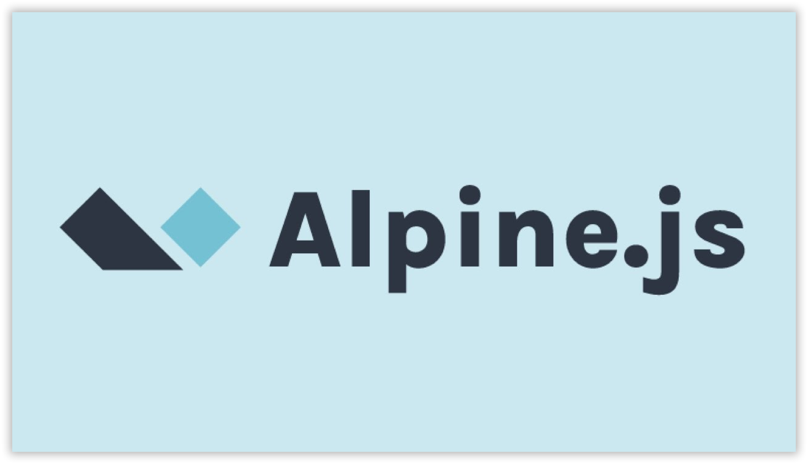
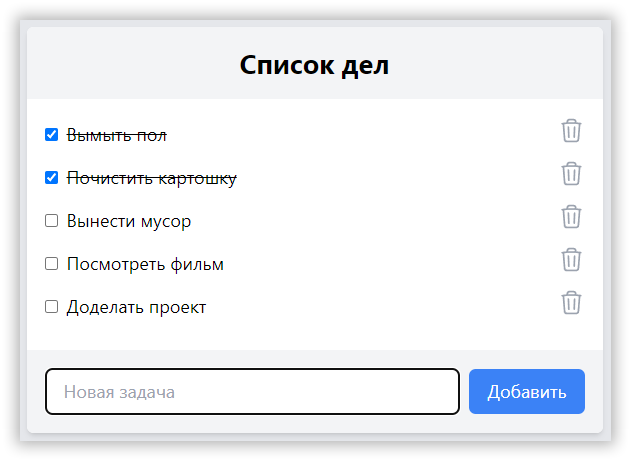

Доброго времени суток! В эфире новый цикл статей. Сегодня мы поговорим о JS фреймворках, и первый наш гость в студии - Alpine.js, легковесная библиотека для удобного управления поведением элементов HTML-разметки.

<!-- more -->



## В этой серии

- Часть 1: создание компонента на Alpine.js ⬅️ вы здесь
- [Часть 2: почему Vue?](../znakomstvo-s-populyarnymi-js-freymvorkami-chast-2/index.md){ data-preview }
- [Часть 3: знакомство с React](../znakomstvo-s-populyarnymi-js-freymvorkami-chast-3/index.md){ data-preview }
- [Часть 4: а может Preact?](../znakomstvo-s-populyarnymi-js-freymvorkami-chast-4/index.md){ data-preview }
- [Часть 5: Svelte тоже неплох](../znakomstvo-s-populyarnymi-js-freymvorkami-chast-5/index.md){ data-preview }
- [Часть 6: но и Solid красавчик](../znakomstvo-s-populyarnymi-js-freymvorkami-chast-6/index.md){ data-preview }
- [Заключение: подводим итоги](../znakomstvo-s-populyarnymi-js-freymvorkami-zaklyuchenie/index.md){ data-preview }

## Вступление

Есть расхожее утверждение, что всё познается в сравнении. Рассмотрим на простых примерах сходства и различия Alpine.js, Vue.js, React и Svelte. В этой и последующих частях этой серии мы создадим одно и то же приложение, но с помощью разных фреймворков.

Проекты типа счётчика я тут реализовывать не буду (для этого есть платные курсы), а вот простенькое приложение TODO с добавлением и удалением задач мы с вами сделать попробуем.

Для начала скачайте папку [вёрстка](https://drive.proton.me/urls/ZS9YYVXK38#mY7BnjYmTPGg) с готовой разметкой нашего приложения. Откройте `index.html` в браузере и посмотрите дизайн. Для простоты используются классы Tailwind CSS:



Приложение простое — список задач с кнопкой «Удалить» для каждого, а также с формой для добавления новых. Выполненные задачи зачёркнуты, имеют установленную галочку в списке.

Теперь создайте где-нибудь папку `projects`. В ней мы будем создавать директории с файлами проектов для каждого из героев этого цикла статей. А поможет нам в этом непростом деле [Vite](https://vitejs.ru) (на французском читается как «ВИТ», в шутку можете называть _Витей_), универсальный инструмент сборки. Перейдем в созданную папку.

Первый проект мы реализуем с помощью Alpine.js. Фреймворк Alpine — это коллекция из 15 атрибутов, 6 свойств и 2 методов (данные могут измениться). Для него не требуется создавать отдельные шаблоны, вы просто можете взять готовую разметку, добавить в нее нужные директивы Alpine и страница (или её часть) станет реактивной.

## Подготовка основных файлов

Итак, убедитесь, что вы находитесь внутри директории `projects`. Откройте в ней командную строку и последовательно выполните следующие команды:

=== ":simple-npm: npm"
    ```bash
    npm create vite@latest alpine-todo -- --template vanilla
    npm i alpinejs
    ```

    Теперь перейдите в созданную папку `alpine-todo` и установите [UnoCSS](https://dragomano.github.io/unocss-russian/):

    ```bash
    npm i -D unocss @iconify-json/heroicons
    ```

=== ":simple-pnpm: pnpm"
    ```bash
    pnpm create vite alpine-todo --template vanilla
    pnpm add alpinejs
    ```

    Теперь перейдите в созданную папку `alpine-todo` и установите [UnoCSS](https://dragomano.github.io/unocss-russian/):

    ```bash
    pnpm add -D unocss @iconify-json/heroicons
    ```

=== ":simple-yarn: Yarn"
    ```bash
    yarn create vite alpine-todo --template vanilla
    yarn add alpinejs
    ```

    Теперь перейдите в созданную папку `alpine-todo` и установите [UnoCSS](https://dragomano.github.io/unocss-russian/):

    ```bash
    yarn add -D unocss @iconify-json/heroicons
    ```

=== ":simple-bun: Bun"
    ```bash
    bun create vite alpine --template vanilla
    bun add alpinejs
    ```

    Теперь перейдите в созданную папку `alpine-todo` и установите [UnoCSS](https://dragomano.github.io/unocss-russian/):

    ```bash
    bun add -D unocss @iconify-json/heroicons
    ```

и обновите `vite.config.js`:

```js
import { defineConfig } from 'vite'
import UnoCSS from 'unocss/vite'

export default defineConfig({
  plugins: [UnoCSS()],
})
```

Скрипт будет проверять файл `index.html`, а также любые `js` файлы в папке `src` и подгружать определения только тех CSS-классов, которые обнаружатся в этих файлах.

Добавьте `uno.config.js`:

```js
import { defineConfig, presetIcons, presetWind4 } from 'unocss'

export default defineConfig({
  presets: [
    presetWind4(),
    presetIcons(),
  ],
})
```

Вообще, создавать сложные компоненты в Alpine.js дело неблагодарное. Вы можете либо писать все свои скрипты внутри тега `script` в HTML-файлах, либо создавать отдельные файлы с разделением в зависимости от целей и задач. Сторонние плагины рассматривать не будем. Выберем второй вариант и создадим файл `todos.js` в папке `src`:

```js
export default function todos() {
  return {};
}
```

Обновите `main.js` и перенесите его тоже в папку `src`:

```js
import Alpine from 'alpinejs';
import 'virtual:uno.css'
import todos from './todos';

Alpine.data('todos', todos);
Alpine.start();
```

Также обновите ссылку на него в `index.html`:

```html
<script type="module" src="/src/main.js"></script>
```

Из файла `вёрстка/index.html` скопируйте полностью всю разметку внутри тега `body` и перенесите в `index.html` проекта, вместо `<div id="root"></div>`. Не забудьте добавить тегу `body` класс `bg-gray-200`:

```html
<body class="bg-gray-200">
  ...
  <script type="module" src="/src/main.js"></script>
</body>
```

Теперь с помощью директивы `x-data` привяжем наш компонент `todos` к корневому блоку `div`:

```html
<div
  class="max-w-sm md:max-w-lg mx-auto my-10 bg-white rounded-md shadow-md overflow-hidden"
  x-data="todos()"
></div>
```

!!! note "Примечание"

    Обычно, когда начальных данных не очень много, в `x-data` напрямую указывают объект. Например, `x-data={ counter: 0 }`. Но в нашем случае у нас будет использоваться большой компонент с несколькими методами, поэтому вы просто указываем название функции, возвращающей объект. После этого можно внутри блока с `x-data` использовать переменные и методы, возвращаемые при вызове `todos()`.

Осталось запустить dev-сервер и начать создавать компоненты:

=== ":simple-npm: npm"
    ```bash
    npm run dev
    ```

=== ":simple-pnpm: pnpm"
    ```bash
    pnpm run dev
    ```

=== ":simple-yarn: Yarn"
    ```bash
    yarn dev
    ```

=== ":simple-bun: Bun"
    ```bash
    bun run dev
    ```

## Создание компонента

Вернёмся к файлу `src/todos.js`. Первое, что должен возвращать наш компонент, это список задач. Для этого инициализируем переменную `todos`:

```js
export default function todos() {
  return {
    todos: [],
  };
}
```

Внутри этой переменной будут храниться объекты задач. Почему объекты? Потому что с ними проще работать. Ведь у каждой задачи должны быть заголовок и статус. Можно было бы заполнить `todos` объектами задач-примеров вручную, но мы ведь люди ленивые, а потому воспользуемся готовым [JSON-сервером](https://jsonplaceholder.typicode.com/todos), как раз предназначенным для тестирования и разработки подобного рода вещей.

Нам потребуется создать метод для получения списка задач и сохранения его в переменной `todos`.

Чтобы не загромождать страницу 200 задачами, предоставляемыми сервером, берем первые 10. Для наших целей этого будет вполне достаточно:

```js
export default function todos() {
  return {
    todos: [],

    fetchTasks: function () {
      fetch('https://jsonplaceholder.typicode.com/todos')
        .then((response) => response.json())
        .then((data) => {
          this.todos = data.slice(0, 10);
        });
    },
  };
}
```

Теперь настроим выполнение этого метода при обновлении страницы. Для этого в Alpine.js можно использовать директиву `x-init`:

```html
<div
  class="max-w-sm md:max-w-lg mx-auto my-10 bg-white rounded-md shadow-md overflow-hidden"
  x-data="todos()"
  x-init="fetchTasks()"
></div>
```

!!! note "Примечание"

    Можно не указывать директиву `x-init` в разметке, а просто определить функцию `init`, возвращающую метод `this.fetchTasks()` в используемом объекте данных.

С помощью `console.log` можно убедиться, что в переменной `this.todos` теперь находится список из 10 задач. Осталось заменить наши 5 задач-примеров на эти получаемые 10 задач. Но как? Мы же не будем вручную добавлять 10 одинаковых блоков с задачами в разметку, а потом получать для каждого данные из массива `todos`? Разумеется, нет. Для этого в JS используются циклы. Уберем из нашей разметки все элементы `li`, кроме одного, а затем обернём его тегом `template`:

```html
<template x-for="todo in todos" :key="todo.id">
  <li class="flex items-center mb-2 hover:cursor-pointer">
    <input type="checkbox" class="mr-2" checked />
    <span class="line-through">Вымыть пол</span>
    <div class="ml-auto text-gray-400 hover:text-gray-600">
      <button class="i-heroicons-trash w-6 h-6" />
    </div>
  </li>
</template>
```

!!! note "Примечание"

    Тег `template` не виден на странице, зато может отображать свое содержимое в зависимости от условия `x-if` или `x-show`. Его удобно использовать для хранения часто используемых блоков кода, как в случае с элементами списка.

Конструкция `x-for="todo in todos` сделает за нас всю работу — отобразит каждый из элементов массива `todos` в виде содержимого внутри элемента `template`. Атрибут `:key` должен содержать уникальное значение (в данном случае это идентификатор каждой задачи), для нормальной работы `x-for`.

!!! note "Примечание"

    В тех редких случаях, когда в используемых данных нет уникальных значений типа идентификатора, можно использовать индекс, генерируемый циклом. Например: `<template x-for="(todo, index) in todos" :key="index">`

Далее, реализуем метод `toggleTask` для переключения статуса задачи при клике на элементе списка, и привяжем этот статус к элементу `input type="checkbox"`:

```js
export default function todos() {
  return {
    // ...

    toggleTask: function (id) {
      this.todos = this.todos.map((t) =>
        t.id === id ? { ...t, completed: !t.completed } : t,
      );
    },
  };
}
```

```html
<li class="flex items-center mb-2 hover:cursor-pointer" @click="toggleTask(todo.id)">
  <input type="checkbox" class="mr-2" :checked="todo.completed" />
</li>
```

Атрибут `@click="toggleTask(todo.id)"` у элемента `li` отвечает за вызов метода `toogleTodo` при клике на элементе списка.

!!! note "Примечание"

    Директива `x-on:` (или её сокращённая запись `@`) заменяет длинное выражение `element.addEventListener`, которое приходилось писать раньше в скриптах, чтобы вызывать тот или иной метод в зависимости от конкретного события. Хотя в современном JavaScript уже без проблем можно писать так: `onclick="func()"`

Однако мы всё ещё видим одинаковые задачи. Нужно заменить `<span class="line-through">Вымыть пол</span>`:

```html
<span :class="{ 'line-through': todo.completed }" x-text="todo.title"></span>
```

Готово, теперь у каждой задачи свой заголовок и статус. Попробуйте. При нажатии на любой пункт в списке происходит поиск элемента с выбранным `id` среди объектов в массиве `todos`, а затем переключение свойства `completed` у найденного объекта.

А как насчёт удаления? Добавим атрибут `@click` и метод `deleteTask` для соответствующей кнопки:

```html
<button class="text-gray-400 hover:text-gray-600" @click="deleteTask(todo.id)"></button>
```

```js
export default function todos() {
  return {
    // ...

    deleteTask: function (id) {
      this.todos = this.todos.filter((todo) => todo.id !== id);
    },
  };
}
```

Как видите, мы не удаляем задачи, а просто фильтруем их.

Осталось реализовать добаление задач. Для этого добавим атрибуты `x-ref` и `x-model` к элементу `input type="text"`, а также создадим метод `addTask` и привяжем его к кнопке «Добавить»:

```html
<div class="flex items-center">
  <input
    x-ref="newTask"
    x-model="inputValue"
    type="text"
    class="flex-1 mr-2 py-2 px-4 rounded-md border border-gray-300"
    placeholder="Новая задача"
    autofocus
  />
  <button
    class="bg-blue-500 hover:bg-blue-600 text-white py-2 px-4 rounded-md"
    @click="addTask()"
  >
    Добавить
  </button>
</div>
```

`x-ref="newTask"` нужен для удобного обращения к этому элементу, чтобы не искать его через `document.querySelector('input type="text"')`, а `x-model` своего рода _синтаксический сахар_ для замены конструкции вида `name="inputValue" @input="inputValue = $event.target.value"`:

```js
export default function todos() {
  return {
    todos: [],
    inputValue: '',

    // ...

    addTask: function () {
      if (!this.inputValue) {
        this.$refs.newTask.focus();
        return;
      }

      this.todos = [
        ...this.todos,
        {
          id: crypto.randomUUID(),
          title: this.inputValue,
          completed: false,
        },
      ];

      this.inputValue = '';
      this.$refs.newTask.focus();
    },
  };
}
```

С помощью выражения `this.$refs.newTask.focus();` мы фокусируемся на поле для ввода заголовка новой задачи после добавления, чтобы лишний раз не кликать мышкой — на случай, если хотим добавить несколько задач подряд. После этого в массив `todos` пушим новый объект и очищаем поле `inputValue`.

Последний штрих - будем отображать наш список только когда он содержит задачи. В этом нам поможет директива `x-show`:

```html
<ul class="list-none p-4" x-show="todos.length"></ul>
```

## Документация

Если вы заинтересовались Alpine.js, вам наверняка пригодится [русскоязычная документация](https://alpinejs.dragomano.ru).

## Заключение

Итак, мы закончили наше простое приложение **TODO** на Alpine.js:

- познакомились с основными директивами
- создали и подключили компонент `todos`
- настроили получение списка задач через JSON API
- реализовали переключение статуса, добавление и удаление задач

Alpine.js идеален, когда нам нужно настроить реактивное поведение в небольшом приложении с одним-двумя компонентами. Но когда приложение разрастается и количество компонентов увеличивается, имеет смысл воспользоваться другими фреймворками.

В [следующей части](../znakomstvo-s-populyarnymi-js-freymvorkami-chast-2/index.md) этой серии мы узнаем, как перевести наше приложение на Vue.js.

---

[Скачать готовый проект](https://gitlab.com/dragomano/alpine-todo){ .md-button .md-button--primary }
