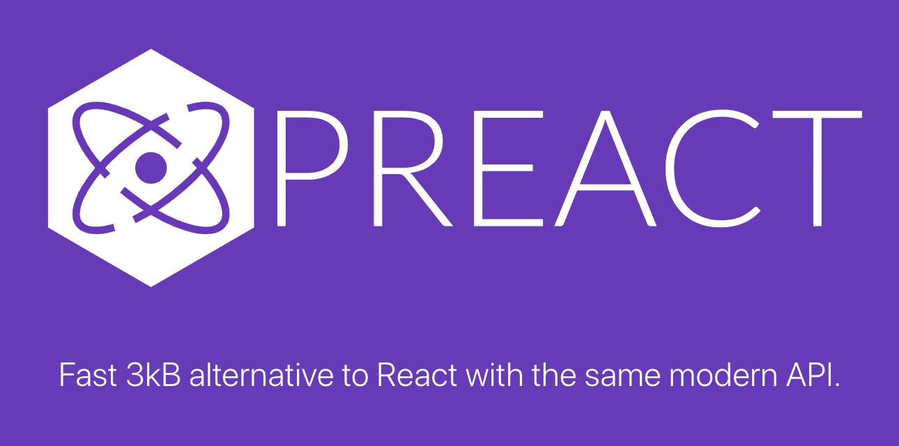

Сегодня мы познакомимся с более лёгкой альтернативой React — библиотекой Preact. Посмотрим на её сходства и различия с React.

<!-- more -->



## В этой серии

- [Часть 1: создание компонента на Alpine.js](../znakomstvo-s-populyarnymi-js-freymvorkami-chast-1/index.md){ data-preview }
- [Часть 2: почему Vue?](../znakomstvo-s-populyarnymi-js-freymvorkami-chast-2/index.md){ data-preview }
- [Часть 3: знакомство с React](../znakomstvo-s-populyarnymi-js-freymvorkami-chast-3/index.md){ data-preview }
- Часть 4: а может Preact? ⬅️ вы здесь
- [Часть 5: Svelte тоже неплох](../znakomstvo-s-populyarnymi-js-freymvorkami-chast-5/index.md){ data-preview }
- [Часть 6: но и Solid красавчик](../znakomstvo-s-populyarnymi-js-freymvorkami-chast-6/index.md){ data-preview }
- [Заключение: подводим итоги](../znakomstvo-s-populyarnymi-js-freymvorkami-zaklyuchenie/index.md){ data-preview }

## Вступление

Если вы в шоке от размера проекта на React, то, во-первых, не забывайте, что речь о килобайтах, а во-вторых, посмотрите на минималистичную альтернативу — [Preact](https://preactjs.com). За несколькими исключениями, это тот же React, с тем же API, но с плюсами (например: меньший размер после сборки, отсутствие необходимости переименовывать атрибуты HTML в `camelCase`, Signals и т. д.). К примеру, чтобы переписать [предыдущий проект](../znakomstvo-s-populyarnymi-js-freymvorkami-chast-3/index.md) на Preact, в компонентах вам понадобится заменить лишь верхние строчки (импорты). Небольшие изменения в `main.jsx`, `package.json` и т. д. не в счёт. Однако мы рассмотрим реализацию с нуля, как будто бы у нас нет проекта на React.

## Подготовка

Как и прежде, перейдите в папку `projects`, откройте консоль и запустите следующую команду:

=== ":simple-npm: npm"
    ```bash
    npm create vite@latest preact-todo -- --template preact
    ```

    Теперь перейдите в созданную папку `preact-todo` и установите `tailwindcss`:

    ```bash
    npm i -D tailwindcss@next @tailwindcss/vite@next
    ```

=== ":simple-pnpm: pnpm"
    ```bash
    pnpm create vite preact-todo --template preact
    ```

    Теперь перейдите в созданную папку `preact-todo` и установите `tailwindcss`:

    ```bash
    pnpm add -D tailwindcss@next @tailwindcss/vite@next
    ```

=== ":simple-yarn: Yarn"
    ```bash
    yarn create vite preact-todo --template preact
    ```

    Теперь перейдите в созданную папку `preact-todo` и установите `tailwindcss`:

    ```bash
    yarn add -D tailwindcss@next @tailwindcss/vite@next
    ```

=== ":simple-bun: Bun"
    ```bash
    bun create vite preact --template preact
    ```

    Теперь перейдите в созданную папку `preact-todo` и установите `tailwindcss`:

    ```bash
    bun add -D tailwindcss@next @tailwindcss/vite@next
    ```

и обновите `vite.config.js`:

```js
import { defineConfig } from 'vite'
import preact from '@preact/preset-vite'
import tailwindcss from '@tailwindcss/vite';

// https://vitejs.dev/config/
export default defineConfig({
  plugins: [preact(), tailwindcss()],
})
```

В файл `src/index.css` замените всё содержимое на следующий код:

```css
@import "tailwindcss";
```

Не забудьте добавить класс `bg-gray-200` элементу `body` в файле `index.html`, чтобы у страницы был серый фон.

Запускаем проект:

=== ":simple-npm: npm"
    ```bash
    npm run dev
    ```

=== ":simple-pnpm: pnpm"
    ```bash
    pnpm run dev
    ```

=== ":simple-yarn: Yarn"
    ```bash
    yarn dev
    ```

=== ":simple-bun: Bun"
    ```bash
    bun run dev
    ```

В Preact в ходу как классовые, так и функциональные компоненты. Для больше удобства и сравнения с React мы будем использовать последние.

## Корневой компонент

Базовый компонент `app.jsx`, по сути, будет мало чем отличаться от аналогичного из проекта на React:

```jsx
import TodoList from './components/TodoList';

function App() {
  return <TodoList title='Список дел' />;
}

export default App;
```

А вот дальше появятся небольшие различия.

## TodoList

Во-первых, мы используем всё те же хуки, что и в React, но импортируем их уже из пространства `preact/hooks`:

```jsx
import { useState, useEffect } from 'preact/hooks';
import TodoItem from './TodoItem';
import TodoForm from './TodoForm';

function TodoList(props) {
  const [todos, setTodos] = useState([]);

  // Подгружаем задачи с сервера при загрузке страницы
  useEffect(() => {
    fetch('https://dummyapi.online/api/todos')
      .then((response) => response.json())
      .then((data) => {
        setTodos(data.slice(0, 10));
      });
  }, []);

  // Добавляем задачу в массив, если у нее есть заголовок
  const addTodo = (title) => {
    if (!title) return;

    const id = Math.max(...todos.map((obj) => obj.id));

    setTodos((prevTodos) => [
      ...prevTodos,
      {
        todos.length ? id + 1 : 1,
        title: title,
        completed: false,
      },
    ]);
  };

  // Меняем статус задачи
  const toggleTodo = (id) => {
    setTodos((prevTodos) => prevTodos.map((t) =>
      t.id === id ? { ...t, completed: !t.completed } : t
    ));
  };

  // Удаляем задачу
  const deleteTodo = (id) => {
    setTodos((prevTodos) => prevTodos.filter((todo) => todo.id !== id));
  };

  // Отображаем задачи и форму для добавления новой
  return (
    <div class='max-w-sm md:max-w-lg mx-auto my-10 bg-white rounded-md shadow-md overflow-hidden'>
      <h1 class='text-2xl font-bold text-center py-4 bg-gray-100'>{props.title}</h1>
      {todos.length > 0 && (
        <ul class='list-none p-4'>
          {todos.map((todo) => (
            <TodoItem key={todo.id} todo={todo} onToggle={toggleTodo} onRemove={deleteTodo} />
          ))}
        </ul>
      )}
      <TodoForm onSubmit={addTodo} />
    </div>
  );
}

export default TodoList;
```

И нам больше не нужно заменять `class` на `className` в разметке!

## TodoItem

Здесь мы вообще никаких хуков не используем, а просто принимаем из родительского компонента _объект задачи_, _функцию переключения_ и _функцию удаления_ в качестве параметров (`props`):

```jsx
function TodoItem({ todo, onToggle, onRemove }) {
  // Обработчик переключения статуса задачи
  const toggleTodo = () => onToggle(todo.id);
  // Обработчик удаления задачи
  const deleteTodo = () => onRemove(todo.id);

  return (
    <li class='flex items-center mb-2 hover:cursor-pointer' onClick={toggleTodo}>
      <input type='checkbox' class='mr-2' checked={todo.completed} readOnly />
      <span class={todo.completed ? 'line-through' : ''}>{todo.title}</span>
      <div class='ml-auto'>
        <button class='text-gray-400 hover:text-gray-600' onClick={deleteTodo}>
          <svg
            xmlns='http://www.w3.org/2000/svg'
            fill='none'
            viewBox='0 0 24 24'
            stroke-width='1.5'
            stroke='currentColor'
            class='w-6 h-6'
          >
            <path
              stroke-linecap='round'
              stroke-linejoin='round'
              d='M14.74 9l-.346 9m-4.788 0L9.26 9m9.968-3.21c.342.052.682.107 1.022.166m-1.022-.165L18.16 19.673a2.25 2.25 0 01-2.244 2.077H8.084a2.25 2.25 0 01-2.244-2.077L4.772 5.79m14.456 0a48.108 48.108 0 00-3.478-.397m-12 .562c.34-.059.68-.114 1.022-.165m0 0a48.11 48.11 0 013.478-.397m7.5 0v-.916c0-1.18-.91-2.164-2.09-2.201a51.964 51.964 0 00-3.32 0c-1.18.037-2.09 1.022-2.09 2.201v.916m7.5 0a48.667 48.667 0 00-7.5 0'
            />
          </svg>
        </button>
      </div>
    </li>
  );
}

export default TodoItem;
```

## TodoForm

```jsx
import { useRef } from 'preact/hooks';

function TodoForm(props) {
  // Создаем ссылку для привязки к элементу `input` с помощью атрибута `ref` (см. разметку)
  const inputRef = useRef(null);

  // Обработчик добавления новой задачи
  const addTodo = () => {
    props.onSubmit(inputRef.current.value);
    inputRef.current.value = '';
    inputRef.current.focus();
  };

  // Обработчик клавиши `Enter`
  const handleKeyDown = (e) => {
    if (e.keyCode !== 13) return;

    addTodo();
  };

  return (
    <div class='p-4 bg-gray-100'>
      <div class='flex items-center'>
        <input
          ref={inputRef}
          type='text'
          class='flex-1 mr-2 py-2 px-4 rounded-md border border-gray-300'
          placeholder='Новая задача'
          autofocus
          onKeyDown={handleKeyDown}
        />
        <button
          class='bg-blue-500 hover:bg-blue-600 text-white py-2 px-4 rounded-md'
          onClick={addTodo}
        >
          Добавить
        </button>
      </div>
    </div>
  );
}

export default TodoForm;
```

## Сигналы

Итак, у нас всё работает и работает согласно задуманному. Но мы можем пойти дальше и улучшить наш проект, внедрив [сигналы](https://preactjs.com/guide/v10/signals), которые, в соответствии с их предназначением, помогут улучшить быстродействие и эргономику нашего небольшого приложения.

Выполните в консоли следующую команду:

```
npm install @preact/signals
```

Согласно документации, сигналы — объекты со свойством `value`, содержащим некоторое значение. Это значение может меняться, но сами сигналы — нет. В глобальном пространстве принято использовать объект `signal`, импортируемый из пространства `@preact/signals`, но поскольку мы работаем с функциональными компонентами, нам хватит и локального доступа к нашим задачам. Для этого мы воспользуемся хуком `useSignal`:

```jsx
import { useSignal } from '@preact/signals';
import TodoItem from './TodoItem';
import TodoForm from './TodoForm';

function TodoList(props) {
  // Устанавливаем начальное значение — пустой массив
  const todos = useSignal([]);

  // Обращаемся к нашей переменной теперь так:
  console.log(todos.value);

  // ...
}
```

Для изменения `todos` нам больше не потребуется некая функция типа `setTodos`, теперь достаточно присвоить значение свойству `value`:

```js
todos.value = 'новое значение';
```

Для безопасной замены хука `useEffect` в сигналах есть аналог — `useSignalEffect`:

```js
useSignalEffect(() => {
  fetch('https://dummyapi.online/api/todos')
    .then((response) => response.json())
    .then((data) => (todos.value = data.slice(0, 10)));
});
```

Теперь компонент `TodoList.jsx` будет выглядеть так:

```jsx
import { useSignal, useSignalEffect } from '@preact/signals';
import TodoItem from './TodoItem';
import TodoForm from './TodoForm';

function TodoList(props) {
  const todos = useSignal([]);

  useSignalEffect(() => {
    fetch('https://dummyapi.online/api/todos')
      .then((response) => response.json())
      .then((data) => (todos.value = data.slice(0, 10)));
  });

  const addTodo = (title) => {
    if (!title) return;

    const id = Math.max(...todos.value.map((obj) => obj.id));

    todos.value = [
      ...todos.value,
      {
        id: id + 1,
        title: title,
        completed: false,
      },
    ];
  };

  const toggleTodo = (id) => {
    const index = todos.value.findIndex((todo) => todo.id === id);

    if (index === -1) return;

    todos.value = [
      ...todos.value.slice(0, index),
      { ...todos.value[index], completed: !todos.value[index].completed },
      ...todos.value.slice(index + 1),
    ];
  };

  const deleteTodo = (id) => {
    todos.value = todos.value.filter((todo) => todo.id !== id);
  };

  return (
    <div class='max-w-sm md:max-w-lg mx-auto my-10 bg-white rounded-md shadow-md overflow-hidden'>
      <h1 class='text-2xl font-bold text-center py-4 bg-gray-100'>{props.title}</h1>
      {todos.value.length > 0 && (
        <ul class='list-none p-4'>
          {todos.value.map((todo) => (
            <TodoItem key={todo.id} todo={todo} onToggle={toggleTodo} onRemove={deleteTodo} />
          ))}
        </ul>
      )}
      <TodoForm onSubmit={addTodo} />
    </div>
  );
}

export default TodoList;
```

Идём дальше. Компонент `TodoItem` остаётся без изменений, поскольку не использует хуков, а лишь принимает входные параметры в компоненте `TodoList`. А компонент `TodoForm`? И в нём тоже нечего менять, поскольку там лишь используется ссылка на элемент `input`, для добавления новых задач и установки фокуса ввода после добавления. Если бы нам не требовалось фокусироваться на элементе, можно было бы реализовать изменение значения `input` через сигнал, с очищением после добавления.

## Для справки

Помимо рассмотренных `useSignal` и `useSignalEffect` есть в сигналах ещё один хук — `useComputed`. С помощью него можно создавать _вычисляемые_ сигналы, зависящие от исходного значения другого сигнала. Например:

```jsx
import { useSignal, useComputed } from '@preact/signals';

function ExampleComponent() {
  // Первый счётчик, с начальным значением 0
  const counter = useSignal(0);

  // Второй счётчик, зависящий от первого и имеющий значение, которое всегда в 2 раза больше значения первого счётчика
  const doubleCounter = useComputed(() => counter.value * 2);

  return (
    <div>
      <p>
        {counter} x 2 = {doubleCounter}
      </p>
      <button onClick={() => counter.value++}>Нажми меня</button>
    </div>
  );
}
```

!!! note "Примечание"

    Здесь прослеживается аналогия с [`ref`](https://v3.ru.vuejs.org/ru/guide/reactivity-fundamentals.html#%D1%81%D0%BE%D0%B7%D0%B4%D0%B0%D0%BD%D0%B8%D0%B5-%D0%B0%D0%B2%D1%82%D0%BE%D0%BD%D0%BE%D0%BC%D0%BD%D1%8B%D1%85-%D1%81%D1%81%D1%8B%D0%BB%D0%BE%D0%BA-%D0%BD%D0%B0-%D1%80%D0%B5%D0%B0%D0%BA%D1%82%D0%B8%D0%B2%D0%BD%D1%8B%D0%B5-%D0%B7%D0%BD%D0%B0%D1%87%D0%B5%D0%BD%D0%B8%D1%8F) и [`computed`](https://v3.ru.vuejs.org/ru/guide/reactivity-computed-watchers.html#%D0%B2%D1%8B%D1%87%D0%B8%D1%81%D0%BB%D1%8F%D0%B5%D0%BC%D1%8B%D0%B5-%D1%81%D0%B2%D0%BE%D0%B8%D1%81%D1%82%D0%B2%D0%B0) из Vue.js

!!! note "Примечание"

    Вы можете использовать сигналы и в приложениях на React. Для этого есть аналогичные хуки `useSignal`, `useSignalEffect` и `useComputed`, доступные в React-компонентах после импорта `@preact/signals-react`.

## Документация

Если вы заинтересовались Preact, загляните на [этот сайт](https://preactjs.com/guide/v10/getting-started) (в меню можно выбрать русский язык).

## Заключение

Итак, мы перенесли наше простое приложение **TODO** на Preact.js:

- узнали некоторые отличия от React
- создали функциональные компоненты на Preact
- познакомились с сигналами и успешно их внедрили

В [следующей части](../znakomstvo-s-populyarnymi-js-freymvorkami-chast-5/index.md) этой серии мы познакомимся с маленьким и шустрым Svelte.

---

[Скачать готовый проект](https://gitlab.com/dragomano/preact-todo){ .md-button .md-button--primary }
