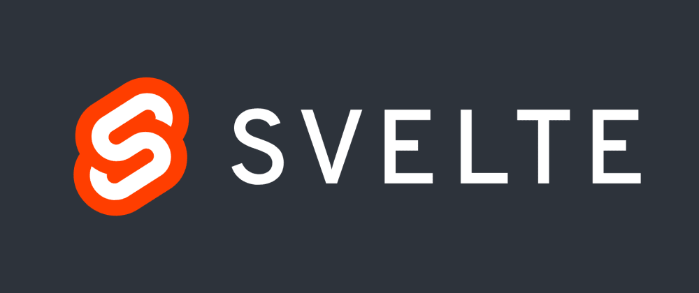

В рунете пишут, что знание Svelte никому не нужно, мол, React-программисты в приоритете. Не верьте. Никогда не знаешь, что будет завтра.

<!-- more -->



## В этой серии

- [Часть 1: создание компонента на Alpine.js](../znakomstvo-s-populyarnymi-js-freymvorkami-chast-1/index.md){ data-preview }
- [Часть 2: почему Vue?](../znakomstvo-s-populyarnymi-js-freymvorkami-chast-2/index.md){ data-preview }
- [Часть 3: знакомство с React](../znakomstvo-s-populyarnymi-js-freymvorkami-chast-3/index.md){ data-preview }
- [Часть 4: а может Preact?](../znakomstvo-s-populyarnymi-js-freymvorkami-chast-4/index.md){ data-preview }
- Часть 5: Svelte тоже неплох ⬅️ вы здесь
- [Часть 6: но и Solid красавчик](../znakomstvo-s-populyarnymi-js-freymvorkami-chast-6/index.md){ data-preview }
- [Заключение: подводим итоги](../znakomstvo-s-populyarnymi-js-freymvorkami-zaklyuchenie/index.md){ data-preview }

## Вступление

Если вы относитесь к любителям минимализма во всём, в том числе в размерах компилируемых файлов, то Svelte — ваш выбор. Почему? Читайте далее.

## Подготовка

Итак, перейдите в папку `projects`, откройте консоль и запустите следующую команду:

=== ":simple-npm: npm"
    ```bash
    npm create vite@latest svelte-todo -- --template svelte
    ```

    Теперь перейдите в созданную папку `svelte-todo` и установите [UnoCSS](https://dragomano.github.io/unocss-russian/):

    ```bash
    npm i -D unocss @iconify-json/heroicons
    ```

=== ":simple-pnpm: pnpm"
    ```bash
    pnpm create vite svelte-todo --template svelte
    ```

    Теперь перейдите в созданную папку `svelte-todo` и установите [UnoCSS](https://dragomano.github.io/unocss-russian/):

    ```bash
    pnpm add -D unocss @iconify-json/heroicons
    ```

=== ":simple-yarn: Yarn"
    ```bash
    yarn create vite svelte-todo --template svelte
    ```

    Теперь перейдите в созданную папку `svelte-todo` и установите [UnoCSS](https://dragomano.github.io/unocss-russian/):

    ```bash
    yarn add -D unocss @iconify-json/heroicons
    ```

=== ":simple-bun: Bun"
    ```bash
    bun create vite svelte --template svelte
    ```

    Теперь перейдите в созданную папку `svelte-todo` и установите [UnoCSS](https://dragomano.github.io/unocss-russian/):

    ```bash
    bun add -D unocss @iconify-json/heroicons
    ```

и обновите `vite.config.js`:

```js
import { defineConfig } from 'vite'
import UnoCSS from 'unocss/vite'
import { svelte } from '@sveltejs/vite-plugin-svelte'

// https://vitejs.dev/config/
export default defineConfig({
  plugins: [UnoCSS(), svelte()],
});
```

Добавьте `uno.config.js`:

```js
import { defineConfig, presetIcons, presetWind4 } from 'unocss'

export default defineConfig({
  presets: [
    presetWind4(),
    presetIcons(),
  ],
})
```

Файл `src/main.js`:

```js
import { mount } from 'svelte'
import 'virtual:uno.css'
import App from './App.svelte'

const app = mount(App, {
  target: document.getElementById('app'),
})

export default app
```

Файл `src/App.svelte`:

```html
<script>
  import TodoList from './lib/TodoList.svelte';
</script>

<TodoList title="Список дел" />
```

Осталось запустить dev-сервер и начать создавать компоненты:

=== ":simple-npm: npm"
    ```bash
    npm run dev
    ```

=== ":simple-pnpm: pnpm"
    ```bash
    pnpm run dev
    ```

=== ":simple-yarn: Yarn"
    ```bash
    yarn dev
    ```

=== ":simple-bun: Bun"
    ```bash
    bun run dev
    ```

## Компонент `TodoList`

Как и прежде, начнём с основного компонента. Создайте в директории `src/lib` файл `TodoList.svelte`:

```html+twig
<script>
  let { title = '' } = $props();
  let todos = $state([]);
</script>

<div class="max-w-sm md:max-w-lg mx-auto my-10 bg-white rounded-md shadow-md overflow-hidden">
  <h1 class="text-2xl font-bold text-center py-4 bg-gray-100">{title}</h1>
  {#if todos.length}
    <ul class="list-none p-4">

    </ul>
  {/if}
</div>
```

Наш компонент будет принимать входящий параметр `title`, поэтому в скрипте **Svelte** мы пишем `  let { title = '' } = $props();`. Привыкайте.

Далее устанавливаем переменную `todos`, которая будет массивом, хранящим список дел. Для этого обернём начальное значение с помощью `$state`:

```html+twig
  let todos = $state([]);
```

!!! note "Примечание"

    В Svelte такие выражения, начинающиеся со знака `$`, называются рунами: `$state`, `$props` и т. д.

А в разметке с помощью условия `if` отображаем список, если массив `todos` не пустой:

```html+twig
{#if todos.length}
  <ul class="list-none p-4">

  </ul>
{/if}
```

Теперь создайте заготовки компонентов `TodoItem.svelte` и `TodoForm.svelte` и импортируйте их, а затем используйте в разметке:

```html+twig
<script>
  import TodoItem from './TodoItem.svelte';
  import TodoForm from './TodoForm.svelte';

  // ...
</script>

<div class="max-w-sm md:max-w-lg mx-auto my-10 bg-white rounded-md shadow-md overflow-hidden">
  <h1 class="text-2xl font-bold text-center py-4 bg-gray-100">{title}</h1>
  {#if todos.length}
    <ul class="list-none p-4">
      {#each todos as todo (todo.id)}
        <TodoItem {todo} />
      {/each}
    </ul>
  {/if}
  <TodoForm />
</div>
```

Здесь мы видим `each` — аналог цикла `for`. Обратите внимание, в каком порядке указаны переменные, а также индекс (`t.id`):

```html+twig
{#each todos as t (t.id)}
  <TodoItem {todo} />
{/each}
```

!!! note "Примечание"

    В Svelte подобные конструкции начинаются с `#`, а заканчиваются `/`. В цепочке условий `if-else` ещё добавляется и двоеточие: `{#if x}<span>Х больше 0</span>{:else}<span>X меньше 0</span>{/if}`

Теперь добавим метод для запроса списка задач с JSON-сервера, а также настроим выполнение этого метода при загрузке страницы:

```html+twig
<script>
  import TodoItem from './TodoItem.svelte';
  import TodoForm from './TodoForm.svelte';

  let { title = '' } = $props();
  let todos = $state([]);

  $effect(() => {
    (async () => {
      await fetch('https://dummyjson.com/todos')
        .then((response) => response.json())
        .then((data) => {
          todos = data.todos.slice(0, 10);
        });
    })();
  });
</script>
```

Осталось реализовать методы удаления и добавления задач, которые мы будем передавать в компоненты `TodoItem` и `TodoForm`, соответственно:

```html+twig
<script>
  // ...

  const addTask = (title) => {
    if (!title) return;

    todos = todos.concat({
      id: crypto.randomUUID(),
      todo: title,
      completed: false,
    });
  };

  const toggleTask = (id) => {
    todos = todos.map((t) => (t.id === id ? { ...t, completed: !t.completed } : t));
  };

  const deleteTask = (id) => {
    todos = todos.filter((todo) => todo.id !== id);
  };
</script>

<div class="max-w-sm md:max-w-lg mx-auto my-10 bg-white rounded-md shadow-md overflow-hidden">
  <h1 class="text-2xl font-bold text-center py-4 bg-gray-100">{title}</h1>
  {#if todos.length}
    <ul class="list-none p-4">
      {#each todos as t (t.id)}
        <TodoItem task={t} toggle={() => toggleTask(t.id)} remove={() => deleteTask(t.id)} />
      {/each}
    </ul>
  {/if}
  <TodoForm submit={addTask} />
</div>
```

!!! note "Примечание"

    Как вы могли заметить, в Svelte реактивность включается только при прямом присваивании. Например, чтобы обновить наш список дел, недостаточно использовать обычные методы типа `push` и т. п., нужно обязательно использовать знак равенства: `todos = новое значение`. Именно поэтому реактивные переменные объявляются с помощью `let`, а не `const`.

## Компонент `TodoItem`

Теперь допишем компонент TodoItem. Нам нужны методы переключения и удаления задач:

```html+twig
<script>
  let { task = $bindable(), toggle, remove } = $props();
</script>
```

Осталось связать написанные методы с соответствующими кнопками в разметке:

```html+twig
<li class='flex items-center mb-2 hover:cursor-pointer' onclick={toggle}>
  <input type='checkbox' class='mr-2' bind:checked={task.completed} />
  <span class:line-through={task.completed}>{task.title}</span>
  <div class="ml-auto text-gray-400 hover:text-gray-600">
    <button class="i-heroicons-trash w-6 h-6" onclick={remove}></button>
  </div>
</li>
```

Здесь мы знакомимся с директивой `bind:`, которая связывает атрибут `checked` чекбокса с соответствующим значением `todo.completed`.

Также здесь можно увидеть изменение класса в зависимости от значения переменной: `<span class:line-through={todo.completed}>`.

## Компонент `TodoForm`

И напоследок реализуем добавление задачи. Нам опять понадобится передача события.

```js
<script>
  let { submit } = $props();
  let input = $state();

  const onclick = () => {
    submit(input.value);

    input.value = '';
    input.focus();
  };
</script>
```

А теперь привяжем с помощью `bind:` состояние `input` к элементу `input`:

```html+twig
<div class='p-4 bg-gray-100'>
  <div class='flex items-center'>
    <input
      bind:this={input}
      type='text'
      class='flex-1 mr-2 py-2 px-4 rounded-md border border-gray-300'
      placeholder='Новая задача'
      autofocus
    />
    <button
      class='bg-blue-500 hover:bg-blue-600 text-white py-2 px-4 rounded-md'
      {onclick}
    >
      Добавить
    </button>
  </div>
</div>
```

## Документация

Если вы заинтересовались Svelte, загляните на [этот сайт](https://svelte.dragomano.ru).

## Заключение

Итак, мы закончили наше простое приложение **TODO** на Svelte:

- успешно адаптировали исходную разметку
- познакомились с некоторыми директивами

В [следующей части](../znakomstvo-s-populyarnymi-js-freymvorkami-chast-6/index.md) мы познакомимся с таинственным солидным конкурентом.

---

[Скачать готовый проект](https://gitlab.com/dragomano/svelte-todo){ .md-button .md-button--primary }
