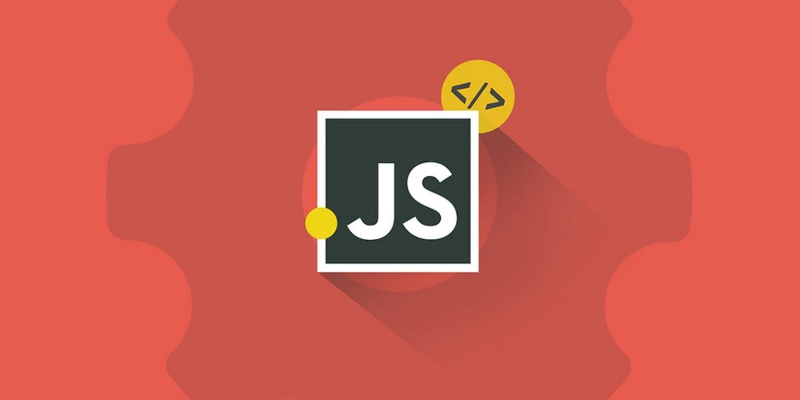

Составляем сводную таблицу особенностей рассмотренных фреймворков.

<!-- more -->

## В этой серии

- [Часть 1: создание компонента на Alpine.js](../znakomstvo-s-populyarnymi-js-freymvorkami-chast-1/index.md){ data-preview }
- [Часть 2: почему Vue?](../znakomstvo-s-populyarnymi-js-freymvorkami-chast-2/index.md){ data-preview }
- [Часть 3: знакомство с React](../znakomstvo-s-populyarnymi-js-freymvorkami-chast-3/index.md){ data-preview }
- [Часть 4: а может Preact?](../znakomstvo-s-populyarnymi-js-freymvorkami-chast-4/index.md){ data-preview }
- [Часть 5: Svelte тоже неплох](../znakomstvo-s-populyarnymi-js-freymvorkami-chast-5/index.md){ data-preview }
- [Часть 6: но и Solid красавчик](../znakomstvo-s-populyarnymi-js-freymvorkami-chast-6/index.md){ data-preview }
- Заключение: подводим итоги ⬅️ вы здесь

На основе всего (плюс добавлю несколько пунктов от себя), что мы прошли в этой серии статей, попробуем сделать такую таблицу:

### Вывод значения переменной в разметке

|                      |                             Пример кода                             |
| -------------------- | :-----------------------------------------------------------------: |
| Обычный JavaScript   |                   `element.innerText = variable`                    |
| Alpine.js            |                  ``                  |
| Vue Options API      | `` или `{{ variable }}` |
| Vue `<script setup>` |                                 ☝️                                  |
| React/Preact         |                      `{variable}`                      |
| Svelte               |                                 ☝️                                  |
| Solid                |                     `{variable()}`                     |

### Вывод переменной с HTML в разметке

|                      |                                                       Пример кода                                                       |
| -------------------- | :---------------------------------------------------------------------------------------------------------------------: |
| Обычный JavaScript   |                                             `element.innerHTML = variable`                                              |
| Alpine.js            |                                            ``                                            |
| Vue Options API      |                                            ``                                            |
| Vue `<script setup>` |                                                           ☝️                                                            |
| React/Preact         | `` или с помощью сторонней библиотеки типа `html-react-parser` |
| Svelte               |                                             `{@html variable}`                                             |
| Solid                |                                          ``                                           |

### Условия в разметке

|                      |                        `if`                         |                                              `if-else`                                               |
| -------------------- | :-------------------------------------------------: | :--------------------------------------------------------------------------------------------------: |
| Обычный JavaScript   |          Любые условия JS только в скрипте          |                                                  👈                                                  |
| Alpine.js            |   `<template x-if="condition">Видно?</template>`    | `<template x-if="condition">Видно?</template>` `<template x-if="!condition">Не видно!</template>` |
| Vue Options API      |       `Видно?`        |              `Видно?` `Не видно!`               |
| Vue `<script setup>` |                         ☝️                          |                                                  ☝️                                                  |
| React/Preact         |       `{condition && (Видно?)}`        |                `{condition ? (Видно?)` ` : (Не видно!)}`                |
| Svelte               |      `{#if condition}Видно?{/if}`      |             `{#if condition}Видно?` `{:else}Не видно!{/if}`             |
| Solid                | `<Show when={condition}>Видно?</Show>` | `<Switch><Match when={condition}>Видно?</Match><Match when={!condition}>Не видно!</Match></Switch>`  |

### Циклы в разметке

|                      |                                           Пример кода                                           |
| -------------------- | :---------------------------------------------------------------------------------------------: |
| Обычный JavaScript   |                                 Любые циклы JS только в скрипте                                 |
| Alpine.js            | `<template x-for="(item, index) in items" :key="index"><li x-text="item.text"></li></template>` |
| Vue Options API      |             `<li v-for="(item, index) in items" :key="index">{{ item.text }}</li>`              |
| Vue `<script setup>` |                                               ☝️                                                |
| React/Preact         |                `{items.map((item, index) => <li key={index}>{item.text}</li>))}`                |
| Svelte               |                  `{#each items as item (item.id)}<li>{item.text}</li>{/each}`                   |
| Solid                |               `<For each={items()}>{(item, index) => <li>{item.text}</li>}</For>`               |

### Привязка событий

|                      |                                     Пример кода                                      |
| -------------------- | :----------------------------------------------------------------------------------: |
| Обычный JavaScript   | `<button onclick="func()"/>` или `element.addEventListener('click', func(event))` |
| Alpine.js            |             `<button x-on:click="func"/>` или `<button @click="func"/>`              |
| Vue Options API      |             `<button v-on:click="func"/>` или `<button @click="func"/>`              |
| Vue `<script setup>` |                                          ☝️                                          |
| React/Preact         |                              `<button onClick={func}/>`                              |
| Svelte               |                             `<button onclick={func}/>`                               |
| Solid                |                              `<button onClick={func}/>`                              |

### Привязка к HTML-элементу

|                      |                                                 Пример кода                                                 |
| -------------------- | :---------------------------------------------------------------------------------------------------------: |
| Обычный JavaScript   |        Инициализация: `const element = document.querySelector(selector)`, использование : `element`         |
| Alpine.js            |                    HTML: `<input x-ref="anyName"/>`, использование: `this.$refs.anyName`                    |
| Vue Options API      |                              HTML: `<input ref="anyName"/>`, использование: ☝️                              |
| Vue `<script setup>` |            HTML: ☝️, инициализация: `const anyName = ref(null)`, использование: `anyName.value`             |
| React/Preact         | HTML: `<input ref={anyName}/>`, инициализация: `const anyName = useRef()`, использование: `anyName.current` |
| Svelte               |        HTML: `<input bind:this={anyName}/>`, инициализация: `let anyName = $state()`, использование: `anyName`         |
| Solid                |           HTML: `<input ref={anyName}/>`, инициализация: `let anyName`, использование: `anyName`            |

### Привязка к значению элемента

|                      |                                                Пример кода                                                |
| -------------------- | :-------------------------------------------------------------------------------------------------------: |
| Обычный JavaScript   |         `element.addEventListener('input', func(event) {})`, использование: `event.target.value`          |
| Alpine.js            |                     HTML: `<input x-model="anyName"/>`, использование: `this.anyName`                     |
| Vue Options API      |                           HTML: `<input v-model="anyName"/>`, использование: ☝️                           |
| Vue `<script setup>` |                                 HTML: ☝️, использование: `anyName.value`                                  |
| React/Preact         |                  HTML: `<input ref={anyName}/>`, использование: `anyName.current.value`                   |
| Svelte               |                      HTML: `<input bind:value={anyName}/>`, использование: `anyName`                      |
| Solid                | HTML: `<input value={anyName()} onInput={(e) => setAnyName(e.target.value)} />`, использование: `anyName` |

### Выполнение кода при загрузке страницы

|                      |                                                                               Пример кода                                                                                |
| -------------------- | :----------------------------------------------------------------------------------------------------------------------------------------------------------------------: |
| Обычный JavaScript   |                                                                          `window.onload = func`                                                                          |
| Alpine.js            |                                                                     Через атрибут `x-init="func()"`                                                                      |
| Vue Options API      |                                                  `mounted() {func() {// тело функции}, func2() {// тело функции}, ...}`                                                  |
| Vue `<script setup>` |                                                                            `onMounted(func)`                                                                             |
| React/Preact         | `useEffect(() => func, [])`, [`useMount(() => func)`](https://ahooks.js.org/hooks/use-mount) [`useSignalEffect(() => func)`](https://preactjs.com/guide/v10/signals/) |
| Svelte               |                                                                             `onMount(func)`                                                                              |
| Solid                |                                                                          `onMount(() => func)`                                                                           |

### Хранение и изменение состояния

|                      |                                                                                    Пример кода                                                                                     |
| -------------------- | :--------------------------------------------------------------------------------------------------------------------------------------------------------------------------------: |
| Обычный JavaScript   |                                                                   `let someVar = initialValue / someVar = newValue`                                                                    |
| Alpine.js            |                                                  HTML: `x-data="{ someVar: initialValue }"`, использование: `this.someVar = newValue`                                                  |
| Vue Options API      |                                                        `data() { return { someVar: initialValue } } / this.someVar = newValue`                                                         |
| Vue `<script setup>` |                                                             `const someVar = ref(initialValue) / someVar.value = newValue`                                                             |
| React/Preact         | `const [someVar, setSomeVar] = useState(initialValue) / setSomeVar(newValue)` [`const someVar = useSignal(initialValue) / someVar.value = newValue`](https://github.com/preactjs/signals) |
| Svelte               |                                                                   `let someVar = $state(initialValue) / someVar = newValue`                                                            |
| Solid                |             `const [someVar, setSomeVar] = createSignal(initialValue) / setSomeVar(newValue)` `const [someVar, setSomeVar] = createStore(initialValue) / setSomeVar(newValue)`              |

### Передача состояния между компонентами

|                      |                                                                                                        Как?                                                                                                        |
| -------------------- | :----------------------------------------------------------------------------------------------------------------------------------------------------------------------------------------------------------------: |
| Обычный JavaScript   |                                                                                               Через объект `window`                                                                                                |
| Alpine.js            |                                           Через события ([`$dispatch`](https://alpinejs.dev/magics/dispatch)) или [`$store`](https://alpinejs.dev/globals/alpine-store)                                            |
| Vue Options API      |                                                                       `provide / inject`, ~~Vuex~~, [`Pinia`](https://pinia-ru.netlify.app)                                                                        |
| Vue `<script setup>` |                                                                                                         ☝️                                                                                                         |
| React/Preact         | `createContext / useContext`, [`Redux Toolkit`](https://redux-toolkit.js.org/), [`MobX`](https://mobx-cookbook.github.io), [`Valtio`](https://github.com/pmndrs/valtio), [`Zustand`](https://zustand-demo.pmnd.rs) |
| Svelte               |                                                                                 [`svelte/store`](https://svelte.dev/docs/svelte-store)                                                                             |
| Solid                |                                                                                            `createContext / useContext`                                                                                            |

### Асинхронные запросы

Допустим, нам нужно подгружать данные с API при загрузке страницы. Как можно вызвать асинхронную функцию?

|                      |                                                                                                                                                                                Как?                                                                                                                                                                                |
| -------------------- | :----------------------------------------------------------------------------------------------------------------------------------------------------------------------------------------------------------------------------------------------------------------------------------------------------------------------------------------------------------------: |
| Обычный JavaScript   |                                                                                                                                                                       `window.onload = func`                                                                                                                                                                       |
| Alpine.js            |                                                                                                                                                              `x-init="func()"`, `$watch`, `x-effect`                                                                                                                                                               |
| Vue Options API      |                                                                                                                       `mounted() { func() }`, [`defineAsyncComponent`](https://v3.ru.vuejs.org/ru/api/global-api.html#defineasynccomponent)                                                                                                                        |
| Vue `<script setup>` | `onMounted(async () => {})`, [`defineAsyncComponent`](https://vuejs.dragomano.ru/api/general.html#defineasynccomponent), [`useFetch`](https://vueuse.org/core/useFetch/#asynchronous-usage), [`useAxios`](https://vueuse.org/integrations/useAxios/), [`useFetch / Composables`](https://vuejs.dragomano.ru/guide/reusability/composables.html#accepting-reactive-state) |
| React/Preact         |         ~~`useEffect`~~, [`useRequest`](https://ahooks.js.org/hooks/use-request/index), [`useAsyncEffect`](https://ahooks.js.org/hooks/use-async-effect), [`useAsync`](https://react-use-custom-hooks.vercel.app/docs/useAsync), [`useQuery`](https://tanstack.com/query/latest/docs/react/quick-start), [`use`](https://react.dev/reference/react/use)         |
| Svelte               |                                                                                                                                                                     `onMount(async () => {})`, `$effect(() => {(async () => {})()})`                                                                                                                                                                      |
| Solid                |                                                                                                                                                            `onMount(async () => {})`, `createResource`                                                                                                                                                             |

## Сравнение размеров билдов

Кроме того, собрав билды всех вариаций нашего проекта **TODO** (`npm run build`), можно отсортировать наших героев по размерам полученных папок `dist` и сгенерированных файлов `index.js`:

| Фреймворк/библиотека | Размер папки `dist` | Размер `js` |
| :------------------: | :-----------------: | ----------: |
|  Обычный JavaScript  |        32 КБ        |     3.41 КБ |
|        Solid         |        44 КБ        |    15.65 КБ |
|        Preact        |        48 КБ        |    16.37 КБ |
|   Preact + Signals   |        52 КБ        |    21.86 КБ |
|        Svelte        |        52 КБ        |    22.28 КБ |
|      Alpine.js       |        80 КБ        |    45.64 КБ |
|         Vue          |        92 КБ        |    63.88 КБ |
|        React         |       212 КБ        |   188.30 КБ |

Разумеется, эти данные относятся всего лишь к демонстрационному проекту, и ваше приложение может оказаться как меньшего, так и гораздо большего размера. С каждым обновлением того или иного фреймворка или библиотеки всё может меняться.

## Для обучающихся

Попробуйте заменить Tailwind в изученных проектах на Bootstrap или Material UI. Или реализуйте отправку POST/PATCH/DELETE запросов на сервер, в зависимости от действий с задачами. Или настройте хранение и обновление задач в localStorage. Это прокачает вас быстрее, чем простое копирование готовых решений.

## Документация на русском языке

- Обычный JavaScript: [https://learn.javascript.ru](https://learn.javascript.ru)
- Alpine.js: [https://alpinejs.dragomano.ru](https://alpinejs.dragomano.ru)
- Vue: [https://vuejs.dragomano.ru](https://vuejs.dragomano.ru)
- React: [https://reactdev.ru](https://reactdev.ru)
- Preact: [https://preactjs.com/guide](https://preactjs.com/guide/v10/getting-started)
- Svelte: [https://svelte.dev/docs/svelte](https://svelte.dev/docs/svelte)
- Solid: [https://www.solidjs.com/](https://www.solidjs.com/docs/latest/api)

## Заключение

Не забывайте, что в основе всех рассмотренных нами библиотек и фреймворков лежит обычный JavaScript. Поэтому, если вы этого не сделали ранее, смело [открывайте и изучайте](https://learn.javascript.ru) — главу за главой, абзац за абзацем. Пригодится.

Создание аналогичного проекта на чистом JS мы рассматривать не будем, но если кому интересно, есть [готовая реализация](https://gitlab.com/dragomano/vanilla-todo).

Что вам больше нравится, с тем и работайте. Никто вам ничего не навязывает. Цель данного цикла лишь в структурировании информациии и сравнении реализаций одного и того же проекта с помощью разных инструментов. Каждый фреймворк всего лишь инструмент, а инструменты применяются в зависимости от конкретной задачи.
